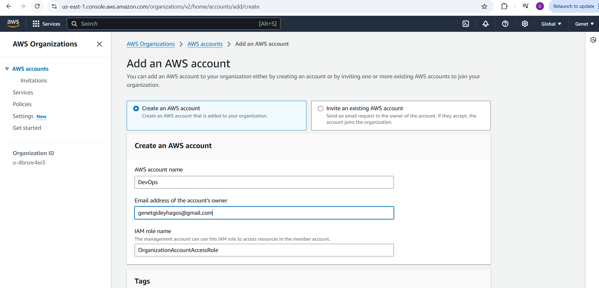

## AWS Cloud Solution for 2 Company Websites Using Reverse Proxy Technology
This project demonstrates how a secure infrastructure inside an AWS VPC (Virtual Private Cloud) is built for a fictitious company. The company operates two websites:
1. **Main Business Website**: A WordPress CMS for their primary operations.
2. **Tooling Website**: A platform used by their DevOps team.

To ensure improved security, performance, and scalability, the infrastructure incorporates **NGINX as a Reverse Proxy** for load balancing and caching. The architecture follows best practices for high availability and redundancy using AWS services such as **Application Load Balancer (ALB)**, **Amazon RDS**, and **Amazon EFS**, while maintaining secure access through private subnets, NAT Gateways, and Bastion hosts.

The resulting infrastructure will resemble the diagram below, showcasing:
- Multi-AZ deployment for high availability.
- Public subnets hosting NGINX and Bastion hosts.
- Private subnets for web servers, databases, and shared storage.
- DNS setup through Route53 for seamless domain routing.

 

This setup ensures that the infrastructure is **cost-efficient, scalable**, and **resilient** to traffic spikes and system failures.

## Starting Off Your AWS Cloud Project

There are a few requirements to take care of before we dive into the project:

### **1. Properly Configure Your AWS Account and Organization Unit**
- **Create an AWS Master Account** (also known as the Root Account).  
  - Go to the **AWS Console**, and navigate to:  
    **Services > All Services > Management & Governance > AWS Organizations**.
    

- Inside the Root Account, **create a sub-account** and name it **DevOps**.  
  - Navigate to: **AWS Organizations > Accounts > Create Account**.  
  - Provide another email address and account name (**DevOps**) to create the sub-account.  
  
  

- In the Root Account, **create an AWS Organization Unit (OU)** and name it **Dev**.  
  - Go to: **AWS Organizations > Actions > Create Organizational Unit**.  
  - Name the unit **Dev** and save. 
   

- **Move the DevOps account into the Dev OU**.  
  - Navigate to: **AWS Organizations > Accounts**.  
  - Select the **DevOps** account then click **Actions** and move it into the **Dev OU**.  
  

- **Log in to the new AWS account** using the email address you set up for it.  
  - Check your email for the credentials, then log in to the AWS console to access your new account.  
  

### **2. Create a Free Domain Name**

Get a free domain name for your fictional company using Freenom. Here’s how:  

- Go to the **Freenom website**: [Freenom](https://freenom.com) you can use  **Cloud dns**: [clouddns](https://www.cloudns.net/) .  
- Search for an available domain name and select one.  
- Follow the steps to register the domain and associate it with your email account.  


### **3. Set Up a Hosted Zone in AWS**

Create a hosted zone in AWS and map it to the free domain name you registered.  

- Go to the **AWS Console**, and navigate to:  
  **Services > All Services > Networking & Content Delivery > Route 53**.  
- Select **Hosted Zones > Create Hosted Zone**.  
- Enter your domain name (the one you registered with clouddns) and choose **Public Hosted Zone**.  

 
 
 

- Copy the **Name Servers (NS)** provided by AWS and update them in cloud dns under your domain settings.  
 

---

### **Note:**
As we proceed, make sure to tag all resources properly. Here’s an example of what your tags should look like:

- **Project**: `<Give your project a name>`  
- **Environment**: `<dev>`  
- **Automated**: `<No>` *(If you’re manually creating the resource. If automation is involved, set it to `<Yes>`.)*

---


### **Set Up a Virtual Private Network (VPC)**

### **1. Create a VPC**
1. Go to the **VPC Dashboard** in the AWS Management Console.
2. Click **Create VPC**.
3. Choose **VPC only** or **VPC and more** (depending on your needs).
4. Specify:
   - **Name tag**: Enter a name for your VPC.
   - **IPv4 CIDR block**: E.g., `10.0.0.0/16`.
   - **IPv6 CIDR block**: Optional.
   - **Tenancy**: Default.

5. Click **Create VPC**.

### **2. Create Subnets**  
Create subnets as shown in the architecture:

- **Public Subnet 1**: `10.0.1.0/24` in **Availability Zone A**  
- **Public Subnet 2**: `10.0.2.0/24` in **Availability Zone B**  
- **Private Subnet 1**: `10.0.3.0/24` in **Availability Zone A**  
- **Private Subnet 2**: `10.0.4.0/24` in **Availability Zone B**  
- **Private Subnet 3**: `10.0.5.0/24` in **Availability Zone A**  
- **Private Subnet 4**: `10.0.6.0/24` in **Availability Zone B** 

#### **Steps to Create Subnets**  
1. Navigate to **Subnets** in the **VPC Dashboard**.  
2. Click **Create Subnet**.  
3. Choose your **VPC** and specify the following:  
   - **Name tag**: Example: `Public-Subnet-1`, `Private-Subnet-1`.  
   - **Availability Zone**: Select **Zone A** or **Zone B** as required.  
   - **IPv4 CIDR block**: Use the values provided above (e.g., `10.0.1.0/24` for Public Subnet 1).  
4. Click **Create Subnet**.  
5. Repeat this process for all **public** and **private** subnets listed above.  
  
  
  
  
  
  

### **3. Create Route Tables and Associate Them with Public Subnets**  
1. Go to **Route Tables** in the **VPC Dashboard**.  
2. Click **Create Route Table**.  
3. Specify the following:  
   - **Name tag**: `Public-Route-Table`.  
   - **VPC**: Choose the VPC you created. 
4. Click **Create Route Table**. 
  

5. Associate the Route Table with **Public Subnets**:  
   - Select the **Public Route Table** → **Subnet Associations** → Add the public subnets 
 
  

### **4. Create Route Tables and Associate Them with Private Subnets**  
1. Go to **Route Tables** in the **VPC Dashboard**.  
2. Click **Create Route Table**.  
3. Specify the following:  
   - **Name tag**: `Private-Route-Table`.  
   - **VPC**: Choose the VPC you created.  
4. Click **Create Route Table**.  

5. Associate the Route Table with **Private Subnets**:  
   - Select the **Private Route Table** → **Subnet Associations** → Add the private subnets 


### **5. Create an Internet Gateway**
1. Navigate to **Internet Gateways** in the VPC Dashboard.
2. Click **Create Internet Gateway**.
3. Specify a **Name tag** and click **Create Internet Gateway**.


4. Attach it to your VPC.


### **6. Edit Public Route Table**
1. Go to the **Route Tables**.
2. Select your **Public Route Table** → Click **Edit routes**.
3. Add a route:
   - **Destination**: `0.0.0.0/0`.
   - **Target**: Your Internet Gateway.
4. Save changes.


### **7. Create Elastic IPs**
1. Navigate to **Elastic IPs** in the EC2 Dashboard.
2. Allocate 3 Elastic IPs:
   - One for the NAT Gateway.
   - Two for future use (e.g., for Bastion Hosts).


### **8. Create a NAT Gateway**
1. Go to **NAT Gateways** in the VPC Dashboard.
2. Click **Create NAT Gateway**.
3. Specify:
   - **Name tag**: E.g., `NAT-Gateway`.
   - **Subnet**: Choose a public subnet.
   - **Elastic IP**: Assign one of the Elastic IPs created earlier.
4. Click **Create NAT Gateway**.


### **9. Create Security Groups**
Create the following **Security Groups**:

#### **Application Load Balancer**
- Rule: Allow access from the Internet.


#### **Bastion Hosts**
- Rule: Allow SSH access only from workstations using public IP.
- To find your workstation public IP, run:
  ```bash
  curl www.canhazip.com
  ```


#### **Nginx Servers**
- Rule: Allow access only from an **Application Load Balancer (ALB)**.
- Placeholder: Add dummy rules; update later when ALB is created.


#### **Web Servers**
- Rule: Allow traffic only from **Nginx Servers**.
- Add dummy rules and update them later when the servers are created.


#### **Data Layer**
- Rule: Allow access to **Amazon RDS** and **EFS** only from Web Servers.
- Ensure **Web Servers** can access RDS and **EFS Mount Point**.


---


### **Provision EC2 Instances for NGINX**  


2. **Install Required Software**:  
 
3. **Create an AMI**:  
   - After configuring the instance, create an **AMI (Amazon Machine Image)** for reuse.  

---

### **Prepare Launch Template for NGINX**  
1. Use the newly created **AMI** to set up a **Launch Template**.  
2. Ensure instances are launched into a **public subnet**.  
3. Assign the appropriate **Security Group** to allow access.  
4. Use **User Data** to:  
   - Update the package repository.  
   - Install and configure **NGINX** automatically.  

---

### **Configure Target Groups**  
1. Set the **Instances** as the target type.  
2. Use **HTTPS** protocol on **port 443** for secure communication.  
3. Set the **health check path** to `/healthstatus`.  
4. Register the **NGINX instances** as targets.  
5. Ensure the health checks pass for the target group.  

---

### **Configure Auto Scaling for NGINX**  
1. Select the correct **Launch Template**.  
2. Assign the **VPC** and **both public subnets**.  
3. Enable the **Application Load Balancer (ALB)** for the AutoScaling Group.  
4. Attach the previously configured **Target Group**.  
5. Ensure health checks are enabled for both **EC2** and **ALB**.  
6. Set the following Auto Scaling parameters:  
   - **Desired capacity**: 2  
   - **Minimum capacity**: 2  
   - **Maximum capacity**: 4  
7. Configure the scaling policy:  
   - **Scale Out** if CPU utilization reaches **90%**.  
8. Enable an **SNS Topic** for scaling notifications.  


Here’s a detailed step-by-step breakdown of the entire process to **provision EC2 instances for Nginx**, **prepare launch templates**, and configure target groups and autoscaling.

---

## **Step 1: Provision EC2 Instances for Nginx**
1. **Create EC2 Instances**:  
   - Use a **CentOS Amazon Machine Image (AMI)**.  
   - Deploy in **two Availability Zones (AZ)** for redundancy.  
   - Select **T2 family instances** (e.g., `t2.micro`) for cost efficiency.  
   

2. **Install Required Software**
   Ensure the following software is installed on the EC2 instance:  
   - `python`  
   - `ntp`  
   - `net-tools`  
   - `vim`  
   - `wget`  
   - `telnet`  
   - `epel-release`  
   - `htop`  

   - Connect to the EC2 instance using SSH:
     ```bash
     ssh -i <your-key.pem> user@<instance-public-ip>
     ```
   - Install the following packages:
     ```bash
     sudo yum update -y
     sudo yum install -y python ntp net-tools vim wget telnet epel-release htop
     ```
   - Verify the installations:
     ```bash
     python --version
     htop
     ```

3. **Create an AMI from the Configured EC2 Instance**
   - Go to **EC2 Dashboard** > **Instances**.
   - Select the instance and click **Actions > Image and Templates > Create Image**.
   - Provide a name (e.g., `nginx-ami`) and description, then create the AMI.
   

## **Step 2: Prepare a Launch Template for Nginx**

1. **Create a Launch Template**
   - Go to: **EC2 Dashboard > Launch Templates > Create Launch Template**.
   - Use the AMI created earlier.
   - Specify the instance type (e.g., t2.micro), key pair, and security group.

2. **Configure Public Subnet**
   - Ensure the instance is launched in a **public subnet**.
   - Assign an **Elastic IP** to ensure persistent access.

3. **Assign a Security Group**
   - Create a security group with the following inbound rules:
     - **HTTP** (Port 80): Anywhere (0.0.0.0/0).
     - **HTTPS** (Port 443): Anywhere (0.0.0.0/0).
     - **SSH** (Port 22): Your IP for secure access.

4. **Use User Data to Install Nginx**
   - Add the following **User Data** script in the launch template to automate Nginx installation:
     ```bash
     #!/bin/bash
     yum update -y
     yum install -y nginx
     systemctl enable nginx
     systemctl start nginx
     echo "Nginx server is up and running" > /usr/share/nginx/html/index.html
     ```
  
   
   
   

## **Step 3: Configure Target Groups**

1. **Create a Target Group**
   - Go to **EC2 Dashboard > Load Balancing > Target Groups**.
   - Click **Create Target Group**.
   - Choose **Instances** as the target type.
   - Configure:
     - **Protocol**: HTTPS  
     - **Port**: 443  
     - **Health Check Path**: `/healthstatus`
    
    
2. **Register Nginx Instances**
   - Add your EC2 instances to the target group.
   - Confirm that health checks pass.   
    

## **Step 4: Configure Auto Scaling for Nginx**

1. **Set Up Auto Scaling Group (ASG)**
   - Go to: **EC2 Dashboard > Auto Scaling > Create Auto Scaling Group**.
   - Select the **Launch Template** you created earlier.
2. **Configure VPC and Subnets**
   - Select your **VPC** and both **public subnets**.
3. **Set Scaling Configuration**
   - **Desired Capacity**: 2  
   - **Minimum Capacity**: 2  
   - **Maximum Capacity**: 4  
4. **Set Scaling Policies**
   - Add a scaling policy to **scale out** when CPU utilization reaches **90%**:
     - Select **Target Tracking Scaling Policy**.
     - Configure CPU utilization threshold to 90%.
5. **Enable Notifications**
   - Create an **SNS topic** to send auto-scaling notifications:
     - Go to **SNS Dashboard** > **Topics > Create Topic**.
     - Link the SNS topic to your ASG for alerts.
    
    
    
   
   
   
   
   

