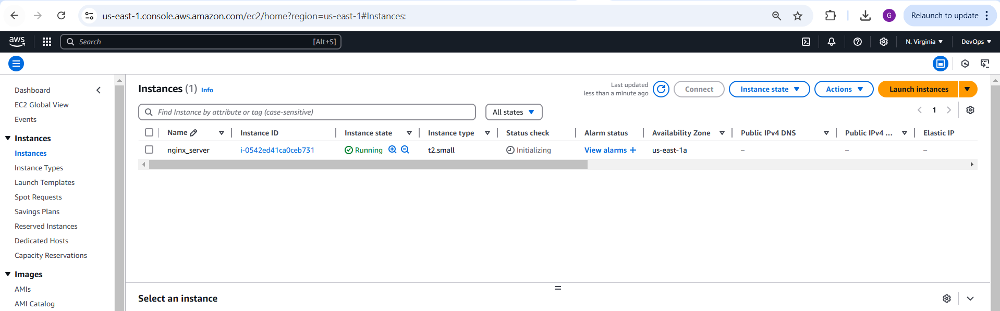

## AWS Cloud Solution for 2 Company Websites Using Reverse Proxy Technology
This project demonstrates how a secure infrastructure inside an AWS VPC (Virtual Private Cloud) is built for a fictitious company. The company operates two websites:
1. **Main Business Website**: A WordPress CMS for their primary operations.
2. **Tooling Website**: A platform used by their DevOps team.

To ensure improved security, performance, and scalability, the infrastructure incorporates **NGINX as a Reverse Proxy** for load balancing and caching. The architecture follows best practices for high availability and redundancy using AWS services such as **Application Load Balancer (ALB)**, **Amazon RDS**, and **Amazon EFS**, while maintaining secure access through private subnets, NAT Gateways, and Bastion hosts.

The resulting infrastructure will resemble the diagram below, showcasing:
- Multi-AZ deployment for high availability.
- Public subnets hosting NGINX and Bastion hosts.
- Private subnets for web servers, databases, and shared storage.
- DNS setup through Route53 for seamless domain routing.

 

This setup ensures that the infrastructure is **cost-efficient, scalable**, and **resilient** to traffic spikes and system failures.

## Starting Off Your AWS Cloud Project

There are a few requirements to take care of before we dive into the project:

### **1. Properly Configure Your AWS Account and Organization Unit**
- **Create an AWS Master Account** (also known as the Root Account).  
  - Go to the **AWS Console**, and navigate to:  
    **Services > All Services > Management & Governance > AWS Organizations**.
    

- Inside the Root Account, **create a sub-account** and name it **DevOps**.  
  - Navigate to: **AWS Organizations > Accounts > Create Account**.  
  - Provide another email address and account name (**DevOps**) to create the sub-account.  
  
  

- In the Root Account, **create an AWS Organization Unit (OU)** and name it **Dev**.  
  - Go to: **AWS Organizations > Actions > Create Organizational Unit**.  
  - Name the unit **Dev** and save. 
   

- **Move the DevOps account into the Dev OU**.  
  - Navigate to: **AWS Organizations > Accounts**.  
  - Select the **DevOps** account then click **Actions** and move it into the **Dev OU**.  
  

- **Log in to the new AWS account** using the email address you set up for it.  
  - Check your email for the credentials, then log in to the AWS console to access your new account.  
  

### **2. Create a Free Domain Name**

Get a free domain name for your fictional company using Freenom. Here’s how:  

- Go to the **Freenom website**: [Freenom](https://freenom.com) you can use  **Cloud dns**: [clouddns](https://www.cloudns.net/) .  
- Search for an available domain name and select one.  
- Follow the steps to register the domain and associate it with your email account.  


### **3. Set Up a Hosted Zone in AWS**

Create a hosted zone in AWS and map it to the free domain name you registered.  

- Go to the **AWS Console**, and navigate to:  
  **Services > All Services > Networking & Content Delivery > Route 53**.  
- Select **Hosted Zones > Create Hosted Zone**.  
- Enter your domain name (the one you registered with clouddns) and choose **Public Hosted Zone**.  

 
 
 

- Copy the **Name Servers (NS)** provided by AWS and update them in cloud dns under your domain settings.  
 

---

### **Note:**
As we proceed, make sure to tag all resources properly. Here’s an example of what your tags should look like:

- **Project**: `<Give your project a name>`  
- **Environment**: `<dev>`  
- **Automated**: `<No>` *(If you’re manually creating the resource. If automation is involved, set it to `<Yes>`.)*

---


### **Set Up a Virtual Private Network (VPC)**

### **1. Create a VPC**
1. Go to the **VPC Dashboard** in the AWS Management Console.
2. Click **Create VPC**.
3. Choose **VPC only** or **VPC and more** (depending on your needs).
4. Specify:
   - **Name tag**: Enter a name for your VPC.
   - **IPv4 CIDR block**: E.g., `10.0.0.0/16`.
   - **IPv6 CIDR block**: Optional.
   - **Tenancy**: Default.

5. Click **Create VPC**.

### **2. Create Subnets**  
Create subnets as shown in the architecture:

- **Public Subnet 1**: `10.0.1.0/24` in **Availability Zone A**  
- **Public Subnet 2**: `10.0.2.0/24` in **Availability Zone B**  
- **Private Subnet 1**: `10.0.3.0/24` in **Availability Zone A**  
- **Private Subnet 2**: `10.0.4.0/24` in **Availability Zone B**  
- **Private Subnet 3**: `10.0.5.0/24` in **Availability Zone A**  
- **Private Subnet 4**: `10.0.6.0/24` in **Availability Zone B** 

#### **Steps to Create Subnets**  
1. Navigate to **Subnets** in the **VPC Dashboard**.  
2. Click **Create Subnet**.  
3. Choose your **VPC** and specify the following:  
   - **Name tag**: Example: `Public-Subnet-1`, `Private-Subnet-1`.  
   - **Availability Zone**: Select **Zone A** or **Zone B** as required.  
   - **IPv4 CIDR block**: Use the values provided above (e.g., `10.0.1.0/24` for Public Subnet 1).  
4. Click **Create Subnet**.  
5. Repeat this process for all **public** and **private** subnets listed above.  
  
  
  
  
  
  

### **3. Create Route Tables and Associate Them with Public Subnets**  
1. Go to **Route Tables** in the **VPC Dashboard**.  
2. Click **Create Route Table**.  
3. Specify the following:  
   - **Name tag**: `Public-Route-Table`.  
   - **VPC**: Choose the VPC you created. 
4. Click **Create Route Table**. 
  

5. Associate the Route Table with **Public Subnets**:  
   - Select the **Public Route Table** → **Subnet Associations** → Add the public subnets 
 
  

### **4. Create Route Tables and Associate Them with Private Subnets**  
1. Go to **Route Tables** in the **VPC Dashboard**.  
2. Click **Create Route Table**.  
3. Specify the following:  
   - **Name tag**: `Private-Route-Table`.  
   - **VPC**: Choose the VPC you created.  
4. Click **Create Route Table**.  

5. Associate the Route Table with **Private Subnets**:  
   - Select the **Private Route Table** → **Subnet Associations** → Add the private subnets 


### **5. Create an Internet Gateway**
1. Navigate to **Internet Gateways** in the VPC Dashboard.
2. Click **Create Internet Gateway**.
3. Specify a **Name tag** and click **Create Internet Gateway**.


4. Attach it to your VPC.


### **6. Edit Public Route Table**
1. Go to the **Route Tables**.
2. Select your **Public Route Table** → Click **Edit routes**.
3. Add a route:
   - **Destination**: `0.0.0.0/0`.
   - **Target**: Your Internet Gateway.
4. Save changes.


### **7. Create Elastic IPs**
1. Navigate to **Elastic IPs** in the EC2 Dashboard.
2. Allocate 3 Elastic IPs:
   - One for the NAT Gateway.
   - Two for future use (e.g., for Bastion Hosts).


### **8. Create a NAT Gateway**
1. Go to **NAT Gateways** in the VPC Dashboard.
2. Click **Create NAT Gateway**.
3. Specify:
   - **Name tag**: E.g., `NAT-Gateway`.
   - **Subnet**: Choose a public subnet.
   - **Elastic IP**: Assign one of the Elastic IPs created earlier.
4. Click **Create NAT Gateway**.


### **9. Create Security Groups**
Create the following **Security Groups**:

#### **Application Load Balancer**
- Rule: Allow access from the Internet.


#### **Bastion Hosts**
- Rule: Allow SSH access only from workstations using public IP.
- To find your workstation public IP, run:
  ```bash
  curl www.canhazip.com
  ```


#### **Nginx Servers**
- Rule: Allow access only from an **Application Load Balancer (ALB)**.
- Placeholder: Add dummy rules; update later when ALB is created.


#### **Web Servers**
- Rule: Allow traffic only from **Nginx Servers**.
- Add dummy rules and update them later when the servers are created.


#### **Data Layer**
- Rule: Allow access to **Amazon RDS** and **EFS** only from Web Servers.
- Ensure **Web Servers** can access RDS and **EFS Mount Point**.


---


### **Provision EC2 Instances for NGINX**  


2. **Install Required Software**:  
 
3. **Create an AMI**:  
   - After configuring the instance, create an **AMI (Amazon Machine Image)** for reuse.  

---

### **Prepare Launch Template for NGINX**  
1. Use the newly created **AMI** to set up a **Launch Template**.  
2. Ensure instances are launched into a **public subnet**.  
3. Assign the appropriate **Security Group** to allow access.  
4. Use **User Data** to:  
   - Update the package repository.  
   - Install and configure **NGINX** automatically.  

---

### **Configure Target Groups**  
1. Set the **Instances** as the target type.  
2. Use **HTTPS** protocol on **port 443** for secure communication.  
3. Set the **health check path** to `/healthstatus`.  
4. Register the **NGINX instances** as targets.  
5. Ensure the health checks pass for the target group.  

---

### **Configure Auto Scaling for NGINX**  
1. Select the correct **Launch Template**.  
2. Assign the **VPC** and **both public subnets**.  
3. Enable the **Application Load Balancer (ALB)** for the AutoScaling Group.  
4. Attach the previously configured **Target Group**.  
5. Ensure health checks are enabled for both **EC2** and **ALB**.  
6. Set the following Auto Scaling parameters:  
   - **Desired capacity**: 2  
   - **Minimum capacity**: 2  
   - **Maximum capacity**: 4  
7. Configure the scaling policy:  
   - **Scale Out** if CPU utilization reaches **90%**.  
8. Enable an **SNS Topic** for scaling notifications.  


Here’s a detailed step-by-step breakdown of the entire process to **provision EC2 instances for Nginx**, **prepare launch templates**, and configure target groups and autoscaling.

---

## **Step 1: Provision EC2 Instances for Nginx**
1. **Create EC2 Instances**:  
   - Use a **CentOS Amazon Machine Image (AMI)**.  
   - Deploy in **two Availability Zones (AZ)** for redundancy.  
   - Select **T2 family instances** (e.g., `t2.micro`) for cost efficiency.  
   

2. **Install Required Software**
   Ensure the following software is installed on the EC2 instance:  
   - `python`  
   - `ntp`  
   - `net-tools`  
   - `vim`  
   - `wget`  
   - `telnet`  
   - `epel-release`  
   - `htop`  

   - Connect to the EC2 instance using SSH:
     ```bash
     ssh -i <your-key.pem> user@<instance-public-ip>
     ```
   - Install the following packages:
     ```bash
     sudo yum update -y
     sudo yum install -y python ntp net-tools vim wget telnet epel-release htop
     ```
   - Verify the installations:
     ```bash
     python --version
     htop
     ```

3. **Create an AMI from the Configured EC2 Instance**
   - Go to **EC2 Dashboard** > **Instances**.
   - Select the instance and click **Actions > Image and Templates > Create Image**.
   - Provide a name (e.g., `nginx-ami`) and description, then create the AMI.
   

## **Step 2: Prepare a Launch Template for Nginx**

1. **Create a Launch Template**
   - Go to: **EC2 Dashboard > Launch Templates > Create Launch Template**.
   - Use the AMI created earlier.
   - Specify the instance type (e.g., t2.micro), key pair, and security group.

2. **Configure Public Subnet**
   - Ensure the instance is launched in a **public subnet**.
   - Assign an **Elastic IP** to ensure persistent access.

3. **Assign a Security Group**
   - Create a security group with the following inbound rules:
     - **HTTP** (Port 80): Anywhere (0.0.0.0/0).
     - **HTTPS** (Port 443): Anywhere (0.0.0.0/0).
     - **SSH** (Port 22): Your IP for secure access.

4. **Use User Data to Install Nginx**
   - Add the following **User Data** script in the launch template to automate Nginx installation:
     ```bash
     #!/bin/bash
     yum update -y
     yum install -y nginx
     systemctl enable nginx
     systemctl start nginx
     echo "Nginx server is up and running" > /usr/share/nginx/html/index.html
     ```
  
   
   
   

## **Step 3: Configure Target Groups**

1. **Create a Target Group**
   - Go to **EC2 Dashboard > Load Balancing > Target Groups**.
   - Click **Create Target Group**.
   - Choose **Instances** as the target type.
   - Configure:
     - **Protocol**: HTTPS  
     - **Port**: 443  
     - **Health Check Path**: `/healthstatus`
    
    
2. **Register Nginx Instances**
   - Add your EC2 instances to the target group.
   - Confirm that health checks pass.   
    

## **Step 4: Configure Auto Scaling for Nginx**

1. **Set Up Auto Scaling Group (ASG)**
   - Go to: **EC2 Dashboard > Auto Scaling > Create Auto Scaling Group**.
   - Select the **Launch Template** you created earlier.
2. **Configure VPC and Subnets**
   - Select your **VPC** and both **public subnets**.
3. **Set Scaling Configuration**
   - **Desired Capacity**: 2  
   - **Minimum Capacity**: 2  
   - **Maximum Capacity**: 4  
4. **Set Scaling Policies**
   - Add a scaling policy to **scale out** when CPU utilization reaches **90%**:
     - Select **Target Tracking Scaling Policy**.
     - Configure CPU utilization threshold to 90%.
5. **Enable Notifications**
   - Create an **SNS topic** to send auto-scaling notifications:
     - Go to **SNS Dashboard** > **Topics > Create Topic**.
     - Link the SNS topic to your ASG for alerts.
   
   
   
   
   
   
   
   


Based on the screenshots provided, here's a detailed demonstration to configure compute resources for the **Bastion Host**, **Launch Templates**, **Target Groups**, and **Auto Scaling**.

---

### **1. Set Up Compute Resources for Bastion**

#### **Step 1: Create an EC2 Instance**
1. Log in to the **AWS Management Console**.
2. Navigate to the **EC2 Dashboard** → **Launch Instances**.
3. Select a **CentOS-based AMI** and ensure it is in the **same Region** and **Availability Zone** as your Nginx server.
4. Choose the instance type (e.g., `t2.micro` for lightweight workloads).
5. Configure instance details:
   - Attach to the same **VPC** and **Subnet** as the Nginx server.
6. Launch the instance.

#### **Step 2: Install Required Software**
Once the instance is running:
1. Connect via SSH:
   ```bash
   ssh -i <your-key.pem> centos@<instance-public-ip>
   ```
2. Install required software:
   ```bash
   sudo yum update -y
   sudo yum install -y python ntp net-tools vim wget telnet epel-release htop
   ```
3. Start and enable NTP:
   ```bash
   sudo systemctl start ntpd
   sudo systemctl enable ntpd
   ```

#### **Step 3: Associate Elastic IP**
1. Navigate to **Elastic IPs** in the EC2 Dashboard.
2. Allocate a new Elastic IP and associate it with the bastion instance.

#### **Step 4: Create an AMI**
1. Select the configured bastion instance.
2. Navigate to **Actions → Image → Create Image**.
3. Provide a name and description for the AMI, then create the image.

---

### **2. Prepare a Launch Template for Bastion**

1. Navigate to **Launch Templates** in the EC2 Dashboard.
2. Create a **new launch template**:
   - **AMI**: Use the AMI created in Step 4.
   - **Network**: Public subnet and associated VPC.
   - **User Data**:
     ```bash
     #!/bin/bash
     sudo yum update -y
     sudo yum install -y ansible git
     ```
3. Save the launch template.

---

### **3. Configure Target Groups**

1. Go to **Target Groups** in the EC2 Dashboard.
2. Create a new target group:
   - **Target Type**: Instances.
   - **Protocol**: TCP.
   - **Port**: 22 (SSH).
   - **VPC**: Same VPC as the bastion host.
3. Register bastion instances as targets.
4. Configure **Health Checks**:
   - Use the default TCP health check.

---

### **4. Configure Auto Scaling for Bastion**

#### **Step 1: Create an Auto Scaling Group**
1. Navigate to **Auto Scaling Groups**.
2. Create a new Auto Scaling Group using the **Launch Template** created earlier.

#### **Step 2: Configure Auto Scaling Group Details**
1. **VPC and Subnets**:
   - Choose the VPC and both public subnets.
2. **Target Group**:
   - Attach the target group created earlier.
3. **Scaling Policies**:
   - **Desired Capacity**: 2
   - **Minimum Capacity**: 2
   - **Maximum Capacity**: 4
   - Set a scale-out policy when **CPU utilization reaches 90%**.

#### **Step 3: Add Notifications**
1. Set up an **SNS Topic** to send scaling notifications.
2. Subscribe to the topic with your email address.

---

### Summary

This workflow includes:
- Creating and configuring a bastion host.
- Setting up AMI, launch templates, and auto-scaling.
- Ensuring public access via Elastic IP and securing it via SSH protocols.

Let me know if you need further clarification! 😊


Based on the images provided, here's how to implement the setup for **web servers** and prepare the launch template as outlined in the instructions:

---

### **1. Set Up Compute Resources for Web Servers**

#### **Step 1: Create EC2 Instances**
1. **Log in to AWS Management Console**.
2. Go to the **EC2 Dashboard** → **Launch Instances**.
3. Create two separate EC2 instances (CentOS):
   - One for the **WordPress** website.
   - One for the **Tooling** website.
4. Ensure both instances are launched in the **same region** and **availability zone** as required.
5. Choose an appropriate instance type (e.g., `t2.micro` for lightweight workloads).

#### **Step 2: Install Required Software**
After launching the instances:
1. Connect to each instance via SSH:
   ```bash
   ssh -i <your-key.pem> centos@<instance-public-ip>
   ```
2. Install the necessary software:
   ```bash
   sudo yum update -y
   sudo yum install -y python ntp net-tools vim wget telnet epel-release htop php
   ```

#### **Step 3: Create an AMI**
1. Navigate to the **Instances** section of the EC2 Dashboard.
2. Select each configured instance and create an AMI:
   - For the WordPress website.
   - For the Tooling website.
3. Go to **Actions → Image → Create Image** and fill in the necessary details.

---

### **2. Prepare Launch Template for Web Servers**

#### **Step 1: Create Launch Templates**
1. Navigate to **Launch Templates** in the EC2 Dashboard.
2. Create two launch templates:
   - **WordPress Launch Template**.
   - **Tooling Launch Template**.

#### **Step 2: Configure Launch Template**
1. Use the respective AMIs created earlier for each template.
2. Ensure the instances are launched into a **public subnet**.
3. Assign appropriate **security groups**:
   - Allow HTTP (80), HTTPS (443), and SSH (22) access.
4. Add **User Data** for the WordPress template to install WordPress:
   ```bash
   #!/bin/bash
   sudo yum update -y
   sudo yum install -y wordpress
   ```

---

### **3. Configure TLS Certificates from AWS ACM**

#### **Step 1: Request a Certificate**
1. Go to **AWS Certificate Manager (ACM)** in the AWS Console.
2. Click on **Request a Certificate**.
3. Select **Request a public certificate**.

#### **Step 2: Configure Certificate Details**
1. Enter the wildcard domain name registered in Freenom:
   - Example: `*.yourdomain.com`.
2. Use **DNS Validation**:
   - AWS will provide DNS records to be added to your domain’s DNS settings.

#### **Step 3: Validate and Tag**
1. Add the DNS records to validate ownership of the domain.
2. After validation, tag the certificate resource for easier management.

---

### **Summary of Steps**
1. Provision EC2 instances for **WordPress** and **Tooling** with required software.
2. Create AMIs for both instances.
3. Set up separate launch templates for each website.
4. Use AWS ACM to configure and validate TLS certificates for secured connectivity.

Let me know if you'd like more specific details on any of the steps! 😊


### Configure Application Load Balancer (ALB) to Route Traffic to NGINX

Follow these steps to configure an **Application Load Balancer (ALB)** to route traffic to NGINX EC2 instances:

---

### **1. Create an Internet-facing ALB**
1. Log in to the **AWS Management Console**.
2. Navigate to **EC2 Dashboard** → **Load Balancers** → **Create Load Balancer**.
3. Choose **Application Load Balancer**.
4. Set the following:
   - **Name**: Provide a meaningful name for the ALB (e.g., `nginx-alb`).
   - **Scheme**: Choose **Internet-facing**.
   - **Listeners**: Add a listener for HTTPS (TCP port 443).
   - **Availability Zones**: Select the VPC, and then choose at least two public subnets in different Availability Zones.

---

### **2. Ensure HTTPS Listener**
- Add an HTTPS listener (port 443) during the ALB setup.
- Configure the listener to forward traffic to a **target group** that contains the NGINX instances.

---

### **3. Ensure Proper VPC, AZ, and Subnet Selection**
- Select the appropriate **VPC**, **Availability Zones**, and **Subnets** where your NGINX instances are hosted.

---

### **4. Choose Certificate from ACM**
1. In the HTTPS listener settings, select **Add Certificate**.
2. Choose the TLS certificate that you created earlier in **AWS ACM**.
3. This will offload SSL/TLS termination to the ALB, reducing the processing overhead on the NGINX servers.

---

### **5. Select Security Group**
- Attach a security group to the ALB that allows traffic on port 443 (HTTPS) from any IP (or specific IP ranges if restricted).

---

### **6. Select NGINX Instances as the Target Group**
1. Create a **Target Group** in the ALB configuration:
   - **Target Type**: Instances.
   - **Protocol**: TCP.
   - **Port**: 80 (HTTP).
2. Register the NGINX EC2 instances as targets.
3. Configure **Health Checks**:
   - **Protocol**: HTTP.
   - **Path**: `/` (or a specific health check endpoint on your NGINX server).

### **Application Load Balancer to Route Traffic to Web Servers**

#### **Steps to Configure an Internal Application Load Balancer (ALB):**

1. **Create an Internal ALB**:
   - Go to **AWS Management Console** → **EC2 Dashboard** → **Load Balancers**.
   - Click on **Create Load Balancer** and choose **Application Load Balancer**.
   - Configure the following:
     - **Name**: Provide a meaningful name (e.g., `internal-alb-webservers`).
     - **Scheme**: Select **Internal**.
     - **Listeners**: Add an HTTPS listener on port 443.
     - **Availability Zones**: Select the appropriate **VPC** and private subnets.

2. **Ensure HTTPS Listener**:
   - Add a listener for HTTPS (TCP port 443).
   - Later, configure it to forward traffic to a target group containing your web servers.

3. **Set the Appropriate VPC, AZ, and Subnets**:
   - Ensure the ALB is created in the same **VPC**, **Availability Zones**, and **private subnets** as the web servers.

4. **Choose a Certificate from ACM**:
   - Attach the SSL/TLS certificate created in **AWS ACM** to the HTTPS listener to handle secure communication.

5. **Select Security Group**:
   - Attach a security group to the ALB that allows traffic on port 443 from trusted sources (like NGINX servers).

6. **Select Web Server Instances as the Target Group**:
   - Create a **Target Group** for the web servers.
   - Target Type: Instances.
   - Protocol: HTTP.
   - Port: 80.
   - Register all web server instances with this target group.

7. **Ensure Health Checks**:
   - Configure health checks for the target group:
     - Protocol: HTTP.
     - Path: `/` (or a specific health check endpoint).

---

### **Setup Amazon Elastic File System (EFS)**

#### **Steps to Configure EFS:**

1. **Create an EFS Filesystem**:
   - Go to **AWS Management Console** → **EFS Dashboard**.
   - Click **Create File System**.
   - Provide a name and ensure it's in the correct **VPC**.

2. **Create an EFS Mount Target**:
   - For each Availability Zone (AZ) in your VPC:
     - Create mount targets.
     - Associate the mount targets with the subnets dedicated to the data layer.

3. **Associate Security Groups**:
   - Use the security groups created earlier for the **data layer** to ensure proper access permissions for EFS.

4. **Create an EFS Access Point**:
   - Create an access point for EFS.
   - Provide a name and leave all other settings as default.

---

### **Note:**
- The above process must be repeated for both **WordPress** and **Tooling** websites.
- Ensure the security and connectivity settings align with your private network configurations.

Let me know if you need help with further steps or configurations! 😊