## Ansible Configuration Management

In **Projects 7 to 10**, I manually set up virtual servers, installed necessary software, and deployed my web application. Now, with **Ansible**, I can automate these repetitive tasks. Using **Ansible Configuration Management**, I:

- Set up virtual machines and servers efficiently.
- Installed and configured software on these servers with ease.
- Wrote playbooks using **YAML** to automate my deployments and configurations.

By leveraging **Ansible**, I now appreciate the power of automation, which minimizes manual efforts and streamlines routine tasks in my projects.

---

### **Bastion Host (Jump Server)**

A **Jump Server** (also called a **Bastion Host**) acts as an intermediary server that provides secure access to internal networks. In secure environments:
- **Web Servers** and **Database Servers** are placed inside a private network (usually in a private subnet) that cannot be directly accessed from the internet.
- This means that even DevOps engineers cannot **SSH** into these private servers directly. Instead, they must pass through the **Jump Server**, which has access to both the public and private networks.
- **Benefits**: The Jump Server reduces the **attack surface** by preventing direct internet access to sensitive internal servers.

In your case, the **Ansible client** is configured to act as the **Jump Server**.

---

### **Tasks:**

1. **Install and configure the Ansible client as a Jump Server**:
   - The goal is to configure an Ansible server that acts as a Bastion Host.
   - Once this Jump Server is set up, DevOps engineers will SSH into this server and then access other private servers securely via the Jump Server.

2. **Create an Ansible playbook to automate server configurations**:
   - Write an Ansible playbook that automates the configuration of the servers you need to manage.


---

### Step 1: Install and Configure Ansible on EC2 Instance (Already Done)


1. **Updated the Name Tag**: I have changed the Name tag of my Jenkins EC2 instance to `Jenkins-Ansible`, which is used to run Ansible playbooks.
   
   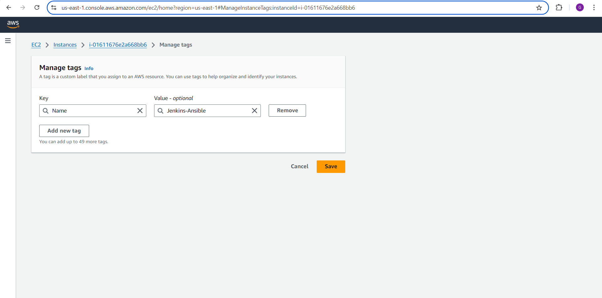

2. **Created a GitHub Repository**: I have created a new GitHub repository named `ansible-config-mgt`.

   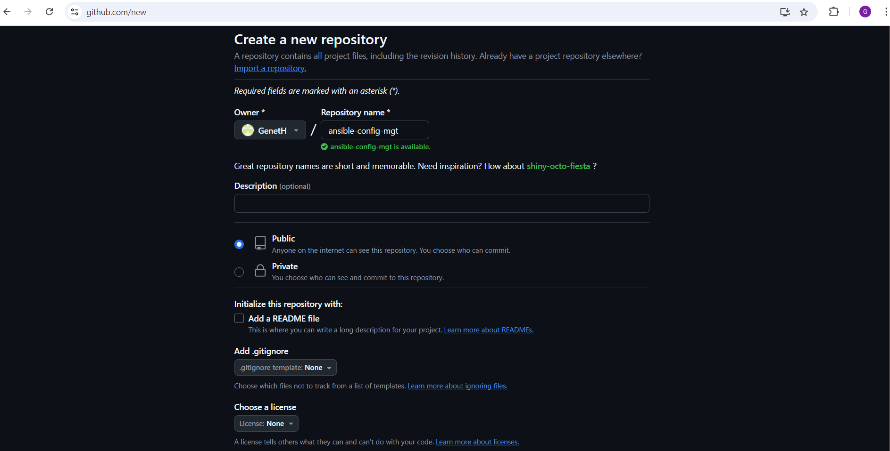

3. **Install Ansible**:
   - I ran the following commands to update the package lists and install Ansible:
     ```bash
     sudo apt update
     sudo apt install ansible
     ```
   - **Verified Ansible Installation**: I confirmed the Ansible installation by running:
     ```bash
     ansible --version
     ```
     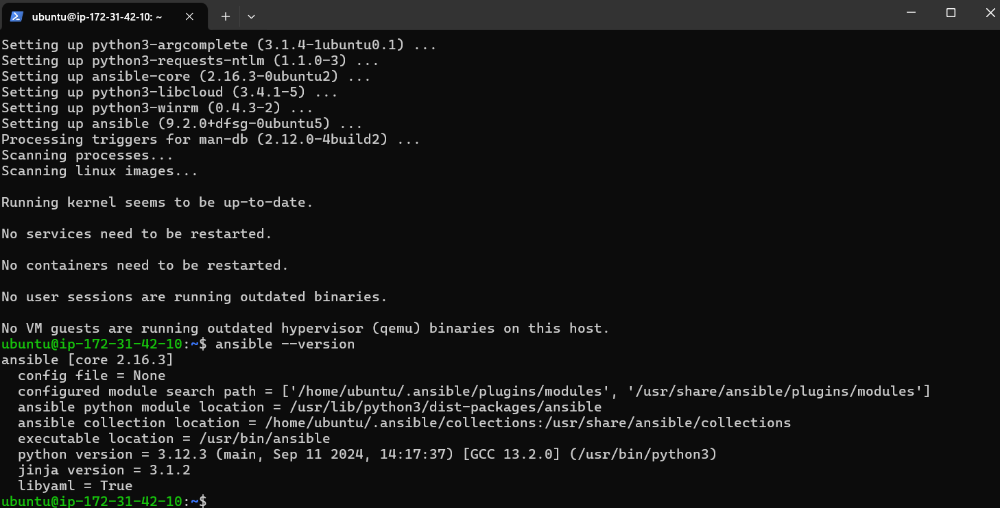

   - This displayed the installed version of Ansible along with configuration details.

4. **Configured Jenkins Build Job to Archive Repository**:

   - **Created a Freestyle Project in Jenkins**:
     - I named the project `ansible` and linked it to the `ansible-config-mgt` repository on GitHub.

   - **Configured a Webhook in GitHub**:
     - I set up a webhook in the GitHub repository to trigger the Jenkins build whenever changes are pushed to the repository.

   - **Configured a Post-Build Action**:
     - I added a post-build step in Jenkins to archive all files (`**`), similar to the process followed in **Project 9**.

5. **Tested the Setup**:
   - I modified the `README.md` file in the `master` branch to trigger a build.
   - The build started automatically, and Jenkins successfully archived the build artifacts.

   - I verified the archived files in the following directory on the Jenkins server:
     ```bash
     ls /var/lib/jenkins/jobs/ansible/builds/<build_number>/archive/
     ```
     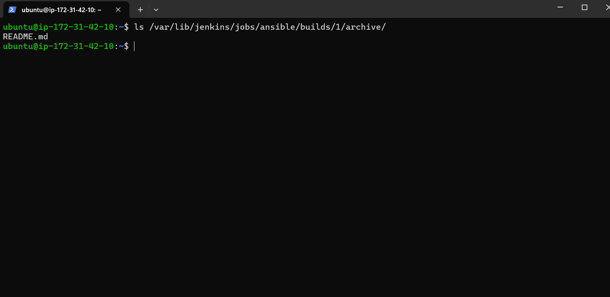

**Note**: Jenkins is configured to trigger builds only when changes are made to the main (or master) branch. 

---

### Step 2 - Prepare My Development Environment using Visual Studio Code

1. I already installed Visual Studio Code (VSC), a free and universal code editor that suits my needs for coding and debugging.  

2. After successfully installing VSC, I configured it to connect to my newly created [GitHub repository](https://github.com).

   

3. I cloned my `ansible-config-mgt` repository to my Jenkins-Ansible instance using the following command:

    ```bash
    git clone  https://github.com/GenetH/ansible-config-mgt
    ```
    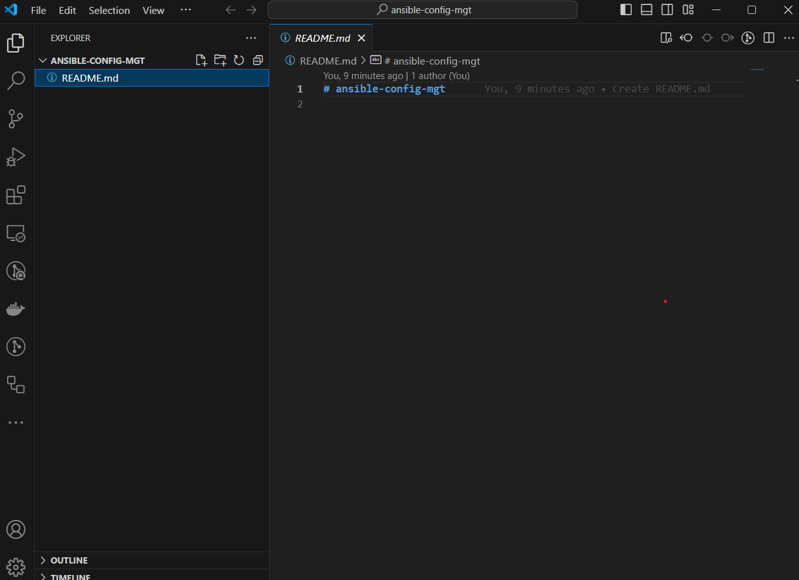

---

### Step 3 - Begin Ansible Development 

1. I created a new branch in my `ansible-config-mgt` GitHub repository for the development of a new feature.

   - I used descriptive and comprehensive branch names, including the ticket number, such as `feature/prj-1`.

   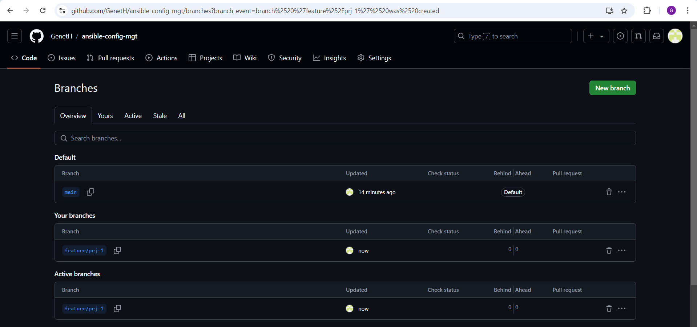

2. I checked out the newly created feature branch to my local machine and started building the code and directory structure.

3. I created a directory named `playbooks` to store all the playbook files.

   

4. I created another directory named `inventory` to keep my hosts organized.

5. Within the `playbooks` folder, I created my first playbook and named it `common.yml`.

6. Within the `inventory` folder, I created inventory files for each environment (Development, Staging, Testing, and Production). These inventory files use `.ini` style to configure Ansible hosts for environments like `dev`, `staging`, `uat`, and `prod`.
  
   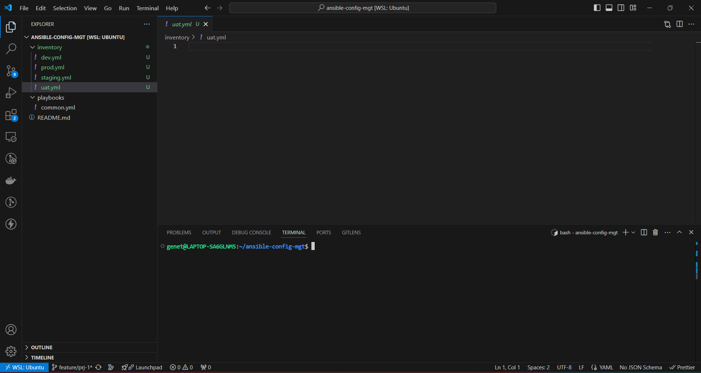


---

### Step 4 - Set Up an Ansible Inventory (Already Done)

1. **Understanding the Ansible Inventory**:
   - An Ansible inventory file defines the hosts and groups of hosts on which commands, modules, and tasks in a playbook operate.
   - Since my goal was to execute Linux commands on remote hosts, I ensured the configuration was set up properly by organizing my hosts within the inventory file.

2. **Saved Inventory Structure**:
   - I saved the following structure in the `inventory/dev` file, replacing the IP addresses with my own development server details:

     ```ini
     [nfs]
     <NFS-Server-Private-IP-Address> ansible_ssh_user=ec2-user

     [webservers]
     <Web-Server1-Private-IP-Address> ansible_ssh_user=ec2-user
     <Web-Server2-Private-IP-Address> ansible_ssh_user=ec2-user

     [db]
     <Database-Private-IP-Address> ansible_ssh_user=ec2-user

     [lb]
     <Load-Balancer-Private-IP-Address> ansible_ssh_user=ubuntu
     ```
     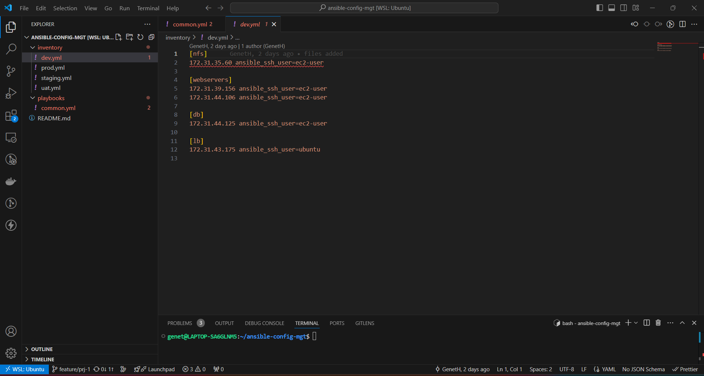

3. **Configuring SSH**:
   - Since Ansible uses **TCP port 22** by default to SSH into remote servers, I configured an SSH agent to manage my SSH keys and connect securely.
   
   To do this, I ran the following commands:
   
   ```bash
   eval `ssh-agent -s`
   ssh-add <path-to-private-key>
   ```

   - I confirmed that my SSH key was added by running:
     ```bash
     ssh-add -l
     ```
   
4. **Connecting to Jenkins-Ansible Server**:
   - After adding my SSH key, I SSHed into my Jenkins-Ansible server using the following command:
   
     ```bash
     ssh -A ubuntu@<public-ip>
     ```

    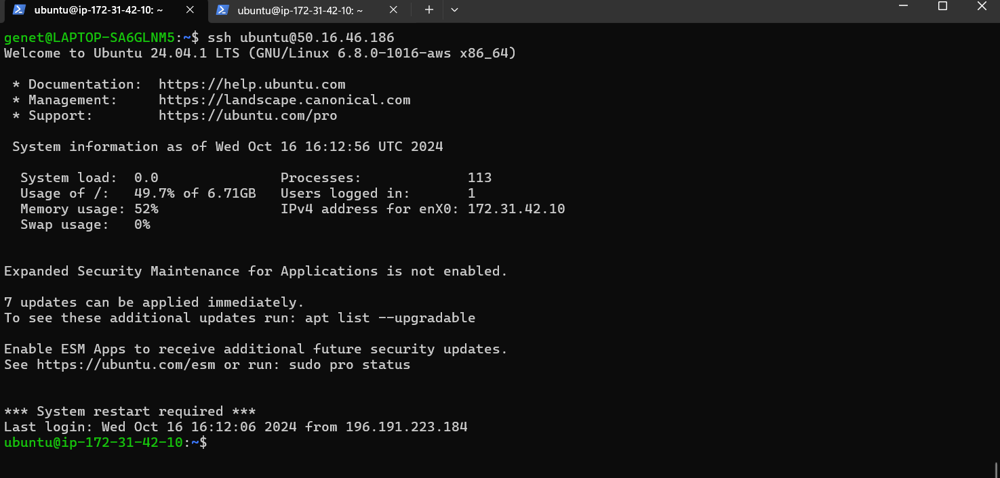

   This setup allowed me to connect my Jenkins-Ansible instance securely to the target servers using the inventory configuration I created.

---

### Step 5 - Created a Common Playbook (Already Done)

I have created a common Ansible playbook (`common.yml`) that provides instructions for tasks that should be performed on all servers listed in the `inventory/dev` file.

#### Playbook Explanation:
In the `common.yml` playbook, I wrote configuration for tasks that are repeatable, reusable, and applicable to multiple machines. This setup is common to systems across the infrastructure.

Here’s the content of the `playbooks/common.yml` file:

```yaml
---
- name: update web, nfs, and db servers
  hosts: webservers, nfs, db
  become: yes
  tasks:
    - name: ensure Wireshark is at the latest version
      yum:
        name: wireshark
        state: latest

- name: update LB server
  hosts: lb
  become: yes
  tasks:
    - name: Update apt repo
      apt:
        update_cache: yes

    - name: ensure Wireshark is at the latest version
      apt:
        name: wireshark
        state: latest
```
   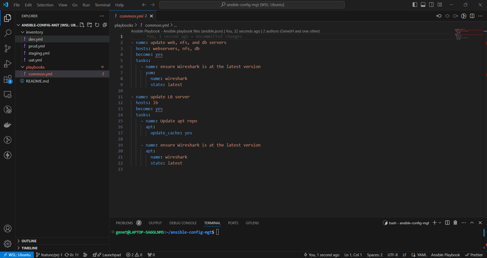

#### What This Playbook Does:
1. **For the Web, NFS, and DB Servers** (RHEL-based systems):
   - It uses `yum` to ensure the **Wireshark** utility is installed and updated to the latest version.
   - This task runs on the `webservers`, `nfs`, and `db` hosts listed in the inventory.

2. **For the Load Balancer (LB) Server** (Ubuntu-based system):
   - It first updates the `apt` repository cache.
   - Then, it installs and ensures that **Wireshark** is up to date.

#### Next Steps:
- I can update this playbook to include additional tasks, such as:
   - Creating a directory and a file inside it.
   - Changing the timezone on all servers.
   - Running some shell scripts across the infrastructure.


---

### Step 6 - Updated GIT with the Latest Code (Already Done)

All of my directories and files were created and saved on my local machine. I needed to push these changes to GitHub.

In real-world environments, I worked alongside other DevOps engineers and developers. It’s crucial to collaborate with Git, especially because many organizations have a development rule that prevents code deployment until it has been peer-reviewed. This is often referred to as the "Four Eyes Principle."

Since I was working on a separate branch, I had to raise a **Pull Request (PR)** to get the branch peer-reviewed and merged into the `master` branch.

I committed my code to GitHub using the following steps:

1. I used Git commands to add, commit, and push my branch to GitHub:
   ```bash
   git status
   git add .
   git commit -m "files added"
   git push origin feature/prj-1
   ```
  

2. After pushing the branch, I created a Pull Request (PR) on GitHub.

  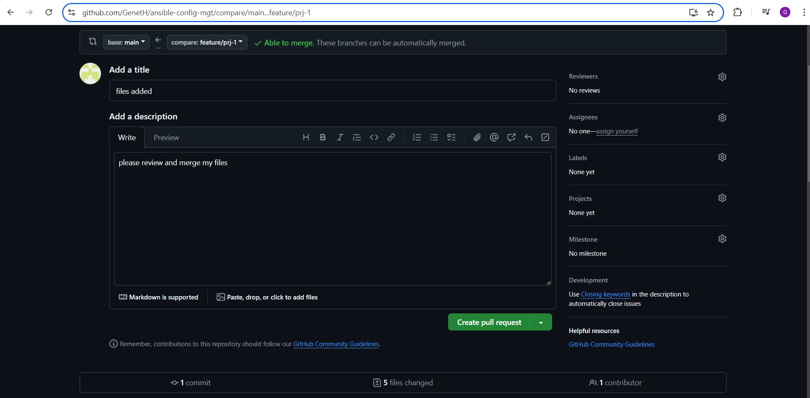

3. I took on the role of a reviewer to evaluate the changes.

4. Once the reviewer (or I, in the case of self-review) was satisfied with the changes, the code was merged into the `main` branch.

5. After merging, I checked out from the feature branch to the `main` branch and pulled down the latest changes.

   ```bash
   git checkout main
   git pull origin main
   ```
   

Once my code changes appeared in the `main` branch, Jenkins triggered the build process and saved all files (build artifacts) to the following directory on the Jenkins-Ansible server:

```bash
/var/lib/jenkins/jobs/ansible/builds/<build_number>/archive/
```
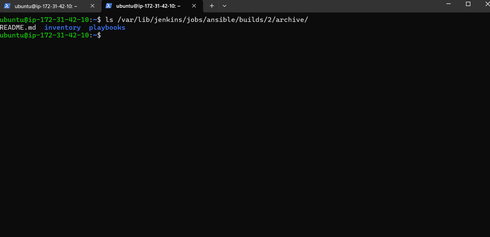

---

### Step 7 - Run the first Ansible Test 

I have successfully executed the Ansible playbook to verify that my configuration works.

Here’s what I did:

1. I set up **Visual Studio Code (VSCode)** to connect to my instance.
   
2. Then, I navigated to the correct directory, `ansible-config-mgt`, on the Jenkins-Ansible server:
   ```bash
   cd ansible-config-mgt
   ```

3. I ran the playbook using the following command:
   ```bash
   ansible-playbook -i inventory/dev.yml playbooks/common.yml
   ```

4. **Verifying Wireshark Installation**:
   After running the playbook, I checked each server to confirm if Wireshark was installed by using the command:
   ```bash
   which wireshark
   ```
   or
   ```bash
   wireshark --version
   ```

---

This test allowed me to confirm that the playbook was functioning correctly and that Wireshark was installed and updated as expected on the target servers. Let me know if you need further assistance!
---


### Conclusion

With the successful implementation of **Ansible Configuration Management**, I have automated the repetitive tasks of setting up virtual servers, installing software, and configuring them across multiple environments. By utilizing Ansible playbooks written in **YAML**, I can now efficiently manage server configurations and deployments without the need for manual intervention. 

Additionally, the integration of **Jenkins** with the **GitHub repository** ensures that any changes pushed to the repository automatically trigger builds, providing a streamlined workflow. The use of **Ansible as a Jump Server (Bastion Host)** enhances security by preventing direct access to sensitive servers, while also providing a way for engineers to access these servers through a secure intermediary.

Overall, this project demonstrates the power of automation in DevOps, significantly reducing manual tasks, improving security, and fostering efficient collaboration through continuous integration and deployment (CI/CD) pipelines.

---