# Ansible Dynamic Assignment (Include) and Community Roles

Ansible is a constantly evolving software project, so it is advised to refer to the [Ansible Documentation](https://docs.ansible.com/) for the latest updates on modules and usage.

Previous projects have built foundational skills in using Ansible playbooks, roles, and import functionalities. This project focuses on extending that knowledge by configuring UAT servers and learning new Ansible concepts and modules.

This project introduces the concept of dynamic assignments using the `include` module in Ansible.

**Static vs. Dynamic Assignments**:
- **Static Assignments**: Use the `import` module in Ansible.
- **Dynamic Assignments**: Use the `include` module.

Static assignments (`import`) are processed during the parsing phase of the playbook, meaning they do not adapt to changes made during execution. In contrast, dynamic assignments (`include`) are processed during the execution phase of the playbook, allowing them to incorporate changes as they happen. Understanding this distinction is essential for effectively working with dynamic assignments in Ansible and prepares you for practical applications in future projects.

---
### Introducing Dynamic Assignment Into Our Structure

**Launch EC2 Instances**: I created two web servers, one database server, and one load balancer server to apply those tasks.


#### 1. Create a New Branch
First, I navigated to my GitHub repository (`ansible-config-mgt`) and created a new branch named `dynamic-assignments` for organizing environment-specific variables.

#### 2. Set Up the Directory Structure
I created a new folder called `dynamic-assignments` in my repository. Inside this folder, I created a file named `env-vars.yml`, which I will use to include environment-specific variable files later.


**Updated Project Structure**:
```
|-- dynamic-assignments
|   |-- env-vars.yml
|-- inventory
|   |-- dev
|   |-- stage
|   |-- uat
|   |-- prod
|-- playbooks
|   |-- site.yml
|-- roles (optional)
|-- static-assignments
|   |-- common.yml
```


#### 3. Create an `env-vars` Directory for Environment Files
To manage variables for different environments (e.g., dev, stage, uat, prod), I created a folder named `env-vars`. Inside this `env-vars` folder, I created YAML files for each environment (e.g., `dev.yml`, `stage.yml`, `uat.yml`, `prod.yml`).

**Resulting Directory Structure**:
```
|-- dynamic-assignments
|   |-- env-vars.yml
|-- env-vars
|   |-- dev.yml
|   |-- stage.yml
|   |-- uat.yml
|   |-- prod.yml
|-- inventory
|   |-- dev
|   |-- stage
|   |-- uat
|   |-- prod
|-- playbooks
|   |-- site.yml
|-- static-assignments
|   |-- common.yml
|   |-- webservers.yml
```


#### 4. Add Content to `env-vars.yml`
I added the following code to `env-vars.yml`:

```yaml
---
- name: collate variables from env specific file, if it exists
  hosts: all
  tasks:
    - name: looping through list of available files
      include_vars: "{{ item }}"
      with_first_found:
        - files:
            - dev.yml
            - stage.yml
            - prod.yml
            - uat.yml
          paths:
            - "{{ playbook_dir }}/../env-vars"
      tags:
        - always
```


### Key Points on Dynamic Variable Inclusion in Ansible:

1. **Updated Syntax for `include_vars`**:
   - The `include_vars` module is used instead of `include`, as `include` has been deprecated since Ansible version 2.8. 
   - Newer variants include:
     - **`include_role`**
     - **`include_tasks`**
     - **`include_vars`**

   Additionally, Ansible introduced similar `import` variants:
   - **`import_role`**
   - **`import_tasks`**

2. **Use of Special Variables**:
   - **`{{ playbook_dir }}`**: This variable helps Ansible identify the location of the running playbook, allowing for relative navigation within the file system.
   - **`{{ inventory_file }}`**: This variable dynamically resolves to the name of the current inventory file being used, and appends `.yml` to pick the correct file in the `env-vars` directory.

3. **Loop with `with_first_found`**:
   - The `with_first_found` loop ensures that Ansible searches for the first available file in the list and includes it.
   - This is beneficial for setting default variable values if a specific environment file isn't found.

### Update `site.yml` with Dynamic Assignments:

**Update `site.yml`**:

   ```yaml
   ---
   - hosts: all
     name: Include dynamic variables
     tasks:
       import_playbook: ../static-assignments/common.yml
       include: ../dynamic-assignments/env-vars.yml
     tags:
       - always

   - hosts: webservers
     name: Webserver assignment
     import_playbook: ../static-assignments/webservers.yml
   ```


### Community Roles
   Instead of creating a MySQL role from scratch, use pre-built community roles. This saves time and ensures reliability as many roles have been developed by experienced engineers and are production-ready.

### Download MySQL Role

   For this guide, we'll use the MySQL role developed by geerlingguy.

### Preparing My Git Environment
   To keep my GitHub repository (`ansible-config-mgt`) current, I committed and pushed changes to the master branch before installing the new role. On my Jenkins-Ansible server, I ran the following commands:
   ```bash
   git init
   git pull https://github.com/<my-username>/ansible-config-mgt.git
   git remote add origin https://github.com/<my-username>/ansible-config-mgt.git
   git branch roles-feature
   git switch roles-feature
   ```


 **Installing the MySQL Role**:
   I installed the `geerlingguy.mysql` role using `ansible-galaxy`:
   ```bash
   ansible-galaxy install geerlingguy.mysql
   ```
   

   Then, I renamed the downloaded role for simplicity:
   ```bash
   mv geerlingguy.mysql/ mysql
   ```
   

**Create the `main.yml` File in the `vars` Directory**

In the `roles/mysql/vars/main.yml`, I added the MySQL root password, the databases to be created, and the users with appropriate privileges. Here's how I structured it:

```yaml

mysql_root_password: ""
mysql_databases:
  - name: tooling
    encoding: utf8
    collation: utf8_general_ci
mysql_users:
  - name: webaccess
    host: "172.31.16.0/20"  # Allow access from specific IP range
    password: Admin123      # User password for 'webaccess'
    priv: "tooling.*:ALL"    # Grant all privileges on the 'tooling' database
```


- **`mysql_root_password`**: This is the root password I set for MySQL.
- **`mysql_databases`**: I specified the database I wanted to create, `tooling`, with UTF-8 encoding and collation.
- **`mysql_users`**: I created a user `webaccess` and granted it full privileges on the `tooling` database, allowing access from the IP range `172.31.16.0/20`.

**Include the MySQL Role in `db-server.yml`**

In the `db-server.yml` playbook,inside static-assignments folder and name it db-servers.yml , update it with mysql roles.

```yaml
- hosts: db_servers
  become: yes
  vars_files:
    - vars/main.yml
  roles:
    - { role: mysql }
```


**Include the `db-server.yml` in `site.yml`**

To ensure that the MySQL role is applied to the database servers, I included the `db-server.yml` playbook in the main `site.yml` playbook:

```yaml
import_playbook: ../static-assignments/db-server.yml
```

**Configured MySQL**: The role automatically handled other necessary MySQL configurations, ensuring it was ready to use.

**Reviewing and Editing the Role**:
   I reviewed the `README.md` file of the role and adjusted the configuration settings to match the credentials and requirements for my project.

**Uploading Changes to GitHub**:
   I staged, committed, and pushed my changes with these commands:
   ```bash
   git add .
   git commit -m "Commit new role files into GitHub"
   git push --set-upstream origin roles-feature
   ```
   

**Creating a Pull Request**:
   After confirming everything was correct, I created a Pull Request in GitHub and merged it into the `main` branch.

### Configure Load Balancer Roles

1. **Decide on Role Sources**:
   I decided whether to develop custom roles for Nginx and Apache or use existing community roles. To save time, I chose to use community roles for a quick and efficient setup.

   Install Nginx Role:
   ```
   ansible-galaxy role install geerlingguy.nginx
   ```
   

   Install Apache Role:

   ```
   ansible-galaxy role install geerlingguy.apache
   ```
   Rename both apache and nginx

   ```
   mv geerlingguy.nginx nginx
   mv geerlingguy.apache apache
   ```
   

2. **Update Webservers Role**
   I updated the webservers role to install EPEL, Remi's repository, Apache, PHP, and clone the tooling website from my GitHub repository.
   Update `roles/webservers/tasks/main.yml`:
```yaml
---
- name: install apache
  remote_user: ec2-user
  become: true
  become_user: root
  ansible.builtin.yum:
    name: "httpd"
    state: present

- name: Enable apache
  remote_user: ec2-user
  become: true
  become_user: root
  ansible.builtin.command:
    cmd: sudo systemctl enable httpd

- name: Install EPEL release
  remote_user: ec2-user
  become: true
  become_user: root
  ansible.builtin.command:
    cmd: sudo dnf install https://dl.fedoraproject.org/pub/epel/epel-release-latest-9.noarch.rpm -y

- name: Install dnf-utils and Remi repository
  remote_user: ec2-user
  become: true
  become_user: root
  ansible.builtin.command:
    cmd: sudo dnf install dnf-utils http://rpms.remirepo.net/enterprise/remi-release-9.rpm -y

- name: Reset PHP module
  remote_user: ec2-user
  become: true
  become_user: root
  ansible.builtin.command:
    cmd: sudo dnf module reset php -y

- name: Enable PHP 8.2 module
  remote_user: ec2-user
  become: true
  become_user: root
  ansible.builtin.command:
    cmd: sudo dnf module enable php:remi-8.2 -y

- name: Install PHP and extensions
  remote_user: ec2-user
  become: true
  become_user: root
  ansible.builtin.yum:
    name:
      - php
      - php-opcache
      - php-gd
      - php-curl
      - php-mysqlnd
    state: present

- name: Install MySQL client
  remote_user: ec2-user
  become: true
  become_user: root
  ansible.builtin.yum:
    name: "mysql"
    state: present

- name: Start PHP-FPM service
  remote_user: ec2-user
  become: true
  become_user: root
  ansible.builtin.service:
    name: php-fpm
    state: started

- name: Enable PHP-FPM service
  remote_user: ec2-user
  become: true
  become_user: root
  ansible.builtin.service:
    name: php-fpm
    enabled: true

- name: Set SELinux boolean for httpd_execmem
  remote_user: ec2-user
  become: true
  become_user: root
  ansible.builtin.command:
    cmd: sudo setsebool -P httpd_execmem 1

- name: install git
  remote_user: ec2-user
  become: true
  become_user: root
  ansible.builtin.yum:
    name: "git"
    state: present

- name: clone a repo
  remote_user: ec2-user
  become: true
  become_user: root
  ansible.builtin.git:
    repo: https://github.com/Github-name/tooling
    dest: /var/www/html
    force: yes

- name: copy html content to one level up
  remote_user: ec2-user
  become: true
  become_user: root
  command: cp -r /var/www/html/html/ /var/www/

- name: Start service httpd, if not started
  remote_user: ec2-user
  become: true
  become_user: root
  ansible.builtin.service:
    name: httpd
    state: started

- name: recursively remove /var/www/html/html/ directory
  remote_user: ec2-user
  become: true
  become_user: root
  ansible.builtin.file:
    path: /var/www/html/html
    state: absent

- name: Check if Apache is running
  ansible.builtin.service_facts:

- name: Stop and disable Apache if it is running
  ansible.builtin.service:
    name: apache2
    state: stopped
    enabled: no
  when: "'apache2' in services and services['apache2'].state == 'running'"
  become: yes
```
    
   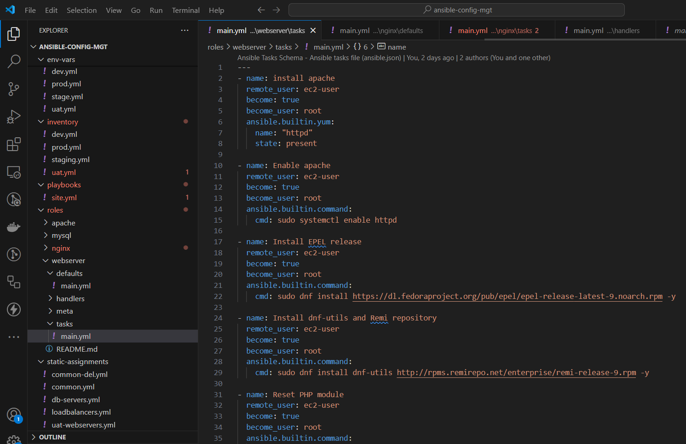

3. **Create a Task to Stop Apache if Running**
   Next, I added a task to check and stop Apache if it is running on the web servers.
   Add to `roles/nginx/tasks/main.yml`:
```yaml
- name: Check if Apache is running
  ansible.builtin.service_facts:

- name: Stop and disable Apache if it is running
  ansible.builtin.service:
    name: apache2
    state: stopped
    enabled: no
  when: "'apache2' in services and services['apache2'].state == 'running'"
  become: yes
```
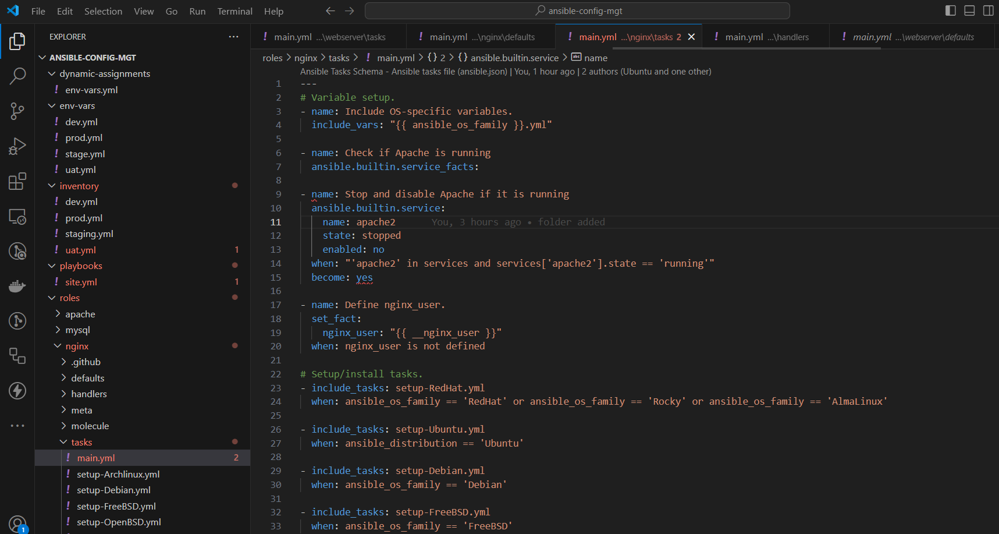

4. **Update roles/nginx/defaults/main.yml for Nginx Load Balancer**
```yaml
# roles/nginx/defaults/main.yml

# Enable/disable Nginx as a load balancer
enable_nginx_lb: true
load_balancer_is_required: true

# Define the virtual hosts for Nginx
nginx_vhosts:
  - listen: "80"
    server_name: "example.com"
    root: "/var/www/html"
    index: "index.php index.html index.htm"
    locations:
      - path: "/"
        proxy_pass: "http://myapp1"
      
    # Optional properties that can be used
    server_name_redirect: "www.example.com"
    error_page: ""
    access_log: ""
    error_log: ""
    extra_parameters: ""
    template: "{{ nginx_vhost_template }}"
    state: "present"

# Define upstreams for load balancing
nginx_upstreams:
  - name: myapp1
    strategy: "ip_hash"
    keepalive: 16
    servers:
      - "172.31.35.223 weight=5"
      - "172.31.34.101 weight=5"

# Define Nginx logging format
nginx_log_format: |-
  '$remote_addr - $remote_user [$time_local] "$request" '
  '$status $body_bytes_sent "$http_referer" '
  '"$http_user_agent" "$http_x_forwarded_for"'

# Ensure the load balancer works as intended
nginx_http_proxy:
  - listen: "80"
  - server_name: "loadbalancer.example.com"
```
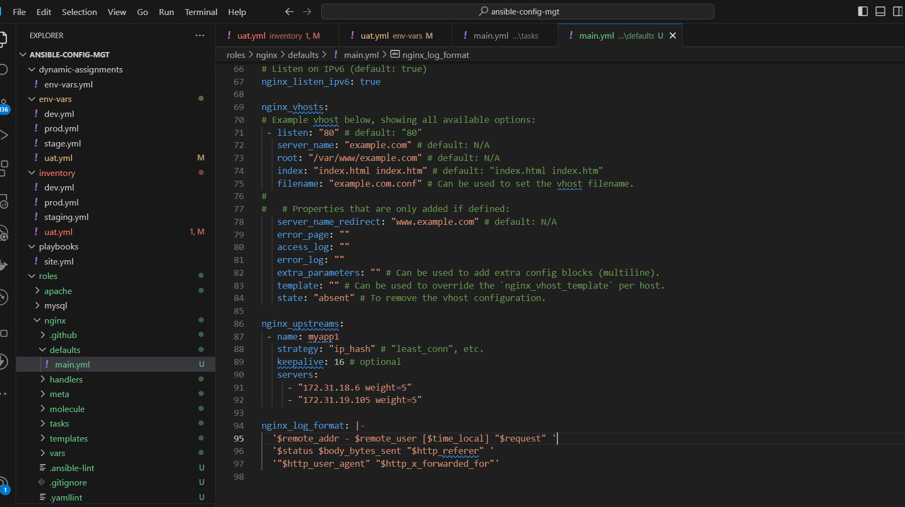

5. **Create Variables for Load Balancer Selection**:
   Inside the `defaults/main.yml` file for both Nginx and Apache roles, I created the following variables:
   ```yaml
   enable_nginx_lb: false
   load_balancer_is_required: false
   ```
   

   ```yaml
   enable_apache_lb: false
   load_balancer_is_required: false
   ```
   

6. **Configure the `loadbalancers.yml` Assignment**:
   I created a `loadbalancers.yml` file in the `static-assignments` directory and set conditions for applying the roles:
   ```yaml
   - hosts: lb
     roles:
       - { role: nginx, when: enable_nginx_lb and load_balancer_is_required }
       - { role: apache, when: enable_apache_lb and load_balancer_is_required }
   ```
   

7. **Update the `site.yml` File**:
   I updated the `site.yml` file to include the new load balancer playbook:
   ```yaml
   - name: Loadbalancers assignment
     hosts: lb
     import_playbook: ../static-assignments/loadbalancers.yml
     when: load_balancer_is_required
   ```
   

8. **Update `inventory/uat.yml`**

```yaml
[uat-webservers]
172.31.18.6 ansible_ssh_user=ec2-user
172.31.19.105 ansible_ssh_user=ec2-user

[db_servers]
172.31.88.43 ansible_ssh_user=ec2-user

[lb]
172.31.86.76 ansible_ssh_user=ubuntu
```
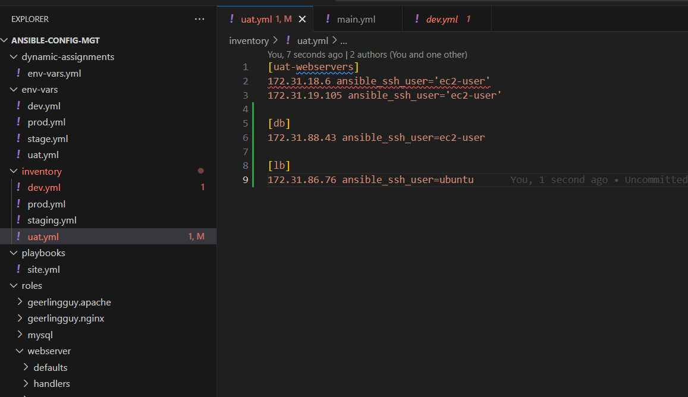

9. **Set Variables in Environment-Specific Files**:
   In the `env-vars` folder, I set the necessary variables in the `uat.yml` file to activate the Nginx load balancer:
   ```yaml
   enable_nginx_lb: true
   load_balancer_is_required: true
   ```
   

   To use Apache instead, I would set `enable_nginx_lb` to `false` and `enable_apache_lb` to `true`.

10. **Test**:

   Command to run the playbook
   ```bash
   ansible-playbook -i inventory/uat.yml playbooks/site.yml --extra-vars "@env-vars/uat.yml"
   ```
   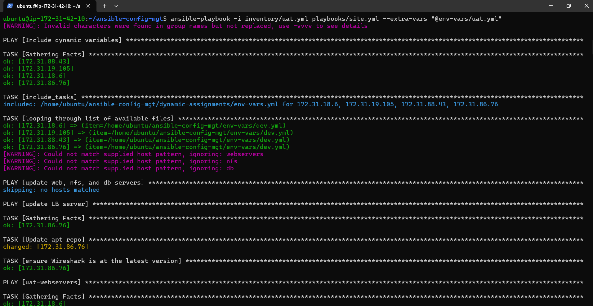
   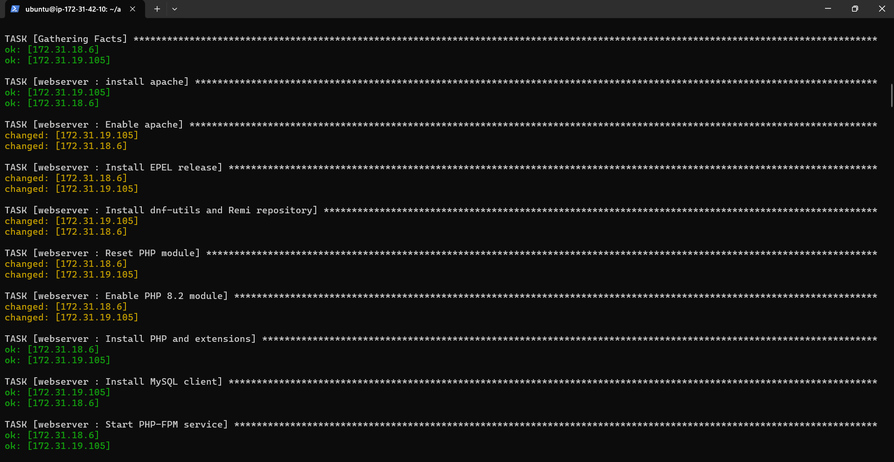
   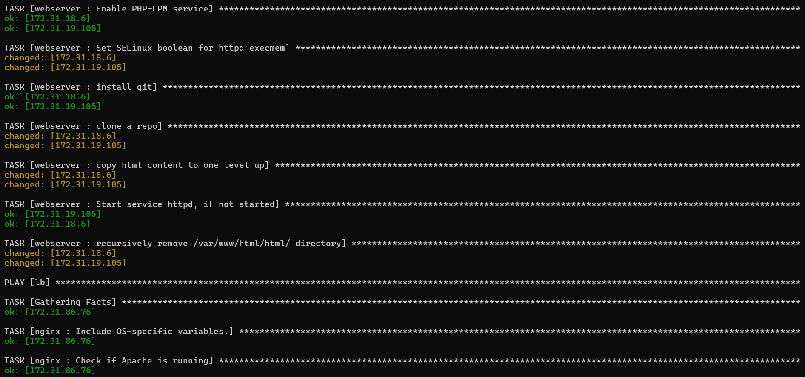
   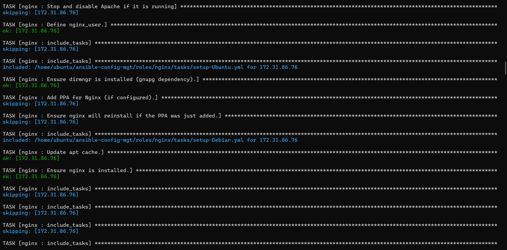
   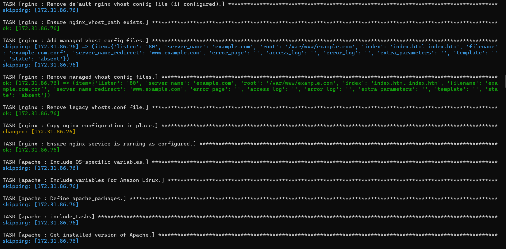
   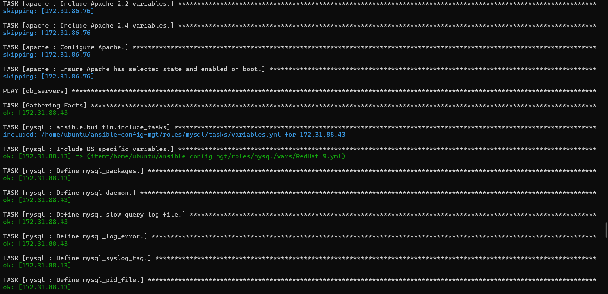
   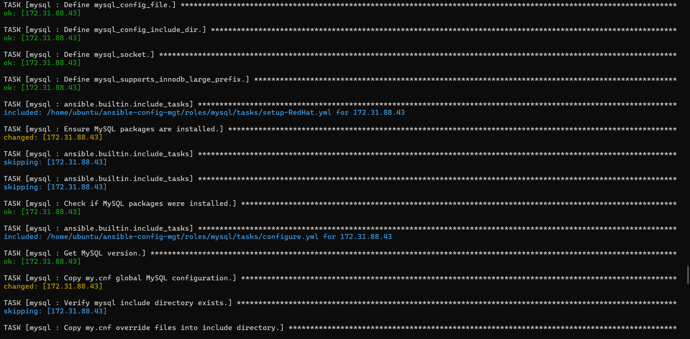
   
   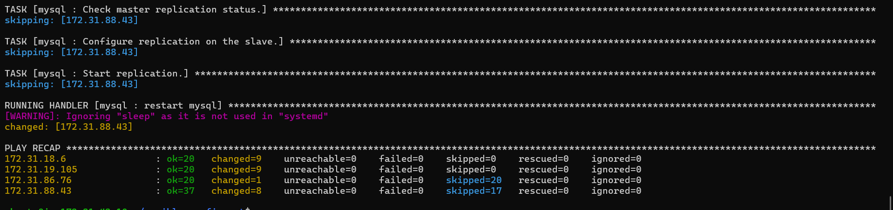

### Verification

After running the playbook, I verified that my UAT web servers were configured correctly by accessing them through a web browser:

- `http://<Web1-UAT-Server-Public-IP-or-DNS-Name>/index.php`

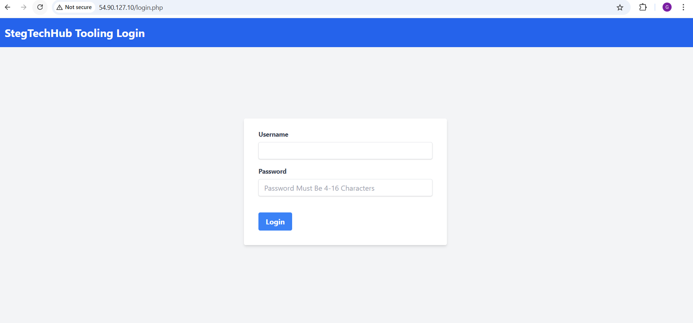

- `http://<Web2-UAT-Server-Public-IP-or-DNS-Name>/index.php`

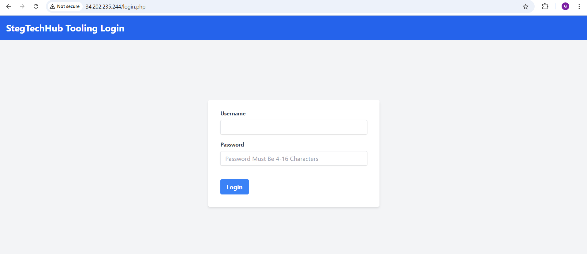

Both URLs confirmed successful configuration when they displayed the expected output.
   
### Conclusion

Completing this project enhanced my understanding of both static and dynamic assignments within Ansible, highlighting the crucial differences between the `import` and `include` modules. The practical implementation of dynamic assignments demonstrated how they adapt during the execution phase, making them an invaluable tool for scenarios where flexibility is required.

By creating the `env-vars.yml` and integrating it with `site.yml`, I structured my Ansible project to accommodate environment-specific configurations seamlessly. Additionally, utilizing pre-built community roles for MySQL, Nginx, and Apache expedited the process while maintaining reliability and quality.

This project provided practical insights into how to manage roles efficiently, use special variables like `{{ playbook_dir }}` and `{{ inventory_file }}`, and configure conditional logic for load balancers. The knowledge gained will be beneficial for future Ansible projects, ensuring scalable, adaptable, and well-organized configurations.


