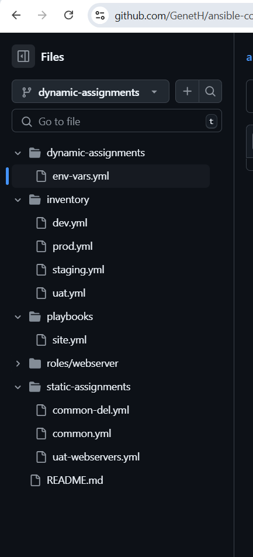
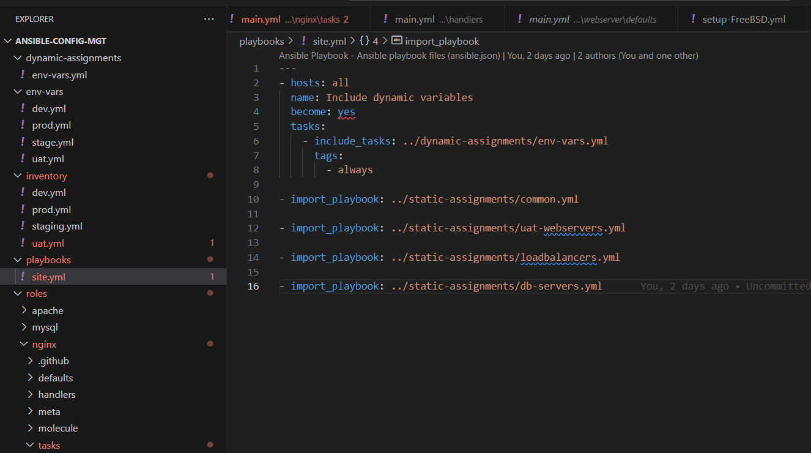

# Ansible Dynamic Assignment and Community


---

### Introducing Dynamic Assignment Into Our Structure

#### 1. Create a New Branch
First, I navigated to my GitHub repository (`ansible-config-mgt`) and created a new branch named `dynamic-assignments` for organizing environment-specific variables.

#### 2. Set Up the Directory Structure
I created a new folder called `dynamic-assignments` in my repository. Inside this folder, I created a file named `env-vars.yml`, which I will use to include environment-specific variable files later.


**Updated Project Structure**:
```
|-- dynamic-assignments
|   |-- env-vars.yml
|-- inventory
|   |-- dev
|   |-- stage
|   |-- uat
|   |-- prod
|-- playbooks
|   |-- site.yml
|-- roles (optional)
|-- static-assignments
|   |-- common.yml
```



#### 3. Create an `env-vars` Directory for Environment Files
To manage variables for different environments (e.g., dev, stage, uat, prod), I created a folder named `env-vars`. Inside this `env-vars` folder, I created YAML files for each environment (e.g., `dev.yml`, `stage.yml`, `uat.yml`, `prod.yml`).

**Resulting Directory Structure**:
```
|-- dynamic-assignments
|   |-- env-vars.yml
|-- env-vars
|   |-- dev.yml
|   |-- stage.yml
|   |-- uat.yml
|   |-- prod.yml
|-- inventory
|   |-- dev
|   |-- stage
|   |-- uat
|   |-- prod
|-- playbooks
|   |-- site.yml
|-- static-assignments
|   |-- common.yml
|   |-- webservers.yml
```


#### 4. Add Content to `env-vars.yml`
I added the following code to `env-vars.yml`:

```yaml
---
- name: collate variables from env specific file, if it exists
  hosts: all
  tasks:
    - name: looping through list of available files
      include_vars: "{{ item }}"
      with_first_found:
        - files:
            - dev.yml
            - stage.yml
            - prod.yml
            - uat.yml
          paths:
            - "{{ playbook_dir }}/../env-vars"
      tags:
        - always
```


### Key Points on Dynamic Variable Inclusion in Ansible:

1. **Updated Syntax for `include_vars`**:
   - The `include_vars` module is used instead of `include`, as `include` has been deprecated since Ansible version 2.8. 
   - Newer variants include:
     - **`include_role`**
     - **`include_tasks`**
     - **`include_vars`**

   Additionally, Ansible introduced similar `import` variants:
   - **`import_role`**
   - **`import_tasks`**

2. **Use of Special Variables**:
   - **`{{ playbook_dir }}`**: This variable helps Ansible identify the location of the running playbook, allowing for relative navigation within the file system.
   - **`{{ inventory_file }}`**: This variable dynamically resolves to the name of the current inventory file being used, and appends `.yml` to pick the correct file in the `env-vars` directory.

3. **Loop with `with_first_found`**:
   - The `with_first_found` loop ensures that Ansible searches for the first available file in the list and includes it.
   - This is beneficial for setting default variable values if a specific environment file isn't found.

### Update `site.yml` with Dynamic Assignments:

**Update `site.yml`**:

   ```yaml
   ---
   - hosts: all
     name: Include dynamic variables
     tasks:
       import_playbook: ../static-assignments/common.yml
       include: ../dynamic-assignments/env-vars.yml
     tags:
       - always

   - hosts: webservers
     name: Webserver assignment
     import_playbook: ../static-assignments/webservers.yml
   ```


### Community Roles
   Instead of creating a MySQL role from scratch, use pre-built community roles. This saves time and ensures reliability as many roles have been developed by experienced engineers and are production-ready.

### Download MySQL Role

   For this guide, we'll use the MySQL role developed by geerlingguy.

### Preparing My Git Environment
   To keep my GitHub repository (`ansible-config-mgt`) current, I committed and pushed changes to the master branch before installing the new role. On my Jenkins-Ansible server, I ran the following commands:
   ```bash
   git init
   git pull https://github.com/<my-username>/ansible-config-mgt.git
   git remote add origin https://github.com/<my-username>/ansible-config-mgt.git
   git branch roles-feature
   git switch roles-feature
   ```


 **Installing the MySQL Role**:
   I installed the `geerlingguy.mysql` role using `ansible-galaxy`:
   ```bash
   ansible-galaxy install geerlingguy.mysql
   ```
   

   Then, I renamed the downloaded role for simplicity:
   ```bash
   mv geerlingguy.mysql/ mysql
   ```
   

**Reviewing and Editing the Role**:
   I reviewed the `README.md` file of the role and adjusted the configuration settings to match the credentials and requirements for my project.

**Uploading Changes to GitHub**:
   I staged, committed, and pushed my changes with these commands:
   ```bash
   git add .
   git commit -m "Commit new role files into GitHub"
   git push --set-upstream origin roles-feature
   ```
   

**Creating a Pull Request**:
   After confirming everything was correct, I created a Pull Request in GitHub and merged it into the `main` branch.


Here's the revised step-by-step guide tailored to reflect my own experience in configuring load balancer roles:

### Configure Load Balancer Roles

1. **Decide on Role Sources**:
   I decided whether to develop custom roles for Nginx and Apache or use existing community roles. To save time, I chose to use community roles for a quick and efficient setup.

   Install Nginx Role:
   ```
   ansible-galaxy role install geerlingguy.nginx
   ```
   

   Install Apache Role:

   ```
   ansible-galaxy role install geerlingguy.apache
   ```
2. **Create Variables for Load Balancer Selection**:
   Inside the `defaults/main.yml` file for both Nginx and Apache roles, I created the following variables:
   ```yaml
   enable_nginx_lb: false
   load_balancer_is_required: false
   ```
   

   ```yaml
   enable_apache_lb: false
   load_balancer_is_required: false
   ```
   

3. **Configure the `loadbalancers.yml` Assignment**:
   I created a `loadbalancers.yml` file in the `static-assignments` directory and set conditions for applying the roles:
   ```yaml
   - hosts: lb
     roles:
       - { role: nginx, when: enable_nginx_lb and load_balancer_is_required }
       - { role: apache, when: enable_apache_lb and load_balancer_is_required }
   ```
   

4. **Update the `site.yml` File**:
   I updated the `site.yml` file to include the new load balancer playbook:
   ```yaml
   - name: Loadbalancers assignment
     hosts: lb
     import_playbook: ../static-assignments/loadbalancers.yml
     when: load_balancer_is_required
   ```
   

5. **Set Variables in Environment-Specific Files**:
   In the `env-vars` folder, I set the necessary variables in the `uat.yml` file to activate the Nginx load balancer:
   ```yaml
   enable_nginx_lb: true
   load_balancer_is_required: true
   ```
   To use Apache instead, I would set `enable_nginx_lb` to `false` and `enable_apache_lb` to `true`.

6. **Test My Configuration**:
   I updated the inventory file for the UAT environment and ran the playbook:
   ```bash
   ansible-playbook -i inventory/uat.yml playbooks/site.yml
   ```
   I then verified that the correct load balancer (Nginx or Apache) was deployed based on the configuration in the environment file.

