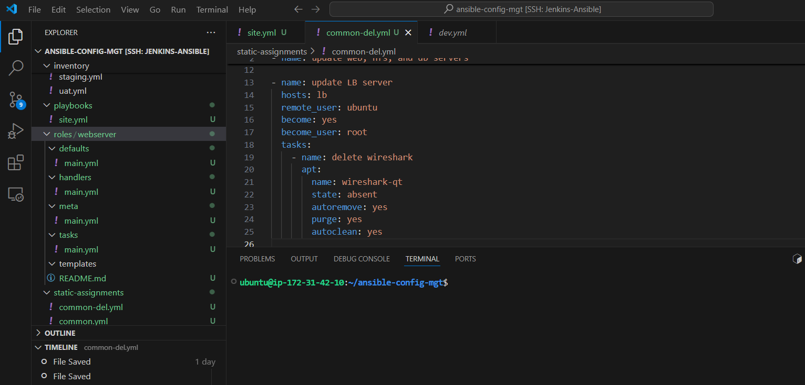

## Ansible Refactoring & Static Assignments (Imports and Roles) - 101

### Project Overview:
In this project, I worked on enhancing the existing `ansible-config-mgt` repository by refactoring my Ansible code, creating assignments, and using imports to improve code structure, reusability, and maintainability.

### What is Code Refactoring?
- **Definition**: Refactoring involves modifying the source code structure without altering its behavior to improve readability, maintainability, and extensibility.
- **Benefits**: Enhances code clarity, reduces complexity, and adds meaningful comments without changing the core logic.
- **In Practice**: Rearranging the code enhances the infrastructure's layout without impacting its functionality.

The content suggests that the Ansible project requires restructuring the playbooks by using imports and roles, leading to better code organization, streamlined task execution, and improved reusability.

---

### Step 1 - Jenkins Job Enhancement

Before I begin, I made some changes to my Jenkins job. Initially, every new change in the code created a separate directory, which wasn't convenient for running commands from one place and consumed space on the Jenkins server with each subsequent change. To improve this process, I enhanced it by introducing a new Jenkins project/job using the **Copy Artifact** plugin.

1. **Create a Directory for Artifacts**:
   - I logged in to my **Jenkins-Ansible** server and created a directory where all build artifacts would be stored after each build.

   ```bash
   sudo mkdir /home/ubuntu/ansible-config-artifact
   
   ```

2. **Set Directory Permissions**:
   - I changed the permissions for the directory to allow Jenkins to write files into it:

   ```bash
   sudo chmod -R 0777 /home/ubuntu/ansible-config-artifact
   ```
   

3. **Install the Copy Artifact Plugin**:
   - I went to **Manage Jenkins** -> **Manage Plugins**, searched for the **Copy Artifact** plugin, and installed it without restarting Jenkins.

   

4. **Create a New Freestyle Project**:
   - I created a new **Freestyle Project** in Jenkins and named it `save_artifacts`. This project is triggered by the completion of my existing **Ansible** project.
   
5. **Configure Build Settings**:
   - I configured the project to discard old builds, keeping only a set number of builds (e.g., 2).

     

   - In the **Build Triggers** section, I checked the option to trigger the build after my other project (`ansible`) completes its build.

     

6. **Configure Artifact Copying**:
   - The main purpose of the `save_artifacts` project is to copy build results (artifacts) into the `/home/ubuntu/ansible-config-artifact` directory.
   - In the **Build** section of the job configuration, I added a step to **Copy artifacts from another project**, specifying `ansible` as the source project. I set `/home/ubuntu/ansible-config-artifact` as the target directory for storing the artifacts.

     


7. **Test the Setup**:
   - To test the setup, I made a small change to the `README.md` file in the GitHub repository and committed it to the `master` branch. This triggered both Jenkins jobs, and I checked that the files were saved inside the `/home/ubuntu/ansible-config-artifact` directory on my Jenkins server.
   
   Initially, I encountered an access error, as shown below:

   

   To resolve this, I added the Jenkins user to the `ubuntu` group by running:
   ```bash
   sudo usermod -aG ubuntu jenkins
   ```
   Then, I restarted the Jenkins service to apply the changes:
   ```bash
   sudo systemctl restart jenkins
   ```
   

By implementing these changes, I ensured that my Jenkins pipeline is more efficient, clean, and well-organized, with build artifacts stored centrally and proper management of old builds.

---


### Step 2 - Refactor Ansible Code by Importing Other Playbooks into `site.yml`

Before refactoring my Ansible code, I ensured that I pulled down the latest code from the `master` (main) branch and created a new branch called `refactor`.


The DevOps principle of iterative improvement emphasizes enhancing processes for better efficiency. Refactoring is one way to achieve this, with the question often being, "Why fix what isn't broken?" The answer lies in improving maintainability and readability.

In my previous work, I included all tasks within a single playbook called `common.yml`, which worked for simpler tasks and configurations across two types of OS. However, as my infrastructure grew more complex, applying tasks to various servers with different requirements made it impractical to navigate through a single playbook. This method risked cluttering my code with comments and conditional logic that could confuse team members. Breaking tasks into modular playbooks promotes better code organization, making it easier for DevOps colleagues to understand and maintain.

#### How I Implemented Code Reuse with Playbook Imports

1. **Create a `site.yml` File**:
   I created a new file in the `playbooks` folder and named it `site.yml`. This file acts as the main entry point for all infrastructure configurations. It references other playbooks, making `site.yml` a parent that includes all sub-playbooks like `common.yml`.

2. **Organize the Directory Structure**:
   I added a new folder at the root of the repository called `static-assignments`, where all child playbooks are stored. This setup is not an Ansible-specific requirement but helps maintain an organized codebase.

3. **Move `common.yml`**:
   I moved the `common.yml` playbook into the `static-assignments` folder.

   

4. **Import `common.yml` in `site.yml`**:
   I imported the `common.yml` playbook into `site.yml` using the `import_playbook` module. The updated `site.yml` file looked like this:

   ```yaml
   ---
   - hosts: all
     - import_playbook: ../static-assignments/common.yml
   ```

   This structure enables me to break down complex tasks into manageable sections and reuse code efficiently.

#### Resulting Folder Structure:
```
|-- static-assignments
|   |-- common.yml
|-- inventory
|   |-- dev
|   |-- stage
|   |-- uat
|   |-- prod
|-- playbooks
|   |-- site.yml
```

---

5. **Create a New Playbook for Testing (`common-del.yml`)**

Since I needed to apply some tasks to my `dev` servers where **Wireshark** was already installed, I created another playbook under `static-assignments` and named it `common-del.yml`. This playbook was configured to remove **Wireshark**.

**Content of `common-del.yml`**:
```yaml
---
- name: update web, nfs, and db servers
  hosts: webservers, nfs, db
  remote_user: ec2-user
  become: yes
  become_user: root
  tasks:
    - name: delete wireshark
      yum:
        name: wireshark
        state: removed

- name: update LB server
  hosts: lb
  remote_user: ubuntu
  become: yes
  become_user: root
  tasks:
    - name: delete wireshark
      apt:
        name: wireshark-qt
        state: absent
        autoremove: yes
        purge: yes
        autoclean: yes
```


#### Update `site.yml` and Run the Playbook

To apply this playbook, I updated `site.yml` to reference `common-del.yml` instead of `common.yml` and ran it against the `dev` environment.

**Updated `site.yml`**:
```yaml
---
- hosts: all
  - import_playbook: ../static-assignments/common-del.yml
```

**Command to Run the Playbook**:
```bash
cd /home/ubuntu/ansible-config-mgt/
ansible-playbook -i inventory/dev.yml playbooks/site.yml
```


#### Verify the Results

I verified that **Wireshark** was deleted on all targeted servers by running the following command:

```bash
wireshark --version
```
I checked all servers


**Wireshark** was deleted on all targeted servers.

---

### Step 3 - Configure UAT Webservers with a Role 'Webserver'

After organizing my `dev` environment, I moved on to setting up and configuring two new UAT web servers. While I could have written tasks for these servers in the same playbook, it would have resulted in clutter. Instead, I decided to use a dedicated **role** to maintain reusability and clean code structure.

#### 1. Launch and Name New EC2 Instances
I launched two fresh EC2 instances with the **RHEL 8** image and named them `Web1-UAT` and `Web2-UAT` for easy identification. I ensured that I stopped any unused EC2 instances to avoid additional costs.

> **Tip**: For this setup, I only needed the two RHEL 8 servers and my existing Jenkins-Ansible server to be up and running.


#### 2. Create a Role for Webserver Configuration
To create a role, I created a directory called `roles` relative to the playbook file or within the `/etc/ansible/` directory. This can be done in two ways:
- **Using Ansible Galaxy** inside the `ansible-config-mgt/roles` directory:
  ```bash
  mkdir roles
  cd roles
  ansible-galaxy init webserver
  ```
  

- **Manually Creating the Directory Structure**:
  I manually created folders and files for the role. Although I used Ansible Galaxy, if you create the structure manually, you can skip unnecessary directories like `tests`, `files`, and `vars`.

- **Resulting Directory Structure**
The folder structure looked like this after cleanup:
```
webserver
├── README.md
├── defaults
│   └── main.yml
├── handlers
│   └── main.yml
├── meta
│   └── main.yml
├── tasks
│   └── main.yml
├── templates
```


#### 3. Update the Inventory
I updated my `inventory/uat.yml` file with the IP addresses of the two UAT web servers:
```ini
[uat-webservers]
<Web1-UAT-Server-Private-IP-Address> ansible_ssh_user='ec2-user'
<Web2-UAT-Server-Private-IP-Address> ansible_ssh_user='ec2-user'
```


> **Note**: Ensure that the `ssh-agent` is used to connect to the Jenkins-Ansible instance, as I had done in previous projects.

#### 4. Update `ansible.cfg`
In `/etc/ansible/ansible.cfg`, I uncommented the `roles_path` string and provided the full path to the roles directory:
```ini
roles_path = /home/ubuntu/ansible-config-mgt/roles
```


#### 5. Add Logic to the `webserver` Role
I added configuration logic to the `webserver` role by writing tasks in `tasks/main.yml` to:
- Install and configure Apache (`httpd`)
- Clone the Tooling website from GitHub
- Deploy the code to `/var/www/html` on both UAT web servers
- Start the `httpd` service

**Sample Content of `main.yml`**:
```yaml
---
- name: install apache
  become: true
  ansible.builtin.yum:
    name: "httpd"
    state: present

- name: install git
  become: true
  ansible.builtin.yum:
    name: "git"
    state: present

- name: clone a repo
  become: true
  ansible.builtin.git:
    repo: https://github.com/<your-name>/tooling.git
    dest: /var/www/html
    force: yes

- name: copy html content to one level up
  become: true
  command: cp -r /var/www/html/html/ /var/www/

- name: Start service httpd, if not started
  become: true
  ansible.builtin.service:
    name: httpd
    state: started

- name: recursively remove /var/www/html/html/ directory
  become: true
  ansible.builtin.file:
    path: /var/www/html/html
    state: absent
```


---

### Step 4 - Reference 'Webserver' Role

With my UAT web servers configured and roles set up, the next step was to reference the `webserver` role in my Ansible configuration. This ensures that tasks are assigned correctly during deployment.

#### 1. Create a Playbook for UAT Webservers
Within the `static-assignments` folder, I created a new playbook named `uat-webservers.yml` to reference the `webserver` role:

**Content of `uat-webservers.yml`**:
```yaml
---
- hosts: uat-webservers
  roles:
    - webserver
```


This playbook specified that all tasks associated with the `webserver` role should be executed on the `uat-webservers` group.

#### 2. Update the `site.yml` File
To include the new `uat-webservers.yml` playbook in my main configuration, I updated the `site.yml` file to refer to it. This ensures that `site.yml` serves as the single entry point for running all necessary playbooks:

**Updated `site.yml`**:
```yaml
---
- hosts: all
  import_playbook: ../static-assignments/common.yml

- hosts: uat-webservers
  import_playbook: ../static-assignments/uat-webservers.yml
```


---

### Step 5 - Commit & Test

After implementing the changes, I committed my code to the repository and created a Pull Request. Once approved, I merged the changes into the `master` branch. I ensured that my Jenkins jobs were configured with webhooks to trigger automatically upon changes in the repository. Both Jenkins jobs were triggered successfully, and the files were copied to the `/home/ubuntu/ansible-config-mgt/` directory on my Jenkins-Ansible server.


#### Run the Playbook Against the UAT Inventory

To execute the playbook, I needed to ensure I was connected to the **Jenkins-Ansible** server using `ssh-agent` for proper authentication. For users needing guidance, relevant tutorials were provided for both Windows and Linux setups.

**Command to run the playbook**:
```bash
cd /home/ubuntu/ansible-config-mgt
ansible-playbook -i inventory/uat.yml playbooks/site.yml
```


### Verification

After running the playbook, I verified that my UAT web servers were configured correctly by accessing them through a web browser:

- `http://<Web1-UAT-Server-Public-IP-or-DNS-Name>/index.php`


- `http://<Web2-UAT-Server-Public-IP-or-DNS-Name>/index.php`


Both URLs confirmed successful configuration when they displayed the expected output.

### Final Architecture Overview

The updated Ansible infrastructure included:


- A **GitHub repository** that hosted the codebase.
- **Jenkins/Ansible server** acting as a CI/CD orchestrator, triggering jobs on code commits through webhooks.
- **RHEL 8 'dev' servers** handling various tasks (e.g., Web-Server 1, Web-Server 2, DB Server, NFS Server).
- **RHEL 8 'UAT' servers** configured for staging deployments, incorporating playbook instructions and roles.
- An **Ubuntu 'dev' server** acting as the Load Balancer.

This streamlined setup allowed for efficient code deployment, modular configuration management, and ensured scalability and maintainability across environments.

---

### Conclusion

Refactoring the `ansible-config-mgt` repository with imports and roles not only streamlined the Ansible code but also enhanced its maintainability, scalability, and readability. By incorporating modular playbooks and reusable roles, I ensured that tasks were organized effectively, allowing seamless deployment and configuration management across different server environments.

The step-by-step enhancements, from Jenkins job improvements for artifact handling to using Ansible roles for configuring UAT web servers, demonstrated the power of structuring and maintaining code in an efficient way. By leveraging the `import_playbook` module and structuring configurations using roles, I improved task execution and collaboration within the DevOps pipeline.

This project solidified the importance of modular and well-organized code, reducing the risk of clutter and promoting reusability. The final architecture supported continuous integration and deployment, ensuring that all components were managed cohesively, ultimately contributing to a robust and scalable infrastructure.

Overall, these efforts enhanced the project’s resilience and scalability, paving the way for smoother DevOps processes and future expansions.


