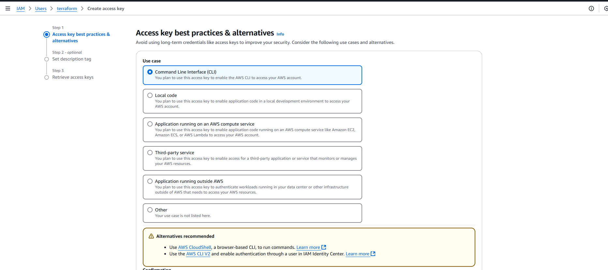

# Automate Infrastructure With IaC using Terraform

---
**Prerequisites before we begin to write Terraform code**
### **Create IAM User**
- Create an **IAM User** in AWS named `terraform`:
  1. Go to **IAM Console**.
  2. Create a user with **programmatic access**.
  3. Attach the policy **AdministratorAccess**.
  4. Download the **Access Key ID** and **Secret Access Key** for this user.
   
   
   
  
  
  
  
  

### **Configure AWS CLI**
1. Install the AWS CLI on your machine if not already installed.
2. Run the command:
   ```bash
   aws configure
   ```
3. Enter the following:
   - **Access Key ID**: `<Access Key from Step 1>`
   - **Secret Access Key**: `<Secret Key from Step 1>`
   - **Default Region**: Your AWS region (e.g., `us-east-1`).
   - **Output Format**: `json` or your preferred format.

### **Install Python and Boto3**
- Ensure you have **Python 3.6+** installed on your machine.
- Install the **boto3** library for AWS interactions:
  ```bash
  pip install boto3
  ```
### **Create an S3 Bucket for Terraform State**
1. Open the **AWS Console**.
2. Navigate to **S3** and create a bucket:
   - Bucket Name: `<yourname>-dev-terraform-bucket` (bucket names must be globally unique).
   - Region: Select the same region where you will deploy resources.
   - Leave all other options default.
    
    
    
    
    
### **Verify Authentication**
Write the following Python script to verify access to AWS:
```python
import boto3

s3 = boto3.resource('s3')
for bucket in s3.buckets.all():
    print(bucket.name)
```
Run the script:
```bash
python script_name.py
```
You should see the bucket name `<yourname>-dev-terraform-bucket` listed.


