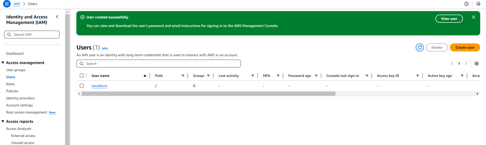
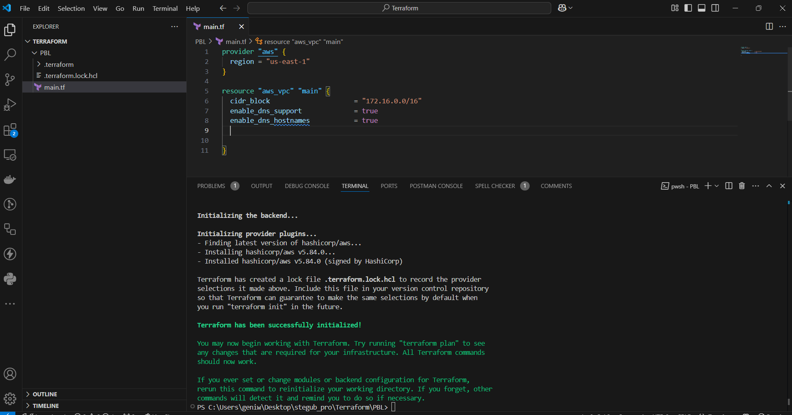

# Automate Infrastructure With IaC using Terraform 1
---
### **Prerequisites before we begin to write Terraform code**
**Create IAM User**
- Create an **IAM User** in AWS named `terraform`:
  1. Go to **IAM Console**.
  2. Create a user with **programmatic access**.
  3. Attach the policy **AdministratorAccess**.
  4. Download the **Access Key ID** and **Secret Access Key** for this user.
   
   
   
  
  
  
  
  

### **Configure AWS CLI**
1. Install the AWS CLI on your machine if not already installed.
2. Run the command:
   ```bash
   aws configure
   ```
3. Enter the following:
   - **Access Key ID**: `<Access Key from Step 1>`
   - **Secret Access Key**: `<Secret Key from Step 1>`
   - **Default Region**: Your AWS region (e.g., `us-east-1`).
   - **Output Format**: `json` or your preferred format.

### **Install Python and Boto3**
- Ensure you have **Python 3.6+** installed on your machine.
- Install the **boto3** library for AWS interactions:
  ```bash
  pip install boto3
  ```
### **Create an S3 Bucket for Terraform State**
1. Open the **AWS Console**.
2. Navigate to **S3** and create a bucket:
   - Bucket Name: `<yourname>-dev-terraform-bucket` (bucket names must be globally unique).
   - Region: Select the same region where you will deploy resources.
   - Leave all other options default.
    
    
    
    
    
### **Verify Authentication**
Write the following Python script to verify access to AWS:
```python
import boto3

s3 = boto3.resource('s3')
for bucket in s3.buckets.all():
    print(bucket.name)
```
Run the script:
```bash
python script_name.py
```
You should see the bucket name `<yourname>-dev-terraform-bucket` listed.


### **Secrets of Writing Quality Terraform Code**

#### **Ingredients for a Successful Terraform Project**
1. **Understand Your Goal:**
   - Clearly define the desired end state of your AWS infrastructure.

2. **Knowledge of Infrastructure as Code (IaC):**
   - Familiarize yourself with the specific IaC technology, Terraform in this case.

3. **Use Up-to-Date Documentation:**
   - Stay updated with the latest Terraform documentation [here](https://www.terraform.io/docs).

#### **Terraform-Specific Terminology**
You will need to understand the following concepts:
- **Attribute:** Specific details about a resource.
- **Resource:** Core building blocks representing infrastructure objects.
- **Interpolations:** Referencing variables, attributes, or outputs.
- **Argument:** Settings or configurations of resources.
- **Providers:** Plugins enabling Terraform to interact with APIs.
- **Provisioners:** Scripts to configure resources after creation.
- **Input Variables:** Parameters passed to your Terraform configuration.
- **Output Variables:** Data outputs after configuration is applied.
- **Module:** Reusable configurations.
- **Data Source:** External data used in your configuration.
- **Local Values:** Temporary values to simplify and enhance readability.
- **Backend:** Storage for Terraform state files.

#### **Data Types in Programming**
These concepts apply in Terraform as well:
- **Integer:** Whole numbers.
- **Float:** Decimal numbers.
- **String:** Text data.
- **Boolean:** `true` or `false` values.

### **Best Practices**
1. **Resource Tagging:**
   - Use multiple key-value pairs to manage resources effectively.
   
2. **Write Reusable Code:**
   - Avoid hard coding; instead, use variables and modules for flexibility.
   - Begin by hard coding for simplicity, then refactor your work following best practices.

### VPC | Subnets | Security Groups

#### Let us create a directory structure:
1. Open your Visual Studio Code and:
   - Create a folder called **PBL**.
   - Create a file in the folder, name it **main.tf**.

   

#### Provider and VPC resource section:
1. Set up Terraform CLI as per [this instruction](https://developer.hashicorp.com/terraform/tutorials/aws-get-started/install-cli).
   - Add **AWS** as a provider and a resource to create a **VPC** in the **main.tf** file.
   - **Provider block** informs Terraform that we intend to build infrastructure within AWS.
   - **Resource block** will create a VPC.

```hcl
provider "aws" {
  region = "eu-central-1"
}

resource "aws_vpc" "main" {
  cidr_block                     = "172.16.0.0/16"
  enable_dns_support             = true
  enable_dns_hostnames           = true
  enable_classiclink             = false
  enable_classiclink_dns_support = false
}
```

Note: You can change the configuration above to create your VPC in other region that is closer to you. The same applies to all configuration snippets that will follow.

- The next thing we need to do, is to download necessary plugins for Terraform to work. These plugins are used by providers and provisioners. At this stage, we only have provider in our main.tf file. So, Terraform will just download plugin for AWS provider.

- Lets accomplish this with terraform init command as seen in the below demonstration.



### Observations:

- Notice that a new directory has been created: `.terraform\....` This is where Terraform keeps plugins. Generally, it is safe to delete this folder. It just means that you must execute `terraform init` again, to download them.

- Moving on, let us create the only resource we just defined: `aws_vpc`. But before we do that, we should check to see what terraform intends to create before we tell it to go ahead and create it.

    - Run `terraform plan`
    - Then, if you are happy with changes planned, execute `terraform apply`


**Observations:**

1. A new file is created `terraform.tfstate`. This is how Terraform keeps itself up to date with the exact state of the infrastructure. It reads this file to know what already exists, what should be added, or destroyed based on the entire terraform code that is being developed.

2. If you also observed closely, you would realize that another file gets created during planning and apply. But this file gets deleted immediately. `terraform.tfstate.lock.info`. This is what Terraform uses to track, who is running its code against the infrastructure at any point in time. This is very important for teams working on the same Terraform repository at the same time. The lock prevents a user from executing Terraform configuration against the same infrastructure when another user is doing the same - it allows to avoid duplicates and conflicts.

**Its content is usually like this**

```
{
   "ID":"e5e5ad0e-9cc5-7af1-3547-77bb3ee0958b",
   "Operation":"OperationTypePlan","Info":"",
   "Who":"dare@dare","Version":"0.13.4",
   "Created":"2020-10-28T19:19:28.261312Z",
   "Path":"terraform.tfstate"
}
```

It is a `json` format file that stores information about a user: user’s `ID`, what operation he/she is doing, timestamp, and location of the `state` file.

---

**Subnets resource section**

According to our architectural design, we require 6 subnets:
- 2 public
- 2 private for webservers
- 2 private for data layer

Let us create the first 2 public subnets.

**Add below configuration to the `main.tf` file:**

```hcl
# Create public subnets1
resource "aws_subnet" "public1" {
    vpc_id                  = aws_vpc.main.id
    cidr_block              = "172.16.0.0/24"
    map_public_ip_on_launch = true
    availability_zone       = "eu-central-1a"
}

# Create public subnet2
resource "aws_subnet" "public2" {
    vpc_id                  = aws_vpc.main.id
    cidr_block              = "172.16.1.0/24"
    map_public_ip_on_launch = true
    availability_zone       = "eu-central-1b"
}
```


- We are creating 2 subnets, therefore declaring 2 resource blocks - one for each of the subnets.
- We are using the `vpc_id` argument to interpolate the value of the VPC id by setting it to `aws_vpc.main.id`. This way, Terraform knows inside which VPC to create the subnet.

**Run `terraform plan` and `terraform apply`.**


**Observations:**

- **Hard coded values:** Remember our best practice hint from the beginning? Both the `availability_zone` and `cidr_block` arguments are hard coded. We should always endeavour to make our work dynamic.
- **Multiple Resource Blocks:** Notice that we have declared multiple resource blocks for each subnet in the code. This is bad coding practice. We need to create a single resource block that can dynamically create resources without specifying multiple blocks. Imagine if we wanted to create 10 subnets, our code would look very clumsy. So, we need to optimize this by introducing a `count` argument.

Now let us improve our code by refactoring it.

First, destroy the current infrastructure. Since we are still in development, this is totally fine. Otherwise, **DO NOT DESTROY** an infrastructure that has been deployed to production.

To destroy whatever has been created run `terraform destroy` command, and type `yes` after evaluating the plan.


**Fixing The Problems By Code Refactoring**

- **Fixing Hard Coded Values:** We will introduce variables and remove hard coding.
  - Starting with the provider block, declare a variable named `region`, give it a default value, and update the provider section by referring to the declared variable. 

    ```hcl
    variable "region" {
      default = "eu-central-1"
    }
    provider "aws" {
      region = var.region
    }
    ```

  - Do the same to the `cidr` value in the VPC block and all the other arguments.

    ```hcl
    variable "vpc_cidr" {
      default = "172.16.0.0/16"
    }
    variable "enable_dns_support" {
      default = "true"
    }
    variable "enable_dns_hostnames" {
      default = "true"
    }
    variable "enable_classiclink" {
      default = "false"
    }
    variable "enable_classiclink_dns_support" {
      default = "false"
    }

    provider "aws" {
      region = var.region
    }

    # Create VPC resource
    resource "aws_vpc" "main" {
      cidr_block = var.vpc_cidr
      enable_dns_support = var.enable_dns_support
      enable_dns_hostnames = var.enable_dns_hostnames
      enable_classiclink = var.enable_classiclink
      enable_classiclink_dns_support = var.enable_classiclink_dns_support
    }
    ```

- **Fixing multiple resource blocks:** This is where things become a little tricky. It’s not complex; we are just going to introduce some interesting concepts: **Loops & Data sources**.
Terraform has a functionality that allows us to pull data which exposes information to us. For example, every region has Availability Zones (AZ). Different regions have from 2 to 4 Availability Zones. With over 20 geographic regions and over 70 AZs served by AWS, it is impossible to keep up with the latest information by hard coding the names of AZs. Hence, we will explore the use of Terraform’s **Data Sources** to fetch information outside of Terraform. In this case, from **AWS**

Let us fetch Availability zones from AWS, and replace the hard-coded value in the subnet’s `availability_zone` section.

```hcl
# Get list of availability zones
data "aws_availability_zones" "available" {
  state = "available"
}
```

To make use of this new `data` resource, we will need to introduce a **count** argument in the subnet block: Something like this.

```hcl
# Create public subnet1
resource "aws_subnet" "public" {
  count               = 2
  vpc_id              = aws_vpc.main.id
  cidr_block          = "172.16.1.0/24"
  map_public_ip_on_launch = true
  availability_zone   = data.aws_availability_zones.available.names[count.index]
}
```
Let us quickly understand what is going on here.

- The **count** tells us that we need 2 subnets. Therefore, Terraform will invoke a loop to create 2 subnets.
- The **data** resource will return a list object that contains a list of AZs. Internally, Terraform will receive the data like this:

```json
["eu-central-1a", "eu-central-1b"]
```

Each of them is an index, the first one is index 0, while the other is index 1. If the data returned had more than 2 records, then the index numbers would continue to increment.

Therefore, each time Terraform goes into a loop to create a subnet, it must be created in the retrieved AZ from the list. Each loop will need the index number to determine what AZ the subnet will be created. That is why we have `data.aws_availability_zones.available.names[count.index]` as the value for `availability_zone`. When the first loop runs, the first index will be 0, therefore the AZ will be **eu-central-1a**. The pattern will repeat for the second loop.

But we still have a problem. If we run Terraform with this configuration, it may succeed for the first time, but by the time it goes into the second loop, it will fail because we still have **cidr_block** hard coded. The same **cidr_block** cannot be created twice within the same VPC. So, we have a little more work to do.


### Let's make `cidr_block` dynamic.

We will introduce a function `cidrsubnet()` to make this happen. It accepts 3 parameters. Let us use it first by updating the configuration, then we will explore its internals.

```hcl
# Create public subnet1
resource "aws_subnet" "public" {
  count                  = 2
  vpc_id                 = aws_vpc.main.id
  cidr_block             = cidrsubnet(var.vpc_cidr, 4, count.index)
  map_public_ip_on_launch = true
  availability_zone      = data.aws_availability_zones.available.names[count.index]
}
```

A closer look at `cidrsubnet` - this function works like an algorithm to dynamically create a subnet CIDR per AZ. Regardless of the number of subnets created, it takes care of the `cidr` value per subnet.

Its parameters are `cidrsubnet(prefix, newbits, netnum)`:

- The `prefix` parameter must be given in CIDR notation, same as for VPC.
- The `newbits` parameter is the number of additional bits with which to extend the prefix. For example, if given a prefix ending with `/16` and a `newbits` value of 4, the resulting subnet address will have length `/20`.
- The `netnum` parameter is a whole number that can be represented as a binary integer with no more than `newbits` binary digits, which will be used to populate the additional bits added to the prefix.

You can experiment with how this works by entering the `terraform console` and keep changing the figures to see the output:

1. On the terminal, run `terraform console`
2. Type `cidrsubnet("172.16.0.0/16", 4, 0)`
3. Hit enter
4. See the output
5. Keep changing the numbers and see what happens.
6. To get out of the console, type `exit`


### The final problem to solve is removing hard coded `count` value.

If we cannot hard code a value we want, then we will need a way to dynamically provide the value based on some input. Since the `data` resource returns all the AZs within a region, it makes sense to count the number of AZs returned and pass that number to the `count` argument.

To do this, we can introduce `length()` function, which basically determines the length of a given list, map, or string.

Since `data.aws_availability_zones.available.names` returns a list like `["eu-central-1a", "eu-central-1b", "eu-central-1c"]` we can pass it into a `length` function and get the number of the AZs.

```hcl
length(["eu-central-1a", "eu-central-1b", "eu-central-1c"])
```

### lets Open up `terraform console` and try it.


### Now we can simply update the public subnet block like this:

```hcl
# Create public subnet1
resource "aws_subnet" "public" {
  count                = length(data.aws_availability_zones.available.names)
  vpc_id               = aws_vpc.main.id
  cidr_block           = cidrsubnet(var.vpc_cidr, 4, count.index)
  map_public_ip_on_launch = true
  availability_zone    = data.aws_availability_zones.available.names[count.index]
}
```

### Observations:
- What we have now is sufficient to create the subnet resource required. But if you observe, it is not satisfying our business requirement of just 2 subnets. The `length` function will return number 3 to the `count` argument, but what we actually need is 2.

---

### Now, let us fix this.

1. **Declare a variable** to store the desired number of public subnets, and set the default value:
   ```hcl
   variable "preferred_number_of_public_subnets" {
     default = 2
   }
   ```

2. **Next, update the `count` argument** with a condition. Terraform needs to check first if there is a desired number of subnets. Otherwise, use the data returned by the `length` function. See how that is presented below:
   ```hcl
   # Create public subnets
   resource "aws_subnet" "public" {
     count = var.preferred_number_of_public_subnets == null ? 
             length(data.aws_availability_zones.available.names) : 
             var.preferred_number_of_public_subnets

     vpc_id               = aws_vpc.main.id
     cidr_block           = cidrsubnet(var.vpc_cidr, 4, count.index)
     map_public_ip_on_launch = true
     availability_zone    = data.aws_availability_zones.available.names[count.index]
   }
   ```

Now let's break it down:

1. **The first part** `var.preferred_number_of_public_subnets == null` checks if the value of the variable is set to `null` or has some value defined.

2. **The second part** `?` and `length(data.aws_availability_zones.available.names)` means, if the first part is true, then use this. In other words, if the preferred number of public subnets is `null` (or not known), then set the value to the data returned by the `length` function.

3. **The third part** `:` and `var.preferred_number_of_public_subnets` means, if the first condition is false, i.e., the preferred number of public subnets is not `null`, then set the value to whatever is defined in `var.preferred_number_of_public_subnets`.

### Now the entire configuration should now look like this:

```hcl
# Get list of availability zones
data "aws_availability_zones" "available" {
  state = "available"
}

variable "region" {
  default = "eu-central-1"
}

variable "vpc_cidr" {
  default = "172.16.0.0/16"
}

variable "enable_dns_support" {
  default = "true"
}

variable "enable_dns_hostnames" {
  default = "true"
}

variable "enable_classiclink" {
  default = "false"
}

variable "enable_classiclink_dns_support" {
  default = "false"
}

variable "preferred_number_of_public_subnets" {
  default = 2
}

provider "aws" {
  region = var.region
}

# Create VPC
resource "aws_vpc" "main" {
  cidr_block                     = var.vpc_cidr
  enable_dns_support             = var.enable_dns_support
  enable_dns_hostnames           = var.enable_dns_support
  enable_classiclink             = var.enable_classiclink
  enable_classiclink_dns_support = var.enable_classiclink
}

# Create public subnets
resource "aws_subnet" "public" {
  count = var.preferred_number_of_public_subnets == null ?
          length(data.aws_availability_zones.available.names) : var.preferred_number_of_public_subnets
  vpc_id            = aws_vpc.main.id
  cidr_block        = cidrsubnet(var.vpc_cidr, 4, count.index)
  map_public_ip_on_launch = true
  availability_zone = data.aws_availability_zones.available.names[count.index]
}
```
now let's check `terraform apply`


Notes:
You should try changing the value of the `preferred_number_of_public_subnets` variable to `null` and observe how many subnets are created. This will demonstrate the dynamic behavior of the configuration.


### Introducing variables.tf & terraform.tfvars

Instead of having a long list of variables in the `main.tf` file, we can actually make our code a lot more readable and better structured by moving out some parts of the configuration content to other files.

- We will put all variable declarations in a separate file.
- And provide non-default values to each of them.

**Steps:**
1. Create a new file and name it `variables.tf`.
2. Copy all the variable declarations into the new file.
3. Create another file, name it `terraform.tfvars`.
4. Set values for each of the variables.

---

### `main.tf`

```hcl
# Get list of availability zones
data "aws_availability_zones" "available" {
  state = "available"
}

provider "aws" {
  region = var.region
}

# Create VPC
resource "aws_vpc" "main" {
  cidr_block                   = var.vpc_cidr
  enable_dns_support           = var.enable_dns_support
  enable_dns_hostnames         = var.enable_dns_support
  enable_classiclink           = var.enable_classiclink
  enable_classiclink_dns_support = var.enable_classiclink
}

# Create public subnets
resource "aws_subnet" "public" {
  count                        = var.preferred_number_of_public_subnets == null ?
                                  length(data.aws_availability_zones.available.names) :
                                  var.preferred_number_of_public_subnets
  vpc_id                       = aws_vpc.main.id
  cidr_block                   = cidrsubnet(var.vpc_cidr, 4, count.index)
  map_public_ip_on_launch      = true
  availability_zone            = data.aws_availability_zones.available.names[count.index]
}
```


### `variables.tf`

```hcl
variable "region" {
  default = "eu-central-1"
}

variable "vpc_cidr" {
  default = "172.16.0.0/16"
}

variable "enable_dns_support" {
  default = "true"
}

variable "enable_dns_hostnames" {
  default = "true"
}

variable "enable_classiclink" {
  default = "false"
}

variable "enable_classiclink_dns_support" {
  default = "false"
}

variable "preferred_number_of_public_subnets" {
  default = null
}
```


### `terraform.tfvars`

```hcl
region = "eu-central-1"

vpc_cidr = "172.16.0.0/16"

enable_dns_support = "true"

enable_dns_hostnames = "true"

enable_classiclink = "false"

enable_classiclink_dns_support = "false"

preferred_number_of_public_subnets = 2
```


### File Structure

You should also have this file structure in the PBL folder:

```
PBL
├── main.tf
├── terraform.tfstate
├── terraform.tfstate.backup
├── terraform.tfvars
└── variables.tf
```


Run `terraform plan` and ensure everything works.


then run `terraform apply` and ensure everything works.


let's check on AWS dashboard


It was successfully created. Now, let's destroy the resources using `terraform destroy`.


### Conclusion

Through this project, I gained hands-on experience automating infrastructure deployment using Terraform. I set up and configured the AWS environment, created a VPC and dynamic subnets, and implemented best practices for Infrastructure as Code (IaC). I replaced hard-coded values with variables, utilized loops, and leveraged functions like `cidrsubnet()` to make the configuration scalable and dynamic. By organizing Terraform files into `main.tf`, `variables.tf`, and `terraform.tfvars`, I improved code readability and maintainability. Using Terraform commands like `plan`, `apply`, and `destroy`, I successfully created and managed resources while verifying them on the AWS dashboard. This project strengthened my understanding of Terraform’s capabilities and prepared me to manage cloud infrastructure efficiently.