# Automate Infrastructure With IaC using Terraform 2
---

Before automating infrastructure with Terraform, having a foundational understanding of networking concepts is crucial. This includes learning about **IP Addresses**, **Subnets**, **CIDR Notation**, and **Networking Protocols**.

#### **Key Resources**
1. **Eli the Computer Guy Videos**:
   - [Introduction to Networking](https://www.youtube.com/watch?v=rL8RSFQG8do)
   - [TCP/IP and Subnet Masking](https://www.youtube.com/watch?v=EkNq4TrHP_U)
2. **Digital Ocean Articles** by Justin Ellingwood:
   - Networking Terminology
   - Subnets and CIDR Notation

**Justin Ellingwood blog posts**

WARNING: You may initially feel overwhelmed by the information provided in these articles. It’s alright if We do not fully understand them the first time. Bookmark the pages, read them again and again for the next few days, find other articles talking about the same topics on Google and watch YouTube videos about them. Subconsciously, you will begin to understand them over time.

- [Networking Part 1](https://www.digitalocean.com/community/tutorials/an-introduction-to-networking-terminology-interfaces-and-protocols)
- [Networking Part 2](https://www.digitalocean.com/community/tutorials/understanding-ip-addresses-subnets-and-cidr-notation-for-networking#netmasks-and-subnets)

**Continue Infrastructure Automation with Terraform**  
Let us continue from where we stopped in the previous project.  

Based on my knowledge from the previous project, I can continue creating AWS resources!  

### **Networking: Private Subnets & Best Practices**

When creating **4 private subnets**, follow these best practices:

1. **Use Variables or the `length()` Function**:
   - Determine the number of Availability Zones (AZs) dynamically.
   
2. **Use the `cidrsubnet()` Function**:
   - Allocate VPC CIDR blocks dynamically for subnets.

3. **Keep Variables and Resources Organized**:
   - Store variables in separate files for better code structure and readability.

4. **Apply Resource Tagging**:
   - Use tags to manage and organize our resources efficiently. Explore functions like `format()` and `count` for dynamic tagging.

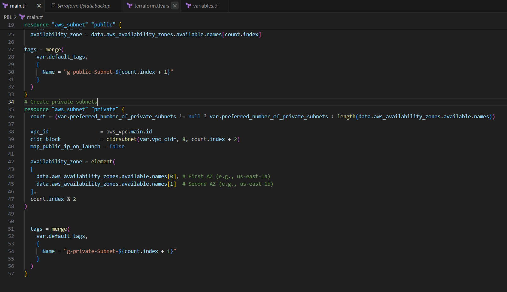
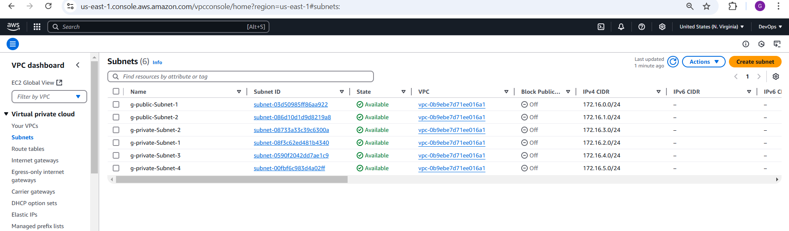

### **Tagging: Importance and Implementation**

Tagging is a straightforward yet powerful way to organize your resources. It helps with:

- Better resource organization into "virtual groups."
- Easier filtering and searching, both programmatically and via the console.
- Simplified billing and cost management (e.g., by department or environment).
- Identifying unused resources for cleanup.
- Collaboration across teams using a shared AWS account.

### **Example: Setting Tags in Terraform**

#### **Static Tag Example:**
```hcl
tags = {
  Environment     = "production"
  Owner-Email     = "admin@example.com"
  Managed-By      = "Terraform"
  Billing-Account = "1234567890"
}
```
#### **Dynamic Tag Example Using `merge()`:**
```hcl
tags = merge(
  var.default_tags,
  {
    Name = "Private Subnet ${count.index}"
  }
)
```

**Explanation:**
- Use the `merge()` function to combine default tags with resource-specific tags dynamically.
- This approach allows changes to be made in a single location for consistent updates across all resources.

### Internet Gateway Creation with `format()` Function

Create an **Internet Gateway** in a separate Terraform file `internet_gateway.tf`
```hcl
resource "aws_internet_gateway" "ig" {
  vpc_id = aws_vpc.main.id

  tags = merge(
    var.tags,
    {
      Name = format("%s-%s!", aws_vpc.main.id, "IG")
    }
  )
}
```
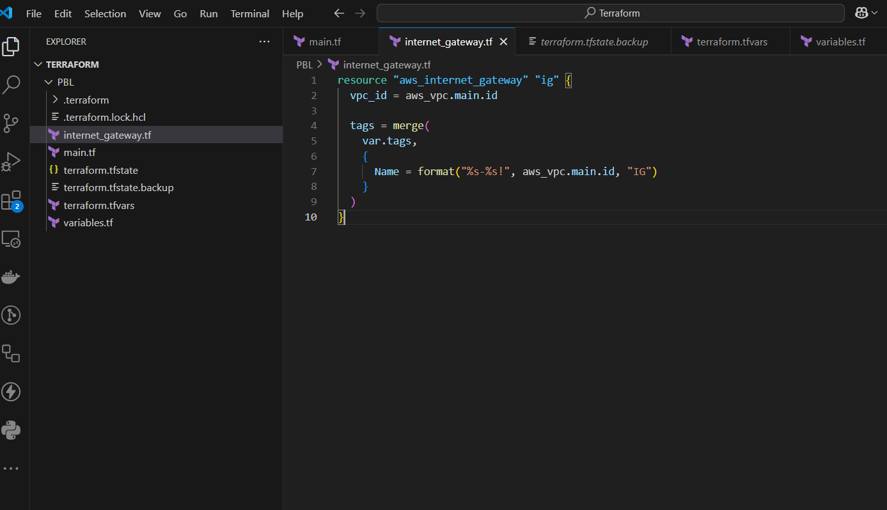
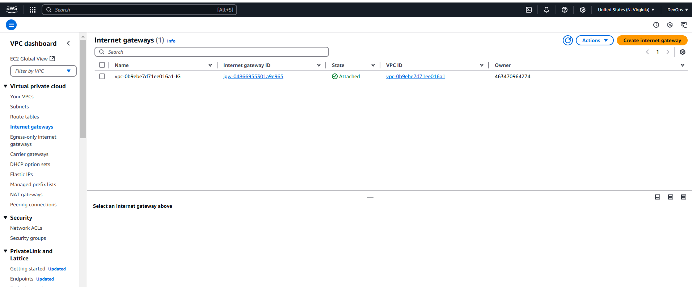

Did you notice how we have used `format()` function to dynamically generate a unique name for this resource? The first part of the `%s` takes the interpolated value of `aws_vpc.main.id` while the second `%s` appends a literal string `IG` and finally an exclamation mark is added in the end.

If any of the resources being created is either using the `count` function or creating multiple resources using a loop, then a key-value pair that needs to be unique must be handled differently.

For example, each of our subnets should have a unique name in the tag section. Without the `format()` function, this would not be possible. With the `format` function, each private subnet’s tag will look like this:

```
Name = PrivateSubnet-0
Name = PrivateSubnet-1
Name = PrivateSubnet-2
```

Lets try and see that in action.

```hcl
tags = merge(
  var.tags,
  {
    Name = format("PrivateSubnet-%s", count.index)
  }
)
```

### NAT Gateways

Create 1 NAT Gateways and 1 Elastic IP (EIP) addresses.

Now use similar approach to create the NAT Gateways in a new file called natgateway.tf.

Note: We need to create an Elastic IP for the NAT Gateway, and you can see the use of depends_on to indicate that the Internet Gateway resource must be available before this should be created. Although Terraform does a good job to manage dependencies, in most cases, it is good to be explicit.

You can read more on dependencies [here](https://developer.hashicorp.com/terraform/language/meta-arguments/depends_on).
```hcl
resource "aws_eip" "nat_eip" {
  vpc        = true
  depends_on = [aws_internet_gateway.ig]

  tags = merge(
    var.tags,
    {
      Name = format("%s-EIP", var.name)
    },
  )
}

resource "aws_nat_gateway" "nat" {
  allocation_id = aws_eip.nat_eip.id
  subnet_id     = element(aws_subnet.public.*.id, 0)
  depends_on    = [aws_internet_gateway.ig]

  tags = merge(
    var.tags,
    {
      Name = format("%s-Nat", var.name)
    },
  )
}
```
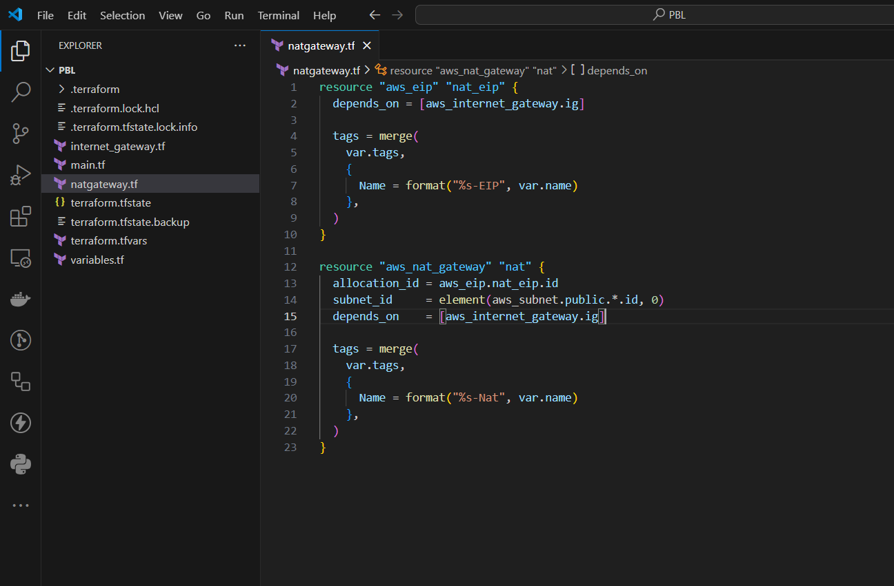
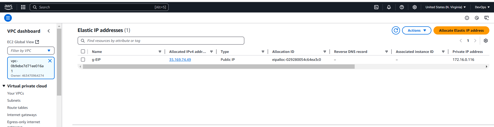
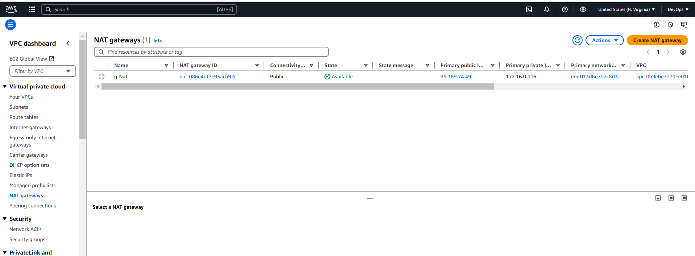

### AWS Routes

To set up routes for both public and private subnets in Terraform, you can create a file called `route_tables.tf`. In this file, We'll define resources for the following:

- **aws_route_table**: For route tables.
- **aws_route**: For routing rules.
- **aws_route_table_association**: To associate subnets with route tables.
```hcl
# Create private route table
resource "aws_route_table" "private-rtb" {
  vpc_id = aws_vpc.main.id

  tags = merge(
    var.tags,
    {
      Name = format("%s-Private-Route-Table", var.name)
    },
  )
}

# Associate all private subnets to the private route table
resource "aws_route_table_association" "private-subnets-assoc" {
  count        = length(aws_subnet.private[*].id)
  subnet_id    = element(aws_subnet.private[*].id, count.index)
  route_table_id = aws_route_table.private-rtb.id
}

# Create route table for the public subnets
resource "aws_route_table" "public-rtb" {
  vpc_id = aws_vpc.main.id

  tags = merge(
    var.tags,
    {
      Name = format("%s-Public-Route-Table", var.name)
    },
  )
}

# Create route for the public route table and attach the internet gateway
resource "aws_route" "public-rtb-route" {
  route_table_id         = aws_route_table.public-rtb.id
  destination_cidr_block = "0.0.0.0/0"
  gateway_id             = aws_internet_gateway.ig.id
}

# Associate all public subnets to the public route table
resource "aws_route_table_association" "public-subnets-assoc" {
  count        = length(aws_subnet.public[*].id)
  subnet_id    = element(aws_subnet.public[*].id, count.index)
  route_table_id = aws_route_table.public-rtb.id
}
```
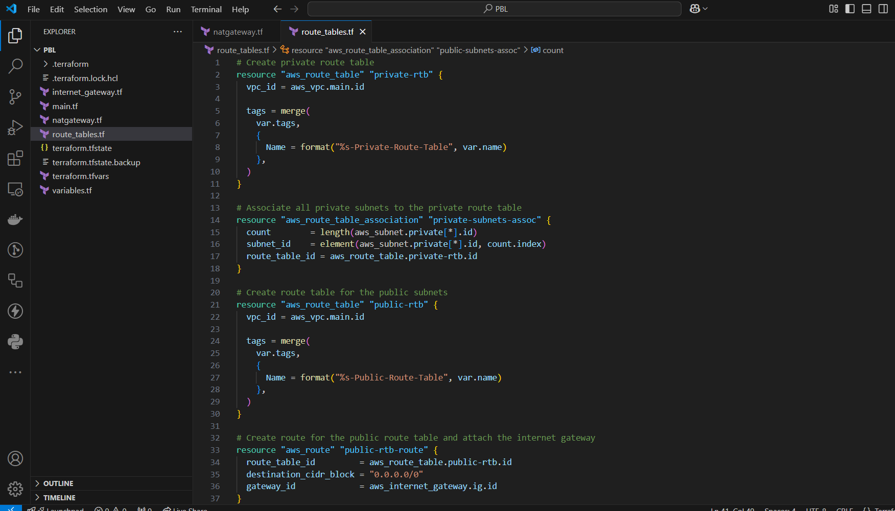
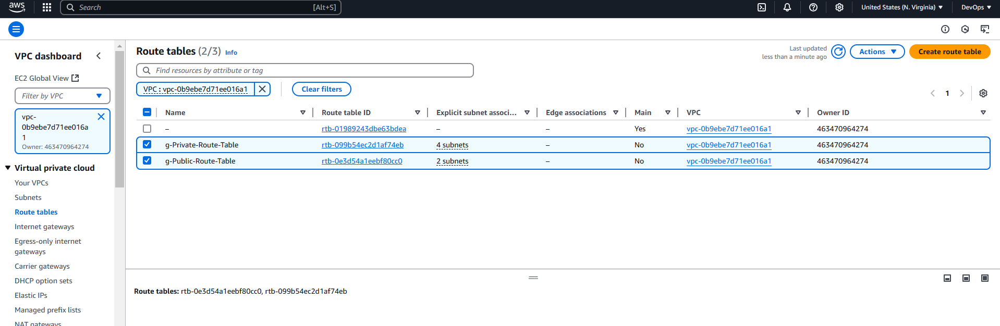
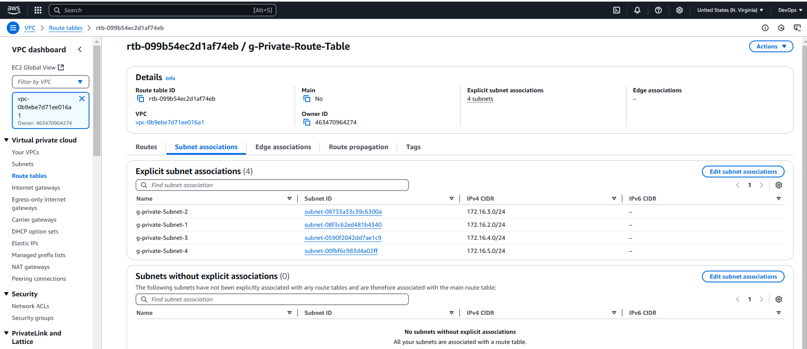
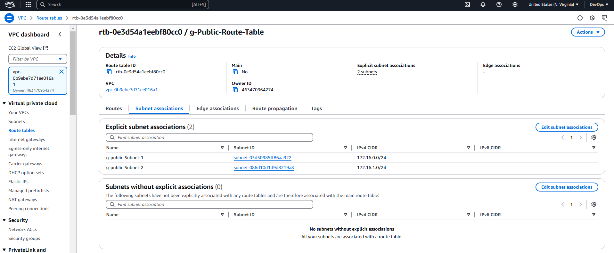


#### Output:

After running `terraform plan` and `terraform apply`, Terraform will provision the following in Our AWS environment:

- [x] Our Main VPC
- [x] 2 Public Subnets
- [x] 4 Private Subnets
- [x] 1 Internet Gateway
- [x] 1 NAT Gateway
- [x] 1 Elastic IP (EIP)
- [x] 2 Route Tables
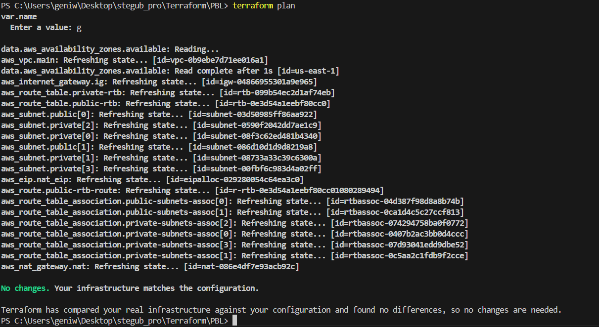
This setup completes the networking part of AWS infrastructure. Now, we can move forward with Compute and Access Control configurations.

---

### AWS Identity and Access Management  
#### IAM and Roles

We want to pass an IAM role or EC2 instances to give them access to some specific resources, so we need to do the following:  

**1. Create AssumeRole**  
Assume Role uses Security Token Service (STS) API that returns a set of temporary security credentials that you can use to access AWS resources that you may not normally have access to. These temporary credentials consist of an access key ID, a secret access key, and a security token. Typically, you use **AssumeRole** within your account or for cross-account access.  

Add the following code to a new file named `roles.tf`:  

```hcl
resource "aws_iam_role" "ec2_instance_role" {
  name               = "ec2_instance_role"
  assume_role_policy = jsonencode({
    Version = "2012-10-17"
    Statement = [
      {
        Action = "sts:AssumeRole"
        Effect = "Allow"
        Sid    = ""
        Principal = {
          Service = "ec2.amazonaws.com"
        }
      },
    ]
  })

  tags = merge(
    var.tags,
    {
      Name = "aws assume role"
    },
  )
}
```

In this code, we are creating **AssumeRole** with **AssumeRole policy**. It grants to an entity, in our case it is an EC2, permissions to assume the role.

**2. Create IAM Policy for this role**  
This is where we need to define a required policy (i.e., permissions) according to our requirements. For example, allowing an IAM role to perform an action `describe` applied to EC2 instances:

```hcl
resource "aws_iam_policy" "policy" {
  name        = "ec2_instance_policy"
  description = "A test policy"
  policy      = jsonencode({
    Version = "2012-10-17"
    Statement = [
      {
        Action = [
          "ec2:Describe*",
        ]
        Effect   = "Allow"
        Resource = "*"
      },
    ]
  })

  tags = merge(
    var.tags,
    {
      Name = "aws assume policy"
    },
  )
}
```
**3. Attach the Policy to the IAM Role**  
This is where we will be attaching the policy, which we created above, to the role we created in the first step.

```hcl
resource "aws_iam_role_policy_attachment" "test-attach" {
  role       = aws_iam_role.ec2_instance_role.name
  policy_arn = aws_iam_policy.policy.arn
}
```
**"4. Create an [Instance Profile](https://docs.aws.amazon.com/IAM/latest/UserGuide/id_roles_use_switch-role-ec2_instance-profiles.html) and associate it with the IAM Role."**
```hcl
resource "aws_iam_instance_profile" "ip" {
  name = "aws_instance_profile_test"
  role = aws_iam_role.ec2_instance_role.name
}
```
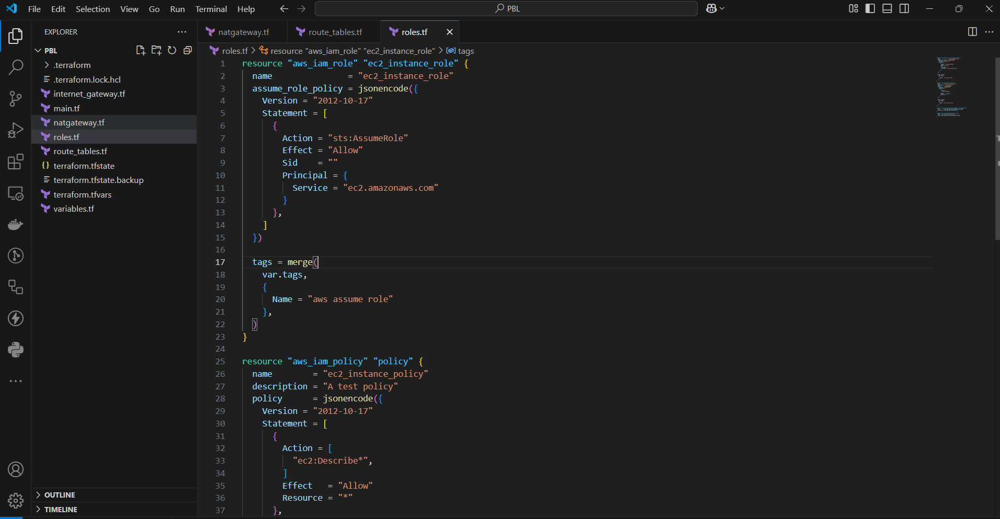
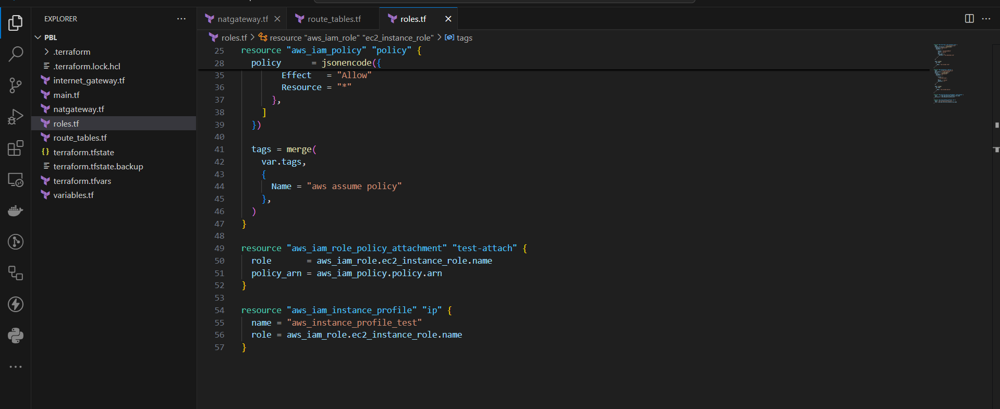

We are pretty much done with the Identity and Management part for now. Let us move on and create other resources required.  

---

### **Resources to be Created**
1. Create Security Groups.
2. Create Target Group for Nginx, WordPress, and Tooling.
3. Create Certificate from AWS Certificate Manager.
4. Create an External Application Load Balancer and Internal Application Load Balancer.
5. Create a Launch Template for Bastion, Tooling, Nginx, and WordPress.
6. Create an Auto Scaling Group (ASG) for Bastion, Tooling, Nginx, and WordPress.
7. Create an Elastic Filesystem.
8. Create Relational Database (RDS).

---

### **1. Create Security Groups**
We are going to create all the security groups in a single file. Then, we are going to reference these security groups within each resource that needs it.

- Check out the Terraform documentation for [Security Groups](https://registry.terraform.io/providers/hashicorp/aws/latest/docs/resources/security_group).
- Check out the Terraform documentation for [Security Group Rules](https://registry.terraform.io/providers/hashicorp/aws/latest/docs/resources/security_group_rule).

Create a file and name it `security.tf`, and copy and paste the code below:

```hcl
# Security group for ALB to allow access from anywhere for HTTP and HTTPS traffic
resource "aws_security_group" "ext-alb-sg" {
  name        = "ext-alb-sg"
  vpc_id      = aws_vpc.main.id
  description = "Allow TLS inbound traffic"

  ingress {
    description = "HTTP"
    from_port   = 80
    to_port     = 80
    protocol    = "tcp"
    cidr_blocks = ["0.0.0.0/0"]
  }

  ingress {
    description = "HTTPS"
    from_port   = 443
    to_port     = 443
    protocol    = "tcp"
    cidr_blocks = ["0.0.0.0/0"]
  }

  egress {
    from_port   = 0
    to_port     = 0
    protocol    = "-1"
    cidr_blocks = ["0.0.0.0/0"]
  }

  tags = merge(
    var.tags,
    {
      Name = "ext-alb-sg"
    }
  )
}

# Security group for Bastion
resource "aws_security_group" "bastion_sg" {
  name        = "vpc_web_sg"
  vpc_id      = aws_vpc.main.id
  description = "Allow incoming HTTP connections."

  ingress {
    description = "SSH"
    from_port   = 22
    to_port     = 22
    protocol    = "tcp"
    cidr_blocks = ["0.0.0.0/0"]
  }

  egress {
    from_port   = 0
    to_port     = 0
    protocol    = "-1"
    cidr_blocks = ["0.0.0.0/0"]
  }

  tags = merge(
    var.tags,
    {
      Name = "Bastion-SG"
    }
  )
}

# Security group for Nginx Reverse Proxy
resource "aws_security_group" "nginx-sg" {
  name   = "nginx-sg"
  vpc_id = aws_vpc.main.id

  egress {
    from_port   = 0
    to_port     = 0
    protocol    = "-1"
    cidr_blocks = ["0.0.0.0/0"]
  }

  tags = merge(
    var.tags,
    {
      Name = "nginx-SG"
    }
  )
}

# AWS Security Group Rules
resource "aws_security_group_rule" "inbound-nginx-http" {
  type                     = "ingress"
  from_port                = 443
  to_port                  = 443
  protocol                 = "tcp"
  source_security_group_id = aws_security_group.ext-alb-sg.id
  security_group_id        = aws_security_group.nginx-sg.id
}

resource "aws_security_group_rule" "inbound-bastion-ssh" {
  type                     = "ingress"
  from_port                = 22
  to_port                  = 22
  protocol                 = "tcp"
  source_security_group_id = aws_security_group.bastion_sg.id
  security_group_id        = aws_security_group.nginx-sg.id
}

# Security group for Internal ALB
resource "aws_security_group" "int-alb-sg" {
  name   = "my-alb-sg"
  vpc_id = aws_vpc.main.id

  egress {
    from_port   = 0
    to_port     = 0
    protocol    = "-1"
    cidr_blocks = ["0.0.0.0/0"]
  }

  tags = merge(
    var.tags,
    {
      Name = "int-alb-sg"
    }
  )
}

resource "aws_security_group_rule" "inbound-ialb-https" {
  type                     = "ingress"
  from_port                = 443
  to_port                  = 443
  protocol                 = "tcp"
  source_security_group_id = aws_security_group.nginx-sg.id
  security_group_id        = aws_security_group.int-alb-sg.id
}

# Security group for Webservers
resource "aws_security_group" "webserver-sg" {
  name   = "my-asg-sg"
  vpc_id = aws_vpc.main.id

  egress {
    from_port   = 0
    to_port     = 0
    protocol    = "-1"
    cidr_blocks = ["0.0.0.0/0"]
  }

  tags = merge(
    var.tags,
    {
      Name = "webserver-sg"
    }
  )
}

resource "aws_security_group_rule" "inbound-web-https" {
  type                     = "ingress"
  from_port                = 443
  to_port                  = 443
  protocol                 = "tcp"
  source_security_group_id = aws_security_group.int-alb-sg.id
  security_group_id        = aws_security_group.webserver-sg.id
}

resource "aws_security_group_rule" "inbound-web-ssh" {
  type                     = "ingress"
  from_port                = 22
  to_port                  = 22
  protocol                 = "tcp"
  source_security_group_id = aws_security_group.bastion_sg.id
  security_group_id        = aws_security_group.webserver-sg.id
}

# Security group for Datalayer
resource "aws_security_group" "datalayer-sg" {
  name   = "datalayer-sg"
  vpc_id = aws_vpc.main.id

  egress {
    from_port   = 0
    to_port     = 0
    protocol    = "-1"
    cidr_blocks = ["0.0.0.0/0"]
  }

  tags = merge(
    var.tags,
    {
      Name = "datalayer-sg"
    }
  )
}

resource "aws_security_group_rule" "inbound-nfs-port" {
  type                     = "ingress"
  from_port                = 2049
  to_port                  = 2049
  protocol                 = "tcp"
  source_security_group_id = aws_security_group.webserver-sg.id
  security_group_id        = aws_security_group.datalayer-sg.id
}

resource "aws_security_group_rule" "inbound-mysql-bastion" {
  type                     = "ingress"
  from_port                = 3306
  to_port                  = 3306
  protocol                 = "tcp"
  source_security_group_id = aws_security_group.bastion_sg.id
  security_group_id        = aws_security_group.datalayer-sg.id
}

resource "aws_security_group_rule" "inbound-mysql-webserver" {
  type                     = "ingress"
  from_port                = 3306
  to_port                  = 3306
  protocol                 = "tcp"
  source_security_group_id = aws_security_group.webserver-sg.id
  security_group_id        = aws_security_group.datalayer-sg.id
}
```
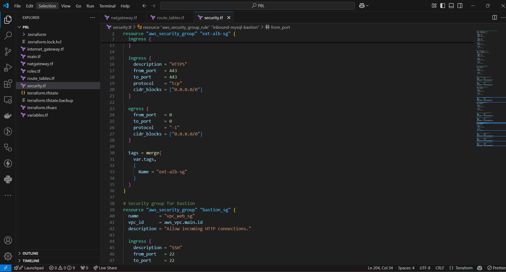
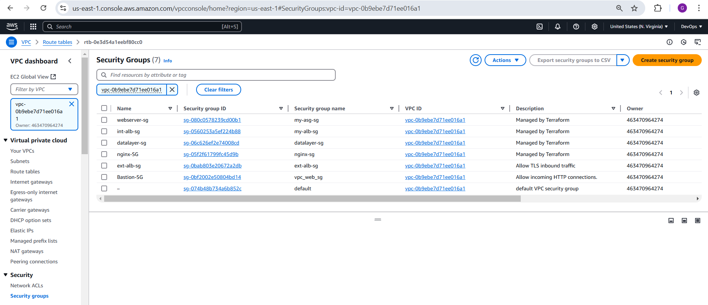

### 2. Create Certificate From Amazon Certificate Manager

Create a file named **cert.tf** and add the following code snippets to it.

**NOTE**: Read through to change the domain name to your own domain name including any other name that needs to be changed.

```hcl
# The entire section creates a certificate, public zone, and validates the certificate using DNS method.

# Create the certificate using a wildcard for all the domains created in your_domain.gq
resource "aws_acm_certificate" "your_domain" {
  domain_name       = "*.your_domain.gq"
  validation_method = "DNS"
}

# Calling the hosted zone
data "aws_route53_zone" "your_domain" {
  name         = "your_domain.gq"
  private_zone = false
}

# Selecting validation method
resource "aws_route53_record" "your_domain" {
  for_each = {
    for dvo in aws_acm_certificate.your_domain.domain_validation_options : dvo.domain_name => {
      name    = dvo.resource_record_name
      record  = dvo.resource_record_value
      type    = dvo.resource_record_type
    }
  }

  allow_overwrite = true
  name            = each.value.name
  records         = [each.value.record]
  ttl             = 60
  type            = each.value.type
  zone_id         = data.aws_route53_zone.your_domain.zone_id
}

# Validate the certificate through DNS method
resource "aws_acm_certificate_validation" "your_domain" {
  certificate_arn        = aws_acm_certificate.your_domain.arn
  validation_record_fqdns = [for record in aws_route53_record.your_domain : record.fqdn]
}

# Create records for tooling
resource "aws_route53_record" "tooling" {
  zone_id = data.aws_route53_zone.your_domain.zone_id
  name    = "tooling.your_domain.gq"
  type    = "A"

  alias {
    name                   = aws_lb.ext-alb.dns_name
    zone_id                = aws_lb.ext-alb.zone_id
    evaluate_target_health = true
  }
}

# Create records for WordPress
resource "aws_route53_record" "wordpress" {
  zone_id = data.aws_route53_zone.your_domain.zone_id
  name    = "wordpress.your_domain.gq"
  type    = "A"

  alias {
    name                   = aws_lb.ext-alb.dns_name
    zone_id                = aws_lb.ext-alb.zone_id
    evaluate_target_health = true
  }
}
```
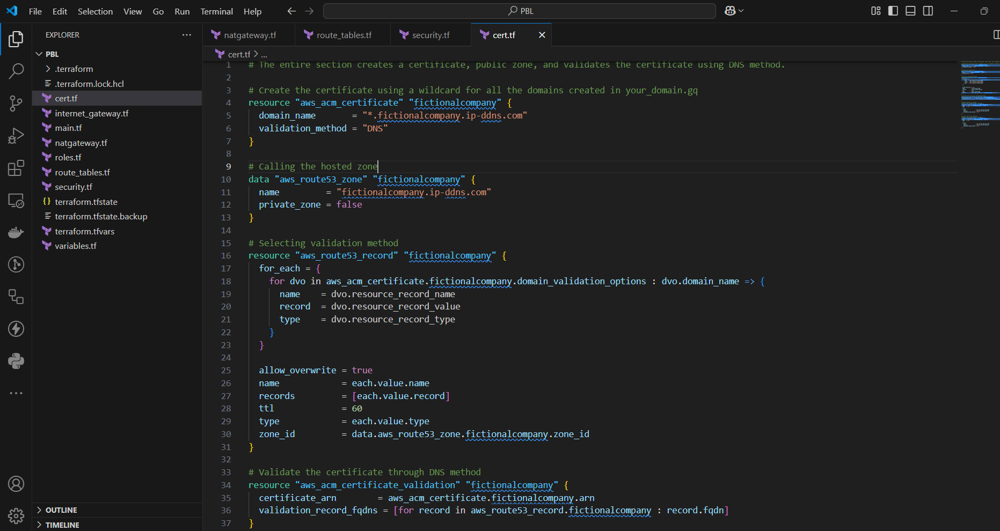
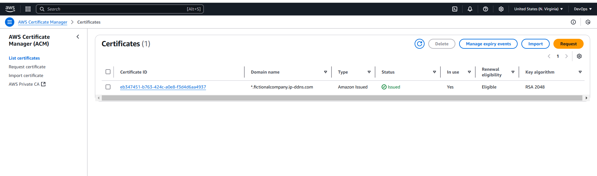

### 3. Create an external (Internet-facing) Application Load Balancer (ALB)

Create a file named `alb.tf`

First of all, we will create the ALB, after which we will create the target group, and then, we will create the listener rule.

Useful Terraform DocumentationGo through this documentation and understand the arguments needed for each resource:
- [ALB](https://registry.terraform.io/providers/hashicorp/aws/latest/docs/resources/lb)
- [ALB Target Group](https://registry.terraform.io/providers/hashicorp/aws/latest/docs/resources/lb_target_group)
- [ALB Listener](https://registry.terraform.io/providers/hashicorp/aws/latest/docs/resources/lb_listener)

We need to create an ALB to balance the traffic between the instances:
```hcl
resource "aws_lb" "ext-alb" {
  name               = "ext-alb"
  internal           = false
  security_groups    = [aws_security_group.ext-alb-sg.id]
  subnets            = [
    aws_subnet.public[0].id,
    aws_subnet.public[1].id
  ]

  tags = merge(
    var.tags,
    {
      Name = "ACS-ext-alb"
    },
  )

  ip_address_type    = "ipv4"
  load_balancer_type = "application"
}
```
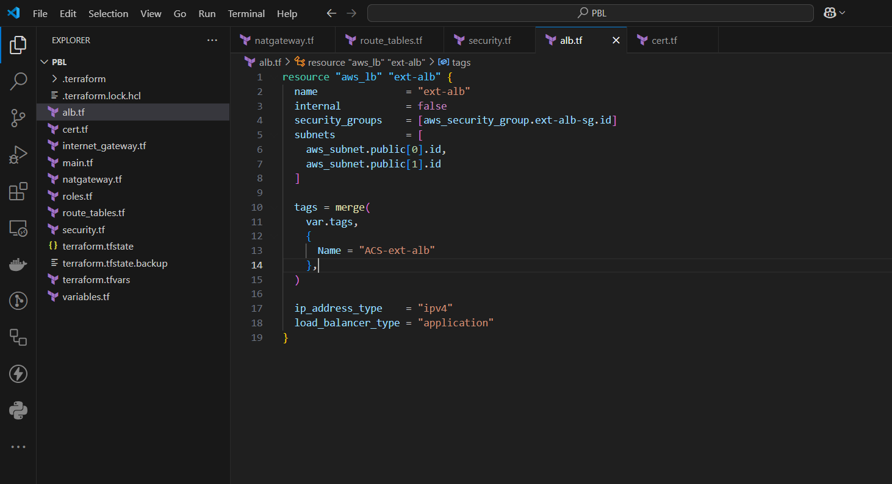

To inform our ALB where to route the traffic, we need to create a [Target Group](https://docs.aws.amazon.com/elasticloadbalancing/latest/application/load-balancer-target-groups.html) to point to its targets:
```hcl
resource "aws_lb_target_group" "nginx-tgt" {
  health_check {
    interval            = 10
    path                = "/healthstatus"
    protocol            = "HTTPS"
    timeout             = 5
    healthy_threshold   = 5
    unhealthy_threshold = 2
  }

  name        = "nginx-tgt"
  port        = 443
  protocol    = "HTTPS"
  target_type = "instance"
  vpc_id      = aws_vpc.main.id
}
```
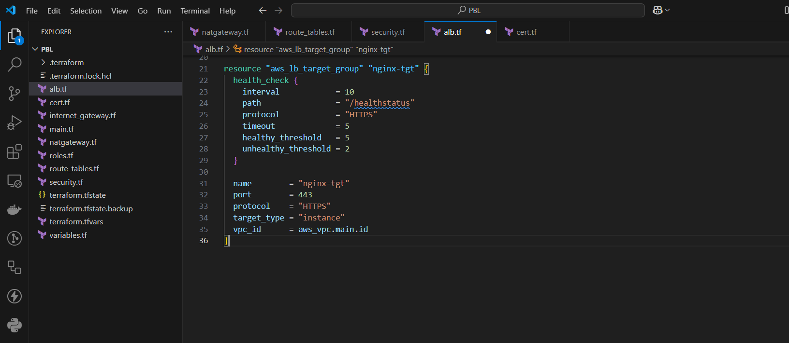

Then we will need to create a [Listener](https://docs.aws.amazon.com/elasticloadbalancing/latest/application/listeners.html) for this target group.
```hcl
resource "aws_lb_listener" "nginx-listner" {
  load_balancer_arn = aws_lb.ext-alb.arn
  port              = 443
  protocol          = "HTTPS"
  certificate_arn   = aws_acm_certificate_validation.oyindamola.certificate_arn

  default_action {
    type = "forward"
    target_group_arn = aws_lb_target_group.nginx-tgt.arn
  }
}
```
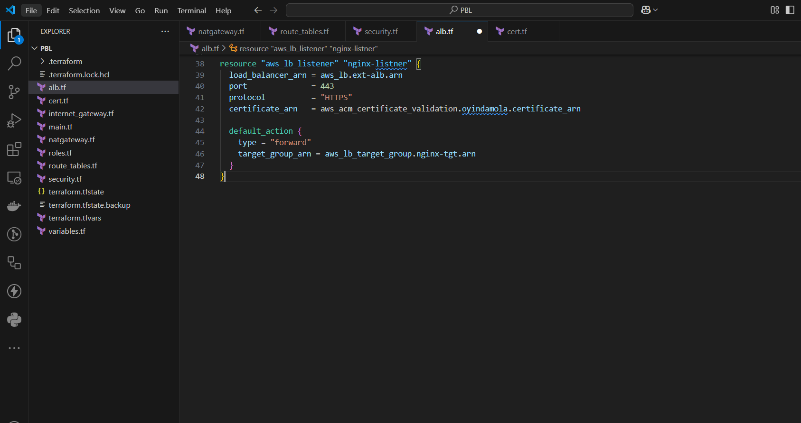

Add the following outputs to `output.tf` to print them on screen:
```hcl
output "alb_dns_name" {
  value = aws_lb.ext-alb.dns_name
}

output "alb_target_group_arn" {
  value = aws_lb_target_group.nginx-tgt.arn
}
```
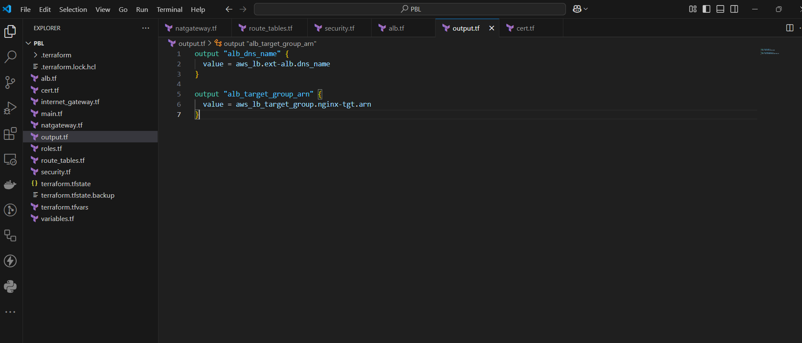


### Create an Internal (Internal) Application Load Balancer (ALB)

For the Internal Load balancer, we will follow the same concepts as with the external load balancer.

Add the code snippets inside the **`alb.tf`** file:

```hcl
# -----------------------------
# Internal Load Balancers for webservers
# -----------------------------

resource "aws_lb" "ialb" {
  name               = "ialb"
  internal           = true
  security_groups    = [
    aws_security_group.int-alb-sg.id,
  ]
  subnets            = [
    aws_subnet.private[0].id,
    aws_subnet.private[1].id,
  ]

  tags = merge(
    var.tags,
    {
      Name = "ACS-int-alb"
    },
  )

  ip_address_type    = "ipv4"
  load_balancer_type = "application"
}
``` 
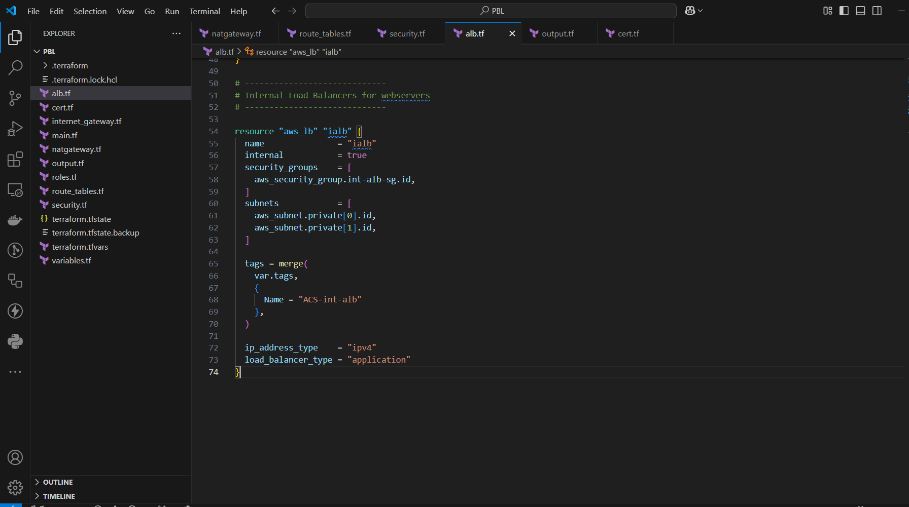

To inform our ALB where to route the traffic, we need to create a [Target Group](https://docs.aws.amazon.com/elasticloadbalancing/latest/application/load-balancer-target-groups.html) to point to its targets:
```hcl
# --- target group for wordpress -------
resource "aws_lb_target_group" "wordpress-tgt" {
  health_check {
    interval            = 10
    path                = "/healthstatus"
    protocol            = "HTTPS"
    timeout             = 5
    healthy_threshold   = 5
    unhealthy_threshold = 2
  }

  name        = "wordpress-tgt"
  port        = 443
  protocol    = "HTTPS"
  target_type = "instance"
  vpc_id      = aws_vpc.main.id
}

# --- target group for tooling -------
resource "aws_lb_target_group" "tooling-tgt" {
  health_check {
    interval            = 10
    path                = "/healthstatus"
    protocol            = "HTTPS"
    timeout             = 5
    healthy_threshold   = 5
    unhealthy_threshold = 2
  }

  name        = "tooling-tgt"
  port        = 443
  protocol    = "HTTPS"
  target_type = "instance"
  vpc_id      = aws_vpc.main.id
}
```
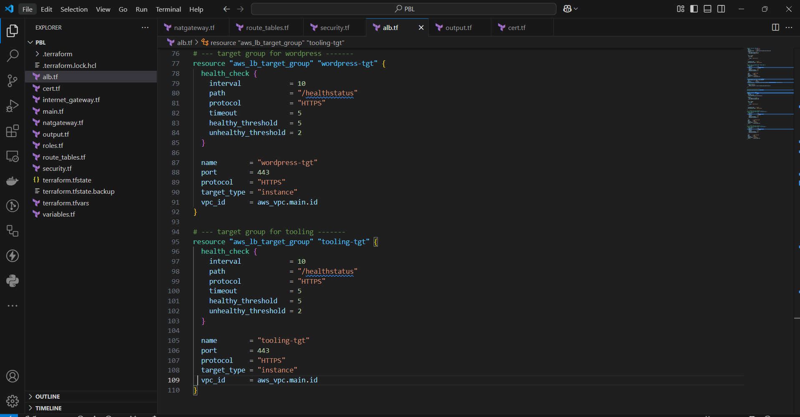

Then we will need to create a [Listener](https://docs.aws.amazon.com/elasticloadbalancing/latest/application/load-balancer-listeners.html) for this target Group
```hcl
# For this aspect a single listener was created for the wordpress which is default,
# A rule was created to route traffic to tooling when the host header changes

resource "aws_lb_listener" "web-listener" {
  load_balancer_arn = aws_lb.ialb.arn
  port              = 443
  protocol          = "HTTPS"
  certificate_arn   = aws_acm_certificate_validation.oyindamola.certificate_arn

  default_action {
    type             = "forward"
    target_group_arn = aws_lb_target_group.wordpress-tgt.arn
  }
}

# Listener rule for tooling target
resource "aws_lb_listener_rule" "tooling-listener" {
  listener_arn = aws_lb_listener.web-listener.arn
  priority     = 99

  action {
    type             = "forward"
    target_group_arn = aws_lb_target_group.tooling-tgt.arn
  }

  condition {
    host_header {
      values = ["tooling.oyindamola.gq"]
    }
  }
}
```

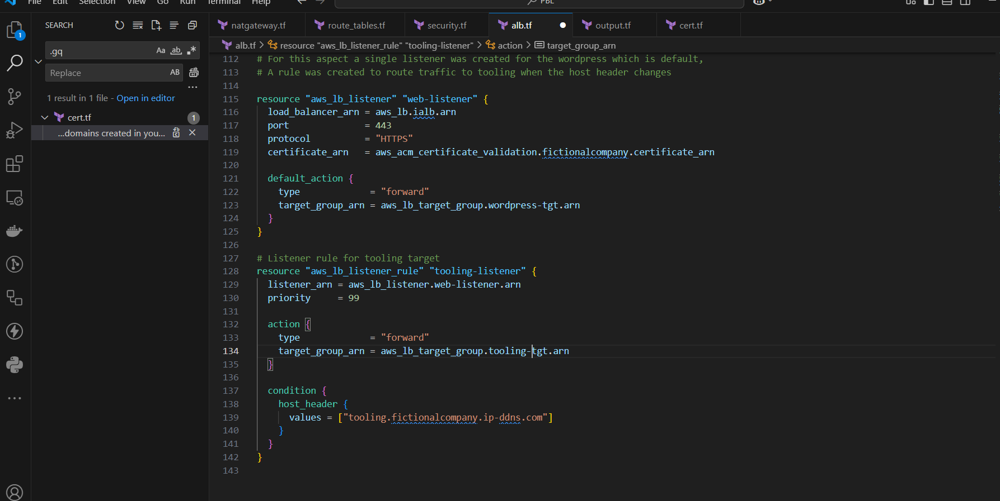

---
### Create an Auto Scaling Group (ASG)

Now, we need to configure our ASG to be able to scale the EC2s in and out, depending on the application traffic.

Before we start configuring an ASG, we need to create the launch template and the AMI needed. For now, we are going to use a random AMI from AWS; then, in project 19, we will use **Packer** to create our AMI.

Based on the architecture we need for Auto Scaling groups for bastion, nginx, WordPress, and tooling, we will create two files:
1. `asg-bastion-nginx.tf` will contain Launch Template and Autoscaling group for Bastion and Nginx.
2. `asg-wordpress-tooling.tf` will contain Launch Template and Autoscaling group for WordPress and Tooling.

**Useful Terraform Documentation:** Go through this documentation and understand the argument needed for each of the resources:
- [SNS-topic](https://registry.terraform.io/providers/hashicorp/aws/latest/docs/resources/sns_topic)
- [SNS-notification](https://registry.terraform.io/providers/hashicorp/aws/latest/docs/resources/autoscaling_notification)
- [Autoscaling](https://registry.terraform.io/providers/hashicorp/aws/latest/docs/resources/autoscaling_group)
- [Launch-template](https://registry.terraform.io/providers/hashicorp/aws/latest/docs/resources/launch_template)

Create `asg-bastion-nginx.tf` and paste the code below:
```hcl
# creating sns topic for all the auto scaling groups
resource "aws_sns_topic" "david-sns" {
 name = "Default_CloudWatch_Alarms_Topic"
}


# creating notification for all the auto scaling groups
resource "aws_autoscaling_notification" "david_notifications" {
 group_names = [
   aws_autoscaling_group.bastion-asg.name,
   aws_autoscaling_group.nginx-asg.name,
   aws_autoscaling_group.wordpress-asg.name,
   aws_autoscaling_group.tooling-asg.name,
 ]
 notifications = [
   "autoscaling:EC2_INSTANCE_LAUNCH",
   "autoscaling:EC2_INSTANCE_TERMINATE",
   "autoscaling:EC2_INSTANCE_LAUNCH_ERROR",
   "autoscaling:EC2_INSTANCE_TERMINATE_ERROR",
 ]

 topic_arn = aws_sns_topic.david-sns.arn
}


resource "random_shuffle" "az_list" {
 input        = data.aws_availability_zones.available.names
}


# launch template for bastion

resource "aws_launch_template" "bastion-launch-template" {
 image_id               = var.ami
 instance_type          = "t2.micro"
 vpc_security_group_ids = [aws_security_group.bastion_sg.id]

 iam_instance_profile {
   name = aws_iam_instance_profile.ip.id
 }

 key_name = var.keypair

 placement {
   availability_zone = "random_shuffle.az_list.result"
 }

 lifecycle {
   create_before_destroy = true
 }

 tag_specifications {
   resource_type = "instance"

  tags = merge(
   var.tags,
   {
     Name = "bastion-launch-template"
   },
 )
 }

# create a file called bastion.sh and copy the bastion userdata from project 15 into it
 user_data = filebase64("${path.module}/bastion.sh")
}

# ---- Autoscaling for bastion  hosts


resource "aws_autoscaling_group" "bastion-asg" {
 name                      = "bastion-asg"
 max_size                  = 2
 min_size                  = 1
 health_check_grace_period = 300
 health_check_type         = "ELB"
 desired_capacity          = 1

 vpc_zone_identifier = [
   aws_subnet.public[0].id,
   aws_subnet.public[1].id
 ]


 launch_template {
   id      = aws_launch_template.bastion-launch-template.id
   version = "$Latest"
 }
 tag {
   key                 = "Name"
   value               = "bastion-launch-template"
   propagate_at_launch = true
 }

}


# launch template for nginx

resource "aws_launch_template" "nginx-launch-template" {
 image_id               = var.ami
 instance_type          = "t2.micro"
 vpc_security_group_ids = [aws_security_group.nginx-sg.id]

 iam_instance_profile {
   name = aws_iam_instance_profile.ip.id
 }

 key_name =  var.keypair

 placement {
   availability_zone = "random_shuffle.az_list.result"
 }

 lifecycle {
   create_before_destroy = true
 }

 tag_specifications {
   resource_type = "instance"

   tags = merge(
   var.tags,
   {
     Name = "nginx-launch-template"
   },
 )
 }

  # create a file called nginx.sh and copy the nginx userdata from project 15 into it
 user_data = filebase64("${path.module}/nginx.sh")
}


# ------ Autoscslaling group for reverse proxy nginx ---------

resource "aws_autoscaling_group" "nginx-asg" {
 name                      = "nginx-asg"
 max_size                  = 2
 min_size                  = 1
 health_check_grace_period = 300
 health_check_type         = "ELB"
 desired_capacity          = 1

 vpc_zone_identifier = [
   aws_subnet.public[0].id,
   aws_subnet.public[1].id
 ]

 launch_template {
   id      = aws_launch_template.nginx-launch-template.id
   version = "$Latest"
 }

 tag {
   key                 = "Name"
   value               = "nginx-launch-template"
   propagate_at_launch = true
 }

}

# attaching autoscaling group of nginx to external load balancer

resource "aws_autoscaling_attachment" "asg_attachment_nginx" {
 autoscaling_group_name = aws_autoscaling_group.nginx-asg.id
 alb_target_group_arn   = aws_lb_target_group.nginx-tgt.arn
}
```

Create `asg-wordpress-tooling.tf` and paste the code below:
```hcl
# launch template for wordpress

resource "aws_launch_template" "wordpress-launch-template" {
  image_id               = var.ami
  instance_type          = "t2.micro"
  vpc_security_group_ids = [aws_security_group.webserver-sg.id]

  iam_instance_profile {
    name = aws_iam_instance_profile.ip.id
  }

  key_name = var.keypair


  placement {
    availability_zone = "random_shuffle.az_list.result"
  }

  lifecycle {
    create_before_destroy = true
  }

  tag_specifications {
    resource_type = "instance"

    tags = merge(
    var.tags,
    {
      Name = "wordpress-launch-template"
    },
  )

  }

    # create a file called wordpress.sh and copy the wordpress userdata from project 15 into it.
  user_data = filebase64("${path.module}/wordpress.sh")
}


# ---- Autoscaling for wordpress application

resource "aws_autoscaling_group" "wordpress-asg" {
  name                      = "wordpress-asg"
  max_size                  = 2
  min_size                  = 1
  health_check_grace_period = 300
  health_check_type         = "ELB"
  desired_capacity          = 1
  vpc_zone_identifier = [

    aws_subnet.private[0].id,
    aws_subnet.private[1].id
  ]


  launch_template {
    id      = aws_launch_template.wordpress-launch-template.id
    version = "$Latest"
  }
  tag {
    key                 = "Name"
    value               = "wordpress-asg"
    propagate_at_launch = true
  }
}


# attaching autoscaling group of wordpress application to internal loadbalancer
resource "aws_autoscaling_attachment" "asg_attachment_wordpress" {
  autoscaling_group_name = aws_autoscaling_group.wordpress-asg.id
  alb_target_group_arn   = aws_lb_target_group.wordpress-tgt.arn
}


# launch template for tooling
resource "aws_launch_template" "tooling-launch-template" {
  image_id               = var.ami
  instance_type          = "t2.micro"
  vpc_security_group_ids = [aws_security_group.webserver-sg.id]

  iam_instance_profile {
    name = aws_iam_instance_profile.ip.id
  }

  key_name = var.keypair


  placement {
    availability_zone = "random_shuffle.az_list.result"
  }

  lifecycle {
    create_before_destroy = true
  }

  tag_specifications {
    resource_type = "instance"

  tags = merge(
    var.tags,
    {
      Name = "tooling-launch-template"
    },
  )

  }

  # create a file called tooling.sh and copy the tooling userdata from project 15 into it
  user_data = filebase64("${path.module}/tooling.sh")
}


# ---- Autoscaling for tooling -----

resource "aws_autoscaling_group" "tooling-asg" {
  name                      = "tooling-asg"
  max_size                  = 2
  min_size                  = 1
  health_check_grace_period = 300
  health_check_type         = "ELB"
  desired_capacity          = 1

  vpc_zone_identifier = [

    aws_subnet.private[0].id,
    aws_subnet.private[1].id
  ]

  launch_template {
    id      = aws_launch_template.tooling-launch-template.id
    version = "$Latest"
  }

  tag {
    key                 = "Name"
    value               = "tooling-launch-template"
    propagate_at_launch = true
  }
}

# attaching autoscaling group of  tooling application to internal loadbalancer
resource "aws_autoscaling_attachment" "asg_attachment_tooling" {
  autoscaling_group_name = aws_autoscaling_group.tooling-asg.id
  alb_target_group_arn   = aws_lb_target_group.tooling-tgt.arn
}
```
### Storage and Database

Useful Documentation:
- [RDS](https://registry.terraform.io/providers/hashicorp/aws/latest/docs/resources/db_instance)
- [EFS](https://registry.terraform.io/providers/hashicorp/aws/latest/docs/resources/efs_file_system)
- [KMS](https://registry.terraform.io/providers/hashicorp/aws/latest/docs/resources/kms_key)

### Create Elastic File System (EFS)

To create an Elastic File System (EFS), you first need a KMS key for encryption. AWS Key Management Service (KMS) allows you to create and manage cryptographic keys for enhanced security.

Add the following code to `efs.tf`:

```hcl
# create key from key management system
resource "aws_kms_key" "g-kms" {
  description = "KMS key "
  policy      = <<EOF
  {
  "Version": "2012-10-17",
  "Id": "kms-key-policy",
  "Statement": [
    {
      "Sid": "Enable IAM User Permissions",
      "Effect": "Allow",
      "Principal": { "AWS": "arn:aws:iam::${var.account_no}:user/terraform" },
      "Action": "kms:*",
      "Resource": "*"
    }
  ]
}
EOF
}

# create key alias
resource "aws_kms_alias" "alias" {
  name          = "alias/kms"
  target_key_id = aws_kms_key.g-kms.key_id
}
```
Let us create EFS and it's mount targets: Add the following code to efs.tf
```hcl
# create Elastic file system
resource "aws_efs_file_system" "g-efs" {
  encrypted  = true
  kms_key_id = aws_kms_key.g-kms.arn

  tags = merge(
    var.tags,
    {
      Name = "g-efs"
    },
  )
}

# set first mount target for the EFS
resource "aws_efs_mount_target" "subnet-1" {
  file_system_id  = aws_efs_file_system.g-efs.id
  subnet_id       = aws_subnet.private[2].id
  security_groups = [aws_security_group.datalayer-sg.id]
}


# set second mount target for the EFS
resource "aws_efs_mount_target" "subnet-2" {
  file_system_id  = aws_efs_file_system.g-efs.id
  subnet_id       = aws_subnet.private[3].id
  security_groups = [aws_security_group.datalayer-sg.id]
}

# create access point for wordpress
resource "aws_efs_access_point" "wordpress" {
  file_system_id = aws_efs_file_system.g-efs.id

  posix_user {
    gid = 0
    uid = 0
  }

  root_directory {
    path = "/wordpress"

    creation_info {
      owner_gid   = 0
      owner_uid   = 0
      permissions = 0755
    }

  }

}

# create access point for tooling
resource "aws_efs_access_point" "tooling" {
  file_system_id = aws_efs_file_system.g-efs.id
  posix_user {
    gid = 0
    uid = 0
  }

  root_directory {

    path = "/tooling"

    creation_info {
      owner_gid   = 0
      owner_uid   = 0
      permissions = 0755
    }

  }
}
```
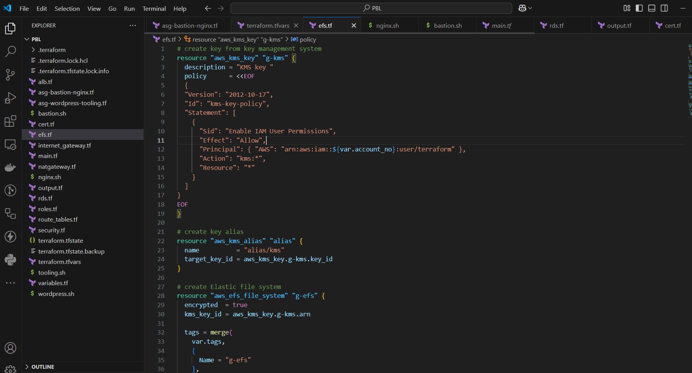

### Create MYSQL RDS

Let us create the RDS itself using this snippet of code in the `rds.tf` file:

```hcl
# This section will create the subnet group for the RDS instance using the private subnet
resource "aws_db_subnet_group" "g-rds" {
  name       = "g-rds"
  subnet_ids = [aws_subnet.private[2].id, aws_subnet.private[3].id]

  tags = merge(
    var.tags,
    {
      Name = "g-rds"
    },
  )
}

# create the RDS instance with the subnets group
resource "aws_db_instance" "g-rds" {
  allocated_storage      = 50
  storage_type           = "gp3"
  engine                 = "mysql"
  engine_version         = "8.0.35"
  instance_class         = "db.t3.micro"
  db_name                = "gdb"
  username               = var.master-username
  password               = var.master-password
  parameter_group_name   = "default.mysql8.0"
  db_subnet_group_name   = aws_db_subnet_group.g-rds.name
  skip_final_snapshot    = true
  vpc_security_group_ids = [aws_security_group.datalayer-sg.id]
  multi_az               = "true"
}
```
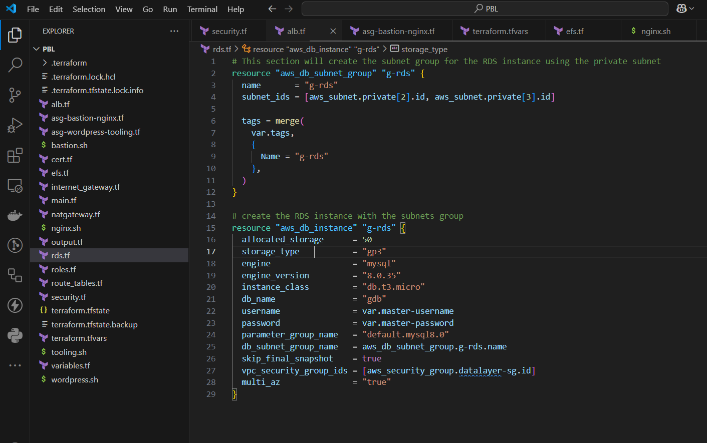

Before applying, please note that we gave reference to some variables in our resources that have not been declared in the `variables.tf` file. Go through the entire code and spot these variables and declare them in the variables.tf file.

If we have done that well, our file should look like this one below.
```hcl
variable "region" {
  type = string
  description = "The region to deploy resources"
}

variable "vpc_cidr" {
  type = string
  description = "The VPC cidr"
}

variable "enable_dns_support" {
  type = bool
}

variable "enable_dns_hostnames" {
  type = bool
}

variable "enable_classiclink" {
  type = bool
}

variable "enable_classiclink_dns_support" {
  type = bool
}

variable "preferred_number_of_public_subnets" {
  type        = number
  description = "Number of public subnets"
}

variable "preferred_number_of_private_subnets" {
  type        = number
  description = "Number of private subnets"
}

variable "name" {
  type    = string
  default = "ACS"

}

variable "tags" {
  description = "A mapping of tags to assign to all resources."
  type        = map(string)
  default     = {}
}


variable "ami" {
  type        = string
  description = "AMI ID for the launch template"
}


variable "keypair" {
  type        = string
  description = "key pair for the instances"
}

variable "account_no" {
  type        = number
  description = "the account number"
}


variable "master-username" {
  type        = string
  description = "RDS admin username"
}

variable "master-password" {
  type        = string
  description = "RDS master password"
}
```
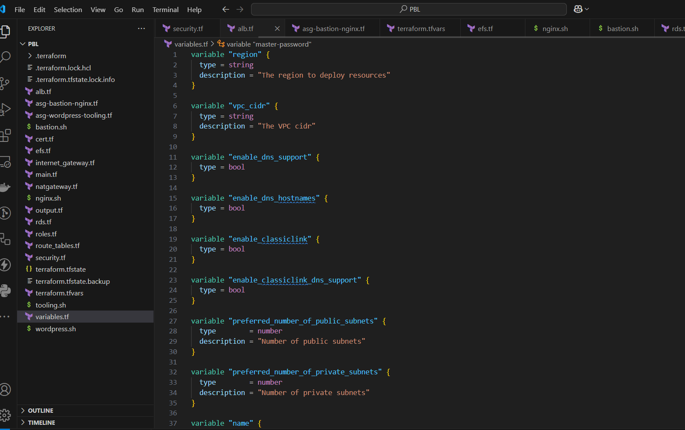

We are almost done but we need to update the last file which is `terraform.tfvars` file. In this file we are going to declare the values for the variables in our varibales.tf file.

Open the `terraform.tfvars` file and add the code below:
```hcl
region = "us-east-1"

vpc_cidr = "172.16.0.0/16"

enable_dns_support = "true"

enable_dns_hostnames = "true"

enable_classiclink = "false"

enable_classiclink_dns_support = "false"

preferred_number_of_public_subnets = "2"

preferred_number_of_private_subnets = "4"

environment = "production"

ami = "ami-0b0af3577fe5e3532"

keypair = "devops"

# Ensure to change this to your acccount number
account_no = "your_account_number"


db-username = "genet"


db-password = "devopspbl"


tags = {
  Enviroment      = "production"
  Owner-Email     = "genethagoswe@gmail.com"
  Managed-By      = "terraform"
  Billing-Account = "Billing-number"
}
```
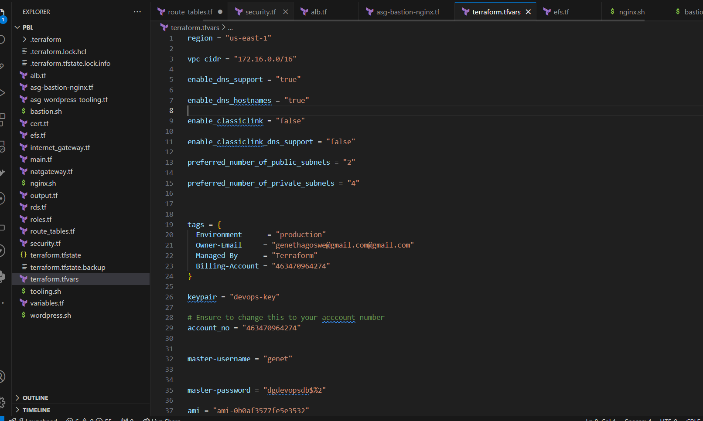

At this point, we shall have pretty much all the infrastructure elements ready to be deployed automatically. Let's try to  `plan` and `apply` our Terraform codes, explore the resources in AWS console and make sure we destroy them right away to avoid massive costs.


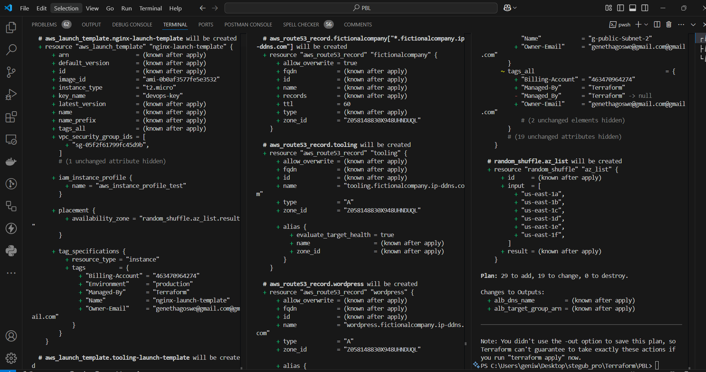
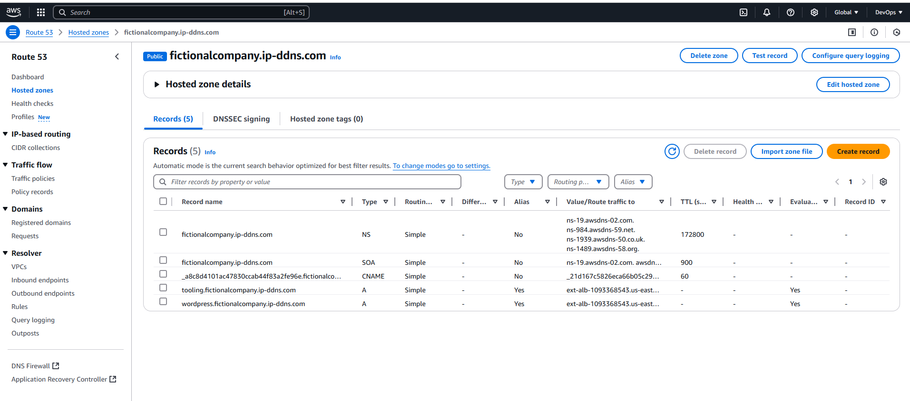

