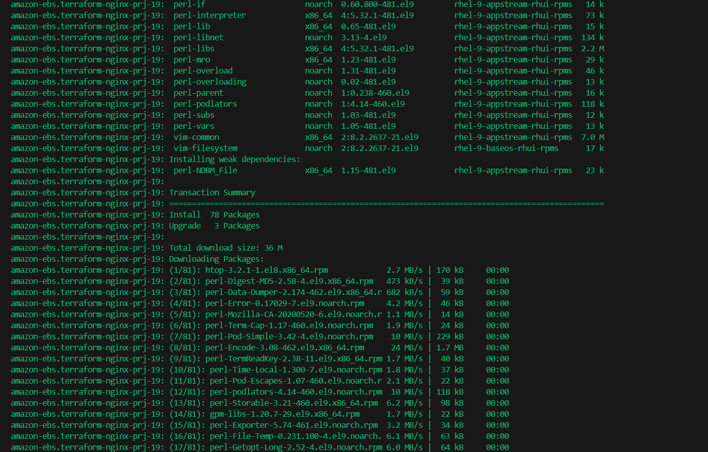
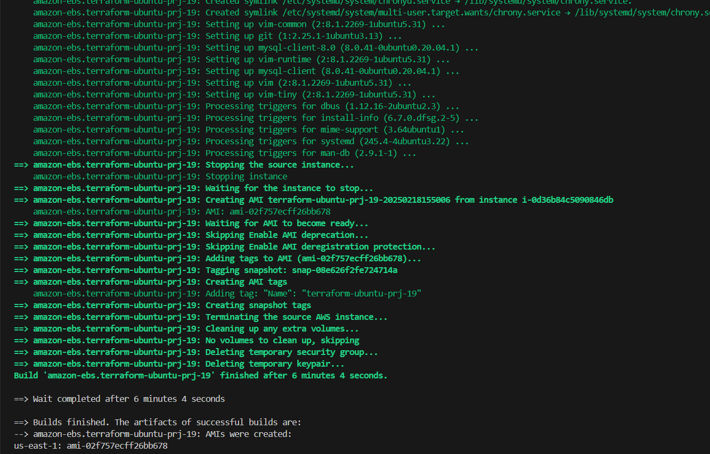
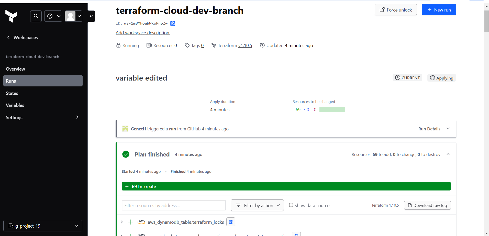

# Automate Infrastructure With IaC using Terraform 4 (Terraform Cloud)
---

### What Terraform Cloud is and why use it

By now, you should be pretty comfortable writing Terraform code to provision Cloud infrastructure using Configuration Language (HCL). Terraform is an open-source system, that you installed and ran a Virtual Machine (VM) that you had to create, maintain and keep up to date. In Cloud world it is quite common to provide a managed version of an open-source software. Managed means that you do not have to install, configure and maintain it yourself - you just create an account and use it "as A Service".

[Terraform Cloud](https://www.hashicorp.com/en/products/terraform) is a managed service that provides you with Terraform CLI to provision infrastructure, either on demand or in response to various events.

By default, Terraform CLI performs operation on the server when it is invoked, it is perfectly fine if you have a dedicated role who can launch it, but if you have a team who works with Terraform - you need a consistent remote environment with remote workflow and shared state to run Terraform commands.

Terraform Cloud executes Terraform commands on disposable virtual machines, this remote execution is also called [remote operations](https://developer.hashicorp.com/terraform/cloud-docs/run/remote-operations).


## Migrate your `.tf` codes to Terraform Cloud

Let us explore how we can migrate our codes to Terraform Cloud and manage our AWS infrastructure from there:

## 1. Create a Terraform Cloud account

Follow [this link](https://app.terraform.io/public/signup/account), create a new account, verify your email and you are ready to start.


Most of the features are free, but if you want to explore the difference between free and paid plans - you can check it on [this page](https://www.hashicorp.com/products/terraform/pricing).

## 2. Create an organization

Select `Start from scratch`, choose a name for your organization and create it.


## 3. Configure a workspace

Before we begin to configure our workspace - [watch this part of the video](https://www.youtube.com/watch?v=m3PlM4erixY&t=287s) to better understand the difference between `version control workflow`, `CLI-driven workflow` and `API-driven workflow` and other configurations that we are going to implement.


We will use `version control workflow` as the most common and recommended way to run Terraform commands triggered from our git repository.

Create a new repository in your GitHub and call it `terraform-cloud`, push your Terraform codes developed in the previous projects to the repository.

Choose `version control workflow` and you will be promped to connect your GitHub account to your workspace - follow the prompt and add your newly created repository to the workspace.

Move on to `Configure settings`, provide a description for your workspace and leave all the rest settings default, click `Create workspace`.


## 4. Configure variables

Terraform Cloud supports two types of variables: `environment variables` and `Terraform variables`. Either type can be marked as `sensitive`, which prevents them from being displayed in the Terraform Cloud web UI and makes them write-only.

Set two environment variables: __`AWS_ACCESS_KEY_ID`__ and __`AWS_SECRET_ACCESS_KEY`__, set the values that you used in the last two projects. These credentials will be used to provision your AWS infrastructure by Terraform Cloud.


After you have set these 2 environment variables - your Terraform Cloud is all set to apply the codes from GitHub and create all necessary AWS resources.

## 5. Now it is time to run our Terraform scripts
But in our previous project, we talked about using `Packer` to build our images, and `Ansible` to configure the infrastructure, so for that we are going to make few changes to our our existing repository from the last project.

The files that would be Added is;

- __AMI:__ for building packer images
- __Ansible:__ for Ansible scripts to configure the infrastructure

Before we proceed, we need to ensure we have the following tools installed on our local machine;

- [packer](https://developer.hashicorp.com/packer/tutorials/docker-get-started/get-started-install-cli)

  

- [Ansible](https://docs.ansible.com/ansible/latest/installation_guide/intro_installation.html)

  

Refer to this [repository](https://github.com/StegTechHub/PBL-project-19) for guidance on how to refactor your environment to meet the new changes above and ensure you go through the `README.md` file.

### Action Plan for this project

- Build images using packer
- confirm the AMIs in the console
- update terraform script with new ami IDs generated from packer build
- create terraform cloud account and backend
- run terraform script
- update ansible script with values from terraform output
     - RDS endpoints for wordpress and tooling
     - Database name, password and username for wordpress and tooling
     - Access point ID for wordpress and tooling
     - Internal load balance DNS for nginx reverse proxy

- run ansible script
- check the website

To follow file structure create a new folder and name it `AMI`. In this folder, create Bastion, Nginx and Webserver (for Tooling and Wordpress) AMI Packer template (`bastion.pkr.hcl`, `nginx.pkr.hcl`, `ubuntu.pkr.hcl` and `web.pkr.hcl`).

Packer template is a `JSON` or `HCL` file that defines the configurations for creating an AMI. Each AMI Bastion, Nginx and Web (for Tooling and WordPress) will have its own Packer template, or we can use a single template with multiple builders.

### Run the packer commands to build AMI for Bastion server, Nginx server and webserver

### For Bastion

```hcl
packer build bastion.pkr.hcl
```


### For Nginx

```hcl
packer build nginx.pkr.hcl
```




### For Webservers

```hcl
packer build web.pkr.hcl
```


### For Ubuntu (Jenkins, Artifactory and sonarqube Server)

```hcl
packer build ubuntu.pkr.hcl
```





## 6. Run `terraform plan` and `terraform apply` from web console

- Switch to `Runs` tab and click on `Queue plan manually` button.


- If planning has been successful, you can proceed and confirm Apply - press `Confirm and apply`, provide a comment and `Confirm plan`


- Check the logs and verify that everything has run correctly. Note that Terraform Cloud has generated a unique state version that you can open and see the codes applied and the changes made since the last run.


## 7. Test automated `terraform plan`

By now, you have tried to launch `plan` and `apply` manually from Terraform Cloud web console. But since we have an integration with GitHub, the process can be triggered automatically. Try to change something in any of `.tf` files and look at `Runs` tab again - `plan` must be launched automatically, but to `apply` you still need to approve manually.

Since provisioning of new Cloud resources might incur significant costs. Even though you can configure `Auto apply`, it is always a good idea to verify your `plan` results before pushing it to `apply` to avoid any misconfigurations that can cause 'bill shock'.

### **Steps to Test Automated `terraform plan` in Terraform Cloud**

## **Step 1: Configure GitHub as a Version Control System (VCS) in Terraform Cloud**
- **Go to Terraform Cloud** → **Settings** → **VCS Providers**.
- **Click on "Add a VCS Provider"**.
- **Select GitHub** and follow the authorization steps.
- **Go to your Terraform Cloud workspace**.
- Click **"Version Control"** → **"Change Source"**.
- **Select "GitHub.com (Custom)"**.
- **Choose your repository** where your Terraform configuration files are stored.


## **Step 2: Make a Change to a `.tf` File**
- **Modify any Terraform configuration file** (e.g., `variables.tf`).
- **Commit and push the change** to the repository:
## **Step 3: Check Terraform Cloud for an Automated Plan**
- **Go to Terraform Cloud** → **Your Workspace**.
- Click the **"Runs"** tab.
- **Observe an automatically triggered Terraform plan**.


## **Step 4: Manually Approve `terraform apply`**
- **Review the plan output** in Terraform Cloud.
- Click **"Confirm & Apply"** to execute changes.

### **Practice Task №1**
## **Step 1: Configure 3 Branches for `dev`, `test`, and `prod`**
- Navigate to your **Terraform Cloud repository** (`terraform-cloud`) in **GitHub**.
- Create three branches:
   - `dev`
   - `test`
   - `prod`
   ```sh
   git checkout -b dev
   git push origin dev

   git checkout -b test
   git push origin test

   git checkout -b prod
   git push origin prod
   ```


## **Step 2: Configure Automatic Runs Only for `dev` Environment**
### **Configure Terraform Cloud Workspaces**
- Go to **Terraform Cloud** (**https://app.terraform.io/**).
- Click **"Workspaces"** and create three workspaces:


### **Enable Auto-Apply for `dev` Only**
- **Go to `terraform-dev` workspace** → **Settings** → **General**.
- **Enable** `Automatic Run Triggering` and **Auto-Apply**.
- **For `test` and `prod`**, disable Auto-Apply to prevent automatic changes.


## **Step 3: Create Email and Slack Notifications**
### **Create Notifications in Terraform Cloud**
- **Go to Terraform Cloud** → **Settings** → **Notifications**.
- **Click "Create Notification"** and select:
   - **Email**: Enter your email to receive notifications.
     

   - **Slack**: Get the **Slack Webhook URL** for notifications.
     
     
   
3. **Set Event Triggers**:
   - `Plan started`
   - `Run errored`
4. **Test Notifications**:
   - **Trigger a plan** and verify the email/Slack notification.
   
   
   

## **Step 4: Apply `destroy` from Terraform Cloud Web Console**
- **Go to Terraform Cloud**.
- **Select a workspace** (e.g., `terraform-dev`).
- **Click "Actions"** → **"Queue destroy plan"**.
- **Confirm** and apply the destroy action.


### **Steps to Work with a Private Terraform Module Registry**

This guide will help you complete **Practice Task №2: Working with a Private Repository** in **Terraform Cloud**.

---

## **1️⃣ Create a Simple Terraform Module Repository**
1. **Create a new GitHub repository** to store your Terraform module.
   - Example repo name: **`terraform-aws-module`**
2. **Clone the repository** to your local machine:
   ```sh
   git clone https://github.com/your-username/terraform-aws-module.git
   cd terraform-aws-module
   ```
3. **Create a Terraform module structure**:
   ```sh
   mkdir -p modules/network
   cd modules/network
   ```
4. **Add module files** (`main.tf`, `variables.tf`, `outputs.tf`).

   - **`main.tf`** (Example: AWS VPC Module)
     ```hcl
     resource "aws_vpc" "main" {
       cidr_block = var.cidr_block
     }
     ```
   - **`variables.tf`**
     ```hcl
     variable "cidr_block" {
       description = "VPC CIDR block"
       type        = string
     }
     ```
   - **`outputs.tf`**
     ```hcl
     output "vpc_id" {
       value = aws_vpc.main.id
     }
     ```

5. **Commit and push the changes**:
   ```sh
   git add .
   git commit -m "Initial Terraform module"
   git push origin main
   ```

---

## **2️⃣ Import the Module into Your Private Registry**
1. **Go to Terraform Cloud** → **Registry** → **Private Registry**.
2. Click **"Add Module"** and select **your GitHub repository**.
3. Terraform Cloud will **import the module** and make it available in your private registry.

---

## **3️⃣ Create a Configuration That Uses the Module**
1. **Create a new Terraform project directory**:
   ```sh
   mkdir ~/terraform-project
   cd ~/terraform-project
   ```
2. **Create a Terraform configuration file (`main.tf`)**:
   ```hcl
   terraform {
     required_providers {
       aws = {
         source  = "hashicorp/aws"
         version = "~> 4.0"
       }
     }
   }

   provider "aws" {
     region = "us-east-1"
   }

   module "network" {
     source     = "app.terraform.io/your-org/terraform-aws-module/aws"
     version    = "1.0.0"
     cidr_block = "10.0.0.0/16"
   }

   output "vpc_id" {
     value = module.network.vpc_id
   }
   ```
3. **Initialize the project**:
   ```sh
   terraform init
   ```

---

## **4️⃣ Create a Workspace for the Configuration**
1. **Go to Terraform Cloud** → **Workspaces** → **Create a Workspace**.
2. Select **"Version Control Workflow"** and connect it to your GitHub repository.
3. Choose **the main branch** and create the workspace.

---

## **5️⃣ Deploy the Infrastructure**
1. **Run Terraform Plan**:
   ```sh
   terraform plan
   ```
2. **Apply the changes**:
   ```sh
   terraform apply -auto-approve
   ```
3. Terraform will **deploy the infrastructure** using the module.

---

## **6️⃣ Destroy Your Deployment**
1. **Run Terraform Destroy**:
   ```sh
   terraform destroy -auto-approve
   ```
2. This will **remove all resources** created.

---

### **🎯 Summary**
✅ **Step 1:** Create a Terraform module repository on GitHub.  
✅ **Step 2:** Import the module into Terraform Cloud's Private Registry.  
✅ **Step 3:** Create a Terraform configuration that uses the module.  
✅ **Step 4:** Create a workspace in Terraform Cloud.  
✅ **Step 5:** Deploy the infrastructure using `terraform apply`.  
✅ **Step 6:** Destroy the infrastructure when done.  

🚀 Now you have successfully worked with a **private Terraform module repository**! Let me know if you need help.