# QUICK TASK

## Now setup the following tools using Helm

This section will be quite challenging for you because you will need to spend some time to research the charts, read their documentations and understand how to get an application running in your cluster by simply running a helm install command.

1. Artifactory
2. Hashicorp Vault
3. Prometheus
4. Grafana
5. Elasticsearch ELK using ECK

## 1️ Install Artifactory

```bash
kubectl create namespace artifactory
helm repo add jfrog https://charts.jfrog.io
helm repo update

helm install artifactory jfrog/artifactory --namespace artifactory

# Check status
kubectl get pods -n artifactory
kubectl get svc -n artifactory
```

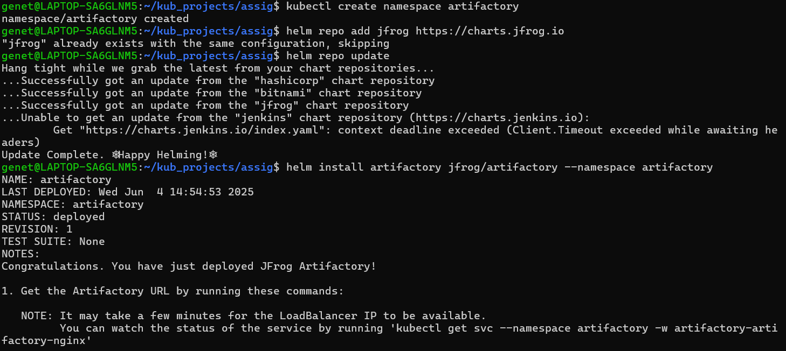

### Access in browser:

```bash
kubectl port-forward svc/artifactory  8082:8082 -n artifactory
```

Open: [http://localhost:8081](http://localhost:8081)

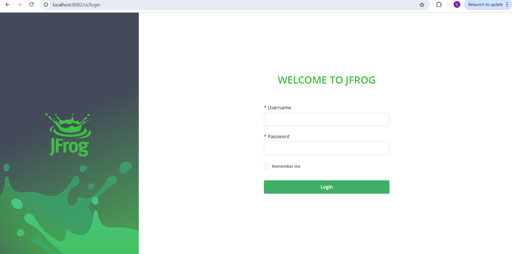

## 2 Install HashiCorp Vault

```bash
kubectl create namespace vault

helm repo add hashicorp https://helm.releases.hashicorp.com
helm repo update

helm install vault hashicorp/vault --namespace vault

# Check status
kubectl get pods -n vault
kubectl get svc -n vault
```
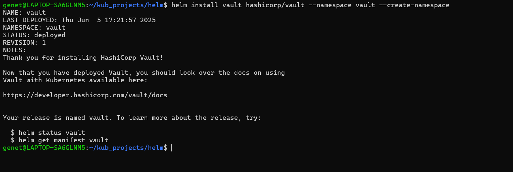
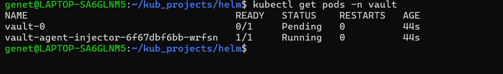
### Access in browser:

```bash
kubectl port-forward svc/vault 8200:8200 -n vault
```
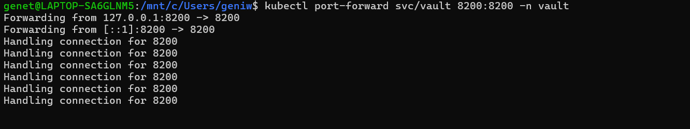

Open: [http://localhost:8200](http://localhost:8200)

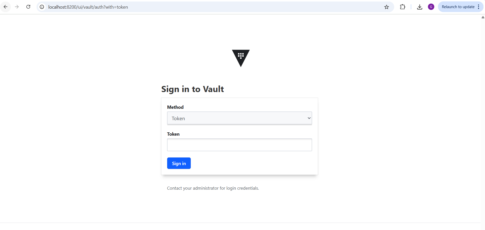

## 3 Install Prometheus

```bash
kubectl create namespace prometheus

helm repo add prometheus-community https://prometheus-community.github.io/helm-charts
helm repo update

helm install prometheus prometheus-community/prometheus --namespace prometheus

# Check status
kubectl get pods -n prometheus
kubectl get svc -n prometheus
```
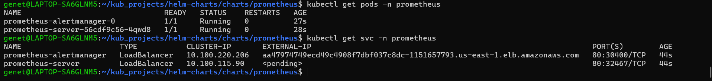

### Access in browser:

```bash
kubectl port-forward svc/prometheus-server 9090:80 -n prometheus
```
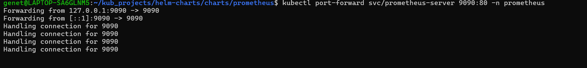

Open: [http://localhost:9090](http://localhost:9090)

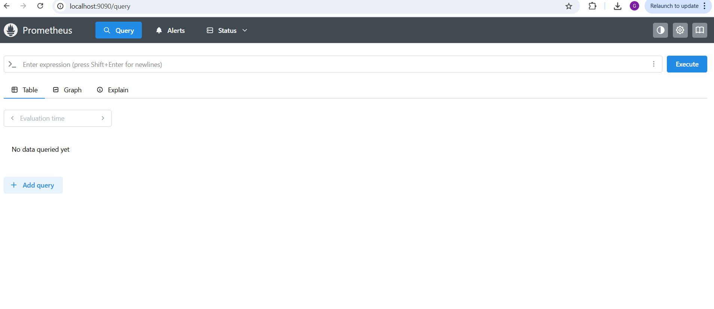


## 4 Install Grafana

```bash
kubectl create namespace grafana

helm repo add grafana https://grafana.github.io/helm-charts
helm repo update

helm install grafana grafana/grafana --namespace grafana

# Check status
kubectl get pods -n grafana
kubectl get svc -n grafana
```
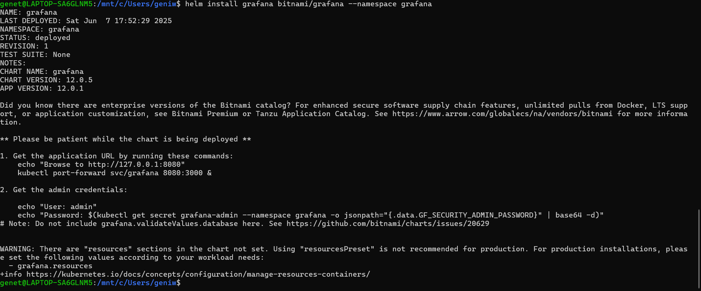
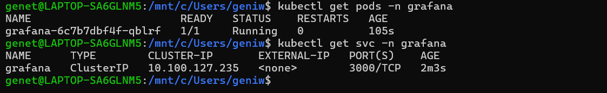

### Access in browser:

```bash
kubectl port-forward svc/grafana 3000:3000 -n grafana
```
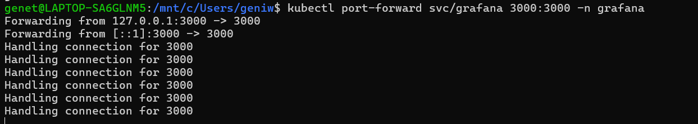

Open: [http://localhost:3000](http://localhost:3000)

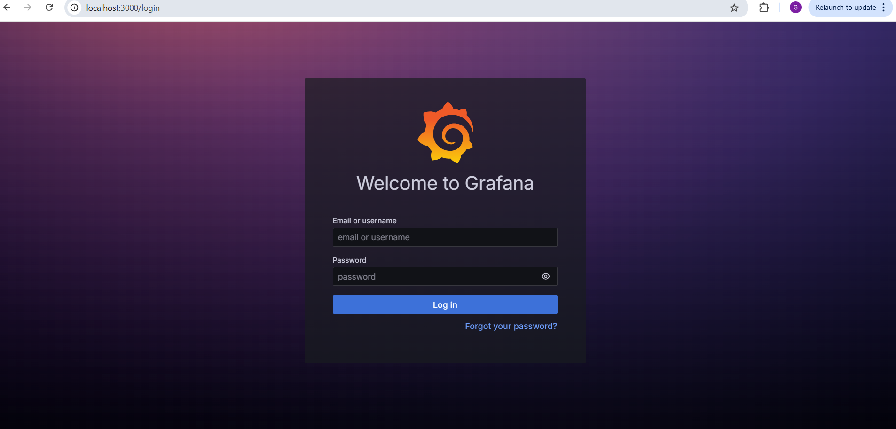

🗝️ Get admin password:

```bash
kubectl get secret grafana-admin --namespace grafana -o jsonpath="{.data.GF_SECURITY_ADMIN_PASSWORD}" | base64 -d 
```
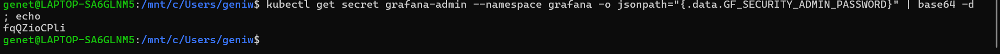
Default username: `admin`

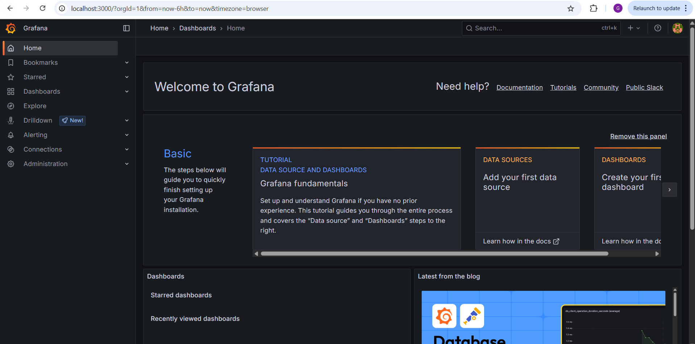

## 5 Install Elasticsearch using ECK

1: Install ECK Operator

```bash
kubectl create namespace elastic-system

kubectl apply -f https://download.elastic.co/downloads/eck/2.12.1/crds.yaml
kubectl apply -f https://download.elastic.co/downloads/eck/2.12.1/operator.yaml

# Check status
kubectl get pods -n elastic-system
```
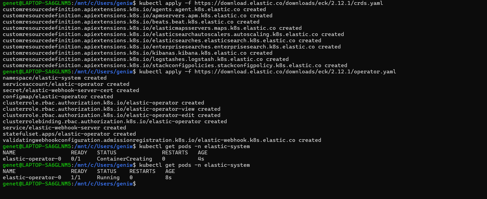

### Step 2: Deploy Elasticsearch instance

Save this file as `elasticsearch.yaml`:

```yaml
apiVersion: elasticsearch.k8s.elastic.co/v1
kind: Elasticsearch
metadata:
  name: quickstart
  namespace: elastic-system
spec:
  version: 8.13.2
  nodeSets:
  - name: default
    count: 1
    config:
      node.store.allow_mmap: false
```
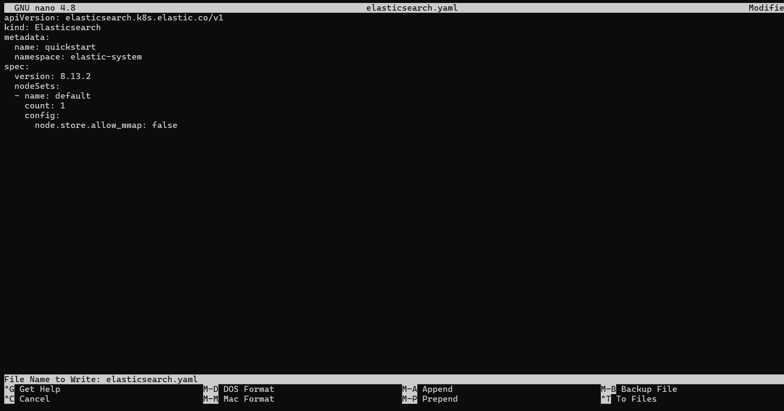

Apply it:

```bash
kubectl apply -f elasticsearch.yaml

# Check status
kubectl get elasticsearch -n elastic-system
kubectl get pods -n elastic-system
```
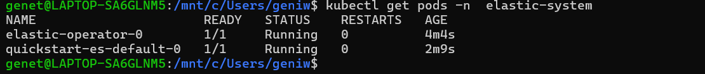

__The End__

In the next project,

1. You will write custom Helm charts
2. Configure Ingress for all the tools and applications running in the cluster
3. Integrate Secrets management using Hashicorp Vault
4. Integrate Logging with ELK
5. Integrate monitoring with Prometheus and Grafana.


