## Building Elastic Kubernetes Service (EKS) With Terraform

Since project 21 and 22, we have had some fragmented experience around Kubernetes bootstrapping and deployment of containerised applications. This project seeks to solidify our skills by focusing more on real-world setup.

1. We will use Terraform to create a Kubernetes EKS cluster and dynamically add scalable worker nodes.
2. We will deploy multiple applications using HELM.
3. We will experience more Kubernetes objects and how to use them with Helm — such as dynamic provisioning of volumes to make pods stateful.
4. We will improve upon our CI/CD skills with Jenkins.

In Project 21, we created a k8s cluster from the ground up. That was quite painful, but very necessary to help us master Kubernetes. Going forward, we will not have to do that. Even in the real world, we will hardly ever have to do that, given that cloud providers such as AWS have managed services for Kubernetes. They have done all the hard work, and with a few API calls to AWS, we can have a production-grade cluster ready to go in minutes. Therefore, in this project, we begin by focusing on **EKS**, and how to get it up and running using Terraform, before moving on to other things.

### Building EKS with Terraform

At this point, we already have some Terraform experience. So, we have some work to do. But we can get started with the steps below. *If we have Terraform code from Project 16, we simply update the code and include EKS starting from number 6 below. Otherwise, we follow the steps from number 1.*

> **Note**: Use Terraform version **v1.0.2** and kubectl version **v1.23.6**

1. We open up a new directory on our laptop, and name it `eks`
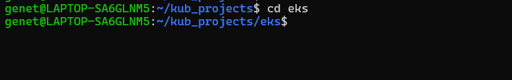

2. We use AWS CLI to create an S3 bucket
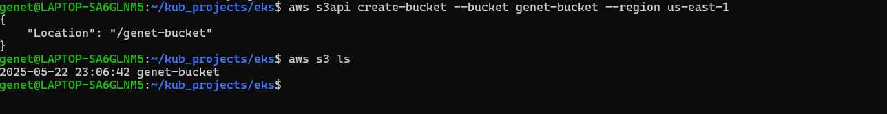

3. We create a file — `backend.tf`
   *Task for us: ensure the backend is configured for remote state in S3*

```hcl
terraform {
}
```
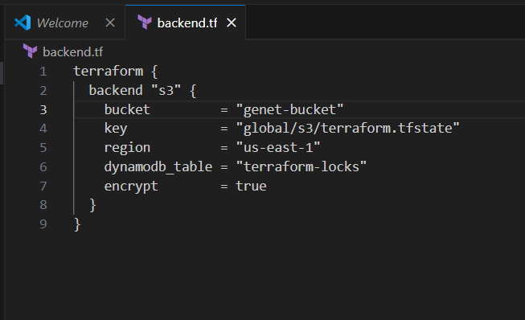

4. We create a file — `network.tf` — and provision Elastic IP for NAT Gateway, VPC, private and public subnets.

```hcl
# reserve Elastic IP to be used in our NAT gateway
resource "aws_eip" "nat_gw_elastic_ip" {
  vpc = true

  tags = {
    Name            = "${var.cluster_name}-nat-eip"
    iac_environment = var.iac_environment_tag
  }
}
```
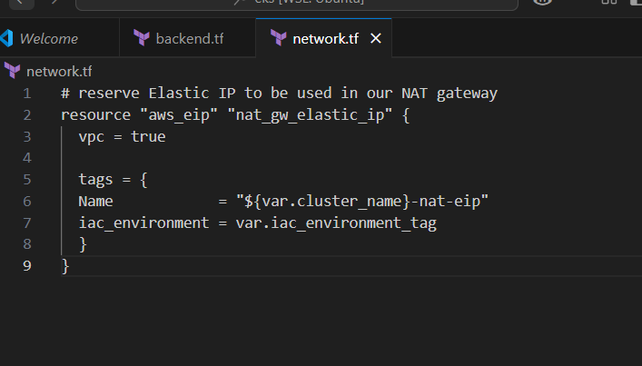

Create `VPC` using the official AWS module

```hcl
module "vpc" {
  source = "terraform-aws-modules/vpc/aws"

  name = "${var.name_prefix}-vpc"
  cidr = var.main_network_block
  azs  = data.aws_availability_zones.available_azs.names

  private_subnets = [
    # this loop will create a one-line list as ["10.0.0.0/20", "10.0.16.0/20", "10.0.32.0/20", ...]
    # with a length depending on how many Zones are available
    for zone_id in data.aws_availability_zones.available_azs.zone_ids :
    cidrsubnet(var.main_network_block, var.subnet_prefix_extension, tonumber(substr(zone_id, length(zone_id) - 1, 1)) - 1)
  ]

  public_subnets = [
    # this loop will create a one-line list as ["10.0.128.0/20", "10.0.144.0/20", "10.0.160.0/20", ...]
    # with a length depending on how many Zones are available
    # there is a zone Offset variable, to make sure no collisions are present with private subnet blocks
    for zone_id in data.aws_availability_zones.available_azs.zone_ids :
    cidrsubnet(var.main_network_block, var.subnet_prefix_extension, tonumber(substr(zone_id, length(zone_id) - 1, 1)) + var.zone_offset - 1)
  ]

  # Enable single NAT Gateway to save some money
  # WARNING: this could create a single point of failure, since we are creating a NAT Gateway in one AZ only
  # feel free to change these options if you need to ensure full Availability without the need of running 'terraform apply'
  # reference: https://registry.terraform.io/modules/terraform-aws-modules/vpc/aws/2.44.0#nat-gateway-scenarios

  enable_nat_gateway     = true
  single_nat_gateway     = true
  one_nat_gateway_per_az = false
  enable_dns_hostnames   = true
  reuse_nat_ips          = true
  external_nat_ip_ids    = [aws_eip.nat_gw_elastic_ip.id]

  # Add VPC/Subnet tags required by EKS
  tags = {
    "kubernetes.io/cluster/${var.cluster_name}" = "shared"
    iac_environment                             = var.iac_environment_tag
  }
  public_subnet_tags = {
    "kubernetes.io/cluster/${var.cluster_name}" = "shared"
    "kubernetes.io/role/elb"                    = "1"
    iac_environment                             = var.iac_environment_tag
  }
  private_subnet_tags = {
    "kubernetes.io/cluster/${var.cluster_name}" = "shared"
    "kubernetes.io/role/internal-elb"           = "1"
    iac_environment                             = var.iac_environment_tag
  }
}
```
__Note:__ The __tags__ added to the subnets is very important. The Kubernetes Cloud Controller Manager (`cloud-controller-manager`) and AWS Load Balancer Controller (`aws-load-balancer-controller`) needs to identify the cluster’s. To do that, it querries the cluster’s subnets by using the tags as a filter.

- For public and private subnets that use load balancer resources: each subnet must be tagged

```hcl
Key: kubernetes.io/cluster/cluster-name
Value: shared
```

- For private subnets that use internal load balancer resources: each subnet must be tagged

```hcl
Key: kubernetes.io/role/internal-elb
Value: 1
```

- For public subnets that use internal load balancer resources: each subnet must be tagged

```hcl
Key: kubernetes.io/role/elb
Value: 1
```
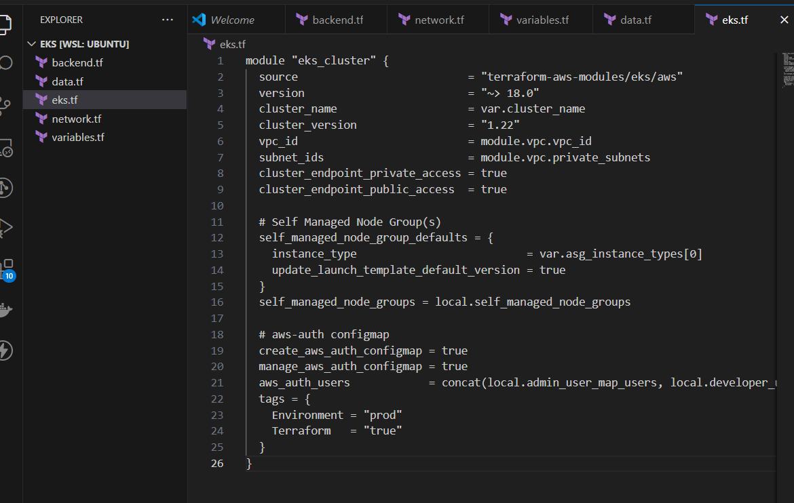

5. Create a file – `variables.tf`

```hcl
# create some variables
variable "cluster_name" {
  type        = string
  description = "EKS cluster name."
}
variable "iac_environment_tag" {
  type        = string
  description = "AWS tag to indicate environment name of each infrastructure object."
}
variable "name_prefix" {
  type        = string
  description = "Prefix to be used on each infrastructure object Name created in AWS."
}
variable "main_network_block" {
  type        = string
  description = "Base CIDR block to be used in our VPC."
}
variable "subnet_prefix_extension" {
  type        = number
  description = "CIDR block bits extension to calculate CIDR blocks of each subnetwork."
}
variable "zone_offset" {
  type        = number
  description = "CIDR block bits extension offset to calculate Public subnets, avoiding collisions with Private subnets."
}
```
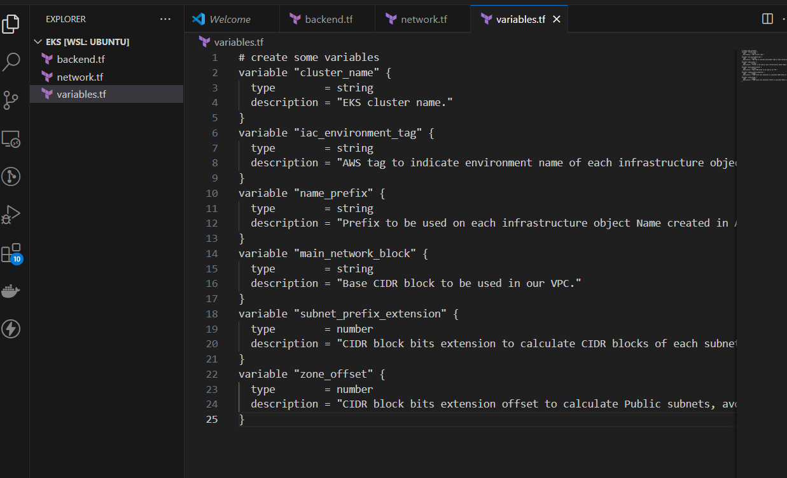

6. Create a file – `data.tf` – This will pull the available AZs for use.

```hcl
# get all available AZs in our region
data "aws_availability_zones" "available_azs" {
  state = "available"
}
data "aws_caller_identity" "current" {} # used for accesing Account ID and ARN
```
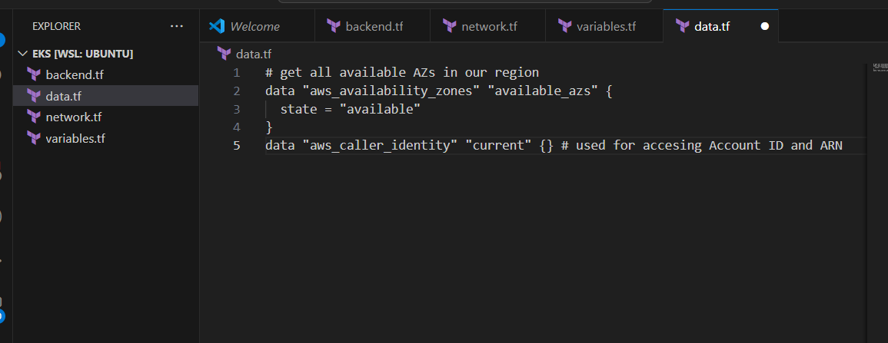

7. Create a file – `eks.tf` and provision EKS cluster (Create the file only if you are not using your existing Terraform code. Otherwise you can simply append it to the main.tf from your existing code) [Read more about this module from the official documentation here](https://registry.terraform.io/modules/terraform-aws-modules/eks/aws/18.20.5) – Reading it will help you understand more about the rich features of the module.

```hcl
module "eks_cluster" {
  source                          = "terraform-aws-modules/eks/aws"
  version                         = "~> 18.0"
  cluster_name                    = var.cluster_name
  cluster_version                 = "1.22"
  vpc_id                          = module.vpc.vpc_id
  subnet_ids                      = module.vpc.private_subnets
  cluster_endpoint_private_access = true
  cluster_endpoint_public_access  = true

  # Self Managed Node Group(s)
  self_managed_node_group_defaults = {
    instance_type                          = var.asg_instance_types[0]
    update_launch_template_default_version = true
  }
  self_managed_node_groups = local.self_managed_node_groups

  # aws-auth configmap
  create_aws_auth_configmap = true
  manage_aws_auth_configmap = true
  aws_auth_users            = concat(local.admin_user_map_users, local.developer_user_map_users)
  tags = {
    Environment = "prod"
    Terraform   = "true"
  }
}
```


8. Create a file – `locals.tf` to create local variables. Terraform does not allow assigning variable to variables. There is good reasons for that to avoid repeating your code unecessarily. So a terraform way to achieve this would be to use locals so that your code can be kept [DRY](https://en.wikipedia.org/wiki/Don%27t_repeat_yourself).

```hcl
# render Admin & Developer users list with the structure required by EKS module
locals {
  admin_user_map_users = [
    for admin_user in var.admin_users :
    {
      userarn  = "arn:aws:iam::${data.aws_caller_identity.current.account_id}:user/${admin_user}"
      username = admin_user
      groups   = ["system:masters"]
    }
  ]
  developer_user_map_users = [
    for developer_user in var.developer_users :
    {
      userarn  = "arn:aws:iam::${data.aws_caller_identity.current.account_id}:user/${developer_user}"
      username = developer_user
      groups   = ["${var.name_prefix}-developers"]
    }
  ]

  self_managed_node_groups = {
    worker_group1 = {
      name = "${var.cluster_name}-wg"

      min_size      = var.autoscaling_minimum_size_by_az * length(data.aws_availability_zones.available_azs.zone_ids)
      desired_size  = var.autoscaling_minimum_size_by_az * length(data.aws_availability_zones.available_azs.zone_ids)
      max_size      = var.autoscaling_maximum_size_by_az * length(data.aws_availability_zones.available_azs.zone_ids)
      instance_type = var.asg_instance_types[0].instance_type

      bootstrap_extra_args = "--kubelet-extra-args '--node-labels=node.kubernetes.io/lifecycle=spot'"

      block_device_mappings = {
        xvda = {
          device_name = "/dev/xvda"
          ebs = {
            delete_on_termination = true
            encrypted             = false
            volume_size           = 10
            volume_type           = "gp2"
          }
        }
      }

      use_mixed_instances_policy = true
      mixed_instances_policy = {
        instances_distribution = {
          spot_instance_pools = 4
        }

        override = var.asg_instance_types
      }
    }
  }
}
```
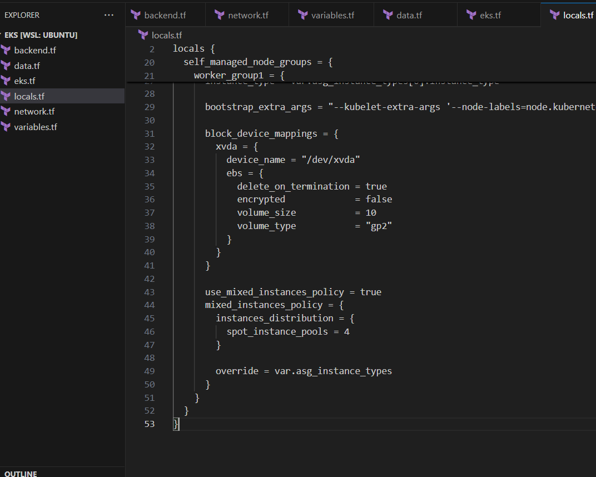

9. Add more variables to the `variables.tf` file

```hcl
# create some variables
variable "admin_users" {
  type        = list(string)
  description = "List of Kubernetes admins."
}
variable "developer_users" {
  type        = list(string)
  description = "List of Kubernetes developers."
}
variable "asg_instance_types" {
  description = "List of EC2 instance machine types to be used in EKS."
}
variable "autoscaling_minimum_size_by_az" {
  type        = number
  description = "Minimum number of EC2 instances to autoscale our EKS cluster on each AZ."
}
variable "autoscaling_maximum_size_by_az" {
  type        = number
  description = "Maximum number of EC2 instances to autoscale our EKS cluster on each AZ."
}
```


9. Create a file – `variables.tfvars` to set values for variables.

```hcl
cluster_name            = "tooling-app-eks"
iac_environment_tag     = "development"
name_prefix             = "darey-io-eks"
main_network_block      = "10.0.0.0/16"
subnet_prefix_extension = 4
zone_offset             = 8

# Ensure that these users already exist in AWS IAM. Another approach is that you can introduce an iam.tf file to manage users separately, get the data source and interpolate their ARN.
admin_users                    = ["darey", "solomon"]
developer_users                = ["leke", "david"]
asg_instance_types             = [ { instance_type = "t3.small" }, { instance_type = "t2.small" }, ]
autoscaling_minimum_size_by_az = 1
autoscaling_maximum_size_by_az = 10
```
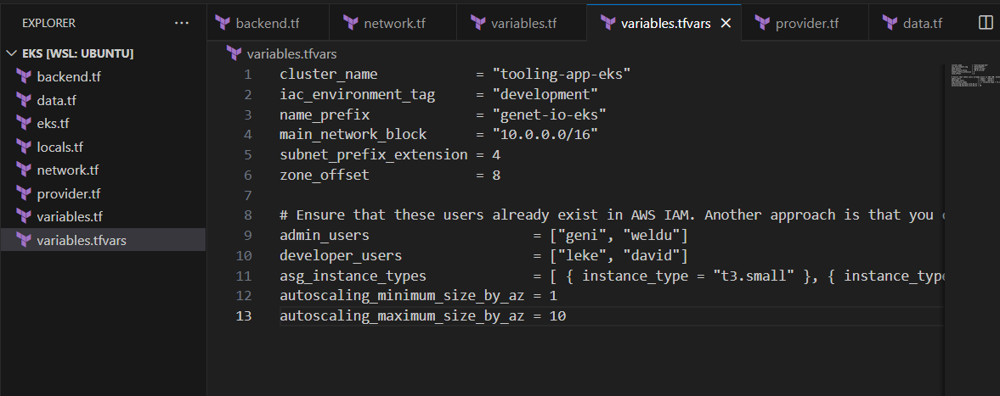

11. Create file – `provider.tf`

```hcl
provider "aws" {
  region = "us-east-1"
}

provider "random" {
}
```
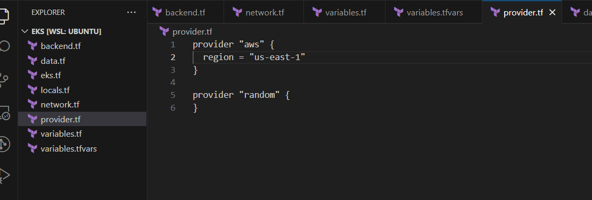

12. Run `terraform init`

```hcl
terraform init
```
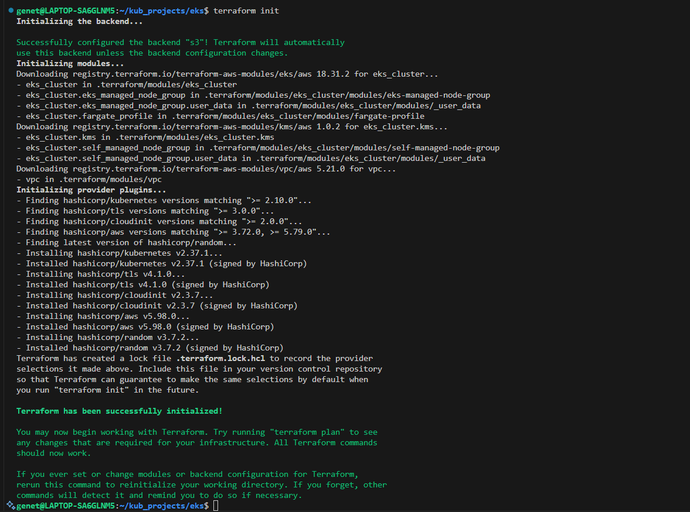

13. Run `Terraform plan` – Your plan should have an output

```
Plan: 41 to add, 0 to change, 0 to destroy.
```
```hcl
terraform plan
```
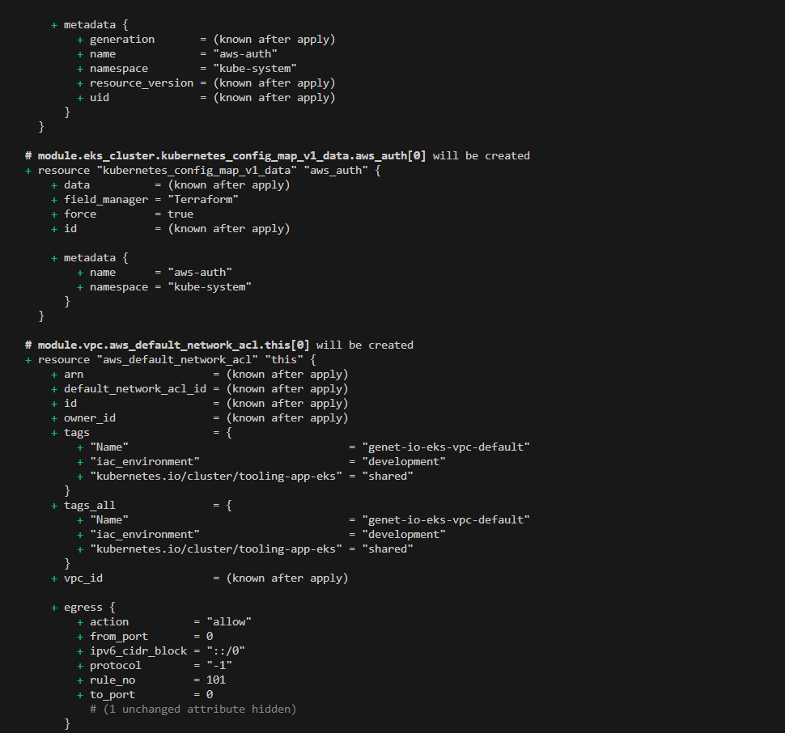
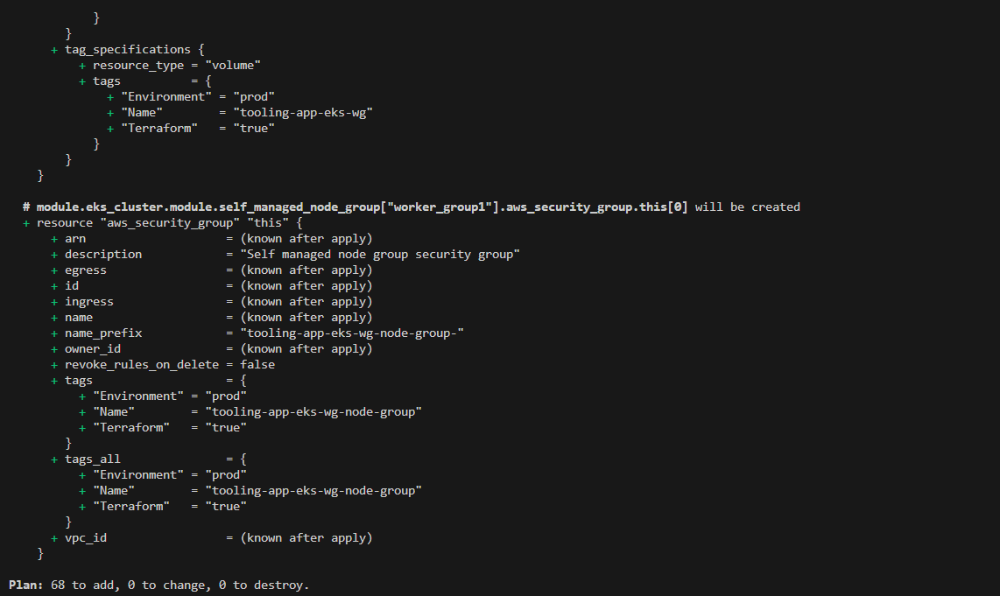


14. Run `Terraform apply`

```hcl
terraform apply
```

This will begin to create cloud resources, and fail at some point with the error

```
╷
│ Error: Post "http://localhost/api/v1/namespaces/kube-system/configmaps": dial tcp [::1]:80: connect: connection refused
│
│   with module.eks-cluster.kubernetes_config_map.aws_auth[0],
│   on .terraform/modules/eks-cluster/aws_auth.tf line 63, in resource "kubernetes_config_map" "aws_auth":
│   63: resource "kubernetes_config_map" "aws_auth" {
```
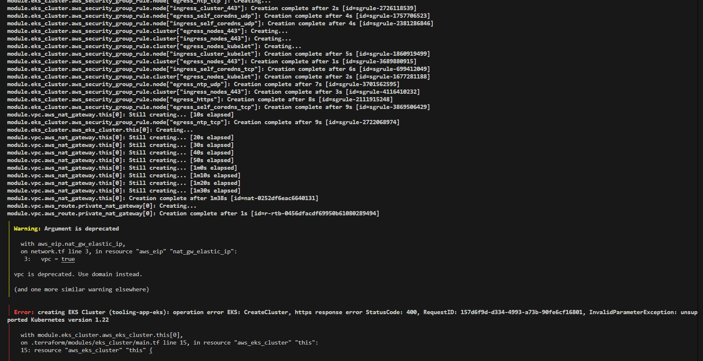

That is because for us to connect to the cluster using the __kubeconfig__, Terraform needs to be able to connect and set the credentials correctly.

Let fix the problem in the next section.

### FIXING THE ERROR

To fix this problem

- Append to the file `data.tf`

```hcl
# get EKS cluster info to configure Kubernetes and Helm providers
data "aws_eks_cluster" "cluster" {
  name = module.eks_cluster.cluster_id
}
data "aws_eks_cluster_auth" "cluster" {
  name = module.eks_cluster.cluster_id
}
```
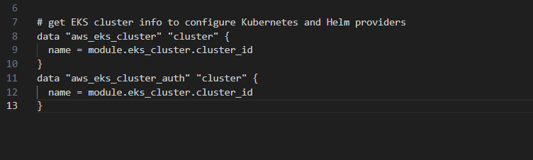

- Append to the file `provider.tf`

```hcl
# get EKS authentication for being able to manage k8s objects from terraform
provider "kubernetes" {
  host                   = data.aws_eks_cluster.cluster.endpoint
  cluster_ca_certificate = base64decode(data.aws_eks_cluster.cluster.certificate_authority.0.data)
  token                  = data.aws_eks_cluster_auth.cluster.token
}
```
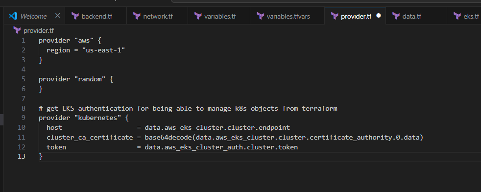

- Run the `init` and plan `again` – This time you will see

```hcl
# module.eks-cluster.kubernetes_config_map.aws_auth[0] will be created
  + resource "kubernetes_config_map" "aws_auth" {
      + data = {
          + "mapAccounts" = jsonencode([])
          + "mapRoles"    = <<-EOT
                - "groups":
                  - "system:bootstrappers"
                  - "system:nodes"
                  "rolearn": "arn:aws:iam::696742900004:role/tooling-app-eks20210718113602300300000009"
                  "username": "system:node:{{EC2PrivateDNSName}}"
            EOT
          + "mapUsers"    = <<-EOT
                - "groups":
                  - "system:masters"
                  "userarn": "arn:aws:iam::696742900004:user/dare"
                  "username": "dare"
                - "groups":
                  - "system:masters"
                  "userarn": "arn:aws:iam::696742900004:user/solomon"
                  "username": "solomon"
                - "groups":
                  - "darey-io-eks-developers"
                  "userarn": "arn:aws:iam::696742900004:user/leke"
                  "username": "leke"
                - "groups":
                  - "darey-io-eks-developers"
                  "userarn": "arn:aws:iam::696742900004:user/david"
                  "username": "david"
            EOT
        }
      + id   = (known after apply)

      + metadata {
          + generation       = (known after apply)
          + labels           = {
              + "app.kubernetes.io/managed-by" = "Terraform"
              + "terraform.io/module"          = "terraform-aws-modules.eks.aws"
            }
          + name             = "aws-auth"
          + namespace        = "kube-system"
          + resource_version = (known after apply)
          + uid              = (known after apply)
        }
    }

Plan: 1 to add, 0 to change, 0 to destroy.
```
```bash
terraform init
terraform plan
```
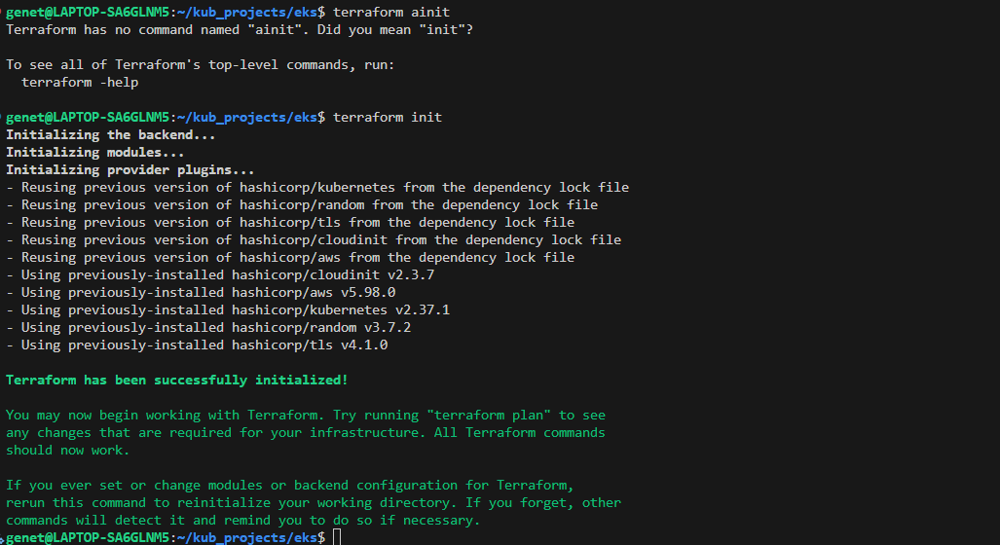

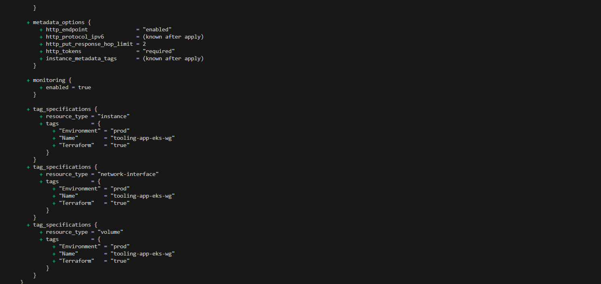
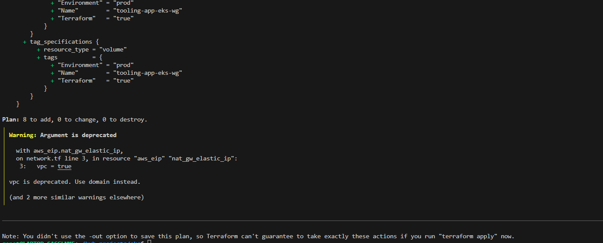

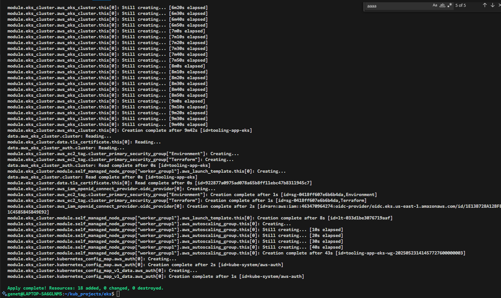

15. Create `kubeconfig` file using __awscli__.

```bash
aws eks update-kubeconfig --name tooling-app-eks --region us-east-1 --kubeconfig kubeconfig
```


## DEPLOY APPLICATIONS WITH HELM

In Project 22, you experienced the use of manifest files to define and deploy resources like pods, deployments, and services into Kubernetes cluster. Here, you will do the same thing except that it will not be passed through kubectl. In the real world, Helm is the most popular tool used to deploy resources into kubernetes. That is because it has a rich set of features that allows deployments to be packaged as a unit. Rather than have multiple YAML files managed individually – which can quickly become messy.

A __Helm__ chart is a definition of the resources that are required to run an application in Kubernetes. Instead of having to think about all of the various __deployments/services/volumes/configmaps/__

```bash
helm install stable/mysql
```
and __Helm__ will make sure all the required resources are installed. In addition you will be able to tweak helm configuration by setting a single variable to a particular value and more or less resources will be deployed. For example, enabling slave for MySQL so that it can have read only replicas.

Behind the scenes, a helm chart is essentially a bunch of YAML manifests that define all the resources required by the application. Helm takes care of creating the resources in Kubernetes (where they don’t exist) and removing old resources.

## Lets begin to gradually walk through how to use Helm

(Credit – https://andrewlock.net/series/deploying-asp-net-core-applications-to-kubernetes/)

1. Parameterising YAML manifests using Helm templates

Let’s consider that our Tooling app have been Dockerised into an image called `tooling-app`, and that you wish to deploy with Kubernetes. Without `helm`, you would create the YAML manifests defining the deployment, service, and ingress, and apply them to your Kubernetes cluster using `kubectl apply`. Initially, your application is version 1, and so the Docker image is tagged as `tooling-app:1.0.0`. A simple deployment manifest might look something like the following:

```yaml
apiVersion: apps/v1
kind: Deployment
metadata:
  name: tooling-app-deployment
  labels:
    app: tooling-app
spec:
  replicas: 3
  strategy:
    type: RollingUpdate
    rollingUpdate:
      maxUnavailable: 1
  selector:
    matchLabels:
      app: tooling-app
  template:
    metadata:
      labels:
        app: tooling-app
    spec:
      containers:
      - name: tooling-app
        image: "tooling-app:1.0.0"
        ports:
        - containerPort: 80
```

Now lets imagine you produce another version of your app, version 1.1.0. How do you deploy that? Assuming nothing needs to be changed with the service or ingress, it may be as simple as copying the deployment manifest and replacing the image defined in the spec section. You would then re-apply this manifest to the cluster, and the deployment would be updated, performing a rolling-update as I described in my first post.

The main problem with this is that all of the values specific to your application – the labels and the image names etc – are mixed up with the "__mechanical__" definition of the manifest.

__Helm__ tackles this by splitting the configuration of a chart out from its basic definition. For example, instead of baking the name of your app or the specific container image into the manifest, you can provide those when you install the chart into the cluster.

For example, a simple templated version of the previous deployment might look like the following:

```yaml
apiVersion: apps/v1
kind: Deployment
metadata:
  name: {{ .Release.Name }}-deployment
  labels:
    app: "{{ template "name" . }}"
spec:
  replicas: 3
  strategy:
    type: RollingUpdate
    rollingUpdate:
      maxUnavailable: 1
  selector:
    matchLabels:
      app: "{{ template "name" . }}"
  template:
    metadata:
      labels:
        app: "{{ template "name" . }}"
    spec:
      containers:
      - name: "{{ template "name" . }}"
        image: "{{ .Values.image.name }}:{{ .Values.image.tag }}"
        ports:
        - containerPort: 80
```
This example demonstrates a number of features of Helm templates:

The template is based on YAML, with {{ }} mustache syntax defining dynamic sections.
Helm provides various variables that are populated at install time. For example, the {{.Release.Name}} allows you to change the name of the resource at runtime by using the release name. Installing a Helm chart creates a release (this is a Helm concept rather than a Kubernetes concept).
You can define helper methods in external files. The {{template "name"}} call gets a safe name for the app, given the name of the Helm chart (but which can be overridden). By using helper functions, you can reduce the duplication of static values (like tooling-app), and hopefully reduce the risk of typos.

You can manually provide configuration at runtime. The {{.Values.image.name}} value for example is taken from a set of default values, or from values provided when you call helm install. There are many different ways to provide the configuration values needed to install a chart using Helm. Typically, you would use two approaches:

A values.yaml file that is part of the chart itself. This typically provides default values for the configuration, as well as serving as documentation for the various configuration values.

When providing configuration on the command line, you can either supply a file of configuration values using the `-f` flag. We will see a lot more on this later on.

## Now lets setup Helm and begin to use it.

According to the official documentation [here](https://helm.sh/docs/intro/install/), there are different options to installing Helm. But we will build the source code to create the binary.

1. [Download the tar.gz file from the project’s Github release page](https://github.com/helm/helm/releases). Or simply use wget to download version 3.6.3 directly

```bash
wget https://github.com/helm/helm/archive/refs/tags/v3.6.3.tar.gz
```

2. Unpack the `tar.gz` file

```bash
tar -zxvf v3.6.3.tar.gz
```

3. cd into the unpacked directory

```bash
cd helm-3.6.3
```

4. Build the source code using `make` utility

```bash
make build
```
If you do not have `make` installed or for any other reason, you cannot install the tool, simply use the official documentation [here](https://helm.sh/docs/intro/install/) for other options.

5. Helm binary will be in the `bin` folder. Simply move it to the `bin` directory on your system. You can check other tools to know where that is. fOr example, check where pwd the utility is being called from by running `which pwd`. Assuming the output is __/usr/local/bin__. You can move the `helm` binary there.

```bash
sudo mv bin/helm /usr/local/bin/
```

6. Check that Helm is installed

```bash
helm version
```
```
version.BuildInfo{Version:"v3.6+unreleased", GitCommit:"13f07e8adbc57b0e3f96b42340d6f44bdc8d5016", GitTreeState:"dirty", GoVersion:"go1.15.5"}
```


## DEPLOY JENKINS WITH HELM

Before we begin to develop our own helm charts, lets make use of publicly available charts to deploy all the tools that we need.

One of the amazing things about helm is the fact that you can deploy applications that are already packaged from a public helm repository directly with very minimal configuration. An example is __Jenkins__.

1. Visit [Artifact Hub](https://artifacthub.io/packages/search) to find packaged applications as Helm Charts
2. Search for Jenkins

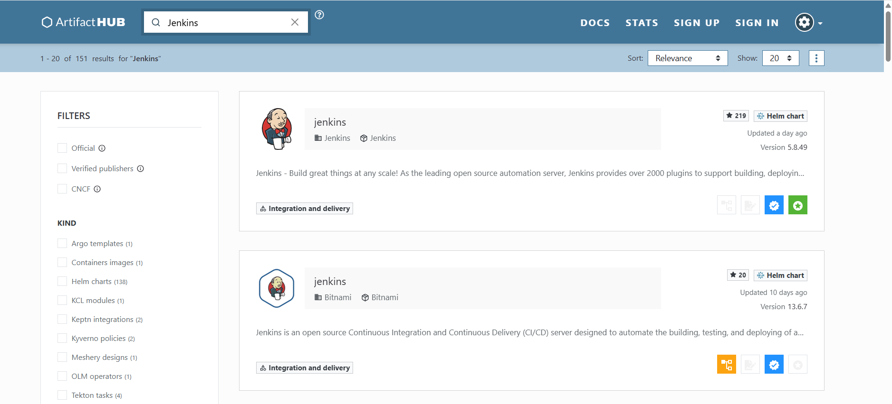

3. Add the repository to helm so that you can easily download and deploy

```bash
helm repo add jenkins https://charts.jenkins.io
```

4. Update helm repo

```bash
helm repo update
```
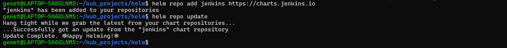

```bash
aws eks update-kubeconfig --name tooling-app-eks --region us-east-1 --kubeconfig ./kubeconfig
```
5. Install the chart

```bash
helm install [RELEASE_NAME] jenkins/jenkins --kubeconfig [kubeconfig file]

helm install jenkins-server jenkins/jenkins --kubeconfig kubeconfig
```
You should see an output like this

```
NAME: jenkins
LAST DEPLOYED: Sun Aug  1 12:38:53 2021
NAMESPACE: default
STATUS: deployed
REVISION: 1
NOTES:
1. Get your 'admin' user password by running:
  kubectl exec --namespace default -it svc/jenkins -c jenkins -- /bin/cat /run/secrets/chart-admin-password && echo
2. Get the Jenkins URL to visit by running these commands in the same shell:
  echo http://127.0.0.1:8080
  kubectl --namespace default port-forward svc/jenkins 8080:8080

3. Login with the password from step 1 and the username: admin
4. Configure security realm and authorization strategy
5. Use Jenkins Configuration as Code by specifying configScripts in your values.yaml file, see documentation: http:///configuration-as-code and examples: https://github.com/jenkinsci/configuration-as-code-plugin/tree/master/demos

For more information on running Jenkins on Kubernetes, visit:
https://cloud.google.com/solutions/jenkins-on-container-engine

For more information about Jenkins Configuration as Code, visit:
https://jenkins.io/projects/jcasc/

NOTE: Consider using a custom image with pre-installed plugins
```
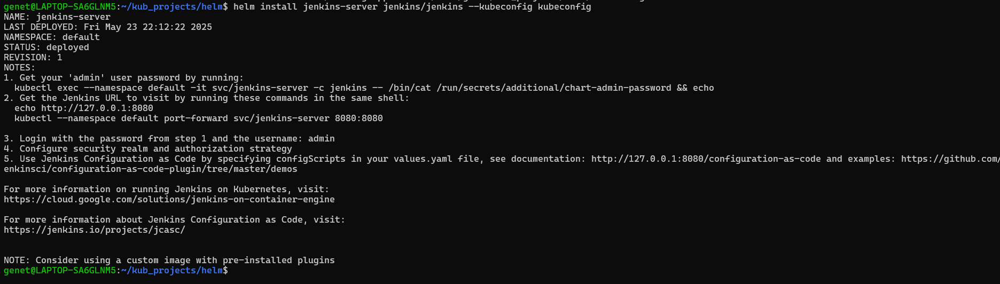

6. Check the __Helm deployment__

```bash
helm ls --kubeconfig kubeconfig
```
Output:
```
NAME    NAMESPACE       REVISION        UPDATED                                 STATUS          CHART           APP VERSION
jenkins default         1               2021-08-01 12:38:53.429471 +0100 BST    deployed        jenkins-3.5.9   2.289.3
```
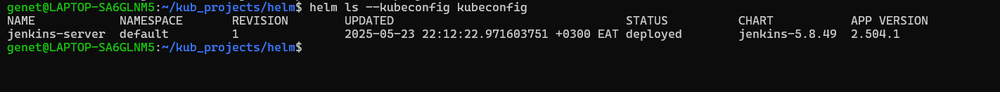

7. Check the pods

```bash
kubectl get pods --kubeconfig kubeconfig
```
Output:
```
NAME        READY   STATUS    RESTARTS   AGE
jenkins-0   2/2     Running   0          6m14s
```
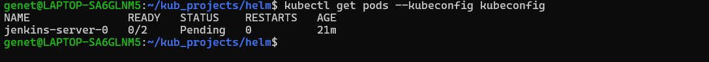

```bash
kubectl describe pods -- kubeconfig
```
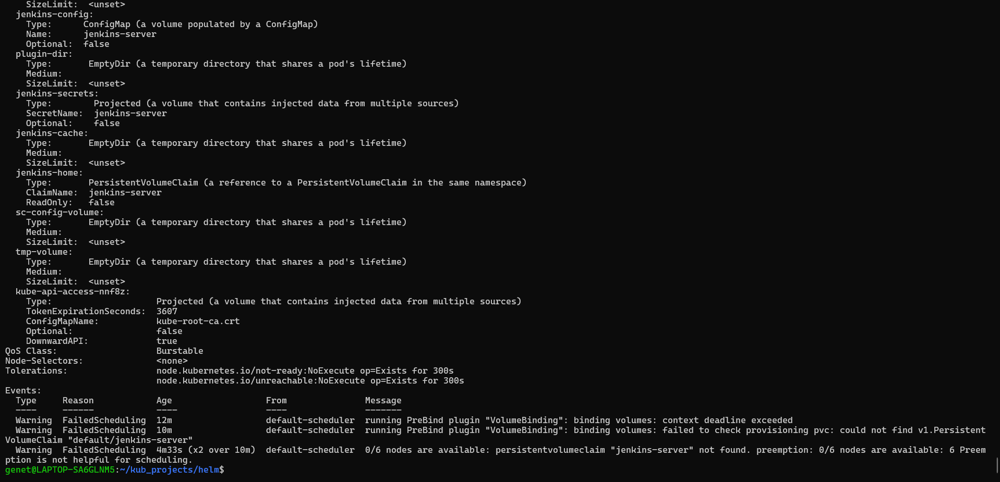

```bash
kubectl describe pvc -- kubeconfig
```
The Event section shows that Kubernetes is waiting for the external provisioner to create the volume, but it’s not happening. This typically means that there might be an issue with the EBS CSI (Container Storage Interface) driver or the AWS EBS service itself.

__Troubleshooting__

Get the cluster's OIDC provider URL

```bash
 aws eks describe-cluster --name tooling-app-eks --region us-east-1 --query "cluster.identity.oidc.issuer" --output text
 ```
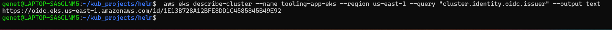

Create IAM role, granting the __AssumeRoleWithWebIdentity__ action.

Copy the following contents to a file that's named `aws-ebs-csi-driver-trust-policy.json` Replace 111122223333 with your account ID. Replace EXAMPLED539D4633E53DE1B71EXAMPLE and region-code with the values returned in the oidc url.

```json
{
  "Version": "2012-10-17",
  "Statement": [
    {
      "Effect": "Allow",
      "Principal": {
        "Federated": "arn:aws:iam::111122223333:oidc-provider/oidc.eks.region-code.amazonaws.com/id/EXAMPLED539D4633E53DE1B71EXAMPLE"
      },
      "Action": "sts:AssumeRoleWithWebIdentity",
      "Condition": {
        "StringEquals": {
          "oidc.eks.region-code.amazonaws.com/id/EXAMPLED539D4633E53DE1B71EXAMPLE:aud": "sts.amazonaws.com",
          "oidc.eks.region-code.amazonaws.com/id/EXAMPLED539D4633E53DE1B71EXAMPLE:sub": "system:serviceaccount:kube-system:ebs-csi-controller-sa"
        }
      }
    }
  ]
}
```
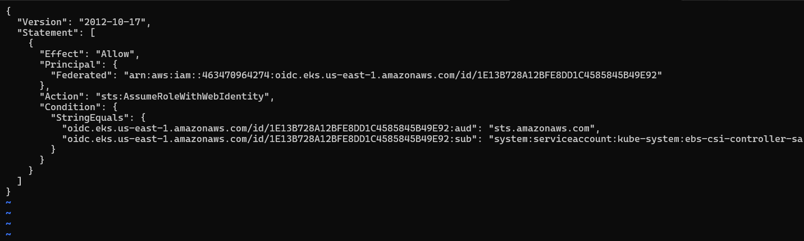

Create the role, name it __AmazonEKS_EBS_CSI_DriverRole__

```bash
aws iam create-role \
--role-name AmazonEKS_EBS_CSI_DriverRole \
--assume-role-policy-document file://"aws-ebs-csi-driver-trust-policy.json"
```

Attach a policy - __AmazonEBSCSIDriverPolicy__

```bash
aws iam attach-role-policy \
      --policy-arn arn:aws:iam::aws:policy/service-role/AmazonEBSCSIDriverPolicy \
      --role-name AmazonEKS_EBS_CSI_DriverRole
```
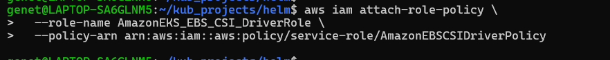

Install Amazon EBS CSI driver through the Amazon EKS add-on to improve security and reduce amount of work. (Using the `eksctl`)

```bash
eksctl create addon --name aws-ebs-csi-driver --cluster tooling-app-eks --region us-east-1
```


```bash
eksctl utils migrate-to-pod-identity --cluster tooling-app-eks --region us-east-1 --approve
```
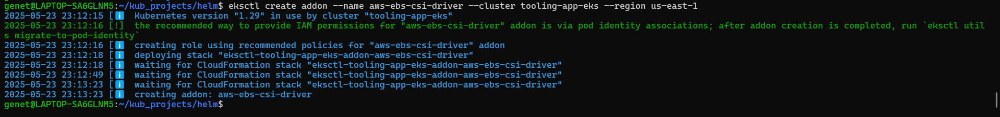

__Check the pods__

```bash
kubectl get pods --kubeconfig kubeconfig
```
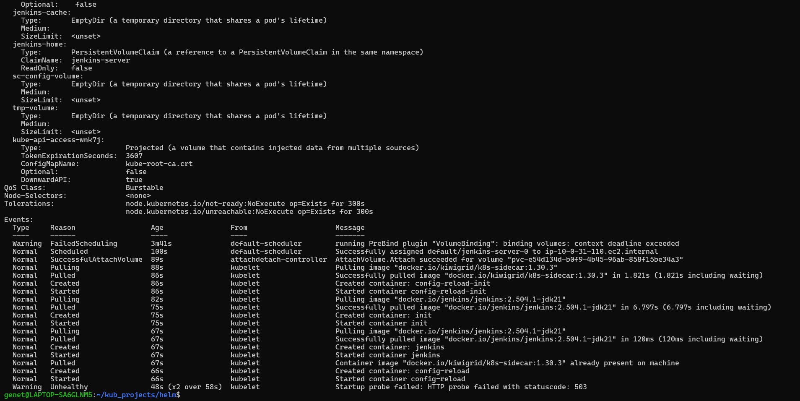

8. Describe the running pod (review the output and try to understand what you see)

```bash
kubectl describe pod jenkins-server-0 --kubeconfig kubeconfig
```
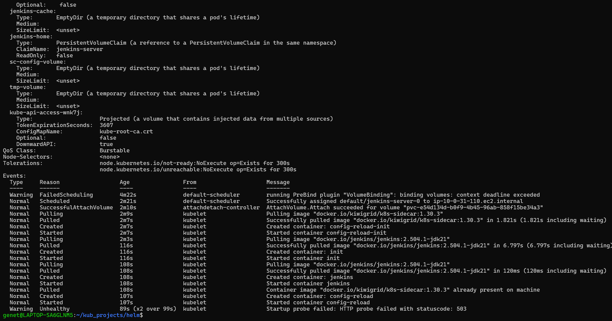

9. Check the logs of the running pod

```bash
kubectl logs jenkins-server-0 --kubeconfig kubeconfig
```
You will notice an output with an error.

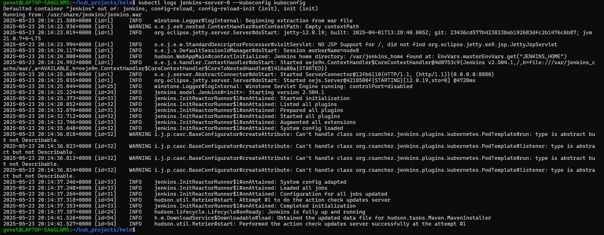

This is because the pod has a `Sidecar container` alongside with the Jenkins container. As you can see fromt the error output, there is a list of containers inside the pod `[jenkins config-reload] i.e jenkins and config-reload containers`. The job of the config-reload is mainly to help Jenkins to reload its configuration without recreating the pod.

Therefore we need to let `kubectl` know, which pod we are interested to see its log. Hence, the command will be updated like:

```bash
kubectl logs jenkins-server-0 -c jenkins --kubeconfig kubeconfig
```

Now lets avoid calling the [kubeconfig file] everytime. Kubectl expects to find the default kubeconfig file in the location `~/.kube/config`. But what if you already have another cluster using that same file? It doesn’t make sense to overwrite it. What you will do is to merge all the __kubeconfig__ files together using a __kubectl plugin__ called [konfig](https://github.com/corneliusweig/konfig) and select whichever one you need to be active.

1. Install a package manager for kubectl called [krew](https://krew.sigs.k8s.io/docs/user-guide/setup/install/) so that it will enable you to install plugins to extend the functionality of kubectl. Read more about it [Here](https://github.com/kubernetes-sigs/krew).

- Run this command to download and install krew:

```bash
(
  set -x; cd "$(mktemp -d)" &&
  OS="$(uname | tr '[:upper:]' '[:lower:]')" &&
  ARCH="$(uname -m | sed -e 's/x86_64/amd64/' -e 's/\(arm\)\(64\)\?.*/\1\2/' -e 's/aarch64$/arm64/')" &&
  KREW="krew-${OS}_${ARCH}" &&
  curl -fsSLO "https://github.com/kubernetes-sigs/krew/releases/latest/download/${KREW}.tar.gz" &&
  tar zxvf "${KREW}.tar.gz" &&
  ./"${KREW}" install krew
)
```
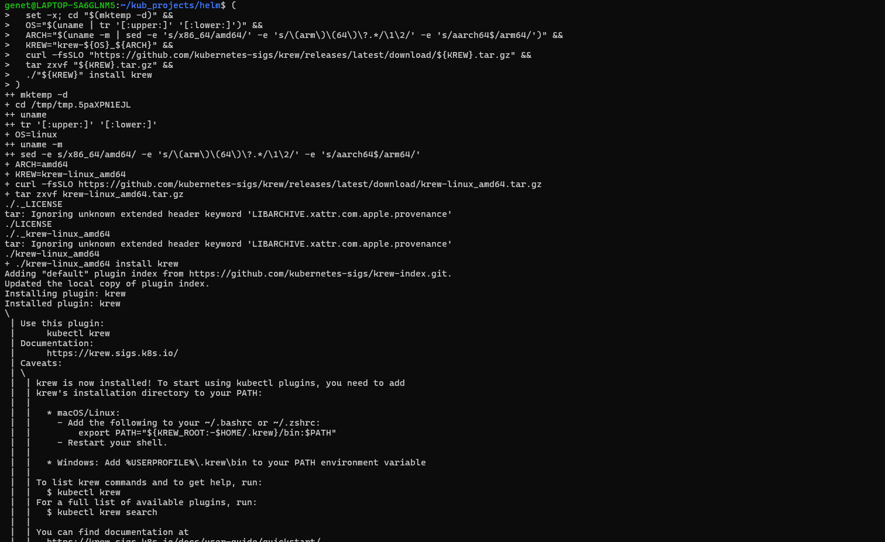

- Add the `$HOME/.krew/bin` directory to your PATH environment variable. To do this, update your `.bashrc` or `.zshrc` file and append the following line and restart your shell.

```bash
export PATH="${KREW_ROOT:-$HOME/.krew}/bin:$PATH"
```

- Run `kubectl krew` to check the installation.

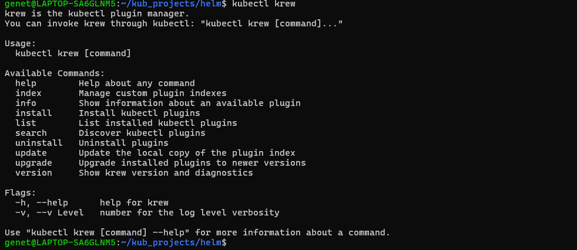

2. Install the [konfig plugin](https://github.com/corneliusweig/konfig)

```bash
kubectl krew install konfig
```

3. Import the kubeconfig into the default kubeconfig file. Ensure to accept the prompt to overide.

```bash
kubectl konfig import --save kubeconfig
```
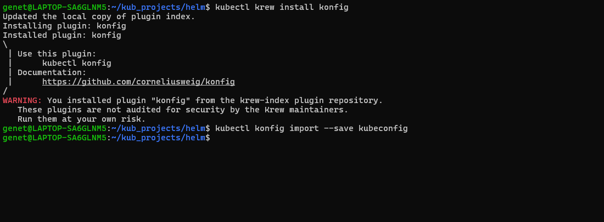

4. Show all the contexts – Meaning all the clusters configured in your kubeconfig. If you have more than 1 Kubernetes clusters configured, you will see them all in the output.

```bash
kubectl config get-contexts
```
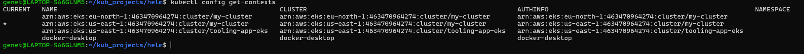

5. Set the current context to use for all kubectl and helm commands

```bash
kubectl config use-context [name of EKS cluster]

kubectl config use-context arn:aws:eks:us-east-1:463470964274:cluster/tooling-app-eks
```
6. Test that it is working without specifying the `--kubeconfig` flag

```bash
kubectl get pods
```
Output:
```
NAME        READY   STATUS    RESTARTS   AGE
jenkins-0   2/2     Running   0          84m
```
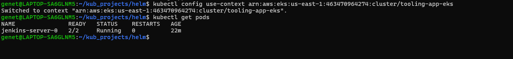

7. Display the current context. This will let you know the context in which you are using to interact with Kubernetes.

```bash
kubectl config current-context
```
Now that we can use kubectl without the --kubeconfig flag, Lets get access to the Jenkins UI. _(In later projects we will further configure Jenkins. For now, it is to set up all the tools we need)_

1. There are some commands that was provided on the screen when Jenkins was installed with Helm. See number 5 above. Get the password to the `admin user`

```bash
kubectl exec --namespace default -it svc/jenkins-server -c jenkins -- /bin/cat /run/secrets/additional/chart-admin-password && echo
```
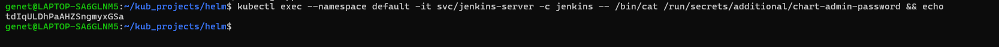

2. Use port forwarding to access Jenkins from the UI

```bash
kubectl --namespace default port-forward svc/jenkins-server 8080:8080
```
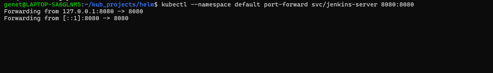

3. Go to the browser __localhost:8080__ and authenticate with the username and password from number 1 above

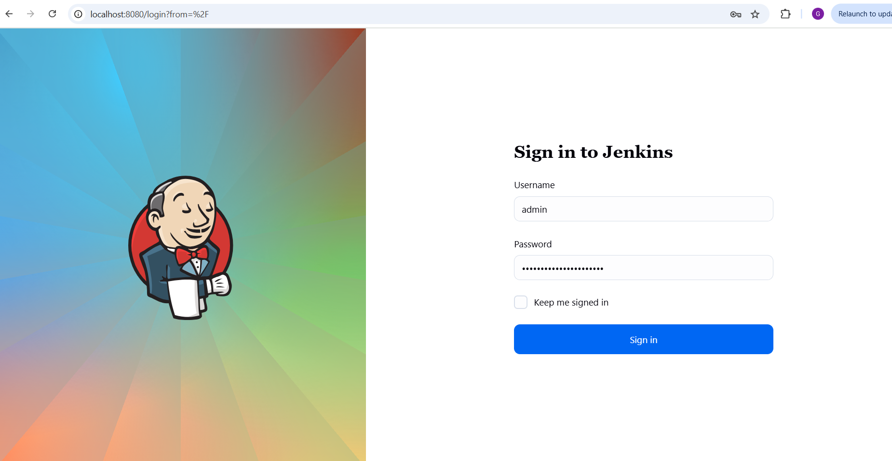

