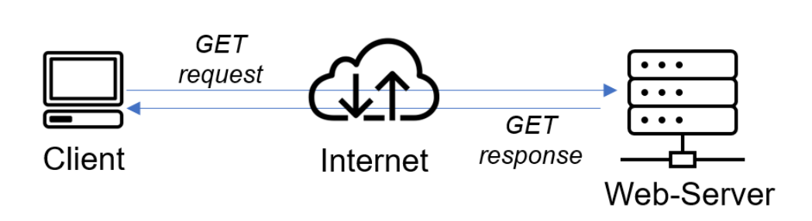
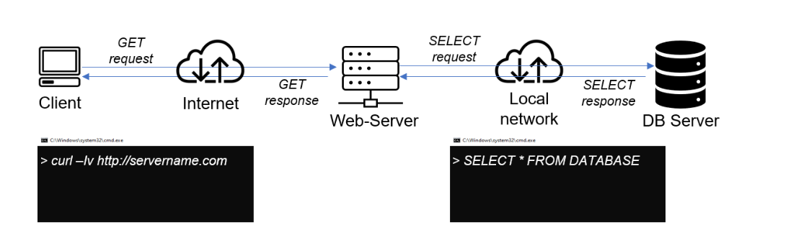

# **Client-Server Architecture with MySQL**

## **Understanding Client-Server Architecture**:
- In a **Client-Server Architecture**, two or more computers (or systems) communicate over a network. One machine acts as a **client** (sending requests), and the other machine acts as a **server** (responding to requests).
- For example, a **client** could be a user's browser, and the **server** could be a web server handling requests such as page views or database queries.

### **Simple Web Client-Server Architecture**:
- A client (e.g., a browser) sends a **GET request** over the internet to a **web server**.
- The web server processes the request and sends a **GET response** back to the client, displaying the requested webpage or data.



## **Extending to a Database Server (DB Server)**:
- In more complex setups, the web server often communicates with a **database server**.
- When the **web server** receives a client request, it may need to retrieve or update data stored in a database. The web server acts as a **client** to the **database server** by sending an SQL query (e.g., `SELECT * FROM DATABASE`).
- The **database server** processes the query and sends back the data as a **response** to the web server, which then sends the final response back to the original client.

### **Web Server and DB Server Architecture**:
- A **client** makes a request to the **web server**.
- The web server sends a **SELECT request** to the **database server** over a **local network**.
- The database server returns the **SELECT response** to the web server, and the web server sends the data to the client.



Now, let’s move on to a practical example of setting up a MySQL Client-Server Architecture using two Linux-based virtual servers.

## **Step 1: Create and Configure Two Linux-Based Virtual Servers**

I began by creating two Linux-based virtual servers (EC2 instances) on AWS:
- **Server A**: I named this the **mysql server**.
- **Server B**: I named this the **mysql client**.


## **Step 2: Install MySQL Server on mysql server**

On **Server A (mysql server)**, I installed the MySQL server software by running:
```bash
sudo apt update
sudo apt install mysql-server
```
Next, I ran the following command to start the MySQL secure installation script and made the appropriate selections based on my security needs. After answering prompts such as removing anonymous users, disallowing remote root login, and removing the test database, MySQL was fully secured:
```bash
sudo mysql_secure_installation
```


At this point, MySQL was successfully installed on **Server A**.

## **Step 3: Install MySQL Client on MySQL Client**

Next, I moved on to **Server B (mysql Client)** and installed the MySQL client software using the following commands:
```bash
sudo apt update
sudo apt install mysql-client
```


Now that the MySQL client was installed, **Server B** was ready to connect to **Server A**.

## **Step 4: Configure Security Groups**

I configured the security groups for **Server A (mysql server)** to allow access to **port 3306** (the default MySQL port) exclusively from **mysql client**'s IP address.

- To ensure security, I only allowed the private IP address of **Server B** to access this port. Here’s what the security group rule looked like:


## **Step 5: Configure MySQL for Remote Connections**

On **Server A (mysql Server)**, I needed to configure MySQL to allow remote connections:

1. I opened the MySQL configuration file and modified the following line to allow connections from any IP address:
```bash
bind-address = 0.0.0.0
```
```bash
sudo vi /etc/mysql/mysql.conf.d/mysqld.cnf
```


2. After saving the file, I restarted the MySQL service to apply the changes:
```bash
sudo systemctl restart mysql
```

## **Step 6: Connect mysql client to the mysql server**

### 1. Create a User and Grant Remote Access

Log in to MySQL:
```bash
sudo mysql -u root
```

Create the user `genet`:
```sql
CREATE USER 'genet'@'%' IDENTIFIED BY 'your_password';
```

Grant privileges:
```sql
GRANT ALL PRIVILEGES ON *.* TO 'genet'@'%' WITH GRANT OPTION;
```

Apply changes:
```sql
FLUSH PRIVILEGES;
```


Exit MySQL:
```bash
exit;
```

### 2. Connect MySQL Client to the mysql server

On **Server B (mysql client)**, I used the MySQL client utility to connect to **Server A** by running the following command:
```bash
mysql -u genet -p -h <mysql_server_ip_address>
```
Example:
```bash
mysql -u genet -p -h 'my_private_ip'
```


After entering the password for the MySQL user, I successfully connected to the MySQL server.

## **Step 7: Verify Connection and Perform SQL Queries**

To verify the connection, I ran an SQL query to list the databases:
```sql
SHOW DATABASES;
```


Seeing the list of databases confirmed that the connection was successful. I could now manage the MySQL server remotely from **Server B** as a MySQL client.

## **Conclusion**

By following these steps, I successfully set up a MySQL **Client-Server Architecture** using two Linux-based virtual servers. The MySQL client on **Server B** was able to securely connect to the MySQL server on **Server A** and perform various database management tasks remotely. This architecture allows for efficient and scalable database management in a networked environment. The process involved setting up the servers, installing the necessary MySQL components, configuring security groups and remote access, and verifying the connection, thus achieving a fully functional MySQL client-server system.

