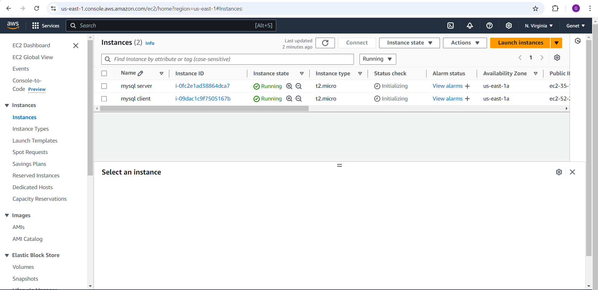
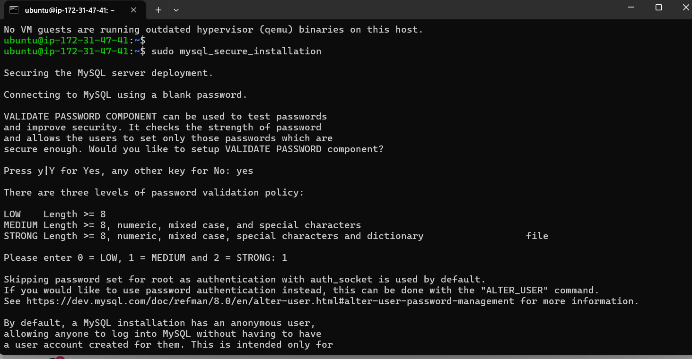
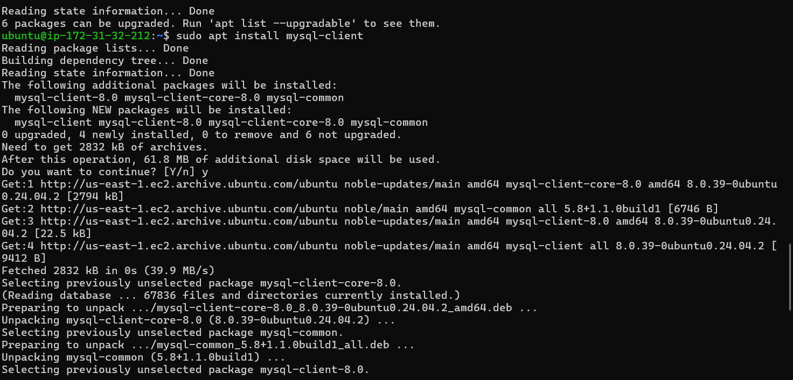
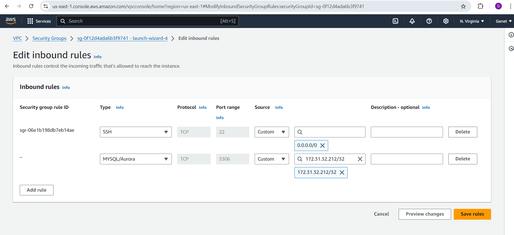
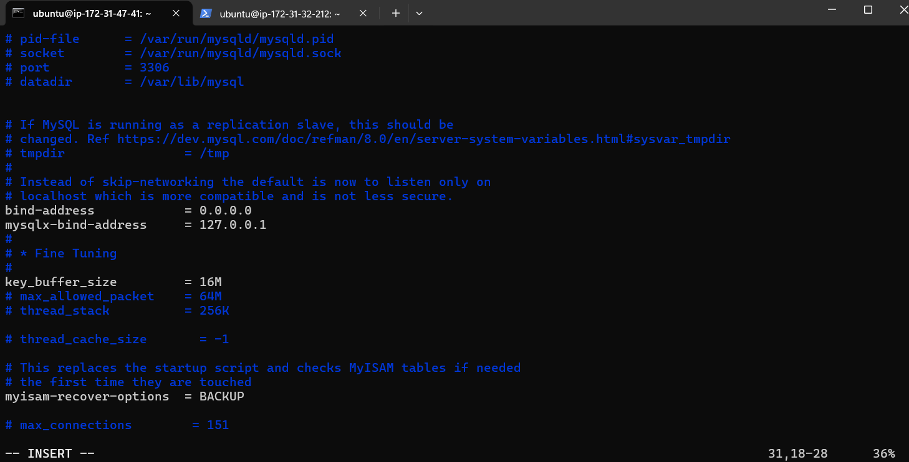
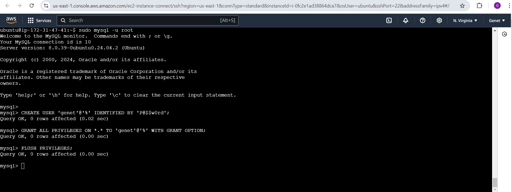
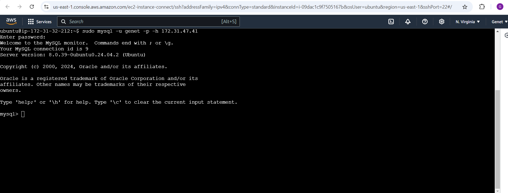
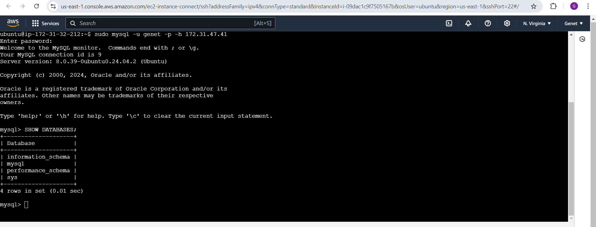

## **Step 1: Create and configure two Linux-based virtual servers**

I started by creating two Linux-based virtual servers (EC2 instances) on AWS:
- **Server A**: I named this the **mysql server**.
- **Server B**: I named this the **mysql client**.




## **Step 2: Install MySQL Server on Server A**

On **Server A (mysql server)**, I installed the MySQL server software by running:
  ```bash
  sudo apt update
  sudo apt install mysql-server
  ```
  I ran the following command to start the MySQL secure installation script and I made the appropriate selections based on my security needs. After answering the remaining prompts (such as removing anonymous users, disallowing remote root login, and removing the test database), MySQL was fully secured.
   ```bash
   sudo mysql_secure_installation
   ```
  
 

  

  At this point, MySQL was successfully installed on **Server A**. 

## **Step 3: Install MySQL Client on Server B**

 Next, I moved on to **Server B (MySQL Client)** and installed the MySQL client software using the following commands:
  ```bash
  sudo apt update
  sudo apt install mysql-client
  ```
  


Now that the MySQL client was installed, **mysql client** was ready to connect to **mysql server**.

### **Step 4: Configure Security Groups**

I configured the security groups for **Server A (MySQL Server)** to allow access to **port 3306** (the default MySQL port) exclusively from **mysql client**'s IP address.

- To ensure security, I only allowed the private IP address of **mysql client** access to this port. Here’s what the security group rule looked like:

  
  

## **Step 5: Configure MySQL for Remote Connections**

On **Server A (MySQL Server)**, I needed to configure MySQL to allow remote connections:

1. I opened the MySQL configuration file:
   To allow connections from any IP address, I modified this line to:
   ```bash
   bind-address = 0.0.0.0
   ```
   ```bash
   sudo vi /etc/mysql/mysql.conf.d/mysqld.cnf
   ```
   

2. After saving the file, I restarted the MySQL service to apply the changes:
   ```bash
   sudo systemctl restart mysql
   ```


## **Step 6: Connect MySQL Client to the MySQL Server**

1.Create User and Grant Remote Access

  Log in to MySQL:
   ```bash
   sudo mysql -u root
   ```

  Create User `genet`:
   ```sql
   CREATE USER 'genet'@'%' IDENTIFIED BY 'your_password';
   ```

  Grant Privileges:
   ```sql
   GRANT ALL PRIVILEGES ON *.* TO 'genet'@'%' WITH GRANT OPTION;
   ```

  Apply Changes:
   ```sql
   FLUSH PRIVILEGES;
   ```
  

  Exit MySQL:
   ```bash
   exit;
  
 2. Connect MySQL Client to the MySQL Server

   On **Server B (MySQL Client)**, I used the MySQL client utility to connect to **mysql server** by running the following command:
   ```bash
   mysql -u genet -p -h <mysql_server_ip_address>
   ```
   Example:
   ```bash
   mysql -u genet -p -h 'myprivate ip'
   ```
   

After entering the password for the MySQL user, I was successfully connected to the MySQL server.

## **Step 7: Verify Connection and Perform SQL Queries**

To verify the connection, I ran an SQL query to list the databases:
  ```sql
  SHOW DATABASES;
  ```
  

Seeing the list of databases confirmed that the connection was successful. I was now able to manage the MySQL server remotely from **Server B**.

At this point, I had successfully completed the setup of a fully functional **MySQL Client-Server architecture**. I could now manage databases, perform SQL queries, create or drop databases, and manipulate data all from **Server B** as a MySQL client.
