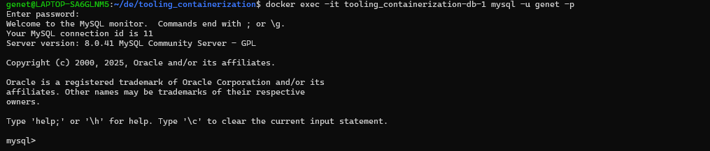

# Self side task
## ✅ Step-by-Step: Deploy Tooling App with Docker Compose and Kubernetes

---

## ✅ Step 1: Build the App and Push to Docker Hub

### 🔹 1.1 Build the image from Docker Compose

```bash
docker compose -f tooling.yml up --build -d
```


```bash
docker exec -it tooling_containerization-db-1 mysql -u genet -p
```


Check the tooling website with a browser on http://localhost:5000


### 🔹 1.2 Tag and push the image

```bash
docker tag tooling_app_frontend <your-dockerhub-username>/tooling-app:latest
docker push <your-dockerhub-username>/tooling-app:latest
```


## ✅ Step 2: Write Kubernetes Pod & Service Manifests

### 🔹 2.1 Create a Pod manifest (`tooling-pod.yaml`)

```bash
cat <<EOF > tooling-pod.yaml
apiVersion: v1
kind: Pod
metadata:
  name: tooling-pod
  labels:
    app: tooling
spec:
  containers:
    - name: tooling-container
      image: genih/tooling-app:latest
      ports:
        - containerPort: 80
EOF
```


### 🔹 2.2 Apply the Pod

```bash
kubectl apply -f tooling-pod.yaml
```

---

### 🔹 2.3 Create a Service manifest (`tooling-service.yaml`)

```bash
cat <<EOF > tooling-service.yaml
apiVersion: v1
kind: Service
metadata:
  name: tooling-service
spec:
  selector:
    app: tooling
  ports:
    - port: 80
      targetPort: 80
EOF
```

### 🔹 2.4 Apply the Service

```bash
kubectl apply -f tooling-service.yaml
```


### 🔹 2.5 MySQL Pod and Service Manifests (with user `mysql-pod.yaml`)

```bash
cat <<EOF > mysql-pod.yaml
apiVersion: v1
kind: Pod
metadata:
  name: mysql-pod
  labels:
    app: mysql-db
spec:
  containers:
    - name: mysql
      image: mysql:8.0
      env:
        - name: MYSQL_ROOT_PASSWORD
          value: password
        - name: MYSQL_DATABASE
          value: toolingdb
        - name: MYSQL_USER
          value: genet
        - name: MYSQL_PASSWORD
          value: Admin1234
      ports:
        - containerPort: 3306
EOF
```


### 🔹 2.6  Create `mysql-service.yaml`:

```bash
cat <<EOF > mysql-service.yaml
apiVersion: v1
kind: Service
metadata:
  name: db
spec:
  selector:
    app: mysql-db
  ports:
    - port: 3306
      targetPort: 3306
EOF
```
### 🔹 2.7 Apply the Pod and Service

```bash
kubectl apply -f mysql-pod.yaml
kubectl apply -f mysql-service.yaml
```


## ✅ Step 3: Port Forwarding to Access the Frontend and Database

```bash
kubectl port-forward pod/tooling-pod 8080:80
```


```bash
kubectl port-forward pod/mysql-pod 3306:3306
```


Then open:

```
http://localhost:8080
```

