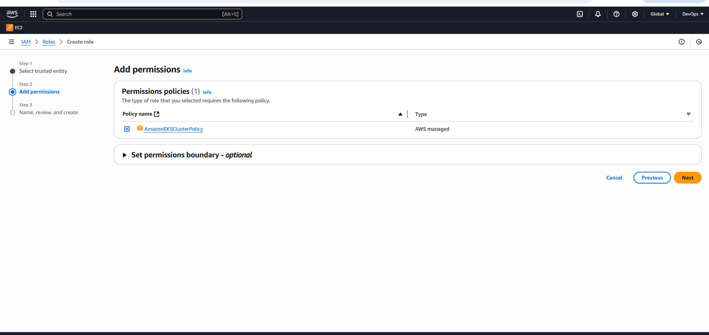
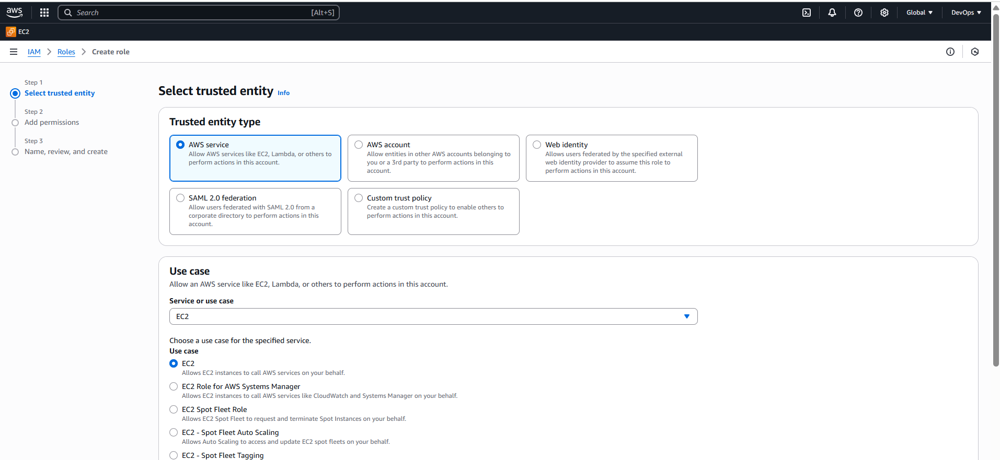

## Create IAM Role for EKS Cluster
**Steps to Create IAM Role for EKS Cluster

### **1. Login to AWS Console**

* Go to [IAM Console](https://console.aws.amazon.com/iam/).
* Select **Roles** from the left panel.
* Click **Create Role**.

### **2. Select Trusted Entity**

* **Select "AWS service".**
* Choose **EKS** as the use case.
* Select **EKS - Cluster**.
* Click **Next**.


### **3. Attach Required Policies**

* Attach the following AWS Managed Policies:

  * `AmazonEKSClusterPolicy`
* Click **Next**.


### **4. Name and Create the Role**

* Role Name: `eks-cluster-role`.
* Review and click **Create Role**.


## **Create IAM Role for EKS Worker Nodes (Node Group)**

### **1. Login to AWS Console**

* Go to [IAM Console](https://console.aws.amazon.com/iam/).
* Select **Roles**.
* Click **Create Role**.

### **2. Select Trusted Entity**

* **Select "AWS service".**
* Choose **EC2** as the use case.
* Click **Next**.


### **3. Attach Required Policies**

Attach these **AWS managed policies**:

* `AmazonEKSWorkerNodePolicy`
* `AmazonEC2ContainerRegistryReadOnly`
* `AmazonEKS_CNI_Policy`

Click **Next**.


### **4. Name and Create the Role**

* Role Name: `eks-nodegroup-role` (or meaningful name).
* Review and click **Create Role**.

## **Create EKS Cluster**

## **1. Login to AWS Console**

* Go to: [EKS Service](https://console.aws.amazon.com/eks/).

## **2. Create the EKS Cluster**

1. Click **"Add cluster" → "Create"**.

2. In **Cluster basics**:

   * **Cluster name**: `my-cluster` .
   * **Kubernetes version**: Select latest stable version .
   * **Cluster Service Role**: Select the IAM role you created (`eks-cluster-role`).


## 🎯 **3. Configure Networking**

1. Select:

   * **VPC**: Choose an existing VPC.
   * **Subnets**: Select **at least 2 subnets** in different AZs.
   * **Security Groups**: Use default or custom one.

2. Keep Cluster Endpoint settings default (public & private access as needed).


## 🎯 **4. Configure Logging (Optional but Recommended)**

* Enable control plane logs if needed.

  * API, Audit, Authenticator, ControllerManager, Scheduler.
* Click **Next**.

## 🎯 **5. Review & Create Cluster**

* Review all settings.
* Click **"Create"**.
* Cluster status will show **CREATING**.
* Wait until status is **ACTIVE** (10-15 min).

## **6. Add a Node Group (Worker Nodes)**

1. After cluster is **ACTIVE**, go to **Compute** → **Add Node Group**.

2. In **Node Group configuration**:

   * Name: `my-nodegroup`.
   * Node IAM Role: Select the IAM Role (`eks-nodegroup-role`).

3. Click **Next**.

4. In **Set compute and scaling configuration**:

   * Instance type: `t3.medium` .
   * Desired Size: 2 (minimum 1, max 3).

5. Configure disk size (default 20 GiB is fine).


6. Click **Next**.

7. Review & Click **Create**.

   * Wait until Node Group is **ACTIVE**.


## **Connect to EKS Cluster **

## **1. Configure AWS CLI**

Run:

```bash
aws configure
```

Provide:

* **AWS Access Key ID**
* **AWS Secret Access Key**
* **Region (e.g., us-east-1)**
* **Output format**: json


## **2. Update kubeconfig for EKS**

Run:

```bash
aws eks --region <your-region> update-kubeconfig --name <your-cluster-name>
```


## **5. Verify Connection**

Check cluster nodes:

```bash
kubectl get nodes
```

Expected output:

```
NAME                                           STATUS   ROLES    AGE     VERSION
ip-192-168-xx-xx.ec2.internal                  Ready    <none>   5m      v1.29.x
```

You’re now connected! 🎉

---

## ✅ **Optional: Test Connection with kubectl**

Try:

```bash
kubectl get svc
kubectl get pods -A
```


