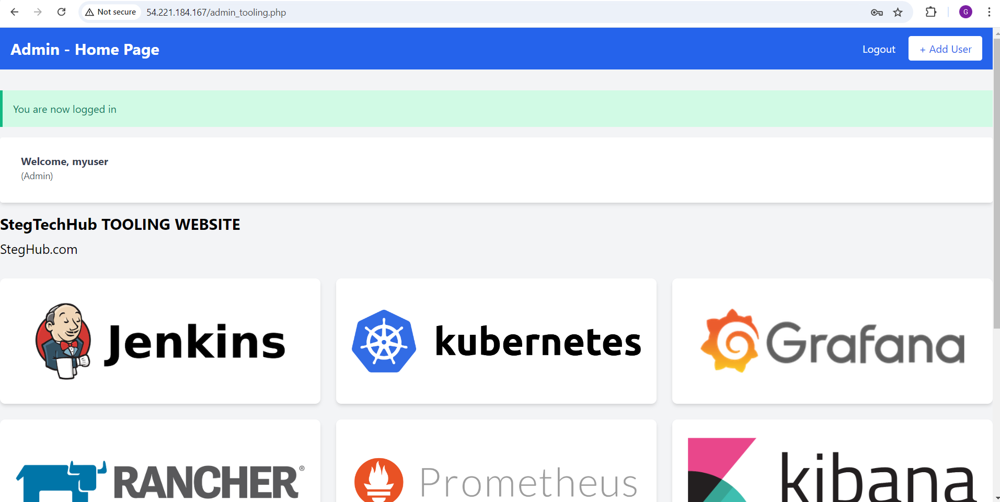

# DevOps Tooling Website Solution

As a member of the DevOps team, my objective is to implement a tooling website solution that provides easy access to various DevOps tools within a corporate infrastructure. This solution focuses on scalability, manageability, and accessibility for multiple teams.

### Key Components of the Solution:

1. **Infrastructure**: AWS, providing reliable and scalable cloud infrastructure.
2. **Web Server**: Red Hat Enterprise Linux 8, offering enterprise-grade stability and performance.
3. **Database Server**: RHEL 9 running MySQL, providing robust database management for the web application.
4. **Storage Server**: Red Hat Enterprise Linux 8 with NFS, enabling shared storage for the web servers to maintain statelessness.
5. **Programming Language**: PHP, a powerful scripting language for web development.
6. **Code Repository**: GitHub, used to manage and deploy the tooling application code.

This project covers the steps of configuring the infrastructure, setting up the database, and managing the web servers to ensure that all components interact seamlessly within the AWS ecosystem.

---

### Step 1: Prepare the NFS Server

1. **I spun up a new EC2 instance** with the RHEL Linux 9 operating system.

2. **I configured LVM on the server**, partitioning and creating logical volumes as follows:

   - **I created physical volumes**:
     - I navigated to **Elastic Block Store (EBS)** > **Volumes** in the AWS Console.
     - I created 3 new volumes, each with 20 GiB of space, ensuring they were in the same availability zone as my EC2 instance.
     - I attached these volumes to the EC2 instance.

     

3. **I inspected the block devices and partitioned the disks**:
   - I connected to the EC2 instance via SSH:
     ```bash
     ssh -i my-key.pem ec2-user@<EC2-IP-Address>
     ```
   - I used `lsblk` to confirm the new EBS volumes were attached:
     ```bash
     lsblk
     ```
     

4. **I partitioned the disks** using `gdisk`:
   ```bash
   sudo gdisk /dev/xvdbb
   sudo gdisk /dev/xvdbc
   sudo gdisk /dev/xvdbd
   ```
   

5. **I created and managed logical volumes**:
   - I installed `lvm2` to manage logical volumes:
     ```bash
     sudo yum install lvm2
     ```
   - I created physical volumes for each partition:
     ```bash
     sudo pvcreate /dev/xvdbb1 /dev/xvdbc1 /dev/xvdbd1
     ```
   - I created a volume group:
     ```bash
     sudo vgcreate webdata-vg /dev/xvdbb1 /dev/xvdbc1 /dev/xvdbd1
     ```
   - I created logical volumes for applications, logs, and optional services:
     ```bash
     sudo lvcreate -L 14G -n lv-apps webdata-vg
     sudo lvcreate -L 14G -n lv-logs webdata-vg
     sudo lvcreate -L 14G -n lv-opt webdata-vg
     ```

6. **I formatted the logical volumes** with `xfs`:
   ```bash
   sudo mkfs.xfs /dev/webdata-vg/lv-apps
   sudo mkfs.xfs /dev/webdata-vg/lv-logs
   sudo mkfs.xfs /dev/webdata-vg/lv-opt
   ```
   

7. **I mounted the logical volumes** to their respective directories:
   ```bash
   sudo mkdir -p /mnt/apps
   sudo mount /dev/webdata-vg/lv-apps /mnt/apps
   sudo mkdir -p /mnt/logs
   sudo mount /dev/webdata-vg/lv-logs /mnt/logs
   sudo mkdir -p /mnt/opt
   sudo mount /dev/webdata-vg/lv-opt /mnt/opt
   ```

8. **I persisted the mount points** by retrieving the UUIDs and updating `/etc/fstab` to ensure the volumes persist after reboot:
   ```bash
   sudo blkid
   sudo vi /etc/fstab
   ```
   - I added the following lines based on the UUIDs:
     ```bash
     UUID=<UUID-lv-apps> /mnt/apps xfs defaults 0 0
     UUID=<UUID-lv-logs> /mnt/logs xfs defaults 0 0
     UUID=<UUID-lv-opt> /mnt/opt xfs defaults 0 0
     ```

9. **I verified the setup** by checking the mounted volumes:
   ```bash
   df -h
   ```
   

---

### Step 2: Install and Configure the NFS Server

1. **I installed and configured the NFS server** to start on boot:
   ```bash
   sudo yum -y update
   sudo yum install nfs-utils -y
   sudo systemctl start nfs-server.service
   sudo systemctl enable nfs-server.service
   sudo systemctl status nfs-server.service
   ```
   

2. **I exported the NFS mounts for web servers**:
   - I located the subnet CIDR of my EC2 instance and used it for NFS configuration.

     

   - I set permissions on the mounted directories:
     ```bash
     sudo chown -R nobody: /mnt/apps /mnt/logs /mnt/opt
     sudo chmod -R 777 /mnt/apps /mnt/logs /mnt/opt
     sudo systemctl restart nfs-server.service
     ```
     

3. **I configured access for NFS clients** by editing `/etc/exports`:
   ```bash
   sudo vi /etc/exports
   ```
   - I added the following lines:
     ```bash
     /mnt/apps <Subnet-CIDR>(rw,sync,no_all_squash,no_root_squash)
     /mnt/logs <Subnet-CIDR>(rw,sync,no_all_squash,no_root_squash)
     /mnt/opt  <Subnet-CIDR>(rw,sync,no_all_squash,no_root_squash)
     ```
     

   - I exported the NFS configuration:
     ```bash
     sudo exportfs -arv
     ```
     

4. **I checked which ports NFS was using**:
   ```bash
   rpcinfo -p | grep nfs
   ```
   

---

### Step 3: Configure the Database Server

1. **I installed the MySQL server** on the EC2 instance running RHEL 9:
   ```bash
   sudo apt update
   sudo apt install mysql-server -y
   sudo systemctl start mysql
   sudo systemctl enable mysql
   ```

2. **I created a database named `tooling`**:
   - I logged into the MySQL shell:
     ```bash
     sudo mysql -u root
     ```
   - Inside the shell, I created the database:
     ```sql
     CREATE DATABASE tooling;
     ```

3. **I created a user named `webaccess`** and granted full permissions to this user on the `tooling` database:
   ```sql
   CREATE USER 'webaccess'@'%' IDENTIFIED BY 'mypass';
   GRANT ALL PRIVILEGES ON tooling.* TO 'webaccess'@'%' WITH GRANT OPTION;
   FLUSH PRIVILEGES;
   ```

4. **I exited the MySQL shell**:
   ```bash
   exit;
   ```
   

---

### Step 4: Prepare the Web Servers

1. **I launched a new EC2 instance** running RHEL 9 for the first web server and connected to it via SSH:
   ```bash
   ssh -i my-key.pem ec2-user@<EC2-IP-Address>
   ```

2. **I installed the NFS client** on the web server:
   ```bash
   sudo yum update -y
   sudo yum install nfs-utils nfs4-acl-tools -y
   ```

3. **I mounted the `/var/www/` directory** to the NFS server:

   **Note 1**: I added the following ports in the security group inbound rules to allow access to the NFS Server:

   - **TCP 111**, **UDP 111**, **TCP 2049**, **UDP 2049**.
   - I ensured that my security groups allow access from the Subnet CIDR.

     

   - I mounted the directory:
     ```bash
     sudo mkdir /var/www
     sudo mount -t nfs -o rw,nosuid <NFS-Server-Private-IP-Address>:/mnt/apps /var/www
     ```
4. **I persisted the mount points** by adding the following line to `/etc/fstab`:
   ```bash
   <NFS-Server-Private-IP-Address>:/mnt/apps /var/www nfs defaults 0 0
   ```
   

5. **I installed Apache and PHP**:
   ```bash
   sudo yum install httpd -y
   sudo systemctl enable httpd
   sudo systemctl start httpd
   sudo dnf install https://dl.fedoraproject.org/pub/epel/epel-release-latest-9.noarch.rpm
   sudo dnf install dnf-utils http://rpms.remirepo.net/enterprise/remi-release-9.rpm
   sudo dnf module reset php
   sudo dnf module enable php:remi-7.4
   sudo dnf install php php-opcache php-gd php-curl php-mysqlnd
   sudo systemctl start php-fpm
   sudo systemctl enable php-fpm
   sudo setsebool -P httpd_execmem 1
   ```

6. **I verified the NFS mount and Apache configuration**:
   - I confirmed that Apache files and directories were available on the web server in `/var/www` and also on the NFS server in `/mnt/apps`.
   - I created a test file:
     ```bash
     sudo touch /var/www/test.txt
     ```
     - I checked that this file appeared on the NFS server and other web servers.
     
     

---

### Step 5: Set Up Additional Web Servers

1. **I repeated Step 4 for two additional web servers**. These servers were set up in the same manner as the initial web server to ensure they also mount the NFS volumes correctly and have Apache and PHP installed.

   

2. **I verified that all web servers were correctly synchronized** with the NFS storage:
   - I created a test file in the `/var/www/` directory on one web server:
     ```bash
     touch /var/www/test.txt
     ```
   - I confirmed that this file appeared on the other two web servers, verifying successful NFS mounts.

---

### Step 6: Deploy the Tooling Application

1. **I forked the Tooling source code** from the provided GitHub repository to my own GitHub account.

2. **I cloned the tooling application** from GitHub to the web servers:
   ```bash
   sudo yum install git -y
   git clone https://github.com/<your-github-username>/tooling /var/www/html
   ```

3. **I set the correct permissions** for the web servers to access the files:
   ```bash
   sudo chown -R apache:apache /var/www/html
   sudo chmod -R 755 /var/www/html
   ```
   

---

### Step 7: Create a New Admin User in MySQL

1. **I logged into MySQL** as the root user:
   ```bash
   mysql -u root -p
   ```

2. **I created a new admin user** with the following SQL commands:
   ```sql
   CREATE USER 'myuser'@'%' IDENTIFIED BY 'password';
   GRANT ALL PRIVILEGES ON *.* TO 'myuser'@'%' WITH GRANT OPTION;
   FLUSH PRIVILEGES;
   ```

3. **I inserted the user information** into the `tooling` database:
   ```sql
   USE tooling;
   INSERT INTO users (id, username, password, email, user_type, status) 
   VALUES (1, 'myuser', '5f4dcc3b5aa765d61d8327deb882cf99', 'user@mail.com', 'admin', '1');
   ```

4. **I exited the MySQL shell**:
   ```bash
   exit;
   ```
   

---

### Step 8: Test and Verify the Application

1. **I ensured port 80 (HTTP) was open** by adding an inbound rule in the AWS Security Group associated with the web server instances.

2. **Note 2**: If you encounter a **403 Forbidden Error**, check the permissions of the `/var/www/html` directory and consider disabling SELinux temporarily to test:
   ```bash
   sudo setenforce 0
   ```

3. **I tested the application** by accessing it in the browser:
   ```
   http://<Public-IP>/login.php
   ```
   

4. **I logged in** using the newly created MySQL admin credentials and confirmed the application was functioning correctly.
   

---

### Conclusion

Through this project, I successfully deployed a scalable and accessible DevOps tooling website solution that integrates critical infrastructure components such as web servers, database servers, and shared storage. Using AWS for infrastructure, NFS for shared storage, MySQL for the database, and Apache with PHP for the web servers, I created a seamless, scalable solution for DevOps teams. After thoroughly testing the setup, I confirmed the tooling application was functional, providing users with easy access to DevOps tools.

