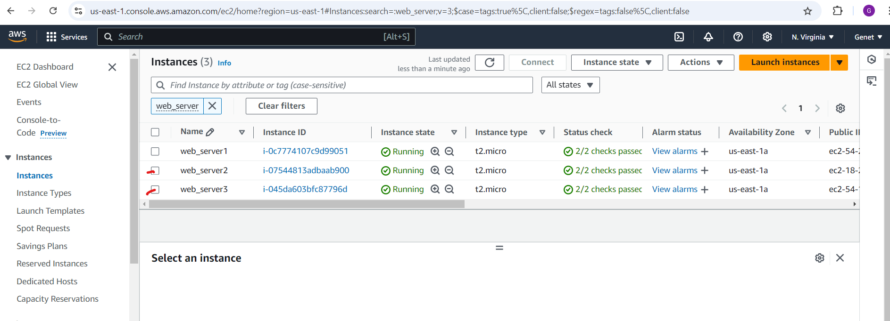

# DevOps Tooling Website Solution

As a member of a DevOps team, your objective is to implement a tooling website solution that provides easy access to various DevOps tools within a corporate infrastructure. This solution is built with a focus on scalability, manageability, and accessibility for multiple teams.

### Key Components of the Solution:

1. **Infrastructure**: AWS, ensuring reliable and scalable cloud infrastructure.
2. **Webserver Linux**: Red Hat Enterprise Linux 8, offering enterprise-grade stability and performance.
3. **Database Server**: Ubuntu 24.04 running MySQL, providing robust database management for the web application.
4. **Storage Server**: Red Hat Enterprise Linux 8 with NFS, enabling shared storage for the web servers to maintain statelessness.
5. **Programming Language**: PHP, a powerful scripting language for web development.
6. **Code Repository**: GitHub, used to manage and deploy the tooling application code.

In this project, you will go through the steps of configuring the infrastructure, setting up the database, and managing the web servers, ensuring that all components interact seamlessly within the AWS ecosystem.

### Step 1 - Prepare NFS Server

1. **I spun up a new EC2 instance** with the RHEL Linux 9 Operating System.

2. **I configured LVM on the server** based on my previous experience. I partitioned and created logical volumes on the server as follows:

   1. **I created Physical Volumes**:
      - I navigated to **Elastic Block Store (EBS)** > **Volumes** in the AWS Console and created 3 new volumes, each with 20 GiB of space, ensuring they were in the same availability zone as my EC2 instance.
        
      - I attached these volumes to the EC2 instance.

      
      

3. **I inspected the block devices and partitioned the disks**:
   - I connected to the EC2 instance via SSH:
     ```bash
     ssh -i my-key.pem ec2-user@54.147.195.203
     ```
   - I used `lsblk` to confirm the new EBS volumes were attached:
     ```bash
     lsblk
     ```
     

4. **I partitioned the disks**:
   - I used `gdisk` to partition each of the disks:
     ```bash
     sudo gdisk /dev/xvdbb
     sudo gdisk /dev/xvdbc
     sudo gdisk /dev/xvdbd
     ```
     

5. **I created and managed logical volumes**:
   - I installed `lvm2` to manage the logical volumes:
     ```bash
     sudo yum install lvm2
     ```
   - I checked for available partitions.
     ```bash
     sudo lvmdiskscan
     ```
   - I created the physical volumes:
     ```bash
     sudo pvcreate /dev/xvdbb1 /dev/xvdbc1 /dev/xvdbd1
     ```
   - I created a volume group:
     ```bash
     sudo vgcreate webdata-vg /dev/xvdbb1 /dev/xvdbc1 /dev/xvdbd1
     ```
     

   - I created logical volumes:
     - For applications:
       ```bash
       sudo lvcreate -L 14G -n lv-apps webdata-vg
       ```
     - For logs:
       ```bash
       sudo lvcreate -L 14G -n lv-logs webdata-vg
       ```
     - For optional services:
       ```bash
       sudo lvcreate -L 14G -n lv-opt  webdata-vg
       ```
     

6. **I formatted the logical volumes with `xfs`**:
   - I formatted the logical volumes to use the `xfs` file system:
     ```bash
     sudo mkfs.xfs /dev/webdata-vg/lv-apps
     sudo mkfs.xfs /dev/webdata-vg/lv-logs
     sudo mkfs.xfs /dev/webdata-vg/lv-opt
     ```
     

7. **I mounted the logical volumes**:
   - I mounted the volumes to their respective directories:
     - For applications:
       ```bash
       sudo mkdir -p /mnt/apps
       sudo mount /dev/webdata-vg/lv-apps /mnt/apps
       ```
     - For logs:
       ```bash
       sudo mkdir -p /mnt/logs
       sudo mount /dev/webdata-vg/lv-logs /mnt/logs
       ```
     - For optional services:
       ```bash
       sudo mkdir -p /mnt/opt
       sudo mount /dev/webdata-vg/lv-opt /mnt/opt
       ```
       

8. **I persisted the mount points**:
   - I retrieved the UUIDs of the logical volumes and updated `/etc/fstab` to ensure they persist after a reboot:
     ```bash
     sudo blkid
     sudo vi /etc/fstab
     ```
   - I added the following lines to `/etc/fstab` based on the UUIDs:
     ```bash
     UUID=<UUID-lv-apps> /mnt/apps xfs defaults 0 0
     UUID=<UUID-lv-logs> /mnt/logs xfs defaults 0 0
     UUID=<UUID-lv-opt> /mnt/opt xfs defaults 0 0
     ```

9. **I verified the setup**:
   - I checked that all volumes were mounted correctly:
     ```bash
     df -h
     ```
     
     
### Logical Volumes Setup

- I ensured there were **3 logical volumes**: `lv-apps`, `lv-logs`, and `lv-opt`.
- I mounted them in the `/mnt/` directory as follows:
  - `apps` on `/mnt/apps` (for web servers)
  - `logs` on `/mnt/logs` (for web server logs)
  - `opt` on `/mnt/opt` (for Jenkins server)

### Install and Configure NFS Server

1. **I installed and configured the NFS server** to start on boot:
   ```bash
   sudo yum -y update
   sudo yum install nfs-utils -y
   sudo systemctl start nfs-server.service
   sudo systemctl enable nfs-server.service
   sudo systemctl status nfs-server.service
   ```
   

2. **I exported the mounts for web servers**:
   - I located the subnet CIDR of my EC2 instance and used it for NFS configuration.

     

3. **I set the necessary permissions** on the mount points:
   ```bash
   sudo chown -R nobody: /mnt/apps
   sudo chown -R nobody: /mnt/logs
   sudo chown -R nobody: /mnt/opt

   sudo chmod -R 777 /mnt/apps
   sudo chmod -R 777 /mnt/logs
   sudo chmod -R 777 /mnt/opt

   sudo systemctl restart nfs-server.service
   ```
   


### Configure Access to NFS Clients

1. **I configured access to NFS clients** by editing `/etc/exports`:
   ```bash
   sudo vi /etc/exports
   ```
   I added the following lines:
   ```bash
   /mnt/apps <Subnet-CIDR>(rw,sync,no_all_squash,no_root_squash)
   /mnt/logs <Subnet-CIDR>(rw,sync,no_all_squash,no_root_squash)
   /mnt/opt  <Subnet-CIDR>(rw,sync,no_all_squash,no_root_squash)
   ```
   

2. **I exported the NFS configuration**:
   ```bash
   sudo exportfs -arv
   ```
   

3. **I checked which ports NFS was using**:
   ```bash
   rpcinfo -p | grep nfs
   ```
   

To implement **Step 2 — Configure the Database Server**, follow these steps:

### Step 2 — Configure the Database Server

    I configured the database on an EC2 instance running the RHEL Linux 9 Operating System. After launching the EC2 instance and connecting via SSH, I proceeded with the following steps to install and configure MySQL:

1. **Install MySQL server**:
   - First, I installed the MySQL server on my database instance:
     ```bash
     sudo yum install mysql-server -y
     sudo systemctl start mysqld
     sudo systemctl enable mysqld
     ```

2. **Create a database named `tooling`**:
   - I connected to MySQL and created the `tooling` database:
     ```bash
     sudo mysql -u root
     ```
     Inside the MySQL shell:
     ```sql
     CREATE DATABASE tooling;
     ```

3. **Create a database user named `webaccess`**:
   - I created a new user:
     ```sql
     CREATE USER 'webaccess'@'%' IDENTIFIED BY 'mypass';
     ```

4. **Grant permissions to the `webaccess` user** on the `tooling` database:
   - I granted the `webaccess` user full permissions on the `tooling` database:
     ```sql
     GRANT ALL PRIVILEGES ON tooling. * TO 'webaccess'@'%' WITH GRANT OPTION;
     FLUSH PRIVILEGES;
     ```

5. **Exit the MySQL shell**:
   ```bash
   exit
   ```
   


It seems you are requesting a detailed step-by-step demonstration with visual guides for **Step 3** of your configuration process. Here's how we can break it down:

### Step 3 — Prepare the Web Servers

#### 1. **Launch a new EC2 instance with RHEL 9 Operating System**

- **Create an EC2 instance** in AWS, selecting RHEL 9 as the operating system.
- **Connect to the instance via SSH** using the key pair associated with the instance.

  ```bash
  ssh -i my-key.pem ec2-user@<EC2-IP-Address>
  ```

#### 2. **Install the NFS client on the Web Servers**

- On the web server, I updated and  installed the required NFS packages to enable NFS client functionality:

  ```bash
  sudo yum update -y
  sudo yum install nfs-utils nfs4-acl-tools -y
  ```

#### 3. **Mount `/var/www/` to the NFS Server**

Note 1: Add the following ports in your security group inbound rules to allow access to NFS Server:
   - TCP 111, UDP 111, TCP 2049, UDP 2049.
   - Ensure that your security groups allow access from the Subnet CIDR.
    

- I mounted the `/var/www/` directory to the NFS server's exported directory for applications:
  ```bash
  sudo mkdir /var/www
  sudo mount -t nfs -o rw,nosuid <NFS-Server-Private-IP-Address>:/mnt/apps /var/www
  ```
  

  This ensures that the web server can access shared files from the NFS server.

#### 4. **Persist the NFS mount points across reboots**

- I edited the `/etc/fstab` file to ensure that the NFS mounts persist after a reboot:

  ```bash
  sudo vi /etc/fstab
  ```

  I added the following line to the file:

  ```bash
  <NFS-Server-Private-IP-Address>:/mnt/apps /var/www nfs defaults 0 0
  ```
  

#### 5. **Install Remi's repository, Apache and PHP**

- I installed Remi;s,Apache and PHP along with its required modules:

  ```bash
  sudo yum install httpd -y
  sudo systemctl enable httpd.service
  sudo systemctl start httpd.service
  sudo dnf install https://dl.fedoraproject.org/pub/epel/epel-release-latest-8.noarch.rpm
  sudo dnf install dnf-utils http://rpms.remirepo.net/enterprise/remi-release-8.rpm
  sudo dnf module reset php
  sudo dnf module enable php:remi-7.4
  sudo dnf install php php-opcache php-gd php-curl php-mysqlnd
  sudo systemctl start php-fpm
  sudo systemctl enable php-fpm
  sudo setsebool -P httpd_execmem 1
  ```

#### 6. **Verify NFS Mount and Apache Configuration**

- I verified that Apache files and directories were available on the Web Server in /var/www and also on the NFS server in /mnt/apps. If the same files appeared in both locations, it confirmed that NFS was mounted correctly. To further check, I created a new file using the command touch test.txt from one server and verified that the same file was accessible from other Web Servers.

  
  

- I ensured that the Apache web server could serve files from the mounted `/var/www/` directory.

#### **I repeated the steps 1-6 above for two additional web servers.**

     

Here’s the updated version in the first person, reflecting "I":

---

#### 7. I located the log folder for Apache on my Web Server and mounted it to the NFS server’s export for logs. Then, I repeated step #4 to ensure that the mount point persists after a reboot.**

- I identified the Apache log folder, which is typically found at `/var/log/httpd/` or `/var/log/apache2/`. I then mounted it to the NFS server’s export for logs:

  ```bash
  sudo mkdir -p  /var/log/httpd
  sudo mount -t nfs -o rw,nosuid <NFS-Server-Private-IP-Address>:/mnt/logs /var/log/httpd
  ```

  This allows my web server’s logs to be stored on the shared NFS server, ensuring centralized log management.

#### I persisted the NFS Mount Point Across Reboots

- I edited the `/etc/fstab` file to make sure the NFS mount persists after reboots:

  ```bash
  sudo vi /etc/fstab
  ```

- I added the following line to the file to ensure that the log mount persists:

  ```bash
  <NFS-Server-Private-IP-Address>:/mnt/logs /var/log/httpd nfs defaults 0 0
  ```
  

This ensures that my Apache logs are stored on the shared NFS server and the mount persists after reboots.

#### 8. **Deploy the Tooling Application**

- I forked the Tooling source code from the provided GitHub repository to my own GitHub account.
  
- I cloned the Tooling application to the web server's `/var/www/html` directory:
  ```bash
  sudo yum install git
  ```
  ```bash
  git clone https://github.com/<your-github-username>/tooling /var/www/html
  ```

  ```bash
  sudo cp -R html/. /var/www/html/
  ```
  

#### 9. **Set Permissions**

- I made sure that the Apache user (`www-data`) has the appropriate permissions to the `/var/www/html` directory:

  ```bash
  sudo chown -R apache:apache /var/www/html
  sudo chmod -R 755 /var/www/html
  ```
The step in the image suggests creating a new MySQL admin user with specific credentials. To clarify and guide through this process, here’s the explanation and command:

### 11. **Create a New Admin User in MySQL**

To create a new MySQL admin user with the username **myuser** and password **password**, follow these steps:

  **Login to MySQL**: First, login to the MySQL server as the root user or an admin with sufficient privileges:
   ```bash
   
   mysql -u root -p

   ```

 **Create a New Admin User**:
   Run the following SQL command inside the MySQL shell to create a new user:
   ```sql
   CREATE USER 'myuser'@'%' IDENTIFIED BY 'password';
   ```

 **Grant Administrative Privileges**: 
   Next, grant the user administrative privileges across all databases:
   ```sql
   GRANT ALL PRIVILEGES ON *.* TO 'myuser'@'%' WITH GRANT OPTION;
   ```

 **Save the Changes**:
   Finally, make sure to flush the privileges so the changes take effect:
   ```sql
   FLUSH PRIVILEGES;
   ```

5. **Exit the MySQL Shell**:
   ```bash
   exit;
   ```
   
   
This will create a new MySQL admin user with full privileges to manage the database and execute administrative tasks.

#### 10. **Test the Web Server**

- I accessed the web server by visiting the following URL in a browser:

  ```
  http://54.221.184.167/index.php
  ```

  If the application was successfully deployed, I should see the Tooling application's homepage.

#### 10. **Open Port 80 for HTTP Traffic**

- I ensured that port 80 (HTTP) is open by adding a rule in the Security Group associated with the web server instance.

  ```bash
  sudo firewall-cmd --permanent --zone=public --add-service=http
  sudo firewall-cmd --reload
  ```

---

### Note 1:
If you encounter a **403 Forbidden Error**, check the permissions of the `/var/www/html` directory and also consider disabling SELinux temporarily to test:

```bash
sudo setenforce 0
```

This step-by-step guide walks you through setting up the web server, installing Apache and PHP, configuring the NFS mount, deploying the application, and ensuring that the setup is working.
