## Experience Continuous Integration with Jenkins | Ansible | Artifactory | SonarQube | PHP

### **Project Context**
- This project is designed to teach fundamental DevOps concepts related to **CI/CD pipelines** by using tools like Jenkins, Ansible, Artifactory, and SonarQube, with a focus on PHP applications.
### **Key Concepts**
**Compiled vs. Interpreted Languages**  
   - Compiled languages like Java and .NET require a build stage to create an executable file (e.g., `.jar`) that contains all dependencies.
   - Interpreted languages like PHP, JavaScript, and Python do not need a build stage, and their code can be directly deployed.

**Improved Deployment**  
   - Direct deployment from Git to servers (e.g., placing code into `/var/www/html`) is not an optimal approach for real-world applications.
   - A better approach is to package the code and its dependencies into archives (e.g., `.tar.gz` or `.zip`) for easier deployment across environments.

### **Goals of the Project**
- To provide a hands-on understanding of CI/CD concepts from an **application perspective** using PHP.
- To demonstrate CI/CD in action across various programming languages like Java, Node.js, .NET, and Python.
- To extend the understanding of platform-specific CI/CD by exploring tools like **Terraform**, **Docker**, and **Kubernetes**.

---

### **What is Continuous Integration?**
In software engineering, Continuous Integration is the practice of merging all developers' working copies to a shared mainline (e.g., a Git repository) several times daily. This practice minimizes conflicts, facilitates frequent testing, and promotes early detection of issues. It follows the principle of **“Commit early, push often.”**

#### **Avoiding Merge Hell**
- Continuous Integration helps prevent **Merge Hell** or **Integration Hell**, which occurs when developers delay merging their branches with the mainline for extended periods. The further a branch drifts from the mainline, the more likely it is to have conflicts during integration.
- Regular commits and pushes to the mainline mitigate this issue, ensuring smooth collaboration.

---

### **CI Workflow**
**Run Tests Locally**  
   Developers run tests (e.g., unit tests) locally using methodologies like **Test-Driven Development (TDD)** to ensure code quality before committing to the central repository. This prevents broken code from affecting other developers.

**Compile Code in CI**  
   After testing locally, developers commit their changes to a CI server (e.g., Jenkins), which compiles the code and executes build processes. Builds can be triggered periodically or after every commit, providing visibility to the entire team.

**Run Further Tests in CI**  
   CI servers perform additional tests, including:
   - **Static Code Analysis**  
   - **Code Coverage Analysis**  
   - **Code Smells Analysis**  
   - **Compliance Analysis**  
   - Other tests like integration and penetration testing.

**Deploy an Artifact from CI**  
   CI produces artifacts (e.g., built code or deployable packages) that can be manually deployed to users as part of **Continuous Delivery (CD)**. If deployment is automated, it moves into **Continuous Deployment**, making the process fully hands-off.

---

### Continuous Integration in the Real World

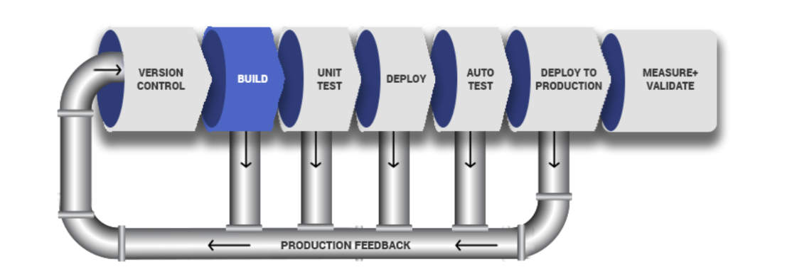

- **Version Control**: Developers commit and push their code to a shared repository (e.g., Git). This ensures all team members can access and work on the latest code.

- **Build**: The source code is compiled into executable files for compiled languages or packaged into deployable formats (e.g., `.tar.gz` or `.zip`) for interpreted languages.

- **Unit Test**: Unit tests written by developers are executed to validate individual components of the code. Failures at this stage halt the pipeline, requiring fixes.

- **Deploy**: Successfully built and tested code is deployed to an artifact repository (e.g., Artifactory) for version control or to a staging environment for further testing.

- **Auto Test**: Advanced tests like integration, penetration, and user acceptance testing (UAT) are conducted automatically in various environments (e.g., SIT for System Integration Testing).

- **Deploy to Production**: Once all tests pass, the release is approved and deployed to the production environment. In automated pipelines, this step is referred to as Continuous Deployment.

- **Measure and Validate**: Feedback is collected from live environments using monitoring tools to measure performance and identify areas for improvement.


**Common Best Practices of CI/CD**  

- Maintain a code repository  
- Automate the build process  
- Make builds self-tested  
- Everyone commits to the baseline every day  
- Every commit to the baseline should be built  
- Every bug-fix commit should come with a test case  
- Keep the build fast  
- Test in a clone of the production environment  
- Make it easy to get the latest deliverables  
- Everyone can see the results of the latest build  
- Automate deployment (if confident in CI/CD pipeline and ready for fully automated Continuous Deployment)  

### Why Are We Doing Everything We Are Doing? - 13 DevOps Success Metrics

After all, DevOps is about continuous delivery or deployment and shipping quality code as fast as possible. Here are 13 key metrics to focus on for tracking success in DevOps:

1. **Deployment frequency**: Measures how often deployments occur, encouraging smaller, frequent releases to ease testing and improve release cycles.  
2. **Lead time**: Tracks the time from starting a work item to its deployment, emphasizing quick and efficient delivery.  
3. **Customer tickets**: Reflects user-reported bugs or issues, serving as an indicator of application quality and performance.  
4. **Percentage of passed automated tests**: Highlights the reliability of automated testing in maintaining code quality during changes.  
5. **Defect escape rate**: Measures defects that make it to production, ensuring confidence in identifying issues during QA.  
6. **Availability**: Tracks system uptime and planned downtime, focusing on minimizing outages and ensuring smooth operations.  
7. **Service level agreements (SLAs)**: Ensures compliance with customer expectations and tracks non-functional requirements.  
8. **Failed deployments**: Keeps track of deployment issues and reversals, aiming to minimize outages and improve system reliability.  
9. **Error rates**: Identifies exceptions and critical errors in code or production, improving stability and uptime.  
10. **Application usage & traffic**: Monitors transaction volumes and user access patterns to detect anomalies like traffic spikes or downtime.  
11. **Application performance**: Evaluates system performance using monitoring tools, addressing issues post-deployment.  
12. **Mean time to detection (MTTD)**: Measures the speed of identifying problems to reduce impact and downtime.  
13. **Mean time to recovery (MTTR)**: Tracks the time to resolve system failures, minimizing disruptions and maintaining reliability.  

These metrics are essential to ensure the CI/CD pipeline operates smoothly and delivers high-quality software efficiently.

---
### **Simulating a Typical CI/CD Pipeline for a PHP-Based Application**

As part of ongoing infrastructure development using **Ansible** (from **Project 11**), the goal is to simulate a CI/CD pipeline for continuous integration and delivery of PHP applications. This project focuses on **Tooling** and **TODO Web Applications**, which are based on the **interpreted (scripting) language PHP**. Since PHP does not require compilation to machine language, it can be deployed directly to a server.

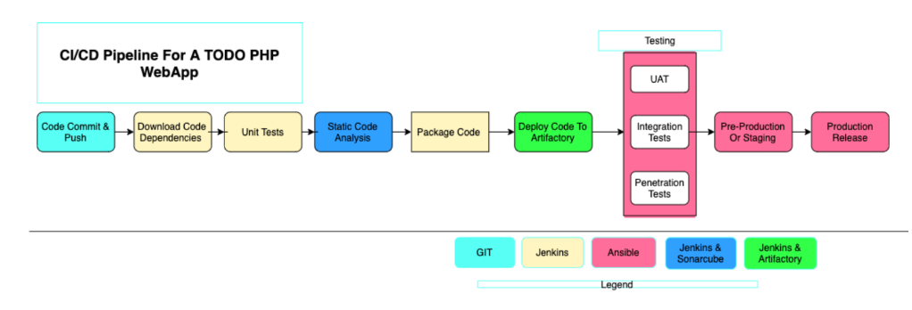

### **CI/CD Pipeline for a TODO PHP WebApp**

#### **Pipeline Workflow**
1. **Code Commit & Push**  
   - Developers push their code to a Git repository.

2. **Download Code Dependencies**  
   - Jenkins fetches dependencies required for the application to run.

3. **Unit Tests**  
   - Code undergoes unit testing to validate individual components.

4. **Static Code Analysis**  
   - Tools like **SonarQube** perform static code checks to ensure quality and adherence to coding standards.

5. **Package Code**  
   - The source code is packaged into deployable formats (e.g., `.tar.gz` or `.zip`).

6. **Deploy Code to Artifactory**  
   - Packaged artifacts are stored in **Artifactory**, enabling better version control and accessibility.

7. **Testing (UAT, Integration, Penetration)**  
   - **UAT (User Acceptance Testing)** ensures the application meets user requirements.  
   - **Integration Tests** validate that different modules work together seamlessly.  
   - **Penetration Tests** identify vulnerabilities and ensure the application is secure.

8. **Pre-Production or Staging**  
   - The application is deployed to a staging environment that mirrors production.

9. **Production Release**  
   - After successful testing, the application is released to the production environment.

---

#### **Legend for Tools in the Workflow**
- **Git**: Code repository for managing versions.  
- **Jenkins**: CI server for orchestrating builds and deployments.  
- **SonarQube**: Code analysis tool for static checks.  
- **Ansible**: Automation tool for configuration and deployment.  
- **Artifactory**: Artifact repository for storing and managing deployable packages.
---

### **Set Up**

This project is a continuation of the Ansible work from a previous setup. The main goal is to create a multi-environment infrastructure for a CI/CD pipeline. The environments include **CI**, **Dev**, **Pentest**, **SIT**, **UAT**, **Preprod**, and **Prod**. Each environment is set up to simulate real-world development, testing, and production stages.

- **Start with minimal servers**: Create only the servers necessary for the current environment you are working on (e.g., development or testing) to save costs.

- **Examples of environments**:
  - **CI**: For Continuous Integration builds and automation.
  - **Dev**: For active development and testing of new features.
  - **Pentest**: For penetration and security testing.

---

### **Tools and Configurations**

- **Nginx**: Configured as a **reverse proxy** for all environments.
- **SonarQube**: Used for static code analysis.
- **Artifactory**: Stores the build artifacts generated during the CI/CD pipeline.
- **TODO WebApp**: A PHP-based application deployed across environments.

---

### **Environment Setup Table**

The following table represents how the tools and configurations are distributed across the environments:

| **Environment** | **Nginx** | **SonarQube** | **Artifactory** | **TODO WebApp** | **Jenkins** |
|------------------|-----------|---------------|------------------|-----------------|-------------|
| **CI**          | ✅        | ✅            | ✅               | ✅              | ✅          |
| **Dev**         | ✅        | ✅            | ✅               | ✅              |             |
| **SIT**         | ✅        | ✅            | ✅               | ✅              |             |
| **UAT**         | ✅        | ✅            | ✅               | ✅              |             |
| **Pentest**     | ✅        | ✅            | ✅               | ✅              |             |
| **Preprod**     | ✅        | ✅            | ✅               | ✅              |             |
| **Prod**        | ✅        | ✅            | ✅               | ✅              |             |

### CI-Environment
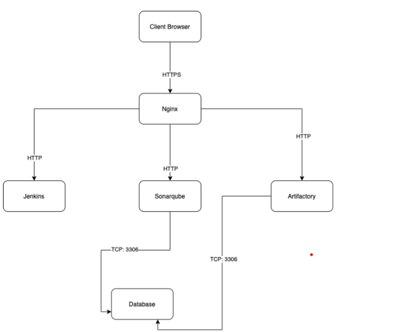

### Other Environment from Lower to Higher

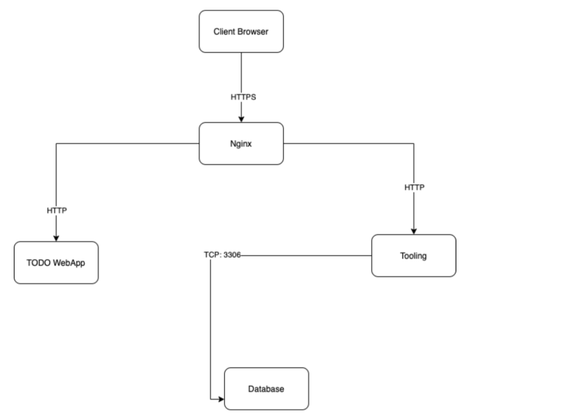


### **DNS Requirements**

To configure DNS, create subdomain entries for each environment. Assuming your main domain is `darey.io`, the subdomains should be set as follows:

| **Server**                   | **Domain**                                      |
|-------------------------------|------------------------------------------------|
| **Jenkins**                  | `https://ci.infradev.steghub.com`              |
| **SonarQube**                | `https://sonar.infradev.steghub.com`           |
| **Artifactory**              | `https://artifacts.infradev.steghub.com`       |
| **Production Tooling**       | `https://tooling.steghub.com`                  |
| **Pre-Prod Tooling**         | `https://tooling.preprod.steghub.com`          |
| **Pentest Tooling**          | `https://tooling.pentest.steghub.com`          |
| **UAT Tooling**              | `https://tooling.uat.steghub.com`              |
| **SIT Tooling**              | `https://tooling.sit.steghub.com`              |
| **Dev Tooling**              | `https://tooling.dev.steghub.com`              |
| **Production TODO-WebApp**   | `https://todo.steghub.com`                     |
| **Pre-Prod TODO-WebApp**     | `https://todo.preprod.steghub.com`             |
| **Pentest TODO-WebApp**      | `https://todo.pentest.steghub.com`             |
| **UAT TODO-WebApp**          | `https://todo.uat.steghub.com`                 |
| **SIT TODO-WebApp**          | `https://todo.sit.steghub.com`                 |
| **Dev TODO-WebApp**          | `https://todo.dev.steghub.com`                 |

---

### Ansible Inventory Should look like this

```
├── ci
├── dev
├── pentest
├── pre-prod
├── prod
├── sit
└── uat
```

**CI Inventory File**
```ini
[jenkins]
<Jenkins-IP-Address>

[nginx]
<Nginx-IP-Address>

[sonarqube]
<Sonarqube-IP-Address>

[artifact_repository]
<Artifact-IP-Address>
```
**Dev Inventory File**
```ini
[tooling]
<Tooling-IP-Address>

[todo]
<Todo-IP-Address>

[nginx]
<Nginx-IP-Address>

[db:vars]
ansible_user=ec2-user
ansible_python_interpreter=/usr/bin/python

[db]
<DB-IP-Address>
```

**Pentest Inventory File**
```ini
[pentest:children]
pentest-todo
pentest-tooling

[pentest-todo]
<Pentest-Todo-IP-Address>

[pentest-tooling]
<Pentest-Tooling-IP-Address>
```
### **Observations**
1. **Children Groups**  
   - The `pentest:children` group combines `pentest-todo` and `pentest-tooling`.  
   - This enables running Ansible tasks on both subgroups or individual groups as needed.

2. **Group Variables**  
   - Use `group_vars` for shared variables across `pentest-todo` and `pentest-tooling`.  
   - This reduces redundancy and simplifies configuration.

3. **Custom Setup for `db`**  
   - The `db` group uses CentOS/Red Hat-specific configurations, such as setting the Python interpreter.  
   - Adapt configurations based on the operating system.


**Ansible Roles for CI Environment**
   - You need to add **SonarQube** and **Artifactory** roles to your Ansible setup.

   **SonarQube**:
   - SonarQube is an open-source platform for continuous inspection of code quality.
   - It performs automatic reviews with static analysis of code to detect bugs, code smells, and security vulnerabilities.
   - To integrate SonarQube with Jenkins, refer to the instructions for SonarQube configuration in your Ansible playbooks.
   
   **Artifactory**:
   - Artifactory is a binary repository manager used to store and manage build artifacts.
   - It extends the source code repository to store build artifacts in a central location.
   - You will configure Artifactory to be used strictly for managing build artifacts as part of your CI/CD pipeline.

**Why Do We Need SonarQube?**
   - SonarQube helps in maintaining high code quality by detecting bugs, security vulnerabilities, and code smells. This ensures that the codebase remains healthy and maintainable over time.
   - It can be integrated with Jenkins to provide real-time feedback during the build process.

**Why Do We Need Artifactory?**
   - Artifactory serves as the central repository for all build artifacts, ensuring they are stored in a secure and organized way.
   - It supports integration with various CI/CD tools like Jenkins to retrieve build artifacts and deploy them across different environments.

### **Configuring Ansible For Jenkins Deployment**

In previous projects, you have been launching Ansible commands manually from a CLI. Now, with Jenkins, we will start running Ansible from Jenkins UI.

### Step 1: Navigated to Jenkins URL
   - I opened my browser and went to the Jenkins URL.

### Step 2: Installed & Opened Blue Ocean Jenkins Plugin
   - I went to **Manage Jenkins**, clicked on **Manage Plugins**, and installed the **Blue Ocean** plugin.
   - After installation, I opened **Blue Ocean** from the Jenkins dashboard, which gave me a simplified interface for pipeline creation.

   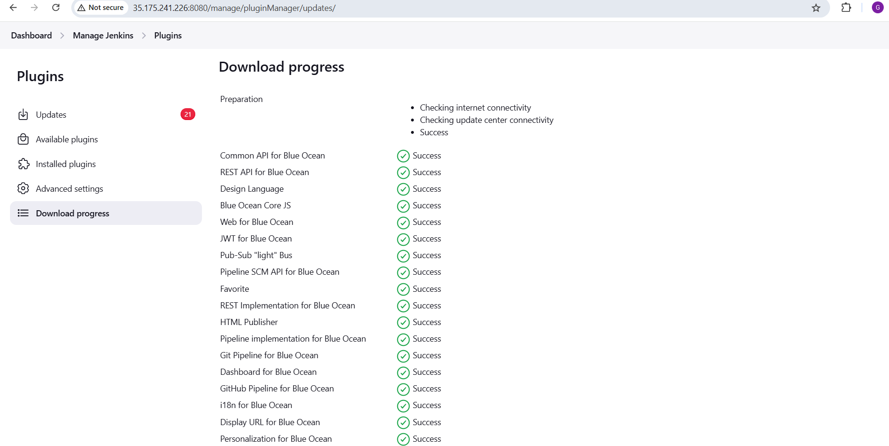

### Step 3: Created a New Pipeline
   - In **Blue Ocean**, I clicked on **New Pipeline** to begin the pipeline creation process.

### Step 4: Selected GitHub for Code Repository
   - When prompted to select the repository location, I chose **GitHub**.
   - Jenkins asked me to connect to my GitHub account, which I proceeded to do.

### Step 5: Connected Jenkins with GitHub
   - Jenkins required an **access token** to authenticate with GitHub.
   - I logged into GitHub, went to **Settings → Developer settings → Personal access tokens**, and generated a new token with the necessary permissions (`repo`).
   - I copied the generated token and pasted it into Jenkins.

### Step 6: Logged into GitHub & Generated an Access Token
   - I successfully generated the access token on GitHub and returned to Jenkins to paste it into the **Connect to GitHub** section.
   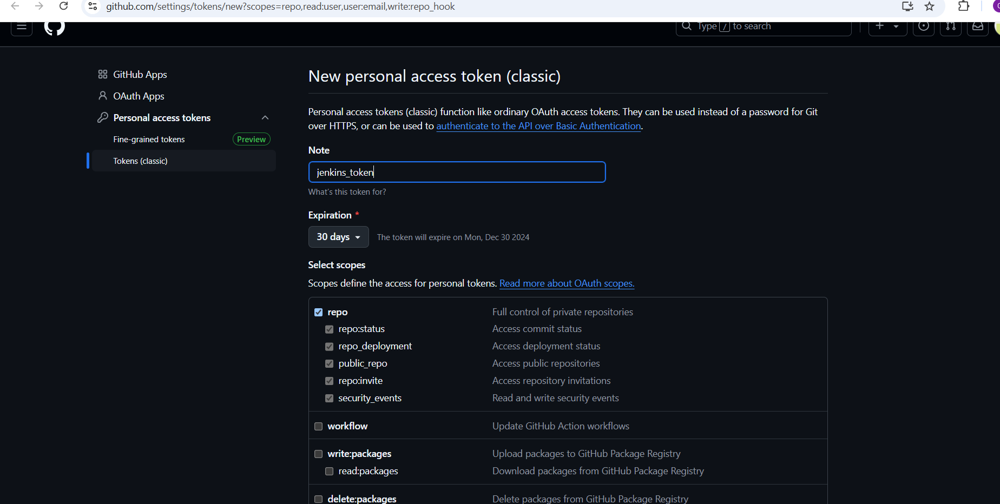

### Step 7: Pasted the Token and Connected
   - After pasting the token, I clicked **Connect** to successfully link Jenkins with my GitHub account.

### Step 8: Chosen the Repository for the Pipeline
   - In Jenkins, I searched for my repository (e.g., `ansible-project`) and selected it.

### Step 9: Created the Pipeline
   - After selecting the repository, I clicked on **Create Pipeline**, and Jenkins automatically set up the pipeline with my chosen GitHub repository.

### *Create a Directory for the Jenkinsfile**
1. Inside my Ansible project folder, I created a new directory called `deploy`:
   ```bash
   mkdir deploy
   ```
2. I navigated to the `deploy` directory:
   ```bash
   cd deploy
   ```

3. Then, I created a new file named `Jenkinsfile` inside the `deploy` directory:
   ```bash
   touch Jenkinsfile
   ```


### **Add Basic Pipeline Code to Jenkinsfile**

I added the following basic pipeline code:
   ```groovy
   pipeline {
       agent any

       stages {
           stage('Build') {
               steps {
                   script {
                       sh 'echo "Building Stage"'
                   }
               }
           }
       }
   }
   ```
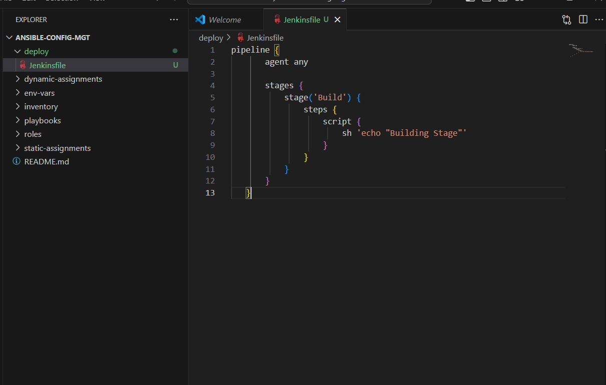


### **Configure the Ansible Project in Jenkins**
1. I opened Jenkins in my web browser.
2. From the **Dashboard**, I selected my Ansible project (e.g., `ansible-project`).
3. Then, I clicked on **Configure** in the left-hand menu.
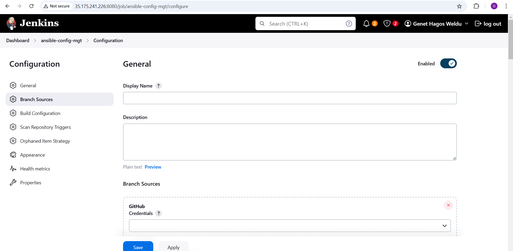
---

### **Configure the Pipeline in Jenkins**
1. Under the **Pipeline** section in the project configuration, I set the pipeline to use the `Jenkinsfile`:
   - **Definition**: Pipeline script from SCM.
   - **SCM**: Git.
   - I provided the Git repository URL where my `Jenkinsfile` is stored.
   - I specified the path to the `Jenkinsfile` as:
     ```
     deploy/Jenkinsfile
     ```
   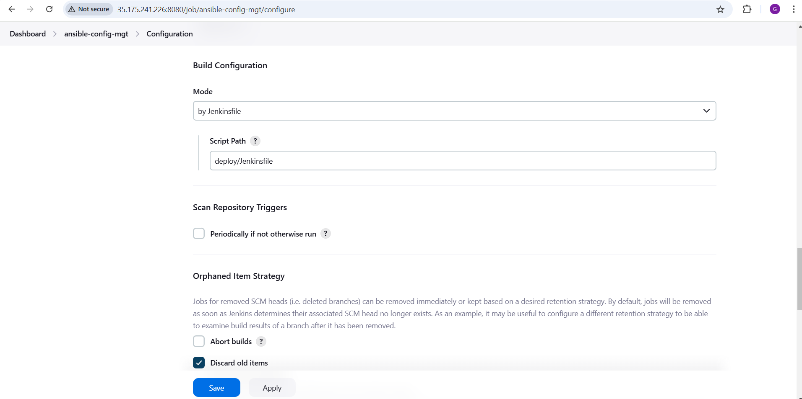
   - I saved the configuration.


### **Triggering a Build**
To experience the effect of the **Jenkinsfile** setup, I triggered a build in Jenkins. By reviewing the console output, I was able to confirm the pipeline execution for the branch.

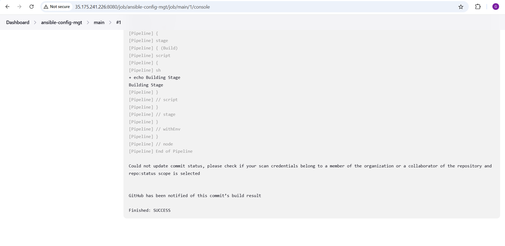


### **Using the Blue Ocean Interface**
I opened the **Blue Ocean** interface in Jenkins, selected my project, and clicked the play button next to the branch to trigger a build. The multibranch nature of the pipeline allowed Jenkins to scan all branches in the repository, making it easy to build each branch from the Blue Ocean interface.

### Create a New Branch
I created a new Git branch named `feature/jenkinspipeline-stages` to test branch-specific pipelines:
```bash
git checkout -b feature/jenkinspipeline-stages
```

I edited the `Jenkinsfile` to add a new **Test** stage alongside the existing **Build** stage:
```groovy
pipeline {
    agent any

    stages {
        stage('Build') {
            steps {
                script {
                    sh 'echo "Building Stage"'
                }
            }
        }
        stage('Test') {
            steps {
                script {
                    sh 'echo "Testing Stage"'
                }
            }
        }
    }
}
```


---

### Make Jenkins Recognize the New Branch
In Jenkins, I navigated to the **Administration** section, selected the project, and clicked on **Scan Repository Now**. This made Jenkins recognize the new branch, and the updated pipeline started building automatically.


---

### Viewing the Pipeline in Blue Ocean
In the Blue Ocean interface, I saw the pipeline for the new branch with the additional **Test** stage. I triggered the build and verified its successful execution, observing both the **Build** and **Test** stages completing as expected.

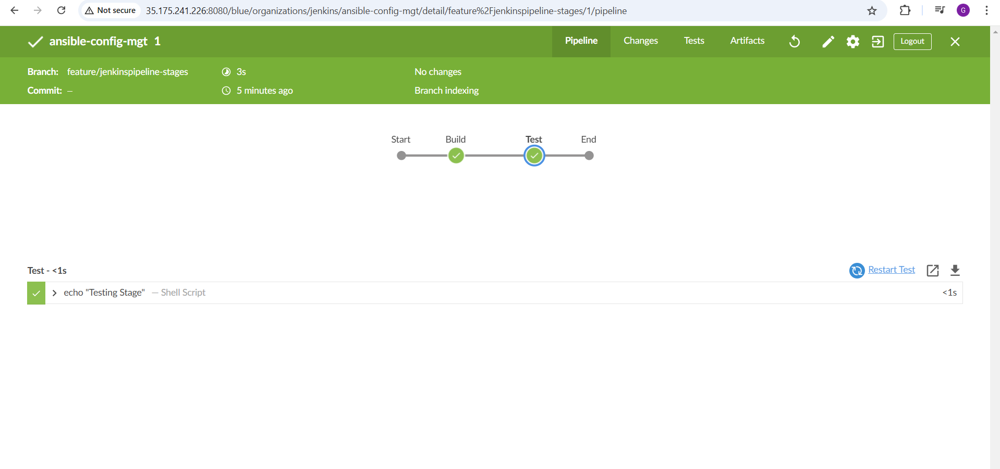

---

### A Quick Task
To further enhance the pipeline, I merged the new branch into the `main` branch, switched back to `main`, and pulled the latest changes and create new branch:
```bash
git checkout main
git pull origin main
git checkout -b feature/jenkinspipeline-test
```

I added additional stages such as **Package**, **Deploy**, and **Clean up**:
```groovy
stage('Package') {
    steps {
        script {
            sh 'echo "Packaging Application"'
        }
    }
}

stage('Deploy') {
    steps {
        script {
            sh 'echo "Deploying Application"'
        }
    }
}

stage('Clean up') {
    steps {
        script {
            sh 'echo "Cleaning Up Environment"'
        }
    }
}
```

After committing and pushing these changes, I confirmed that all stages ran successfully in the Blue Ocean interface.

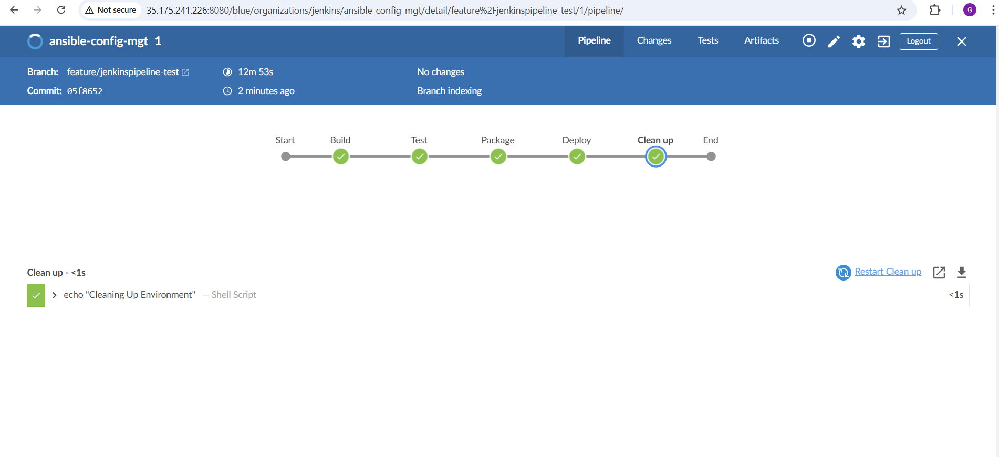

I merged the feature branch into the main branch, completed the pipeline, and confirmed that the main branch has a successful pipeline with all stages visible in Blue Ocean.

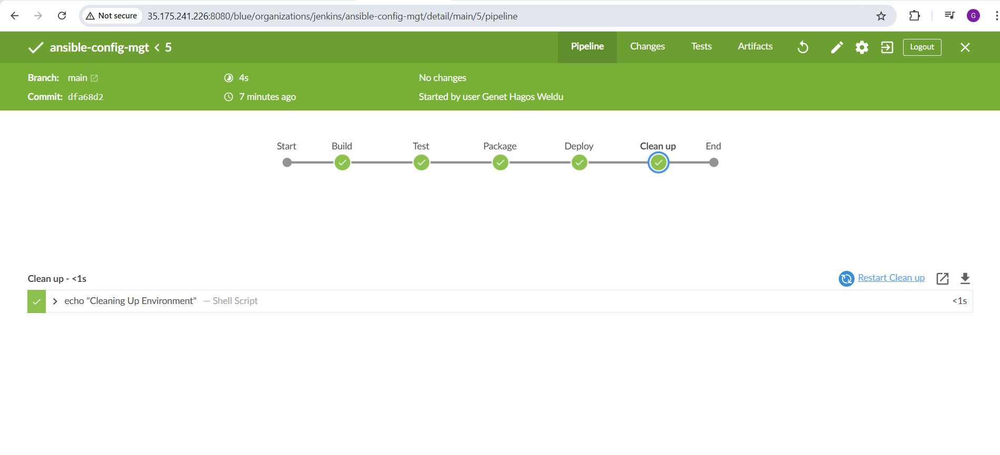

### **Running Ansible Playbook from Jenkins**

### **Steps for Setting Up Ansible on Jenkins**
### **I Installed Ansible on Jenkins**

1. **Installed Ansible on Jenkins Server (Ubuntu)**  
   I successfully installed Ansible on the Jenkins server using the following steps:  
   - Updated the system:  
     ```bash
     sudo apt update && sudo apt upgrade -y
     ```
   - Installed Ansible:  
     ```bash
     sudo apt install ansible -y
     ```
   - Verified the installation:  
     ```bash
     ansible --version
     ```
   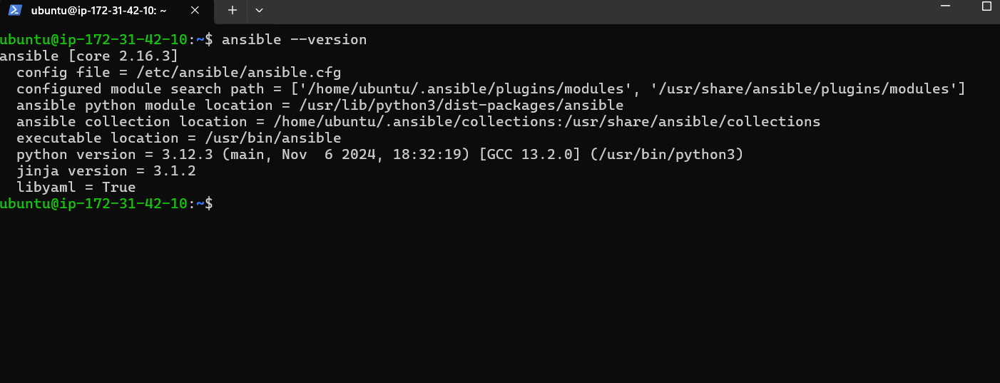

2. **Installed the Ansible Plugin in Jenkins UI**  
   - **Installed the Ansible Plugin**:  
     - Navigated to **Dashboard > Manage Jenkins > Manage Plugins > Available Plugins**.  
     - Installed the **Ansible Plugin** and restarted Jenkins.  
     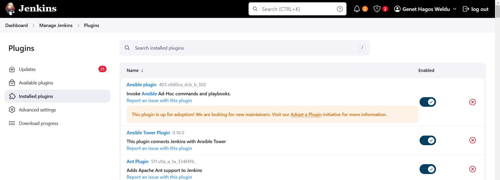
   
   - **Configured Ansible in Global Tool Configuration**:  
     - Navigated to **Dashboard > Manage Jenkins > Global Tool Configuration**.  
     - Added a new Ansible tool by clicking **Add Ansible**.  
     - Entered the name and path retrieved from the `which ansible` command into the configuration.  
   
      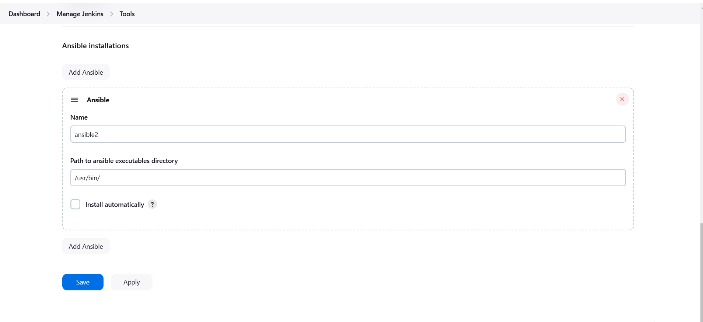

3. **Created a Fresh Jenkinsfile**  
   - Deleted any pre-existing `Jenkinsfile` configurations.  
   - Created a new pipeline script for running Ansible playbooks with parameterized deployments.  
     

This completed the Ansible integration with Jenkins. The environment is ready for automated deployments!
You can refer to this [video guide](#) for detailed instructions.


### **Important Notes**
- Ensure Ansible runs successfully on the **Dev environment** before extending configurations to other environments.  
- Export the `ANSIBLE_CONFIG` environment variable to specify the location of the `.ansible.cfg` file, which contains crucial deployment configurations.

### **Common Errors and Solutions**

#### 1. **Incorrect SCM Branch Checkout**
   - Ensure the `Jenkinsfile` checks out the correct SCM branch (e.g., `main` instead of `master` if the master branch has been deprecated).  
   - GitHub no longer defaults to `master` as the primary branch. Learn more [here](#).

#### 2. **Environment Variables Configuration**
   - Make sure the `ansible.cfg` file is exported as an environment variable so Ansible can locate required roles and configurations.  
   - When using multiple branches, dynamically update the `roles_path` with tools like **sed** to avoid branch-specific conflicts.

#### 3. **Outdated Jenkins Workspace**
   - If Jenkins fails after pushing changes to Git, the workspace may be outdated.  
     - Add a `clean up` step in the pipeline to remove old files from the workspace.  
     - This ensures the latest code is fetched and used for builds.

#### 4. **Branch Mismatch**
   - Verify the branch specified in the `Jenkinsfile` matches the intended branch.  
   - Use `git branch` on the Jenkins server to confirm the active branch.

---

### **Deployment Beyond the Dev Environment**
If the deployment to Dev is successful, consider the following options for other environments:  
- **Manual Updates**: Update the `Jenkinsfile` manually for each environment (e.g., **SIT**, **UAT**, **Pentest**).  
- **Dedicated Git Branches**: Use a dedicated branch for each environment with hardcoded inventory configurations.

---

### **Parameterizing Deployments**
Avoid manual updates by parameterizing deployments in the `Jenkinsfile`.  
- This approach allows you to dynamically set configurations for the target environment.  
- Parameterized deployments streamline the process and reduce human error.

By following these steps, you can efficiently manage and scale your deployment processes using Ansible and Jenkins.


Certainly! Here's the updated section with the title added:

---

## **Parameterizing `Jenkinsfile` For Ansible Deployment**

### **Step 1: Update the SIT Inventory**

I updated the inventory file with new servers:

```ini
[tooling]
<SIT-Tooling-Web-Server-Private-IP-Address>

[todo]
<SIT-Todo-Web-Server-Private-IP-Address>

[nginx]
<SIT-Nginx-Private-IP-Address>

[db:vars]
ansible_user=ec2-user
ansible_python_interpreter=/usr/bin/python

[db]
<SIT-DB-Server-Private-IP-Address>
```

---

### **Step 2: Parameterize the Jenkins Pipeline**

I modified the `Jenkinsfile` to add a parameter for selecting the inventory dynamically:

```groovy
pipeline {
    agent any

    parameters {
        string(
            name: 'inventory',
            defaultValue: 'dev',
            description: 'This is the inventory file for the environment to deploy configuration'
        )
    }

    stages {
        stage('Checkout SCM') {
            steps {
                git branch: 'main', url: 'https://github.com/GenetH/ansible-config-mgt.git'
            }
        }

        stage('Run Ansible Playbook') {
            steps {
                sshagent(['private-key']) {
                    ansiblePlaybook(
                        playbook: "${WORKSPACE}/playbooks/site.yml",
                        inventory: "${WORKSPACE}/inventory/${inventory}.yml",
                        become: true,
                        credentialsId: 'private-key'
                    )
                }
            }
        }
    }
}
```

---

### **Step 3: Use the Parameterized Inventory**

I replaced the hardcoded inventory path `inventory/dev.yml` in the `Run Ansible Playbook` stage with the parameterized inventory file `${inventory}`. This allows the user to specify the environment at runtime.

---

### **Step 4: Execute the Pipeline**

1. Navigate to your Jenkins project and click on **Build with Parameters**.
2. You will see a prompt for the `inventory` parameter. Provide the desired environment, e.g., `sit`, and click **Run**.

Example:

- Input `sit` into the field for the inventory parameter:
   

- Run the job, and Jenkins will use the inventory file `inventory/sit.yml`.

---

### **Step 5: Add Another Parameter for Tags**

To run specific tasks using Ansible tags, enhance the `Jenkinsfile` as follows:

```groovy
parameters {
    string(
        name: 'tags',
        defaultValue: '',
        description: 'Ansible tags to run specific tasks'
    )
}
```

In the `Run Ansible Playbook` stage, include the `tags` parameter:

```groovy
ansiblePlaybook(
    playbook: "${WORKSPACE}/playbooks/site.yml",
    inventory: "${WORKSPACE}/inventory/${inventory}.yml",
    tags: "${tags}",
    become: true,
    credentialsId: 'private-key'
)
```

---

This approach allows for flexibility in deploying configurations across multiple environments and specific roles or tasks using parameters in the Jenkins pipeline.
