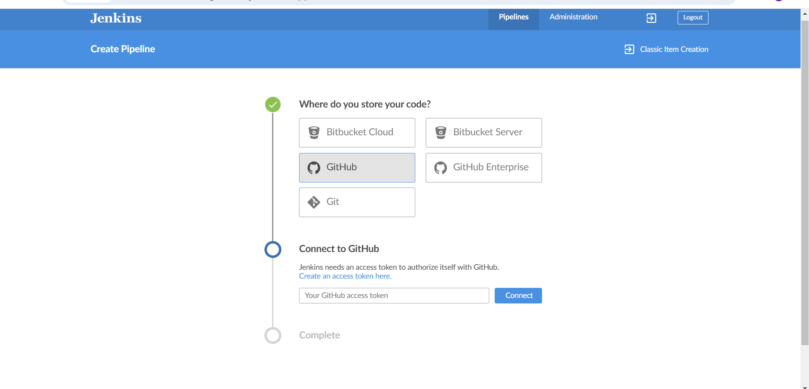
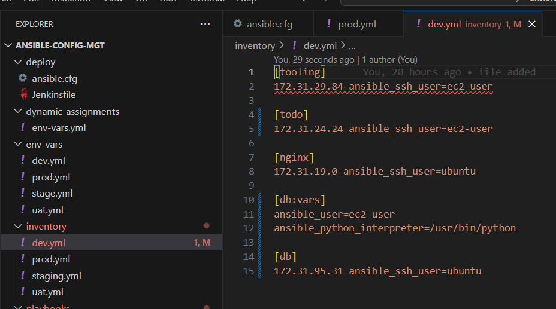
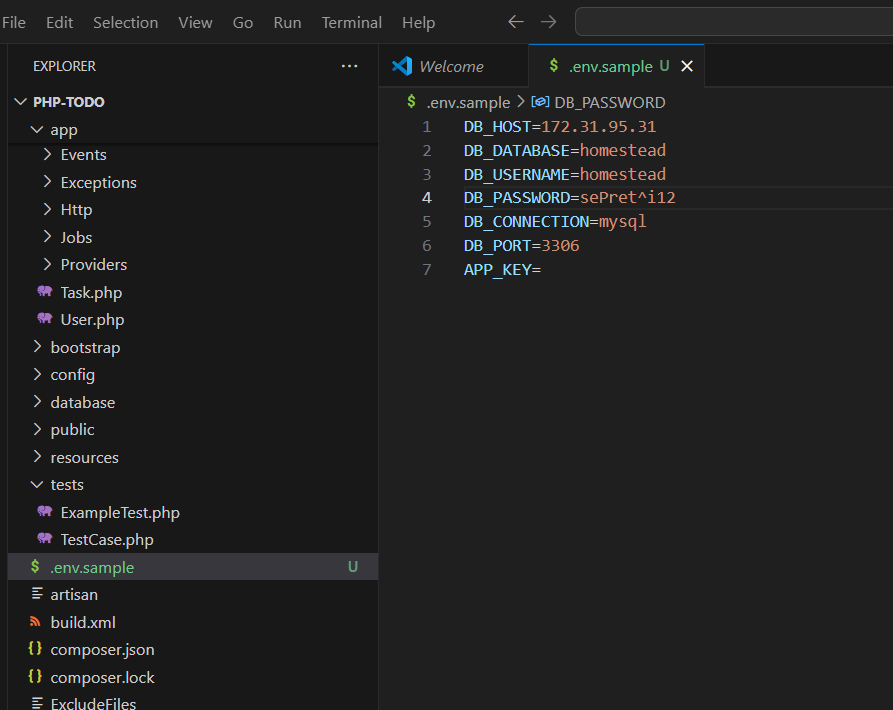

## Experience Continuous Integration with Jenkins | Ansible | Artifactory | SonarQube | PHP

### **Project Context**
- This project is designed to teach fundamental DevOps concepts related to **CI/CD pipelines** by using tools like Jenkins, Ansible, Artifactory, and SonarQube, with a focus on PHP applications.
### **Key Concepts**
**Compiled vs. Interpreted Languages**  
   - Compiled languages like Java and .NET require a build stage to create an executable file (e.g., `.jar`) that contains all dependencies.
   - Interpreted languages like PHP, JavaScript, and Python do not need a build stage, and their code can be directly deployed.

**Improved Deployment**  
   - Direct deployment from Git to servers (e.g., placing code into `/var/www/html`) is not an optimal approach for real-world applications.
   - A better approach is to package the code and its dependencies into archives (e.g., `.tar.gz` or `.zip`) for easier deployment across environments.

### **Goals of the Project**
- To provide a hands-on understanding of CI/CD concepts from an **application perspective** using PHP.
- To demonstrate CI/CD in action across various programming languages like Java, Node.js, .NET, and Python.
- To extend the understanding of platform-specific CI/CD by exploring tools like **Terraform**, **Docker**, and **Kubernetes**.

---

Here’s the text from the uploaded image transcribed for you:

---

### What is Continuous Integration?

In software engineering, Continuous Integration (CI) is a practice of merging all developers’ working copies to a shared mainline (e.g., Git Repository or some other version control system) several times per day. Frequent merges reduce chances of any conflicts in code and allow to run tests more often to avoid massive rework if something goes wrong. This principle can be formulated as **Commit early, push often**.

The general idea behind multiple commits is to avoid what is generally considered as **Merge Hell** or **Integration hell**. When a new developer joins a new project, he or she must create a copy of the main codebase by starting a new feature branch from the **mainline** to develop his own features (in some organization or team, this could be called a **develop**, **main**, or **master** branch). If there are tens of developers working on the same project, they will all have their own branches created from **mainline** at different points in time. Once they make a copy of the repository it starts drifting away from the mainline with every new merge of other developers’ codes. If this lingers on for a very long time without reconciling the code, then this will cause a lot of code conflict or **Merge Hell**, as rightly said. Imagine such a **hell** from tens of developers or worse, hundreds. 

So, the best thing to do is to continuously commit & push your code to the **mainline**. As many times as tens times per day. With this practice, you can avoid **Merge Hell** or **Integration hell**.

### **CI Workflow**
**Run Tests Locally**  
   Developers run tests (e.g., unit tests) locally using methodologies like **Test-Driven Development (TDD)** to ensure code quality before committing to the central repository. This prevents broken code from affecting other developers.

**Compile Code in CI**  
   After testing locally, developers commit their changes to a CI server (e.g., Jenkins), which compiles the code and executes build processes. Builds can be triggered periodically or after every commit, providing visibility to the entire team.

**Run Further Tests in CI**  
   CI servers perform additional tests, including:
   - **Static Code Analysis**  
   - **Code Coverage Analysis**  
   - **Code Smells Analysis**  
   - **Compliance Analysis**  
   - Other tests like integration and penetration testing.

**Deploy an Artifact from CI**  
   CI produces artifacts (e.g., built code or deployable packages) that can be manually deployed to users as part of **Continuous Delivery (CD)**. If deployment is automated, it moves into **Continuous Deployment**, making the process fully hands-off.

### Continuous Integration in the Real World


- **Version Control**: Developers commit and push their code to a shared repository (e.g., Git). This ensures all team members can access and work on the latest code.

- **Build**: The source code is compiled into executable files for compiled languages or packaged into deployable formats (e.g., `.tar.gz` or `.zip`) for interpreted languages.

- **Unit Test**: Unit tests written by developers are executed to validate individual components of the code. Failures at this stage halt the pipeline, requiring fixes.

- **Deploy**: Successfully built and tested code is deployed to an artifact repository (e.g., Artifactory) for version control or to a staging environment for further testing.

- **Auto Test**: Advanced tests like integration, penetration, and user acceptance testing (UAT) are conducted automatically in various environments (e.g., SIT for System Integration Testing).

- **Deploy to Production**: Once all tests pass, the release is approved and deployed to the production environment. In automated pipelines, this step is referred to as Continuous Deployment.

- **Measure and Validate**: Feedback is collected from live environments using monitoring tools to measure performance and identify areas for improvement.


**Common Best Practices of CI/CD**  

  Principles that define a reliable and robust CI/CD pipeline:
- Maintain a code repository  
- Automate the build process  
- Make builds self-tested  
- Everyone commits to the baseline every day  
- Every commit to the baseline should be built  
- Every bug-fix commit should come with a test case  
- Keep the build fast  
- Test in a clone of the production environment  
- Make it easy to get the latest deliverables  
- Everyone can see the results of the latest build  
- Automate deployment (if confident in CI/CD pipeline and ready for fully automated Continuous Deployment)  

### Why Are We Doing Everything We Are Doing? - 13 DevOps Success Metrics

After all, DevOps is about continuous delivery or deployment and shipping quality code as fast as possible. Here are 13 key metrics to focus on for tracking success in DevOps:

1. **Deployment frequency**: Measures how often deployments occur, encouraging smaller, frequent releases to ease testing and improve release cycles.  
2. **Lead time**: Tracks the time from starting a work item to its deployment, emphasizing quick and efficient delivery.  
3. **Customer tickets**: Reflects user-reported bugs or issues, serving as an indicator of application quality and performance.  
4. **Percentage of passed automated tests**: Highlights the reliability of automated testing in maintaining code quality during changes.  
5. **Defect escape rate**: Measures defects that make it to production, ensuring confidence in identifying issues during QA.  
6. **Availability**: Tracks system uptime and planned downtime, focusing on minimizing outages and ensuring smooth operations.  
7. **Service level agreements (SLAs)**: Ensures compliance with customer expectations and tracks non-functional requirements.  
8. **Failed deployments**: Keeps track of deployment issues and reversals, aiming to minimize outages and improve system reliability.  
9. **Error rates**: Identifies exceptions and critical errors in code or production, improving stability and uptime.  
10. **Application usage & traffic**: Monitors transaction volumes and user access patterns to detect anomalies like traffic spikes or downtime.  
11. **Application performance**: Evaluates system performance using monitoring tools, addressing issues post-deployment.  
12. **Mean time to detection (MTTD)**: Measures the speed of identifying problems to reduce impact and downtime.  
13. **Mean time to recovery (MTTR)**: Tracks the time to resolve system failures, minimizing disruptions and maintaining reliability.  

These metrics are essential to ensure the CI/CD pipeline operates smoothly and delivers high-quality software efficiently.

---
### **Simulating a Typical CI/CD Pipeline for a PHP-Based Application**

As part of ongoing infrastructure development using **Ansible** (from **Project 11**), the goal is to simulate a CI/CD pipeline for continuous integration and delivery of PHP applications. This project focuses on **Tooling** and **TODO Web Applications**, which are based on the **interpreted (scripting) language PHP**. Since PHP does not require compilation to machine language, it can be deployed directly to a server.


**CI/CD Pipeline for a TODO PHP WebApp**

**Pipeline Workflow**
1. **Code Commit & Push**  
   - Developers push their code to a Git repository.

2. **Download Code Dependencies**  
   - Jenkins fetches dependencies required for the application to run.

3. **Unit Tests**  
   - Code undergoes unit testing to validate individual components.

4. **Static Code Analysis**  
   - Tools like **SonarQube** perform static code checks to ensure quality and adherence to coding standards.

5. **Package Code**  
   - The source code is packaged into deployable formats (e.g., `.tar.gz` or `.zip`).

6. **Deploy Code to Artifactory**  
   - Packaged artifacts are stored in **Artifactory**, enabling better version control and accessibility.

7. **Testing (UAT, Integration, Penetration)**  
   - **UAT (User Acceptance Testing)** ensures the application meets user requirements.  
   - **Integration Tests** validate that different modules work together seamlessly.  
   - **Penetration Tests** identify vulnerabilities and ensure the application is secure.

8. **Pre-Production or Staging**  
   - The application is deployed to a staging environment that mirrors production.

9. **Production Release**  
   - After successful testing, the application is released to the production environment.

#### **Legend for Tools in the Workflow**
- **Git**: Code repository for managing versions.  
- **Jenkins**: CI server for orchestrating builds and deployments.  
- **SonarQube**: Code analysis tool for static checks.  
- **Ansible**: Automation tool for configuration and deployment.  
- **Artifactory**: Artifact repository for storing and managing deployable packages.
---

### **Set Up**

This project is a continuation of the Ansible work from a previous setup. The main goal is to create a multi-environment infrastructure for a CI/CD pipeline. The environments include **CI**, **Dev**, **Pentest**, **SIT**, **UAT**, **Preprod**, and **Prod**. Each environment is set up to simulate real-world development, testing, and production stages.

- **Start with minimal servers**: Create only the servers necessary for the current environment you are working on (e.g., development or testing) to save costs.

- **Examples of environments**:
  - **CI**: For Continuous Integration builds and automation.
  - **Dev**: For active development and testing of new features.
  - **Pentest**: For penetration and security testing.

---

### **Tools and Configurations**

- **Nginx**: Configured as a **reverse proxy** for all environments.
- **SonarQube**: Used for static code analysis.
- **Artifactory**: Stores the build artifacts generated during the CI/CD pipeline.
- **TODO WebApp**: A PHP-based application deployed across environments.

---

### **Environment Setup Table**

The following table represents how the tools and configurations are distributed across the environments:

| **Environment** | **Nginx** | **SonarQube** | **Artifactory** | **TODO WebApp** | **Jenkins** |
|------------------|-----------|---------------|------------------|-----------------|-------------|
| **CI**          | ✅        | ✅            | ✅               | ✅              | ✅          |
| **Dev**         | ✅        | ✅            | ✅               | ✅              |             |
| **SIT**         | ✅        | ✅            | ✅               | ✅              |             |
| **UAT**         | ✅        | ✅            | ✅               | ✅              |             |
| **Pentest**     | ✅        | ✅            | ✅               | ✅              |             |
| **Preprod**     | ✅        | ✅            | ✅               | ✅              |             |
| **Prod**        | ✅        | ✅            | ✅               | ✅              |             |

### CI-Environment


### Other Environment from Lower to Higher


### **DNS Requirements**

To configure DNS, create subdomain entries for each environment. Assuming your main domain is `darey.io`, the subdomains should be set as follows:

| **Server**                   | **Domain**                                      |
|-------------------------------|------------------------------------------------|
| **Jenkins**                  | `https://ci.infradev.steghub.com`              |
| **SonarQube**                | `https://sonar.infradev.steghub.com`           |
| **Artifactory**              | `https://artifacts.infradev.steghub.com`       |
| **Production Tooling**       | `https://tooling.steghub.com`                  |
| **Pre-Prod Tooling**         | `https://tooling.preprod.steghub.com`          |
| **Pentest Tooling**          | `https://tooling.pentest.steghub.com`          |
| **UAT Tooling**              | `https://tooling.uat.steghub.com`              |
| **SIT Tooling**              | `https://tooling.sit.steghub.com`              |
| **Dev Tooling**              | `https://tooling.dev.steghub.com`              |
| **Production TODO-WebApp**   | `https://todo.steghub.com`                     |
| **Pre-Prod TODO-WebApp**     | `https://todo.preprod.steghub.com`             |
| **Pentest TODO-WebApp**      | `https://todo.pentest.steghub.com`             |
| **UAT TODO-WebApp**          | `https://todo.uat.steghub.com`                 |
| **SIT TODO-WebApp**          | `https://todo.sit.steghub.com`                 |
| **Dev TODO-WebApp**          | `https://todo.dev.steghub.com`                 |

---

### Ansible Inventory Should look like this

```
├── ci
├── dev
├── pentest
├── pre-prod
├── prod
├── sit
└── uat
```

**CI Inventory File**
```ini
[jenkins]
<Jenkins-IP-Address>

[nginx]
<Nginx-IP-Address>

[sonarqube]
<Sonarqube-IP-Address>

[artifact_repository]
<Artifact-IP-Address>
```
**Dev Inventory File**
```ini
[tooling]
<Tooling-IP-Address>

[todo]
<Todo-IP-Address>

[nginx]
<Nginx-IP-Address>

[db:vars]
ansible_user=ec2-user
ansible_python_interpreter=/usr/bin/python

[db]
<DB-IP-Address>
```

**Pentest Inventory File**
```ini
[pentest:children]
pentest-todo
pentest-tooling

[pentest-todo]
<Pentest-Todo-IP-Address>

[pentest-tooling]
<Pentest-Tooling-IP-Address>
```
### **Observations**
1. **Children Groups**  
   - The `pentest:children` group combines `pentest-todo` and `pentest-tooling`.  
   - This enables running Ansible tasks on both subgroups or individual groups as needed.

2. **Group Variables**  
   - Use `group_vars` for shared variables across `pentest-todo` and `pentest-tooling`.  
   - This reduces redundancy and simplifies configuration.

3. **Custom Setup for `db`**  
   - The `db` group uses CentOS/Red Hat-specific configurations, such as setting the Python interpreter.  
   - Adapt configurations based on the operating system.


**Ansible Roles for CI Environment**
   - You need to add **SonarQube** and **Artifactory** roles to your Ansible setup.

   **SonarQube**:
   - SonarQube is an open-source platform for continuous inspection of code quality.
   - It performs automatic reviews with static analysis of code to detect bugs, code smells, and security vulnerabilities.
   - To integrate SonarQube with Jenkins, refer to the instructions for SonarQube configuration in your Ansible playbooks.
   
   **Artifactory**:
   - Artifactory is a binary repository manager used to store and manage build artifacts.
   - It extends the source code repository to store build artifacts in a central location.
   - You will configure Artifactory to be used strictly for managing build artifacts as part of your CI/CD pipeline.

**Why Do We Need SonarQube?**
   - SonarQube helps in maintaining high code quality by detecting bugs, security vulnerabilities, and code smells. This ensures that the codebase remains healthy and maintainable over time.
   - It can be integrated with Jenkins to provide real-time feedback during the build process.

**Why Do We Need Artifactory?**
   - Artifactory serves as the central repository for all build artifacts, ensuring they are stored in a secure and organized way.
   - It supports integration with various CI/CD tools like Jenkins to retrieve build artifacts and deploy them across different environments.

### **Configuring Ansible For Jenkins Deployment**

In previous projects, you have been launching Ansible commands manually from a CLI. Now, with Jenkins, we will start running Ansible from Jenkins UI.

**Step 1: Navigated to Jenkins URL**
   - I opened my browser and went to the Jenkins URL.

**Step 2: Installed & Opened Blue Ocean Jenkins Plugin**
   - I went to **Manage Jenkins**, clicked on **Manage Plugins**, and installed the **Blue Ocean** plugin.
   - After installation, I opened **Blue Ocean** from the Jenkins dashboard, which gave me a simplified interface for pipeline creation.

   

**Step 3: Created a New Pipeline**
   - In **Blue Ocean**, I clicked on **New Pipeline** to begin the pipeline creation process.

**Step 4: Selected GitHub for Code Repository**
   - When prompted to select the repository location, I chose **GitHub**.
   - Jenkins asked me to connect to my GitHub account, which I proceeded to do.

**Step 5: Connected Jenkins with GitHub**
   - Jenkins required an **access token** to authenticate with GitHub.
   - I logged into GitHub, went to **Settings → Developer settings → Personal access tokens**, and generated a new token with the necessary permissions (`repo`).
   - I copied the generated token and pasted it into Jenkins.

**Step 6: Logged into GitHub & Generated an Access Token**
   - I successfully generated the access token on GitHub and returned to Jenkins to paste it into the **Connect to GitHub** section.
   

**Step 7: Pasted the Token and Connected**
   - After pasting the token, I clicked **Connect** to successfully link Jenkins with my GitHub account.
   

**Step 8: Chosen the Repository for the Pipeline**
   - In Jenkins, I searched for my repository (e.g., `ansible-project`) and selected it.

**Step 9: Created the Pipeline**
   - After selecting the repository, I clicked on **Create Pipeline**, and Jenkins automatically set up the pipeline with my chosen GitHub repository.

### **Create a Directory for the Jenkinsfile**
1. Inside my Ansible project folder, I created a new directory called `deploy`:
   ```bash
   mkdir deploy
   ```
2. I navigated to the `deploy` directory:
   ```bash
   cd deploy
   ```

3. Then, I created a new file named `Jenkinsfile` inside the `deploy` directory:
   ```bash
   touch Jenkinsfile
   ```


### **Add Basic Pipeline Code to Jenkinsfile**

I added the following basic pipeline code:
   ```groovy
   pipeline {
       agent any

       stages {
           stage('Build') {
               steps {
                   script {
                       sh 'echo "Building Stage"'
                   }
               }
           }
       }
   }
   ```


### **Configure the Ansible Project in Jenkins**
1. I opened Jenkins in my web browser.
2. From the **Dashboard**, I selected my Ansible project (e.g., `ansible-project`).
3. Then, I clicked on **Configure** in the left-hand menu.


### **Configure the Pipeline in Jenkins**
1. Under the **Pipeline** section in the project configuration, I set the pipeline to use the `Jenkinsfile`:
   - **Definition**: Pipeline script from SCM.
   - **SCM**: Git.
   - I provided the Git repository URL where my `Jenkinsfile` is stored.
   - I specified the path to the `Jenkinsfile` as:
     ```
     deploy/Jenkinsfile
     ```
   
   - I saved the configuration.

### **Triggering a Build**
To experience the effect of the **Jenkinsfile** setup, I triggered a build in Jenkins. By reviewing the console output, I was able to confirm the pipeline execution for the branch.


### **Using the Blue Ocean Interface**
I opened the **Blue Ocean** interface in Jenkins, selected my project, and clicked the play button next to the branch to trigger a build. The multibranch nature of the pipeline allowed Jenkins to scan all branches in the repository, making it easy to build each branch from the Blue Ocean interface.

### Create a New Branch
I created a new Git branch named `feature/jenkinspipeline-stages` to test branch-specific pipelines:
```bash
git checkout -b feature/jenkinspipeline-stages
```

I edited the `Jenkinsfile` to add a new **Test** stage alongside the existing **Build** stage:
```groovy
pipeline {
    agent any

    stages {
        stage('Build') {
            steps {
                script {
                    sh 'echo "Building Stage"'
                }
            }
        }
        stage('Test') {
            steps {
                script {
                    sh 'echo "Testing Stage"'
                }
            }
        }
    }
}
```


---

### Make Jenkins Recognize the New Branch
In Jenkins, I navigated to the **Administration** section, selected the project, and clicked on **Scan Repository Now**. This made Jenkins recognize the new branch, and the updated pipeline started building automatically.


---

### Viewing the Pipeline in Blue Ocean
In the Blue Ocean interface, I saw the pipeline for the new branch with the additional **Test** stage. I triggered the build and verified its successful execution, observing both the **Build** and **Test** stages completing as expected.


---

### A Quick Task
To further enhance the pipeline, I merged the new branch into the `main` branch, switched back to `main`, and pulled the latest changes and create new branch:
```bash
git checkout main
git pull origin main
git checkout -b feature/jenkinspipeline-test
```

I added additional stages such as **Package**, **Deploy**, and **Clean up**:
```groovy
stage('Package') {
    steps {
        script {
            sh 'echo "Packaging Application"'
        }
    }
}

stage('Deploy') {
    steps {
        script {
            sh 'echo "Deploying Application"'
        }
    }
}

stage('Clean up') {
    steps {
        script {
            sh 'echo "Cleaning Up Environment"'
        }
    }
}
```

After committing and pushing these changes, I confirmed that all stages ran successfully in the Blue Ocean interface.


I merged the feature branch into the main branch, completed the pipeline, and confirmed that the main branch has a successful pipeline with all stages visible in Blue Ocean.


### **Running Ansible Playbook from Jenkins**

**Installe Ansible on Jenkins**

1. **Installed Ansible on Jenkins Server (Ubuntu)**  
   I successfully installed Ansible on the Jenkins server using the following steps:  
   - Updated the system:  
     ```bash
     sudo apt update && sudo apt upgrade -y
     ```
   - Installed Ansible:  
     ```bash
     sudo apt install ansible -y
     ```
   - Verified the installation:  
     ```bash
     ansible --version
     ```
   

2. **Installed the Ansible Plugin in Jenkins UI**  
   - **Installed the Ansible Plugin**:  
     - Navigated to **Dashboard > Manage Jenkins > Manage Plugins > Available Plugins**.  
     - Installed the **Ansible Plugin** and restarted Jenkins.  
     
   
   - **Configured Ansible in Global Tool Configuration**:  
     - Navigated to **Dashboard > Manage Jenkins > Global Tool Configuration**.  
     - Added a new Ansible tool by clicking **Add Ansible**.  
     - Entered the name and path retrieved from the `which ansible` command into the configuration.  
   
      

3. **Created a Fresh Jenkinsfile**  
   - Deleted any pre-existing `Jenkinsfile` configurations.  
   - Created a new pipeline script for running Ansible playbooks with parameterized deployments.  
```groovy
pipeline {
    agent any

    environment {
        ANSIBLE_CONFIG = "${WORKSPACE}/deploy/ansible.cfg"
    }

    stages {
        stage('Initial cleanup') {
            steps {
                dir("${WORKSPACE}") {
                    deleteDir() // Clean up the workspace
                }
            }
        }

        stage('Checkout SCM') {
            steps {
                git branch: 'main', url: 'https://github.com/GenetH/ansible-config-mgt.git'
            }
        }

        stage('Prepare Ansible For Execution') {
            steps {
                script {
                    def cfgPath = "${WORKSPACE}/deploy/ansible.cfg"
                    sh """
                    if ! grep -q 'roles_path=${WORKSPACE}/roles' ${cfgPath}; then
                        echo 'roles_path=${WORKSPACE}/roles' >> ${cfgPath}
                    fi
                    """
                }
            }
        }

        stage('Test SSH Connection') {
            steps {
                sshagent(['private-key']) { 
                    sh 'ssh -o StrictHostKeyChecking=no -i /home/ubuntu/.ssh/id_rsa.pem ubuntu@172.31.42.10 exit'
                }
            }
        }

        stage('Run Ansible playbook') {
            steps {
                sshagent(['private-key']) { 
                    ansiblePlaybook(
                        become: true,
                        credentialsId: 'private-key', // Replace with your Jenkins credential ID
                        disableHostKeyChecking: true,
                        installation: 'ansible',
                        inventory: "${WORKSPACE}/inventory/dev.yml",
                        playbook: "${WORKSPACE}/playbooks/site.yml"
                    )
                }
            }
        }

        stage('Clean Workspace after build') {
            steps {
                cleanWs(cleanWhenAborted: true, cleanWhenFailure: true, cleanWhenNotBuilt: true, cleanWhenUnstable: true, deleteDirs: true)
            }
        }
    }
}
```
This completed the Ansible integration with Jenkins. The environment is ready for automated deployments!
You can refer to this [video guide](#) for detailed instructions.

### **Important Notes**
- Ensure Ansible runs successfully on the **Dev environment** before extending configurations to other environments.  
- Export the `ANSIBLE_CONFIG` environment variable to specify the location of the `.ansible.cfg` file, which contains crucial deployment configurations.

### **Possible Errors to Watch Out For:**

1. **SCM Branch Checking**:
   - Ensure that the `git` module in `Jenkinsfile` checks out the **main** branch instead of **master**.  
   - GitHub discontinued the use of **master** as the default branch. Update your SCM configuration accordingly.
   - [Learn more here](https://github.com/github/renaming).

2. **Export `ANSIBLE_CONFIG` Environment Variable**:
   - Jenkins needs to export the `ANSIBLE_CONFIG` environment variable to locate your `ansible.cfg` file.
   - Place your `ansible.cfg` in the **deploy** directory to keep deployment-related files organized.
   - Use the **Pipeline Syntax** tool in Ansible to generate syntax for setting environment variables dynamically.  
   - [Learn about Pipeline Syntax for Jenkins here](https://wiki.jenkins.io/display/JENKINS/Building+a+software+project).

### **Possible Issues to Watch Out for When Implementing This:**

1. **Dynamic Role Paths**:
   - The location of `roles_path` may vary based on the branch Jenkins runs on. Dynamically update the `roles_path` in `ansible.cfg` for each execution.
   - Use Linux Stream Editor (`sed`) to add the appropriate `roles_path` at runtime.

2. **Changes Not Reflected**:
   - If Jenkins fails due to missing changes:
     - Always clean up the workspace (`deleteDir()`) before running a new build.
     - Confirm the workspace reflects the expected files using `ls` or Git commands in the workspace directory.

3. **Branch Mismatch**:
   - Verify the branch being checked out matches the branch the pipeline expects.  
   - Login to the Jenkins box and confirm the current branch with `git branch`.

### **Best Practices for Multiple Environments:**
- Avoid manually updating `Jenkinsfile` for environments like `sit`, `uat`, or `prod`.
- Use Jenkins pipeline parameters to dynamically select the environment.


Updated `inventory/dev.yml` File:


Updated `playbook/site.yml` File:


Updated ansible.cfg File:


After fixing the files and resolving the errors, the pipeline executed successfully, as shown in the screenshot below:


## **Parameterizing `Jenkinsfile` For Ansible Deployment**

### **Step 1: Update the SIT Inventory**

I updated the inventory file with new servers:

```ini
[tooling]
<SIT-Tooling-Web-Server-Private-IP-Address>

[todo]
<SIT-Todo-Web-Server-Private-IP-Address>

[nginx]
<SIT-Nginx-Private-IP-Address>

[db:vars]
ansible_user=ec2-user
ansible_python_interpreter=/usr/bin/python

[db]
<SIT-DB-Server-Private-IP-Address>
```


---

### **Step 2: Parameterize the Jenkins Pipeline**

I modified the `Jenkinsfile` to add a parameter for selecting the inventory dynamically:

```groovy
pipeline {
    agent any

    parameters {
      string(name: 'inventory', defaultValue: 'dev',  description: 'This is the inventory file for the environment to deploy configuration')
    }
...
```

### **Step 3: Use the Parameterized Inventory**

I replaced the hardcoded inventory path `inventory/dev.yml` in the `Run Ansible Playbook` stage with the parameterized inventory file `${inventory}`. This allows the user to specify the environment at runtime.
```
 stage('Run Ansible Playbook') {
            steps {
                sshagent(['private-key']) {
                    ansiblePlaybook(
                        playbook: "${WORKSPACE}/playbooks/site.yml",
                        inventory: "${WORKSPACE}/inventory/${inventory}.yml",
                        become: true,
                        credentialsId: 'private-key'
                    )
                }
            }
        }
...
```


---

### **Step 4: Execute the Pipeline**

1. Navigate to your Jenkins project and click on **Build with Parameters**.
2. You will see a prompt for the `inventory` parameter. Provide the desired environment, e.g., `sit`, and click **Run**.


### **Step 5: Add Another Parameter for Tags**

To run specific tasks using Ansible tags, enhance the `Jenkinsfile` as follows:

```groovy
parameters {
    string(name: 'tags', defaultValue: '', description: 'Ansible tags to run specific tasks')
}
```

In the `Run Ansible Playbook` stage, include the `tags` parameter:

```groovy
ansiblePlaybook(
    playbook: "${WORKSPACE}/playbooks/site.yml",
    inventory: "${WORKSPACE}/inventory/${inventory}.yml",
    tags: "${tags}",
    become: true,
    credentialsId: 'private-key'
)
```


---

### CI/CD Pipeline for TODO Application

We already have the **tooling** website deployed through Ansible. Now, we introduce another PHP application to expand our managed infrastructure. This application includes unit tests, making it an ideal candidate for demonstrating an end-to-end CI/CD pipeline.

Our goal is to deploy the application directly from **Artifactory** instead of **git**. If your Ansible setup lacks an Artifactory role, you can create one using [this guide](https://www.jfrog.com/confluence/display/RTF/Installing+and+Configuring+Artifactory).

### Steps to Create Artifactory Account and Repository

I followed these steps to create an account and set up a repository in **Artifactory Cloud**:

1. **Create an Artifactory Cloud Account**:
   - I visited the **Artifactory Cloud** website ([jfrog.com](https://jfrog.com/start-free/)).
   - Signed up by providing my email, organization name, and other necessary details.
   - Confirmed my email and logged in to the newly created account.
   
  
2. **Create a Repository in Artifactory**:
   - After logging in, I navigated to the **"Repositories"** section.
   - Clicked on **"Create Repository"** and selected the type of repository (e.g., Generic).
   - Named the repository `Todo-dev-local`and saved the settings.
    


### Phase 1 - Prepare Jenkins

1. **Fork the Repository**  
   I have already forked the repository into my GitHub account from [https://github.com/StegTechHub/php-todo.git](https://github.com/StegTechHub/php-todo.git).
   ```plaintext
   https://github.com/StegTechHub/php-todo.git
   ```
   

2. **Install PHP and Composer Tool on Jenkins Server**  
   I installed PHP dependencies and the Composer tool manually or via automation (later update Ansible accordingly):  
   ```bash
   sudo apt install -y zip libapache2-mod-php phploc php-{xml,bcmath,bz2,intl,gd,mbstring,mysql,zip}
   ```
   

3. **Install Jenkins Plugins**  
   I have successfully installed the required Jenkins plugins:
   - **Plot Plugin**: For visualizing test reports and code coverage. 
    
   - **Artifactory Plugin**: For uploading code artifacts to Artifactory servers.
   

4. **Configure Artifactory in Jenkins**  
   In the Jenkins UI:
   - I navigated to `Manage Jenkins > Configure System`.
   - Under the **JFrog** section:
   - Set up the **Server ID**, **Artifactory URL**, and **Credentials**.
   - Ran the **Test Connection**, and it was successful.

   

### Phase 2 - Integrate Artifactory Repository with Jenkins

#### **1. Create a Dummy Jenkinsfile**
- I created a dummy `Jenkinsfile` in the repository to define the initial pipeline structure.


#### **2. Set Up a Multibranch Jenkins Pipeline**
- Using **Blue Ocean**, I created a multibranch Jenkins pipeline to manage branches automatically and integrate the repository with Jenkins.

#### **3: Configure Database**
On the database server, I created a database and user with appropriate privileges:

```sql
CREATE DATABASE homestead;
CREATE USER 'homestead'@'%' IDENTIFIED BY 'sePret^i';
GRANT ALL PRIVILEGES ON *.* TO 'homestead'@'%';
```

---

#### **4. Update Database Connectivity**
- I updated the database connectivity requirements in the `.env.sample` file and renamed it to `.env` to match Laravel's configuration requirements.



#### **5: Update Jenkinsfile**
I updated the `Jenkinsfile` with the proper pipeline configuration, as follows:

```groovy
pipeline {
    agent any

    stages {
        stage("Initial cleanup") {
            steps {
                dir("${WORKSPACE}") {
                    deleteDir() // Clean up the workspace
                }
            }
        }

        stage('Checkout SCM') {
            steps {
                git branch: 'main', url: 'https://github.com/StegTechHub/php-todo.git'
            }
        }

        stage('Prepare Dependencies') {
            steps {
                sh 'mv .env.sample .env'
                sh 'composer install'
                sh 'php artisan migrate'
                sh 'php artisan db:seed'
                sh 'php artisan key:generate'
            }
        }
    }
}
```


---

### Prepare Dependencies Section:
1. **Renaming `.env.sample` to `.env`**:
   - PHP requires the `.env` file to define environment-specific configurations.
   
2. **Install Dependencies with Composer**:
   - Composer is used to install all required libraries for the PHP application.

3. **Set Up Database Objects with `php artisan`**:
   - The `.env` file is used by `php artisan` to configure the database objects.
   - After running this step, logging into the database and executing `SHOW TABLES` displays the created tables.

---

#### **Adding Unit Tests to the Jenkinsfile**
I updated the `Jenkinsfile` to include a unit testing stage:

```groovy
stage('Execute Unit Tests') {
    steps {
        sh './vendor/bin/phpunit'
    }
}
```

### Phase 3 - Code Quality Analysis

This is one of the areas where developers, architects, and many stakeholders are mostly interested in as far as product development is concerned. As a DevOps engineer, you also have a role to play, especially when it comes to setting up the tools.

For **PHP**, the most commonly used tool for code quality analysis is **phploc**. [Read the article here for more](https://phpqa.io/projects/phploc.html).

The data produced by **phploc** can be plotted onto graphs in Jenkins.

1. Added the code analysis step in `Jenkinsfile`. The output of the data will be saved in `build/logs/phploc.csv` file.

```groovy
stage('Code Analysis') {
    steps {
        sh 'phploc app/ --log-csv build/logs/phploc.csv'
    }
}
```


2. **Visualize Results with the Plot Plugin**
   - Jenkins provides the **Plot Plugin** to visualize data such as **phploc** metrics. These plots can show variations across builds, helping to track trends in code quality metrics.
   - Below is an example stage for setting up a plot configuration in Jenkins:


#### **How to Visualize in Jenkins**
- After executing these stages, navigate to the **Plot** menu in the Jenkins UI to view the generated graphs.


- The plotted data will represent various code quality metrics such as:
  - Lines of Code (LOC)
  - Average Method Length
  - Cyclomatic Complexity
  - Number of Methods


3.**Bundle Application Code as Artifact**
To ensure that the PHP application is packaged for deployment, we add a **Package Artifact** stage in the `Jenkinsfile`.

```groovy
stage('Package Artifact') {
    steps {
        sh 'zip -qr php-todo.zip ${WORKSPACE}/*'
    }
}
```


- **Purpose**: This stage compresses the application code into a `.zip` file named `php-todo.zip`. This artifact will later be uploaded to Artifactory for version control and easy retrieval.
- **Output**: A zipped file (`php-todo.zip`) is created, containing the entire workspace.

---

### **Step 4 - Upload Artifact to Artifactory**
Once the artifact is created, it is uploaded to an Artifactory repository.

```groovy
stage('Upload Artifact to Artifactory') {
    steps {
        script {
            def server = Artifactory.server 'artifactory-server'
            def uploadSpec = """{
                "files": [
                    {
                        "pattern": "php-todo.zip",
                        "target": "<name-of-artifact-repository>/php-todo",
                        "props": "type=zip;status=ready"
                    }
                ]
            }"""
            server.upload spec: uploadSpec
        }
    }
}
```


- **Purpose**: This stage uses the Artifactory plugin to upload the zipped artifact (`php-todo.zip`) to a designated repository in Artifactory.
- **Key Details**:
  - `pattern`: Specifies the artifact to upload.
  - `target`: The destination repository and path in Artifactory.
  - `props`: Metadata properties for the artifact.

### **Step 5 - Deploy the Application to the Dev Environment**

Deployment to the development environment is executed by triggering an Ansible pipeline.

```groovy
stage('Deploy to Dev Environment') {
    steps {
        build job: 'ansible-project/main', 
              parameters: [[
                  $class: 'StringParameterValue', 
                  name: 'env', 
                  value: 'dev'
              ]],
              propagate: false, 
              wait: true
    }
}
```


The `build` job used in this step tells Jenkins to start another job. In this case, it is the `ansible-project` job, and we are targeting the `main` branch. Hence, we have `ansible-project/main`. Since the Ansible project requires parameters to be passed in, we have included this by specifying the `parameters` section. The name of the parameter is `env` and its value is `dev`. Meaning, deploy to the Development environment.

But how are we certain that the code being deployed has the quality that meets corporate and customer requirements? Even though we have implemented **Unit Tests** and **Code Coverage** Analysis with `phpunit` and `phploc`, we still need to implement **Quality Gate** to ensure that ONLY code with the required code coverage, and other quality standards make it through to the environments.

To achieve this, we need to configure **SonarQube** - An open-source platform developed by **SonarSource** for continuous inspection of code quality to perform automatic reviews with static analysis of code to detect bugs, code smells, and security vulnerabilities.

---

### SonarQube Installation

#### **Before We Begin**
Before we start getting hands-on with **SonarQube** configuration, it is incredibly important to understand a few key concepts:

- **Software Quality**: The degree to which a software component, system, or process meets specified requirements based on user needs and expectations.
- **Software Quality Gates**: Quality gates are acceptance criteria presented as predefined quality standards. These ensure that a software development project must meet the required quality to proceed to the next lifecycle stage.

**SonarQube** is a tool used to create quality gates for software projects, ensuring only high-quality software code is shipped. Despite the fast delivery facilitated by the DevOps CI/CD pipeline, ensuring the quality of such delivery is equally important. Using **SonarQube**, we can set up **Quality Gates** to enforce these standards.

---

### Install SonarQube on Ubuntu 20.04 with PostgreSQL as the Backend Database

#### **Step 1: Manual Installation Overview**
Here’s a step-by-step guide for installing **SonarQube 7.9.3**:
- Java must be installed as SonarQube is Java-based.
- MySQL support is deprecated; PostgreSQL will be used.
- Linux Kernel configuration changes are required for optimal performance, such as increasing `vm.max_map_count`, file descriptors, and `ulimit`.

---

### Tune Linux Kernel

#### **Apply Temporary Changes**
Run the following commands to apply session changes:
```bash
sudo sysctl -w vm.max_map_count=262144
sudo sysctl -w fs.file-max=65536
ulimit -n 65536
ulimit -u 4096
```

#### **Make Changes Permanent**
Edit the `/etc/security/limits.conf` file and append:
```bash
sonarqube   -   nofile   65536
sonarqube   -   nproc    4096
```

### **Update and Upgrade Packages**
Run the following commands:
```bash
sudo apt-get update
sudo apt-get upgrade
```

### Install Required Packages

1. **Install `wget` and `unzip`:**
   ```bash
   sudo apt-get install wget unzip -y
   ```

2. **Install OpenJDK and Java Runtime Environment (JRE) 11:**
   ```bash
   sudo apt-get install openjdk-11-jdk -y
   sudo apt-get install openjdk-11-jre -y
   ```

3. **Set the Default JDK:**
   ```bash
   sudo update-alternatives --config java
   ```

   Output Example:
   ```
   Selection    Path                                 Priority   Status
   ---------------------------------------------------------------
   0            /usr/lib/jvm/java-11-openjdk/bin/java 1111      auto mode
   1            /usr/lib/jvm/java-11-openjdk/bin/java 1111      manual mode
   2            /usr/lib/jvm/java-8-openjdk/bin/java  1081      manual mode
   ```

4. Select the required option to switch to OpenJDK 11. Verify the Java version:
   ```bash
   java -version
   ```

### **Steps to Install and Set Up PostgreSQL 10 Database for SonarQube**

1. **Add PostgreSQL Repository**:
   - I added the PostgreSQL repository to the `sources.list` using this command:
     ```bash
     sudo sh -c 'echo "deb http://apt.postgresql.org/pub/repos/apt/ `lsb_release -cs`-pgdg main" >> /etc/apt/sources.list.d/pgdg.list'
     ```

2. **Download PostgreSQL Software Key**:
   - I downloaded and added the repository key with the following command:
     ```bash
     wget -q https://www.postgresql.org/media/keys/ACCC4CF8.asc -O - | sudo apt-key add -
     ```

3. **Install PostgreSQL Database Server**:
   - I installed PostgreSQL and its contrib package:
     ```bash
     sudo apt-get -y install postgresql postgresql-contrib
     ```

4. **Start PostgreSQL Database Server**:
   - I started the PostgreSQL service using this command:
     ```bash
     sudo systemctl start postgresql
     ```

5. **Change the Password for Default `postgres` User**:
   - I changed the password for the default PostgreSQL `postgres` user:
     ```bash
     sudo passwd postgres
     ```

6. **Switch to the PostgreSQL User**:
   - I logged in as the `postgres` user:
     ```bash
     su - postgres
     ```
   

7. **Create a New User for SonarQube**:
   - I created a new user named `sonar`:
     ```bash
     createuser sonar
     ```

8. **Switch to PostgreSQL Shell**:
   - I entered the PostgreSQL command-line interface:
     ```bash
     psql
     ```

9. **Set a Password for the `sonar` User**:
   - Inside the PostgreSQL shell, I set a password for the `sonar` user:
     ```sql
     ALTER USER sonar WITH ENCRYPTED password 'sonar';
     ```

10. **Create a New Database for SonarQube**:
    - I created a database owned by the `sonar` user:
      ```sql
      CREATE DATABASE sonarqube OWNER sonar;
      ```

11. **Grant All Privileges to the `sonar` User**:
    - I granted the `sonar` user all privileges on the `sonarqube` database:
      ```sql
      GRANT ALL PRIVILEGES ON DATABASE sonarqube TO sonar;
      ```

12. **Exit the PostgreSQL Shell**:
    - I exited the PostgreSQL shell:
      ```bash
      \q
      ```

13. **Switch Back to the `sudo` User**:
    - Finally, I switched back to the `sudo` user:
      ```bash
      exit
      ```

### Install and Configure SonarQube on Ubuntu 20.04 LTS

---

#### **Step 1: Download SonarQube**

1. Navigate to the `/tmp` directory and download the SonarQube installation files:
   ```bash
   cd /tmp && sudo wget https://binaries.sonarsource.com/Distribution/sonarqube/sonarqube-7.9.3.zip
   ```

2. Extract the archive setup to the `/opt` directory:
   ```bash
   sudo unzip sonarqube-7.9.3.zip -d /opt
   ```

3. Move the extracted setup to the `/opt/sonarqube` directory:
   ```bash
   sudo mv /opt/sonarqube-7.9.3 /opt/sonarqube
   ```

#### **Step 2: Configure SonarQube**

1. Create a dedicated group and user for SonarQube:
   ```bash
   sudo groupadd sonar
   sudo useradd -c "user to run SonarQube" -d /opt/sonarqube -g sonar sonar
   sudo chown sonar:sonar /opt/sonarqube -R
   ```

2. Edit the SonarQube configuration file using your preferred editor (e.g., `vim` or `nano`):
   ```bash
   sudo vim /opt/sonarqube/conf/sonar.properties
   ```

3. In the configuration file:
   - Uncomment and configure the PostgreSQL database properties:
     ```properties
     sonar.jdbc.username=sonar
     sonar.jdbc.password=sonar
     sonar.jdbc.url=jdbc:postgresql://localhost:5432/sonarqube
     ```

#### **Step 3: Set Up the Script to Run SonarQube**

1. Edit the `sonar.sh` script file to set the `RUN_AS_USER` variable:
   ```bash
   sudo nano /opt/sonarqube/bin/linux-x86-64/sonar.sh
   ```

2. In the file, find and update:
   ```bash
   RUN_AS_USER=sonar
   ```
   

#### **Step 4: Start SonarQube**

1. Switched to the `sonar` user:
   ```bash
   sudo su sonar
   ```

2. Navigated to the SonarQube script directory:
   ```bash
   cd /opt/sonarqube/bin/linux-x86-64/
   ```

3. Started SonarQube using the script:
   ```bash
   ./sonar.sh start
   ```

4. Checked SonarQube status:
   ```bash
   ./sonar.sh status
   ```

#### **Step 5: Verify SonarQube Logs**

- To check logs for any errors or for confirming the server is running:
  ```bash
  tail /opt/sonarqube/logs/sonar.log
  ```
- Output


### Steps to Configure SonarQube as a systemd Service

1. **Stop the Currently Running SonarQube Service**  
   Navigate to the `SonarQube` bin directory and stop the service:
   ```bash
   cd /opt/sonarqube/bin/linux-x86-64/
   ./sonar.sh stop
   ```
   

2. **Create a systemd Service File**  
   I created a service file to manage SonarQube as a systemd service:
   ```bash
   sudo nano /etc/systemd/system/sonar.service
   ```

3. **Add the Configuration for SonarQube Service**  
   Below is the configuration I used to define how systemd manages the SonarQube service:
   ```ini
   [Unit]
   Description=SonarQube service
   After=syslog.target network.target

   [Service]
   Type=forking
   ExecStart=/opt/sonarqube/bin/linux-x86-64/sonar.sh start
   ExecStop=/opt/sonarqube/bin/linux-x86-64/sonar.sh stop

   User=sonar
   Group=sonar
   Restart=always

   LimitNOFILE=65536
   LimitNPROC=4096

   [Install]
   WantedBy=multi-user.target
   ```

4. **Saved the File and Enable the Service**  
   Once the service file was created, I saved it and used the following commands to control the SonarQube service:
   ```bash
   sudo systemctl start sonar
   sudo systemctl enable sonar
   sudo systemctl status sonar
   ```
   


### Access SonarQube

- I accessed **SonarQube** using a browser by typing the server's IP address followed by port `9000`.  
  Example:  
  ```
  http://server_IP:9000 OR http://localhost:9000
  ```

- After opening the URL, I logged in using the **default administrator credentials**:  
  ```
  Username: admin  
  Password: admin
  ```
  

- Once I successfully logged in, I was able to see the SonarQube dashboard, where I can manage projects, analyze code, and set up **Quality Gates**.

 


 ### Configure SonarQube and Jenkins for Quality Gate Integration

I followed these steps to successfully configure SonarQube and Jenkins for Quality Gate:

1. **Installed the SonarScanner Plugin in Jenkins**  
   - I went to `Manage Jenkins > Manage Plugins`.  
   - Searched for **SonarScanner**, then installed the plugin.
    

2. **Configured SonarQube Server in Jenkins**  
   - Next, I navigated to `Manage Jenkins > Configure System`.  
   - Scrolled down to the **SonarQube servers** section.  
   - Clicked on `Add SonarQube` and filled in the following details:
     - **Name**: I used `sonarqube`.
     - **Server URL**: Added my SonarQube server's address `http://<sonarqube_server_ip>:9000`.
     - **Authentication Token**: I generated this in SonarQube (explained in the next step).
     

3. **Generated Authentication Token in SonarQube**  
   - Logged into SonarQube using the admin credentials.  
   - Went to `User > My Account > Security > Generate Tokens`.  
   - Entered a token name (`sonar-jenkins`) and clicked generate.  
   - Copied the token and added it to the **SonarQube servers** section in Jenkins.
   

4. **Set Up the Quality Gate Webhook in SonarQube**  
   - Opened `Administration > Configuration > Webhooks > Create`.  
   - Added a webhook pointing to Jenkins with the URL:  
     `http://<jenkins_host>/sonarqube-webhook/`.  
   - Saved the configuration.
   

### Update Jenkins Pipeline to Include SonarQube Scanning and Quality Gate

I followed these steps to update the Jenkins pipeline with **SonarQube scanning and Quality Gate** integration.

1. **Add Quality Gate Stage to Jenkinsfile**  
   - I added the following stage to the Jenkinsfile to include SonarQube scanning:
   ```groovy
   stage('SonarQube Quality Gate') {
       environment {
           scannerHome = tool 'SonarQubeScanner'
       }
       steps {
           withSonarQubeEnv('sonarqube') {
               sh "${scannerHome}/bin/sonar-scanner"
           }
       }
   }
   ```
   

2. **Initial Pipeline Setup Issue**  
   - At this point, I ran the pipeline, but it failed because the `sonar-scanner.properties` file was not configured.

    

3. **Configure `sonar-scanner.properties` File**  
   - I navigated to the scanner configuration directory on the Jenkins server:
     ```bash
     cd /var/lib/jenkins/tools/hudson.plugins.sonar.SonarRunnerInstallation/SonarQubeScanner/conf/
     ```
   - I edited the `sonar-scanner.properties` file:
     ```bash
     sudo vi sonar-scanner.properties
     ```
   - I added the project-specific configuration:
     ```properties
     sonar.host.url=http://<SonarQube-Server-IP-address>:9000
     sonar.projectKey=php-todo
     sonar.sourceEncoding=UTF-8
     sonar.php.exclusions=**/vendor/**
     sonar.php.coverage.reportPaths=build/logs/clover.xml
     sonar.php.tests.reportPath=build/logs/junit.xml
     ```
    

4. **Validate the Scanner Installation**  
   - I verified the scanner tool by listing the contents of its `bin` directory:
     ```bash
     cd /var/lib/jenkins/tools/hudson.plugins.sonar.SonarRunnerInstallation/SonarQubeScanner/bin
     ls -latr
     ```
   - Output:
     ```
     -rwxr-xr-x 1 jenkins jenkins 2550 Oct 2 12:42 sonar-scanner.bat
     -rwxr-xr-x 1 jenkins jenkins 1823 Oct 2 12:42 sonar-scanner
     ```
    

5. **Generate Pipeline Script Snippet in Jenkins**  
   - I went to **Pipeline Syntax** in Jenkins for my pipeline and selected **withSonarQubeEnv** from the dropdown to generate the required block.  
   - Dashboard path:
     ```
     Dashboard > php-todo > Pipeline Syntax
     ```
   - Example of the generated snippet:
     ```groovy
     withSonarQubeEnv {
         // some block
     }
     ```
    

### **End-to-End Pipeline Overview**

After completing all the configurations, I ran the pipeline and verified the output. As expected, the pipeline executed successfully. Below is a screenshot of the completed pipeline workflow.


Each stage is marked green, indicating that all processes worked as intended.

### **SonarQube Analysis Results**

Next, I checked the **SonarQube dashboard** to validate the code quality after the pipeline execution. 


**Key Findings**:
- **13 Bugs** were identified.
- **43 Code Smells** were detected.
- **0% Code Coverage**, as unit tests were not yet added for this project.

SonarQube also highlighted the **technical debt**, totaling **6 hours**, which provides an estimated time to fix issues.

---

**Why This Result Matters**:
In the **development environment**, having such issues is acceptable because developers are continuously iterating and improving the code. However, as a **DevOps engineer**, it's crucial to ensure the **Quality Gate** step in the pipeline enforces strict standards. If the set quality conditions are not met, the pipeline should **fail** to prevent poor-quality code from moving further.


### Conditionally Deploy to Higher Environments
In the real-world development environment, teams follow branching strategies like **GitFlow** to manage releases. Branches in a repository (e.g., GitHub or GitLab) include:

- **Develop**
- **Master or Main** (which may include placeholders for version numbers like `Release-1.0.0`)
- **Feature/**
- **Release/**
- **Hotfix/**

Each branch type has a distinct role in controlling software releases.

---

### Update Jenkinsfile to Reflect GitFlow Strategy
To implement a basic GitFlow approach, let’s assume only the **develop** branch is allowed to deploy code to the **Integration (SIT)** environment.

#### Steps:
1. Add a **`when` condition** to run the Quality Gate only for specific branches: `develop`, `hotfix`, `release`, `main`, or `master`.

```groovy
when { 
  branch pattern: "^develop*|^hotfix*|^release*|^main*", comparator: "REGEXP"
}
```

2. Introduce a **timeout step** to ensure the pipeline waits for SonarQube’s analysis. If the code fails quality checks, the pipeline aborts.

```groovy
timeout(time: 1, unit: 'MINUTES') { 
  waitForQualityGate abortPipeline: true 
}
```

3. The updated **Quality Gate** stage will look like this:

```groovy
stage('SonarQube Quality Gate') {
  when { 
    branch pattern: "^develop*|^hotfix*|^release*|^main*", comparator: "REGEXP"
  }
  environment {
    scannerHome = tool 'SonarQubeScanner'
  }
  steps {
    withSonarQubeEnv('sonarqube') {
      sh "${scannerHome}/bin/sonar-scanner -Dproject.settings=sonar-project.properties"
    }
    timeout(time: 1, unit: 'MINUTES') {
      waitForQualityGate abortPipeline: true
    }
  }
}
```


If everything works, SonarQube will show a webhook entry for Jenkins under **Administration > Configuration > Webhooks**. 


### **Complete the following tasks to finish Project 14**

#### 1. **Introduce Jenkins Agents/Slaves**
- Added **two new EC2 instances** to act as Jenkins slaves.  
   

- Installed **Java** on both instances to support Jenkins agents.  
  ```
  sudo apt update
  sudo yum install java-11-openjdk-devel -y
  ```

- Configure Jenkins to Run Pipeline Jobs Randomly on Available Slave Nodes**  
- Navigate to **Dashboard** > **Manage Jenkins** > **Nodes**, click on **New Node** and enter a **Name** and click on **Create**. 

  

Let me know if you'd like me to refine this further!
- Connect slave_1, click on slave_1 and completed this fields then save.

   

- Connected the 'slave_1' by running the Jenkins agent script: 

  
  ```
  sudo mkdir /opt/build
  sudo chmod 777 /opt/build
  # Download agent.jar to /opt/build. Make sure it has Jenkins IP here
  curl -sO http://<Jenkins-IP>:8080/jnlpJars/agent.jar
  ```
  ```
  java -jar agent.jar -webSocket -url http://<Jenkins-IP>:8080/ -secret @secret-file -name "slave_one" -workDir "/opt/build" &
  ```

   
   

- Repeat same steps for `slave_2`
   


#### 2. **Configure Webhook Between Jenkins and GitHub**
- Set up a webhook to trigger Jenkins pipeline automatically on a GitHub code push. 

#### 3. **Deploy the Application to All Environments**
- Added stages to the Jenkins pipeline script for **Development**, **Test**, and **Production** environments.

**Development Environment**
```
stage ('Deploy to Dev Environment') {
    agent { label 'slave_1' }
    steps {
        build job: 'ansible-config-mgt/main', parameters: [[$class: 'StringParameterValue', name: 'env', value: 'dev']], propagate: false, wait: true
    }
}
```

**Test Environment**
```
stage ('Deploy to Test Environment') {
    agent { label 'slave_2' }
    steps {
        build job: 'ansible-config-mgt/main', parameters: [[$class: 'StringParameterValue', name: 'env', value: 'pentest']], propagate: false, wait: true
    }
}
```

**Production Environment**
```
stage ('Deploy to Production Environment') {
    agent any
    steps {
        build job: 'ansible-config-mgt/main', parameters: [[$class: 'StringParameterValue', name: 'env', value: 'ci']], propagate: false, wait: true
    }
}
```

- **Execution Example**: Successful deployment across environments using the pipeline script.  


#### **4. Optional - Experience Pentesting in Pentest Environment**
- **Configure Wireshark**:  
  Explore pentesting by configuring **Wireshark** in the pentest environment. This is purely for gaining insights into network packet analysis and penetration testing concepts.  
  👉 Watch the **[Wireshark Tutorial here](https://github.com/melkamu372/StegHub-DevOps-Cloud-Engineering/assets/47281626)**  

#### **Ansible Role for Wireshark**:  
You can use these Ansible roles for automated Wireshark setup:
- **Ubuntu**: [ymajik/ansible-role-wireshark](https://github.com/ymajik/ansible-role-wireshark)
- **RedHat**: [wtanaka/ansible-role-wireshark](https://github.com/wtanaka/ansible-role-wireshark)  
