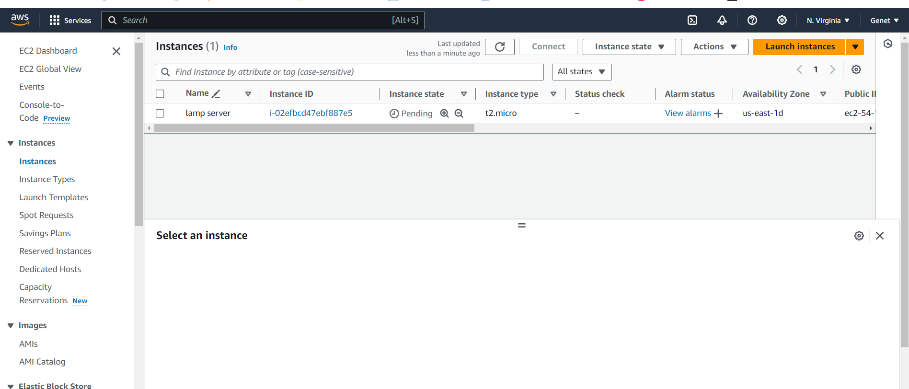
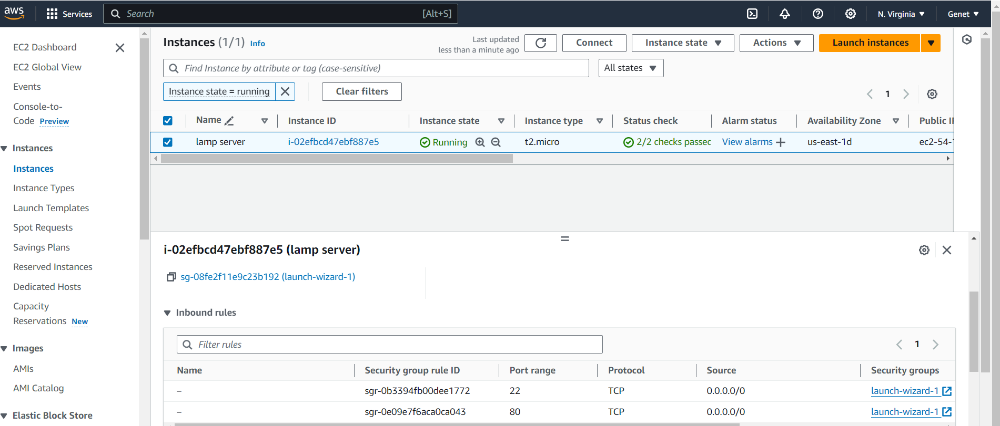
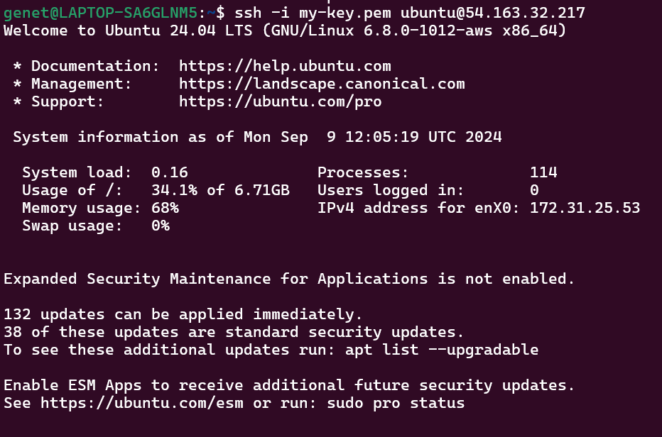
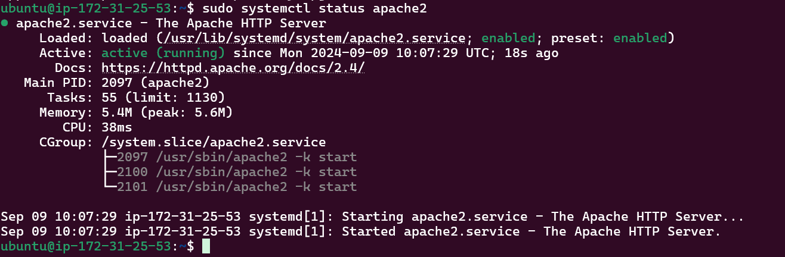
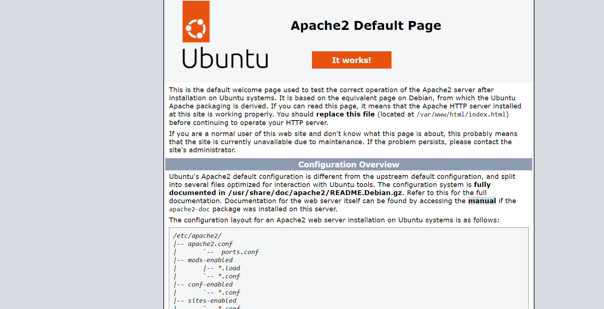
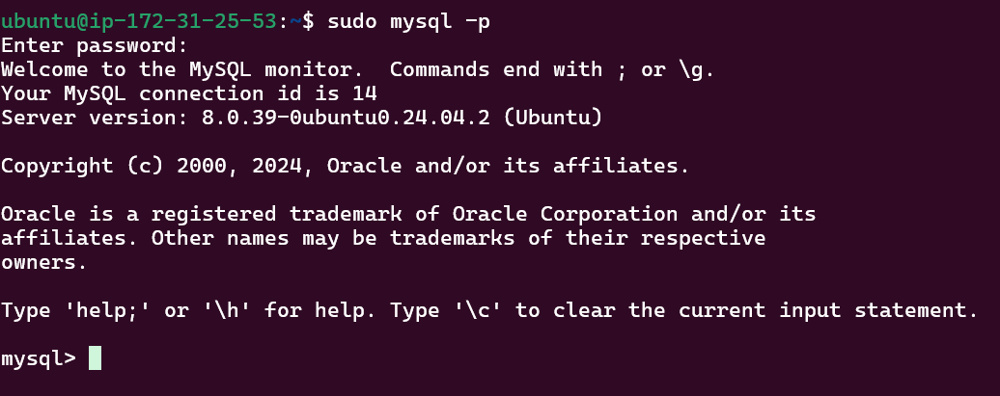
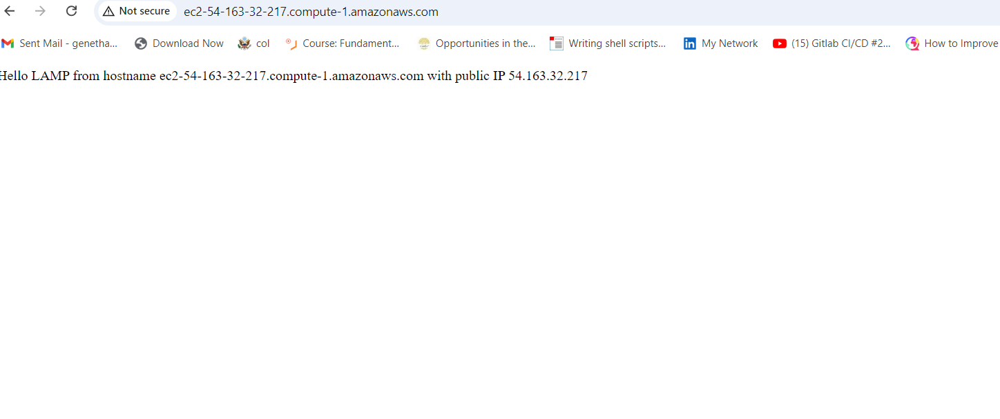
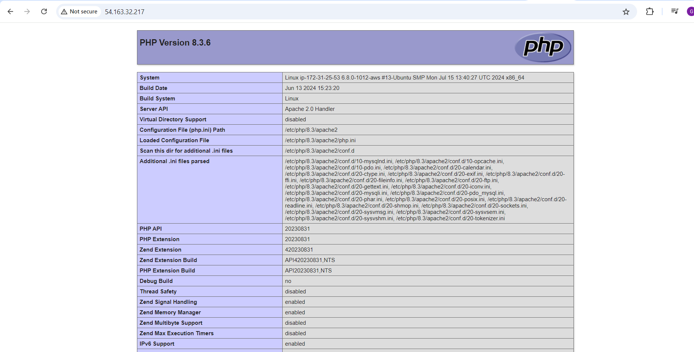

# LAMP Stack Setup on Ubuntu 24.04 LTS

This guide describes the step-by-step process I followed to set up a LAMP stack on an Ubuntu server. This environment, which includes Linux (Ubuntu), Apache, MySQL, and PHP, is essential for hosting websites and web applications.

## Step 1: Server Setup

1. **Launch EC2 Instance:**
   - I launched an EC2 instance of type **t2.micro** running **Ubuntu 24.04 LTS (HVM)** in the **us-east-1** region using the AWS console.

   

2. **Configure Security Group:**
 
To allow necessary traffic, I set up security rules to open HTTP (Port 80) to the world for web traffic and restrict SSH (Port 22) access to my IP for security reasons.

   

3. **Create SSH Key Pair:**
   I created an SSH key pair named my-key for secure access, adjusted file permissions, and connected to the instance using the following commands:
     ```bash
     chmod 400 my-key.pem
     ssh -i my-key.pem ubuntu@54.163.32.217 
     ```
 
  


##  Step 2. Install Apache 
First, I updated the package list and installed Apache:
```
sudo apt update
sudo apt install apache2 -y
```
Then, I enabled and started Apache:
```
sudo systemctl enable apache2
sudo systemctl status apache2
```

To verify Apache’s installation, I accessed the server's public IP address in a browser, which displayed the default Apache page:


##  Step 3. Install MySQL
I installed MySQL with the following command:
```
sudo apt install mysql-server
```
I ran the following command to start the MySQL secure installation script and I made the appropriate selections based on my security needs. After answering the remaining prompts (such as removing anonymous users, disallowing remote root login, and removing the test database), MySQL was fully secured.
```
sudo mysql_secure_installation
```
To ensure that everything was set up correctly, I tested logging in to MySQL using the new root password:
```
sudo mysql -p
```

After confirming that the setup was successful, I exited the MySQL console by typing:
```
exit
```
## Step 4. Install PHP

I created a PHP file to test PHP installation:
```
sudo vi  /var/www/html/info.php
```
Then, I restarted Apache to apply the changes:
```
sudo systemctl restart apache2
```
## Step 5: Setting Up a Virtual Host
After those steps I have created a virtual host for my website using Apache
The fist stpes is I created a directory for projectlamp using the following command:
```
sudo mkdir /var/www/projectlamp
```
Next, I assigned ownership of the directory to the current system user using the following command:
```
sudo chown -R $USER:$USER /var/www/projectlamp
```
I created a new configuration file in Apache's sites-available directory by running the following command:
```
sudo vi /etc/apache2/sites-available/projectlamp.conf
```
Then, I manually entered the following configuration:
```
<VirtualHost *:80>
    ServerName projectlamp
    ServerAlias www.projectlamp
    ServerAdmin webmaster@localhost
    DocumentRoot /var/www/projectlamp
    ErrorLog ${APACHE_LOG_DIR}/error.log
    CustomLog ${APACHE_LOG_DIR}/access.log combined
</VirtualHost>
```
I enabled the new virtual host by running the following command:
```
sudo a2ensite projectlamp
```
Then, I disabled the default Apache website to prevent it from conflicting with my new virtual host:
```
sudo a2dissite 000-default
```
Finally, I reloaded Apache to apply the changes:
```
sudo systemctl reload apache2
```
The web root directory /var/www/projectlamp was still empty, so I created an index.html file in that location to test the virtual host configuration. Here's the command I used:
```
sudo echo 'Hello LAMP from hostname' $(TOKEN=`curl -X PUT "http://169.254.169.254/latest/api/token" -H "X-aws-ec2-metadata-token-ttl-seconds: 21600"` && curl -H "X-aws-ec2-metadata-token: $TOKEN" -s http://169.254.169.254/latest/meta-data/public-hostname) 'with public IP' $(TOKEN=`curl -X PUT "http://169.254.169.254/latest/api/token" -H "X-aws-ec2-metadata-token-ttl-seconds: 21600"` && curl -H "X-aws-ec2-metadata-token: $TOKEN" -s http://169.254.169.254/latest/meta-data/public-ipv4) > /var/www/projectlamp/index.html
```
Afterward, I opened my browser and accessed the website using the public IP address:
```
http://54.163.32.217:80
```


To enable PHP as the default page for the website, I edited the dir.conf file in Apache’s mods-enabled directory. This file controls which file Apache loads first when a directory is accessed.
```
sudo vim /etc/apache2/mods-enabled/dir.conf
```
Changed the order in the DirectoryIndex directive so that index.php is prioritized over index.html:
```
DirectoryIndex index.php index.html index.cgi index.pl index.xhtml index.htm
```
To test that PHP is properly installed and configured on the server, I created a simple PHP script by running the following command:
```
echo "<?php phpinfo(); ?>" > /var/www/projectlamp/index.php
```
After saving and closing the file, I refreshed the page in my browser by visiting the server's public IP. This displayed the PHP information page, confirming that PHP was working correctly.

## Conclusion
In this demonstration, I’ve successfully set up a LAMP stack on an Ubuntu 24.04 LTS server hosted on AWS EC2. The process involved launching an EC2 instance, installing and configuring Apache, MySQL, and PHP, and verifying that each component works as expected. This setup provides a solid foundation for deploying web applications.