# LEMP Stack Setup on Ubuntu 24.04 LTS

This guide describes the step-by-step process I followed to set up a LEMP stack on an Ubuntu server. This environment, which includes Linux, Nginx, MySQL, and PHP , is essential for hosting websites and web applications.

## Step 0: Server Setup

1. **Launch EC2 Instance**

   I launched an EC2 instance of type **t2.micro** running **Ubuntu 24.04 LTS (HVM)** in the **us-east-1** region using the AWS console.

   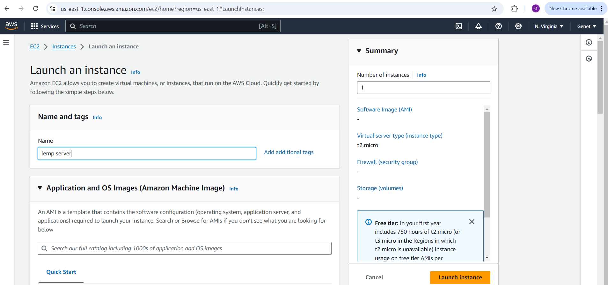
   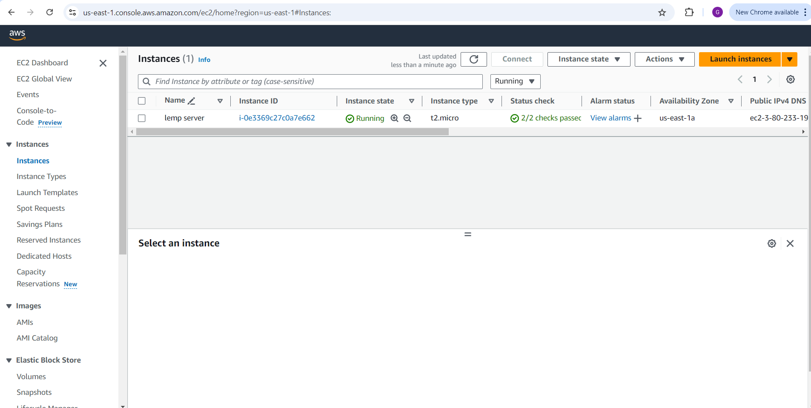

2. **Configure Security Group**
 
   To allow necessary traffic, I set up security rules to open HTTP (Port 80) to the world for web traffic and restrict SSH (Port 22) access to my IP for security reasons.

   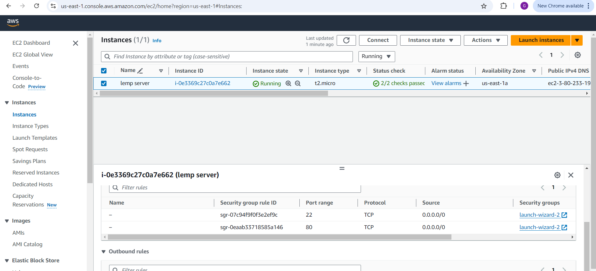

3. **Create SSH Key Pair**

   I created an SSH key pair named my-key for secure access, adjusted file permissions, and connected to the instance using the following commands:
     ```bash
     chmod 400 my-key.pem
     ssh -i my-key.pem ubuntu@3.80.233.195
     ```
    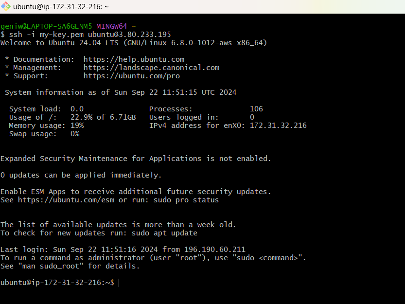

## Step 1: Installing the Nginx Web Server

1. **Update the package list**

   I started by updating my server’s package index to ensure I had access to the latest versions. I ran:
   ```bash
   sudo apt update
   ```
   
2. **Install Nginx**

   ```bash
   sudo apt install nginx
   ```
   I confirmed the installation when prompted by typing "Y."
   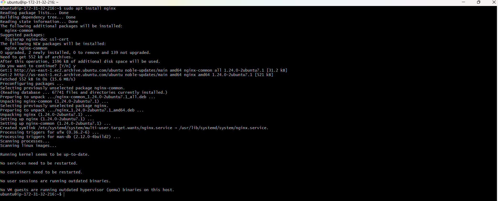
   
3. **Verify Nginx is running**

   Once Nginx was installed, I checked its status to ensure it was running by using:
   ```bash
   sudo systemctl status nginx
   ```
   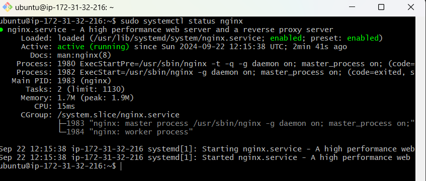
   The service showed as "active" in green, meaning Nginx was up and running.

4. **Test Nginx locally**

   To check if Nginx was running properly, I tested it locally on the server by running:
   ```bash
   curl http://localhost:80
   ```
   I also tried:
   ```bash
   curl http://127.0.0.1:80
   ```
   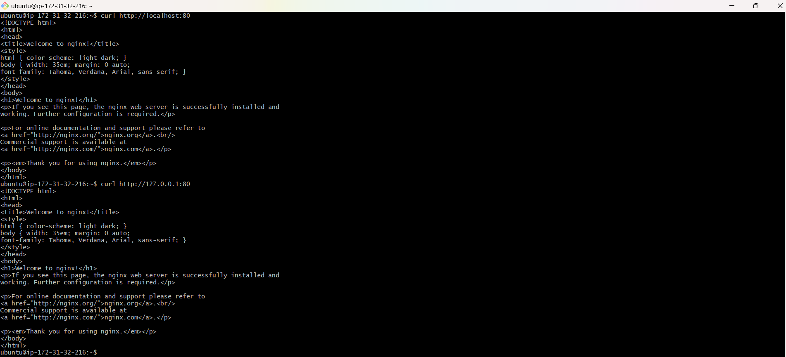
   Both commands confirmed that Nginx was serving content by returning the welcome page.

5. **Access Nginx via public IP**

   Finally, I tested the setup by accessing the Nginx welcome page from my web browser. I opened my browser and went to:
   ```
   http://3.80.233.195:80
   ```
   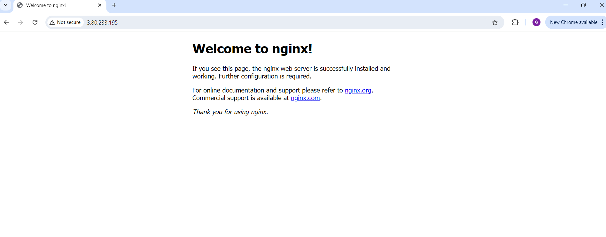
   I saw the Nginx welcome page, confirming that Nginx was successfully installed and accessible over the internet.

## Step 2: Installing MYSQL

1. **Install MySQL**

   To get MySQL installed, I used the following command:
   ```bash
   sudo apt install mysql-server
   ```
   When prompted, I confirmed the installation by typing "Y" and hitting `ENTER`.
   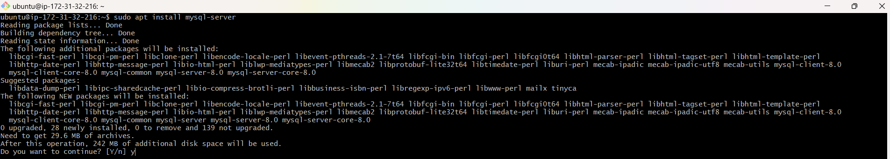

2. **Log into MySQL**

   Once the installation was done, I logged into MySQL as the root user by typing:
   ```bash
   sudo mysql
   ```
   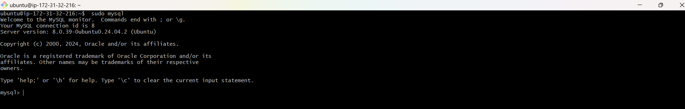
   This allowed me to access the MySQL monitor with administrative privileges.

3. **Set Root User Authentication and Password**
   ```
   ALTER USER 'root'@'localhost' IDENTIFIED WITH mysql_native_password BY 'PassWord.1';
   ```
   This command changed the root user's authentication method and set the password to `PassWord.1`.
4. **Secure MySQL**

   To improve security, I exited MySQL and ran the following script:
   ```bash
   sudo mysql_secure_installation
   ```
   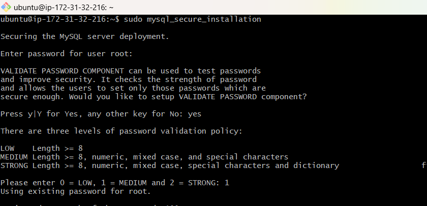
   
   I ran the following command to start the MySQL secure installation script and I made the appropriate selections based on my security needs. After answering the remaining prompts (such as removing anonymous users, disallowing remote root login, and removing the test database), MySQL was fully secured.

5. **Log in with Root Password**

   After securing MySQL, I tested the root password by running:
   ```bash
    sudo mysql -p
   ```
   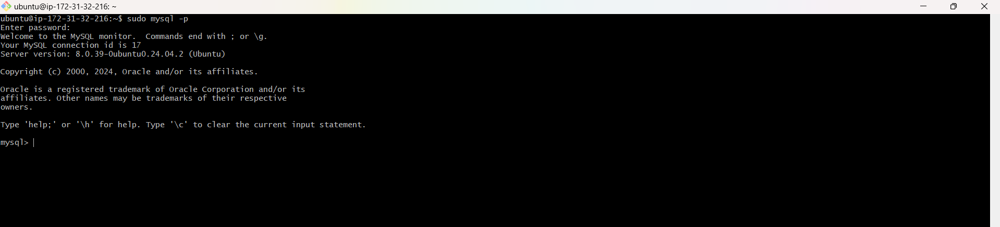
   This prompted me for the password I had set during the security configuration, confirming everything was properly set up.


## Step 3: Install PHP

   With Nginx and MySQL installed, I moved on to installing PHP to handle dynamic content and communicate with MySQL databases.

   To install PHP along with the necessary components for Nginx, I ran:
   ```bash
   sudo apt install php-fpm php-mysql
   ```
   When prompted, I confirmed the installation by typing "Y" and pressing `ENTER`.
   
   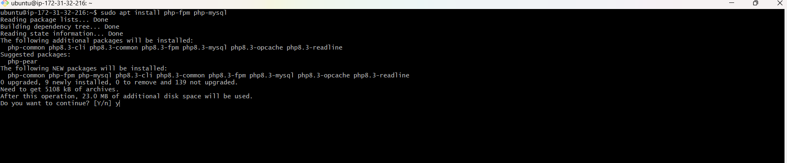

   This installed **php-fpm** (PHP FastCGI Process Manager) to allow Nginx to process PHP requests, and **php-mysql**, which enables PHP to communicate with MySQL databases.

## Step 4: Configuring Nginx to Use the PHP Processor


1. **Setup the Root Web Directory and Open Nginx Configuration File**

   I started by creating the root directory for my project and ensuring my user had ownership of it. Then, I opened a new Nginx configuration file using `nano`:

   ```bash
   sudo mkdir /var/www/projectLEMP
   sudo chown -R $USER:$USER /var/www/projectLEMP
   sudo nano /etc/nginx/sites-available/projectLEMP
   ```
   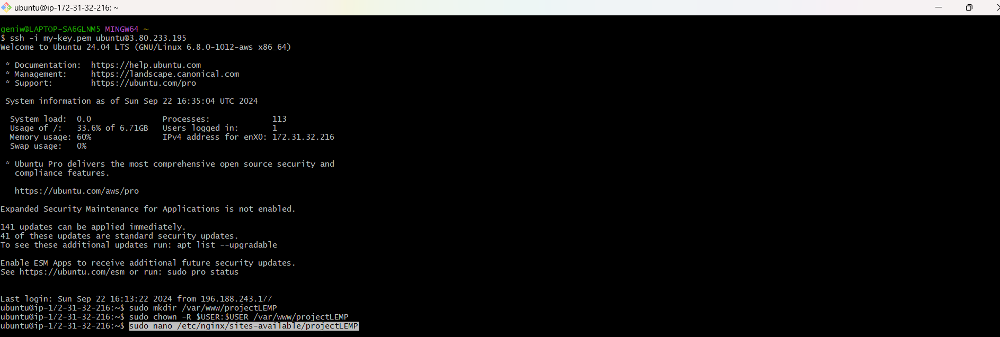

2. **Configure Nginx for PHP Processing**

   I pasted the following configuration into the blank file:
   ```
   server {
       listen 80;
       server_name projectLEMP www.projectLEMP;
       root /var/www/projectLEMP;

       index index.html index.htm index.php;

       location / {
           try_files $uri $uri/ =404;
       }

       location ~ \.php$ {
           include snippets/fastcgi-php.conf;
           fastcgi_pass unix:/var/run/php/php8.3-fpm.sock;
       }

       location ~ /\.ht {
           deny all;
       }
   }
   ```
   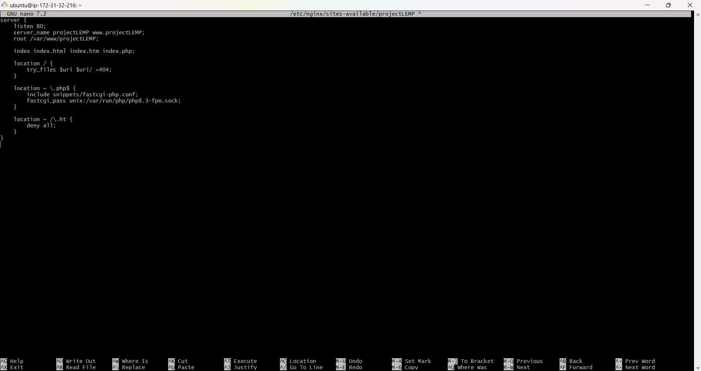

    Explanation of Directives and Location Blocks:

   - **listen**:  
     Defines the port on which Nginx listens. In this case, Nginx listens on port 80, the default port for HTTP traffic.
   - **root**:  
     Defines the root directory where the files for this website are stored. In this case, it's `/var/www/projectLEMP`.
   - **index**:  
     Specifies the order in which Nginx prioritizes index files. Here, `index.html` is listed before `index.php`, which means if both files are present, `index.html` will be served.
   - **server_name**:  
     Defines which domain names or IP addresses this server block responds to. This should be set to your domain name or the public IP address of the server. In this case, it's set to `projectLEMP`.
   - **location /**:  
     This block checks for the existence of files or directories that match the requested URI. If none are found, it returns a 404 error.
   - **location ~ \.php$**:  
     This block handles PHP processing by including the `fastcgi-php.conf` file and pointing Nginx to the PHP-FPM socket (`php8.3-fpm.sock`) for handling PHP files.
   - **location ~ /\.ht**:  
     This block denies access to any `.htaccess` files, which Nginx doesn't process. This adds an extra layer of security by preventing access to such files.

   This configuration tells Nginx to serve files from `/var/www/projectLEMP` and process `.php` files using PHP-FPM.

3. **Save and Exit `nano`**

   After entering the configuration, I saved and exited `nano` by pressing `CTRL + X`, then `Y` to confirm, and `ENTER` to save.

   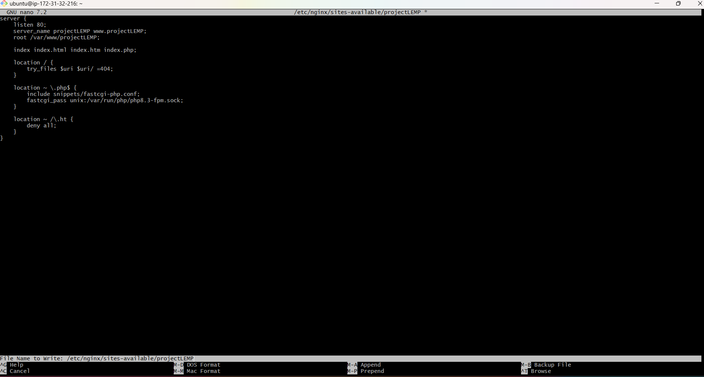

4. **Enable the New Nginx Configuration**

   I created a symbolic link to enable the configuration file:
   ```bash
   sudo ln -s /etc/nginx/sites-available/projectLEMP /etc/nginx/sites-enabled/
   ```

5. **Test Nginx Configuration for Syntax Errors**

   Before reloading Nginx, I tested the configuration to ensure there were no errors:
   ```bash
   sudo nginx -t
   ```

   If everything was correct, I saw this message:

   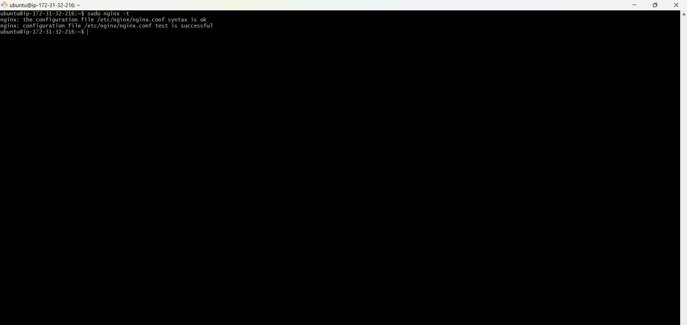

6. **Unlink the Default Nginx Site Configuration**  
   Since Nginx has a default server block that listens on port 80, which may interfere with your new configuration, I disabled it by running:
   ```bash
   sudo unlink /etc/nginx/sites-enabled/default
   ```
   This command removes the symbolic link to the default site configuration in the `sites-enabled` directory.

7. **Reload Nginx to Apply Changes**  
   After disabling the default configuration, I reloaded Nginx to apply the changes:
   ```bash
   sudo systemctl reload nginx
   ```
   This step ensures that the changes made to Nginx configurations are applied, and it starts using the new server block defined for the `projectLEMP`.

8. **Create a Test HTML File**

   I created a simple test file to confirm that my Nginx server was working:
   ```bash
   sudo echo 'Hello LEMP from hostname' $(TOKEN=`curl -X PUT "http://169.254.169.254/latest/api/token" -H "X-aws-ec2-metadata-token-ttl-seconds: 21600"` && curl -H "X-aws-ec2-metadata-token: $TOKEN" -s http://169.254.169.254/latest/meta-data/public-hostname) 'with public IP' $(TOKEN=`curl -X PUT "http://169.254.169.254/latest/api/token" -H "X-aws-ec2-metadata-token-ttl-seconds: 21600"` && curl -H "X-aws-ec2-metadata-token: $TOKEN" -s http://169.254.169.254/latest/meta-data/public-ipv4) > /var/www/projectLEMP/index.html
   ```
   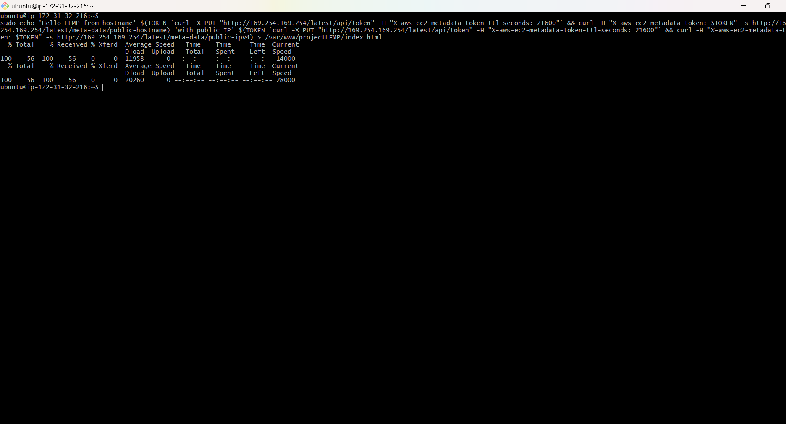

9. **Test the Setup**

    I opened my web browser and navigated to the server’s public IP address:
    ```
    http://3.80.233.195:80
    ```
    
    If everything worked correctly, I saw the text:
    ```
    Hello LEMP from hostname ec2-3-80-233-195.compute-1.amazonaws.com with public IP 3.80.233.195
    ```
   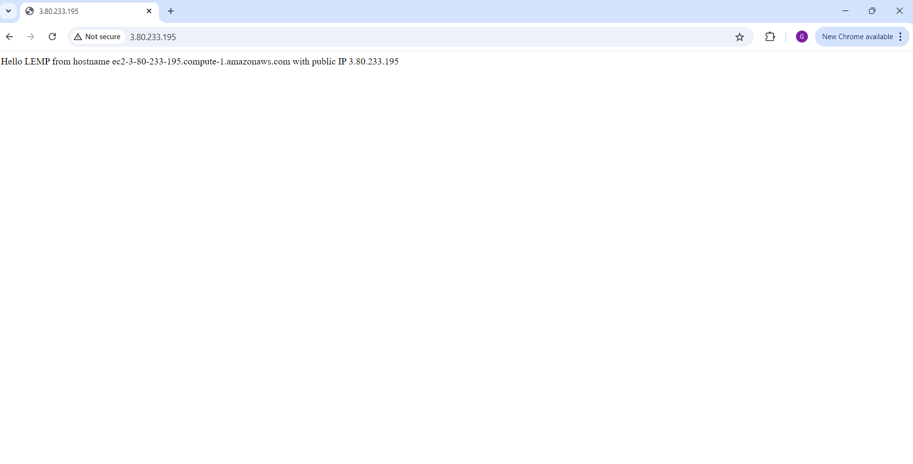
   By following these steps, I successfully configured Nginx to process PHP and served content from my project directory.

## Step 5: Testing PHP with Nginx

1. **Create a PHP Info File**

   I created a PHP file to test that PHP is correctly configured with Nginx. First, I navigated to my document root and created a file named `info.php`:
   ```bash
   nano /var/www/projectLEMP/info.php
   ```

   Inside the file, I added the following PHP code:
   ```
   <?php
   phpinfo();
   ```
   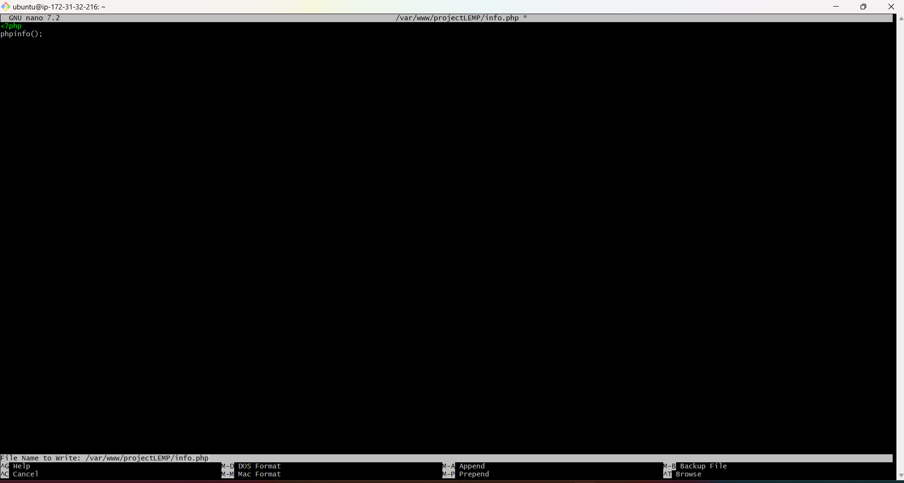
   This code outputs detailed information about the PHP setup on my server.

2. **Access the PHP Info Page**

   After saving the file, I opened my web browser and navigated to the following URL, replacing `<Public-IP-Address>` with my server’s actual IP address:
   ```bash
   http://3.80.233.195/info.php
   ```
   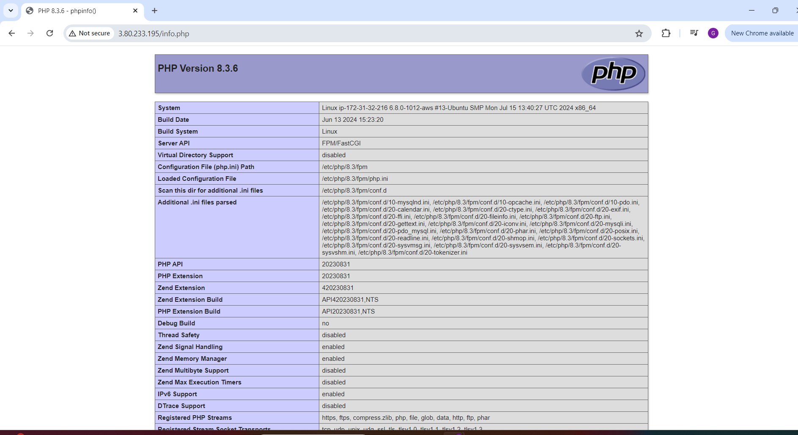
   This displayed a webpage with detailed information about my PHP installation, including the version, configuration, and extensions.

3. **Remove the PHP Info File**

   Since the `info.php` file exposes sensitive information about the server, I removed it after verifying the setup to ensure security:
   ```bash
   sudo rm /var/www/projectLEMP/info.php
   ```
   By removing this file, I ensured that no sensitive PHP or server details would remain publicly accessible.

## Step 6:  Retrieve Data from MySQL database with PHP

1. **Create the Database**

   I started by accessing my MySQL console as the root user using the following command:

   ```bash
   sudo mysql
   ```

   Then, I created a new database called example_database with:

   ```sql
   CREATE DATABASE `example_database`;
   ```
   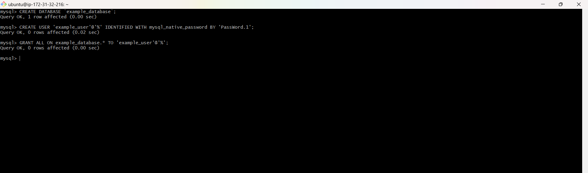 

2. **Create a New User and Assign Privileges**

   Next, I created a MySQL user named `example_user`, defined the password, and used the mysql_native_password method for authentication:

   ```sql
   CREATE USER 'example_user'@'%' IDENTIFIED WITH mysql_native_password BY 'PassWord.1';
   ```

   I then granted this user full privileges to the example_database:

   ```sql
   GRANT ALL ON example_database.* TO 'example_user'@'%';
   ```

3. **Test User Permissions**

   After creating the user, I exited the MySQL console with:

   ```sql
   exit;
   ```

   To confirm the permissions for the new user, I logged back in as `example_user`:

   ```bash
   mysql -u example_user -p
   ```

   I then checked the available databases to verify that the `example_database` was accessible:

   ```sql
   SHOW DATABASES;
   ```
   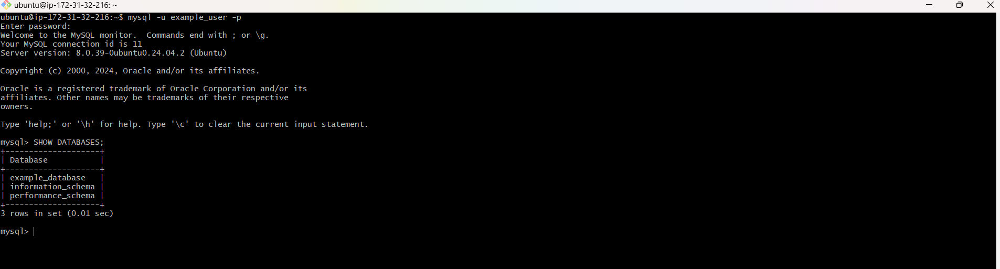
   As expected, `example_database`was listed along with `information_schema`.

4. **Create a Test Table**

   Still in the MySQL console, I created a table named `todo_list` within the `example_database`:

   ```sql
     CREATE TABLE example_database.todo_list (
         item_id INT AUTO_INCREMENT,
         content VARCHAR(255),
         PRIMARY KEY(item_id)
    );
   ```
   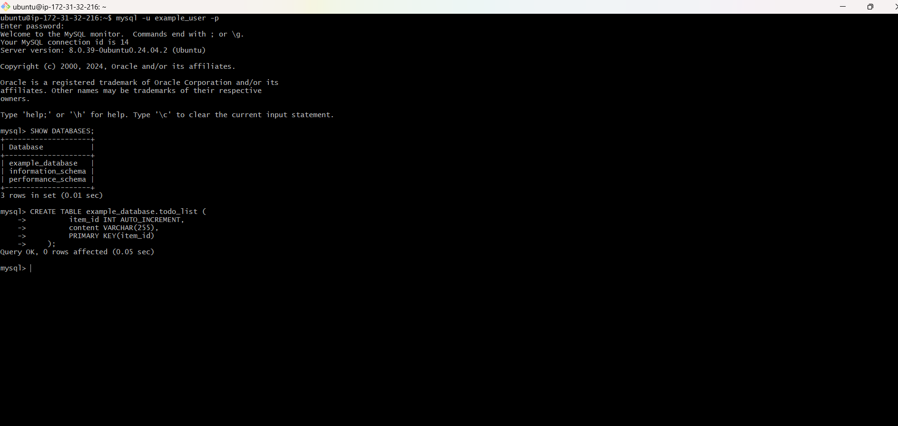

5. **Insert Data into the Table**

   I proceeded to insert a few sample items into the `todo_list` table using:

   ```sql
   INSERT INTO example_database.todo_list (content) VALUES ("My first important item");
   INSERT INTO example_database.todo_list (content) VALUES ("My second important item");
   INSERT INTO example_database.todo_list (content) VALUES ("My third important item");
   ```
   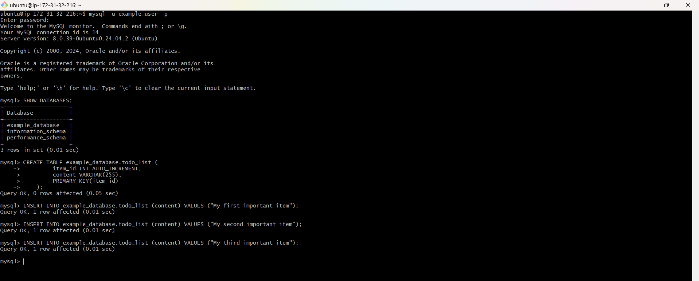

6. **Retrieve Data from the Table**

   To verify that the data had been successfully inserted, I ran:

   ```sql
   SELECT * FROM example_database.todo_list;
   ```
   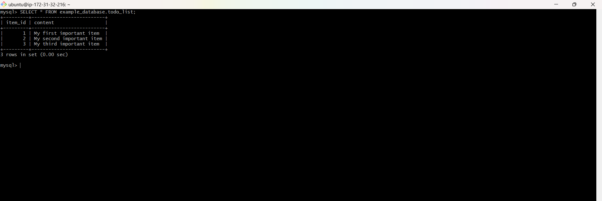
   The query returned the items I inserted, confirming that the data was correctly stored.

7. **PHP Script to Retrieve and Display Data**

   I then created a PHP file called `todo_list.php` within `/var/www/projectLEMP/` directory. The PHP script below was used to retrieve and display the `todo_list` items from MySQL:
   ```
   sudo nano /var/www/projectLEMP/todo_list.php
   ```
   ```php
   <?php
   $user = "example_user";
   $password = "PassWord.1";
   $database = "example_database";
   $table = "todo_list";

   try {
     $db = new PDO("mysql:host=localhost;dbname=$database", $user, $password);
     echo "<h2>TODO</h2><ol>";

     foreach($db->query("SELECT content FROM $table") as $row) {
        echo "<li>" . $row['content'] . "</li>";
    }
    echo "</ol>";
   } catch (PDOException $e) {
    print "Error!: " . $e->getMessage() . "<br/>";
    die();
   }
   ?>
   ```
   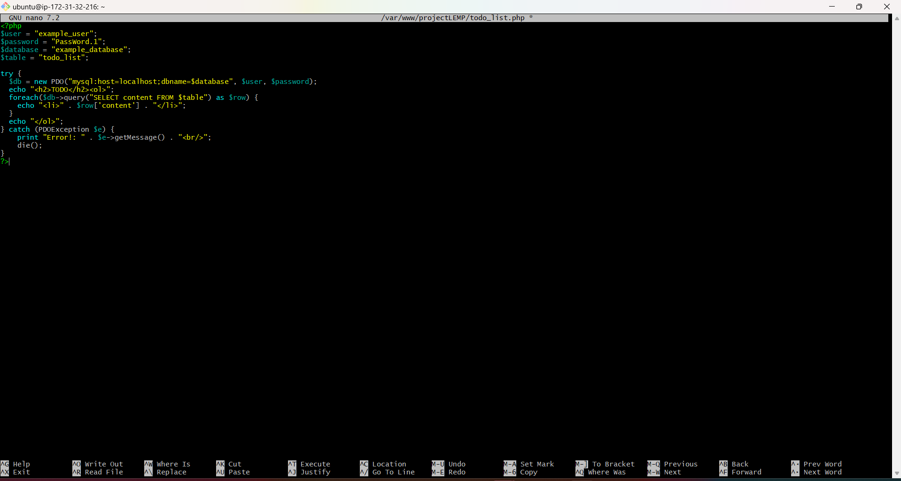
8. **Test the PHP Script**

   Finally, I tested the PHP script by navigating to the following URL in my browser:

   ```
   http://3.80.233.195/todo_list.php
   ```
   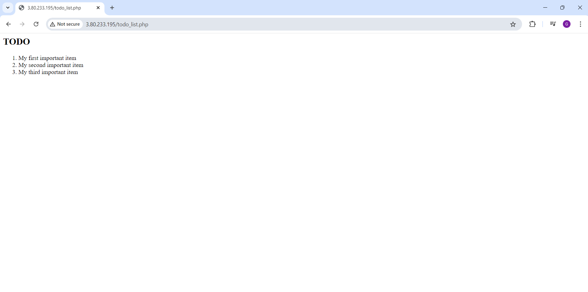
   This displayed the list of todo_list items as expected.

## Conclusion
   By following this comprehensive guide, I successfully set up a LEMP stack on Ubuntu 24.04 LTS, installed and configured Nginx, MySQL, and PHP, and demonstrated data retrieval using PHP from a MySQL database. This environment is now ready to host dynamic web applications efficiently.