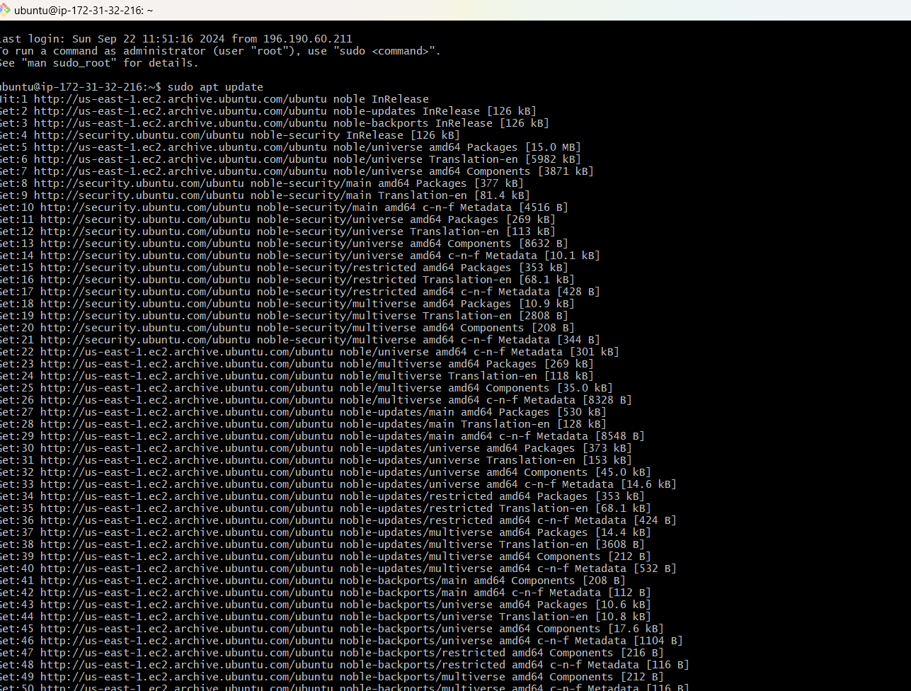

# LEMP Stack Setup on Ubuntu 24.04 LTS

This guide describes the step-by-step process I followed to set up a LAMP stack on an Ubuntu server. This environment, which includes Linux, Nginx, MySQL, and PHP , is essential for hosting websites and web applications.

## Step 0: Server Setup

1. **Launch EC2 Instance:**
   - I launched an EC2 instance of type **t2.micro** running **Ubuntu 24.04 LTS (HVM)** in the **us-east-1** region using the AWS console.

   
   

2. **Configure Security Group:**
 
To allow necessary traffic, I set up security rules to open HTTP (Port 80) to the world for web traffic and restrict SSH (Port 22) access to my IP for security reasons.

   

3. **Create SSH Key Pair:**
   I created an SSH key pair named my-key for secure access, adjusted file permissions, and connected to the instance using the following commands:
     ```bash
     chmod 400 my-key.pem
     ssh -i my-key.pem ubuntu@3.80.233.195
     ```
 

## Step 1: Installing the Nginx Web Server

1. **Update the package list**

I started by updating my server’s package index to ensure I had access to the latest versions. I ran:
```bash
sudo apt update
```

2. **Install Nginx**

```bash
sudo apt install nginx
```
I confirmed the installation when prompted by typing "Y."

3. **Verify Nginx is running**

Once Nginx was installed, I checked its status to ensure it was running by using:
```bash
sudo systemctl status nginx
```
The service showed as "active" in green, meaning Nginx was up and running.

4. **Test Nginx locally**

To check if Nginx was running properly, I tested it locally on the server by running:
```bash
curl http://localhost:80
```
I also tried:
```bash
curl http://127.0.0.1:80
```
Both commands confirmed that Nginx was serving content by returning the welcome page.

5. **Access Nginx via public IP**

Finally, I tested the setup by accessing the Nginx welcome page from my web browser. I opened my browser and went to:
```
http://3.80.233.195:80
```
I saw the Nginx welcome page, confirming that Nginx was successfully installed and accessible over the internet.


This confirmed that my Nginx web server was successfully installed, running, and accessible through the firewall. At this point, my basic web server setup was complete!