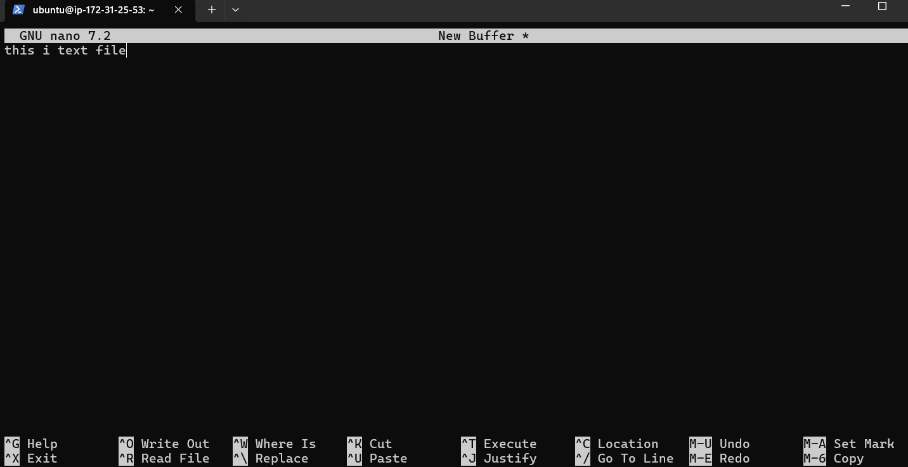

## Nano Editor
## Objective:
To become proficient in using the Nano text editor for editing files, managing configuration files, and improving productivity within a terminal environment.

## 1. **Introduction to Nano**
   - **What is Nano?**
     - A simple, user-friendly terminal-based text editor.
     - Commonly used for editing configuration files in Unix/Linux environments.
     - Pre-installed on many Linux distributions.
   
   - **Why Use Nano?**
     - Lightweight and easy to learn.
     - Offers basic functionality without the steep learning curve of other editors like Vim or Emacs.

   - **Installation**:
     - Nano comes pre-installed on most Linux systems. If not, you can install it using:
       ```bash
       sudo apt install nano  # On Debian/Ubuntu
       sudo yum install nano  # On CentOS/RHEL
       ```

## 2. **Basic Operations**

   - **Opening a File**:
     ```
     nano filename.txt
     ```
    

   - **Navigation**:
     - Use the arrow keys to move through the text.
     - Page Up/Down to scroll.
   
   - **Editing Text**:
     - Type normally to insert text.
     - Backspace/Delete to remove text.

   - **Saving Changes**:
     - To save changes and exit, press `Ctrl + O` (write out), then `Enter`.
     - To exit without saving, press `Ctrl + X` and then press `N` when prompted.

   - **Canceling Commands**:
     - Press `Ctrl + C` to cancel any command and return to the editor.

## 3. **Advanced Features**
   - **Search**:
     - To search for text, press `Ctrl + W`, type your search term, and press `Enter`.
     - To search for the next occurrence, press `Ctrl + W` again and then `Ctrl + W` to repeat the search.

   - **Cut, Copy, and Paste**:
     - **Cut Text**: To cut a line, press `Ctrl + K`.
     - **Copy Text**: To copy text, press `Alt + 6` after selecting the desired text using `Ctrl + ^` (start of selection).
     - **Paste Text**: Press `Ctrl + U` to paste the cut/copied text.

   - **Undo/Redo**:
     - To undo, press `Alt + U`.
     - To redo, press `Alt + E`.

   - **Multiple Buffers**:
     - Nano supports multiple buffers (files) to open. Use `Ctrl + R` to open another file while editing the current one.

## 4. **Common Shortcuts**
   | Command       | Shortcut         |
   |---------------|------------------|
   | Save          | `Ctrl + O`       |
   | Exit          | `Ctrl + X`       |
   | Search        | `Ctrl + W`       |
   | Cut Line      | `Ctrl + K`       |
   | Paste Text    | `Ctrl + U`       |
   | Undo          | `Alt + U`        |
   | Redo          | `Alt + E`        |
   | Toggle Line Numbers | `Alt + #`  |


