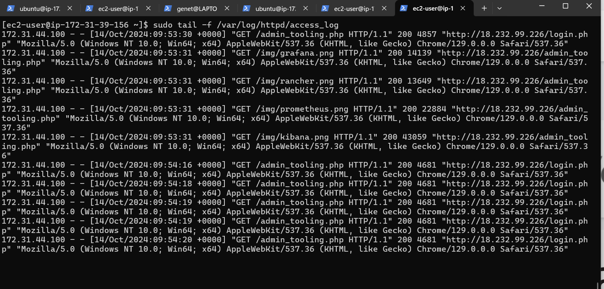

## Load Balancer Solution with Apache

### **Introduction:**

In modern web architectures, ensuring high availability and scalability is crucial for handling increased web traffic. One way to achieve this is by distributing traffic across multiple web servers through a **load balancer**. In this project, I configured an **Apache Load Balancer** on an Ubuntu EC2 instance, balancing traffic between two web servers. Additionally, the setup includes a **MySQL database server** and an **NFS server** for file sharing across the web servers. This architecture ensures both **horizontal scaling** and **reliability** by distributing traffic and centralizing file storage.

The key steps of the project include setting up an EC2 instance for the load balancer, configuring Apache to act as a load balancer, and verifying the distribution of traffic across the web servers.

---

### Prerequisites:
- I ensured that two **RHEL8 web servers**, one **MySQL DB server** (Ubuntu 20.04), and one **RHEL8 NFS server** were properly set up. 
- I confirmed that Apache was installed and running on both web servers.
- I ensured that the directories `/var/www/` from both web servers were mounted to `/mnt/apps/` on the NFS server.

---

### **Configure Apache as Load Balancer**

1. I launched an EC2 instance with Ubuntu 20.04 and named it `Project-8-apache-lb`.
2. I opened TCP port 80 by configuring an inbound rule in the security group for the instance.
   
   

3. Installed Apache Load Balancer on the Project-8-apache-lb server and configured it to direct traffic to both web servers:

```bash
# Install apache2
sudo apt update
sudo apt install apache2 -y
sudo apt-get install libxml2-dev

# Enable the following modules:
sudo a2enmod rewrite
sudo a2enmod proxy
sudo a2enmod proxy_balancer
sudo a2enmod proxy_http
sudo a2enmod headers
sudo a2enmod lbmethod_bytraffic

# Restart apache2 service
sudo systemctl restart apache2

# Check if apache2 is up and running
sudo systemctl status apache2
```


---

### **Configure Apache as a Load Balancer**

1. I edited the Apache configuration file:
   ```bash
   sudo nano /etc/apache2/sites-available/000-default.conf
   ```
2. I added the following load balancer configuration under `<VirtualHost *:80>`:
   ```bash
   <Proxy "balancer://mycluster">
       BalancerMember http://<WebServer1-Private-IP>:80 loadfactor=5 timeout=1
       BalancerMember http://<WebServer2-Private-IP>:80 loadfactor=5 timeout=1
       ProxySet lbmethod=bytraffic
   </Proxy>

   ProxyPreserveHost On
   ProxyPass / balancer://mycluster/
   ProxyPassReverse / balancer://mycluster/
   ```
   
---

### **Verify the Load Balancer Configuration**

1. I restarted the Apache service to apply the changes:
   ```bash
   sudo systemctl restart apache2
   ```

2. I checked to ensure Apache was running:
   ```bash
   sudo systemctl status apache2
   ```

3. I accessed the load balancer's public IP or DNS in a browser:
   ```bash
   http://18.232.99.226/index.php
   ```
   

4. To confirm that load balancing was working, I SSHed into both web servers and checked the access logs:
   ```bash
   sudo tail -f /var/log/httpd/access_log
   ```
   

   I refreshed the browser multiple times and saw logs being generated on both servers as the requests were distributed.

---

**Note:** I tested other load balancing methods:
- `byrequests`: balancing based on the number of requests.
- `bybusyness`: balancing based on the current load of the servers.
- `heartbeat`: monitoring the server's health.

---

### **Configure Local DNS Names (Optional)**

#### **1. I Opened the `/etc/hosts` File**

On the **load balancer (LB) server**, I opened the `/etc/hosts` file for editing:

```bash
sudo nano /etc/hosts
```

#### **2. I Added Entries for the Web Servers**

I added the following two records to map the IP addresses of the web servers to names like `Web1` and `Web2`. I replaced `<WebServer1-Private-IP-Address>` and `<WebServer2-Private-IP-Address>` with the actual private IP addresses of the web servers.

Example:
```
172.31.39.156 Web1
172.31.44.106 Web2
```


#### **3. I Updated the Apache Load Balancer Configuration**

I replaced the IP addresses with the new names (`Web1` and `Web2`) in the `BalancerMember` directives in the Apache configuration file:

```apache
<Proxy "balancer://mycluster">
    BalancerMember http://Web1:80 loadfactor=5 timeout=1
    BalancerMember http://Web2:80 loadfactor=5 timeout=1
    ProxySet lbmethod=bytraffic
</Proxy>

ProxyPass / balancer://mycluster/
ProxyPassReverse / balancer://mycluster/
```


#### **4. I Tested the Configuration**

Once I updated the configuration, I restarted Apache on the load balancer:

```bash
sudo systemctl restart apache2
```

I then tested if the new names (`Web1` and `Web2`) resolved correctly by running `curl` commands from the LB server:

```bash
curl http://Web1
curl http://Web2
```


Everything worked correctly, and I received responses from the web servers.

---

### **Important Note:**
This DNS resolution is local to the Load Balancer. It will not be accessible from other servers or the Internet. It’s a quick and easy way to manage your servers without needing to remember or type out IP addresses.

---

### **Target Architecture:**


- **Load Balancer (LB):** Distributes incoming traffic across multiple web servers, ensuring availability and improved performance.
- **Web Servers (Web-Server 1 and Web-Server 2):** Handle requests routed by the load balancer and communicate with the database server for data.
  - **TCP 80:** Communication between the load balancer and the web servers happens over port 80 (HTTP).
- **Database Server (DB Server):** Both web servers connect to a centralized database via **TCP 3306** (MySQL default port).

---

### **Flow of Traffic:**

1. **Client to Load Balancer (TCP 80):** Incoming traffic is received by the load balancer, which forwards the requests to one of the web servers based on your load balancing method.
2. **Web Servers to DB Server (TCP 3306):** Each web server communicates with the database server to handle data-related operations.

---

### **Conclusion:**

In this project, I successfully implemented a **load balancing solution** using an Apache load balancer on an Ubuntu EC2 instance, distributing traffic across two web servers. This setup allows for **horizontal scaling**, meaning the system can efficiently manage increased traffic by distributing requests across multiple servers, improving both **performance** and **reliability**. Additionally, the architecture includes a **MySQL database** and **NFS server** for centralized data and file storage, further enhancing the solution's robustness.

Throughout the project, I configured the Apache load balancer, set up local DNS resolution for easier management of web servers, and verified that the load balancer was distributing traffic evenly across both web servers. Different load balancing methods, such as **bytraffic**, **byrequests**, and **bybusyness**, were tested to optimize traffic distribution.

