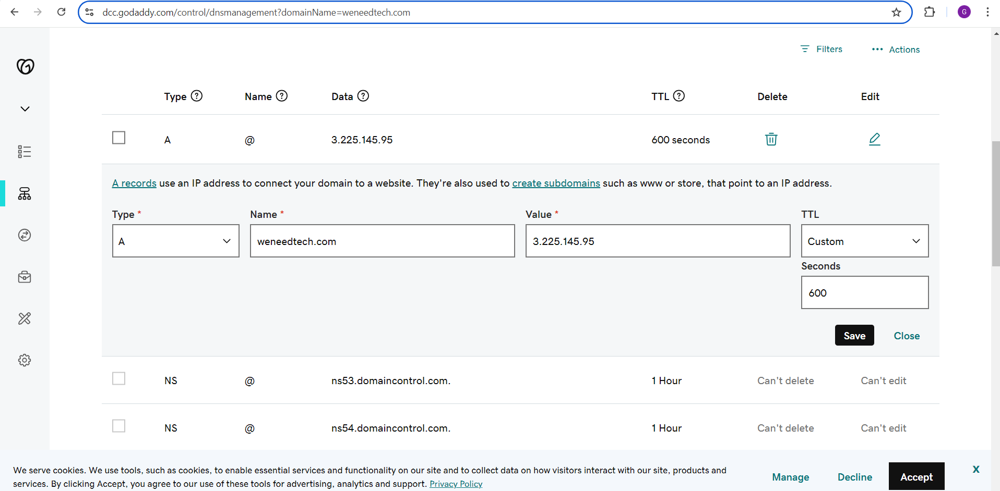

## Load Balancer Solution with Nginx and SSL/TLS

### Introduction

In this project, I configured a highly available and secure web application infrastructure using Nginx as a load balancer with SSL/TLS certificates, integrated with Jenkins for CI/CD. The goal was to ensure that web traffic is evenly distributed between two web servers, with secure communication enabled for client traffic. Additionally, the infrastructure leverages GitHub for version control and Jenkins for automating the deployment of updates to the web servers.

---

### Part 1: I Configured Nginx as a Load Balancer

#### 1. **I Created an EC2 VM for Nginx**
   - I launched an EC2 instance with **Ubuntu Server 20.04 LTS** and named it **Nginx_LB**.
   - I made sure to open the required ports in the **Security Group**:
     - **TCP port 80** for HTTP traffic.
     - **TCP port 443** for HTTPS traffic.
    
     

#### 2. **I Updated the /etc/hosts File**
   - I updated the `/etc/hosts` file on the EC2 instance to resolve the Web Servers' names (e.g., `Web1` and `Web2`) and their respective IP addresses.

     

#### 3. **I Installed and Configured Nginx**
   - **Updated and Installed Nginx**:
     ```bash
     sudo apt update
     sudo apt install nginx
     ```
   - **Configured Nginx as a Load Balancer**:
     - I opened the Nginx configuration file:
       ```bash
       sudo vi /etc/nginx/nginx.conf
       ```
     - I added the following configuration inside the `http` section to define an upstream for the web servers:
       ```bash
       upstream myproject {
           server Web1 weight=5;
           server Web2 weight=5;
       }
       
       server {
           listen 80;
           server_name www.domain.com;
           location / {
               proxy_pass http://myproject;
           }
       }
       ```
       

     - I also commented out the following line in the configuration file:
       ```bash
       # include /etc/nginx/sites-enabled/*;
       ```
  
#### 4. **I Restarted Nginx**
   - After making the configuration changes, I restarted the Nginx service to apply the changes:
     ```bash
     sudo systemctl restart nginx
     sudo systemctl status nginx
     ```
     

---

### Part 2: Register a New Domain Name and Configure Secured Connection Using SSL/TLS Certificates

#### 1. **I Registered a Domain Name**
   - I registered a new domain using [GoDaddy](https://www.godaddy.com).
   - I selected my preferred domain zone such as `.com`.

#### 2. **I Assigned an Elastic IP**
   - I assigned an **Elastic IP** to my Nginx Load Balancer (EC2 instance).
   - This ensures that the public IP address will remain static, even after the EC2 instance reboots.
    
     

     

#### 3. **I Updated the DNS A Record**
   - I went into my domain registrar’s settings and updated the **A Record** to point to the Elastic IP.
   - This step links the domain name to the public IP address of my Nginx Load Balancer.

     

#### 4. **I Configured Nginx to Recognize My Domain Name**
   - I updated the Nginx configuration file to recognize my new domain name by adding:
     ```bash
     server_name www.weneedtech.com;
     ```
     

   - This ensures that Nginx is aware of my domain and can respond to requests using my domain name.
    
#### 5. **I Installed Certbot and Requested SSL/TLS Certificates**
   - I installed **Certbot** to obtain SSL certificates for my domain:
     ```bash
     sudo snap install --classic certbot
     ```
   - After installing Certbot, I ran the following command to request the certificates:
     ```bash
     sudo ln -s /snap/bin/certbot /usr/bin/certbot
     sudo certbot --nginx
     ```
     
     
   - Certbot automatically handled the certificate installation and updated my Nginx configuration to enable HTTPS.

   - I opened my web browser and tried to reach my website using HTTPS by entering the following URL in the address bar:
     ```
     https://www.weneedtech.com/
     ```
     

     I successfully deployed using Nginx, and my new domain is now accessible.
---

#### **Note**: Set Up Periodical Renewal for SSL/TLS Certificates
   - Let's Encrypt SSL certificates are only valid for 90 days, so it's important to set up a **cron job** to renew them automatically:
     ```bash
     sudo crontab -e
     ```
   - In the crontab file, you can add the following line to renew the certificate twice a day:
     ```bash
     0 */12 * * * /usr/bin/certbot renew >/dev/null 2>&1
     ```

---


### Conclusion

In this project, I successfully set up a robust and secure web infrastructure with an Nginx load balancer, SSL/TLS certificates, and automated deployments through Jenkins. This architecture ensures that the application remains highly available and scalable, while also securing client communication with HTTPS. By integrating CI/CD, we can deploy changes efficiently and safely to the production environment. This setup is now capable of handling client traffic with a balance between security, performance, and high availability.

---
