# MEAN Stack Setup on Ubuntu 24.04 LTS

This guide describes the step-by-step process I followed to set up a MEAN stack on my Ubuntu server. The MEAN stack includes **MongoDB**, **ExpressJS**, **Angular**, and **NodeJS**, which are essential for building and deploying modern web applications.

### Prerequisites:
- **Ubuntu 24.04 LTS** server (with root or sudo privileges)
- **Basic knowledge of Linux commands**
- **Installed Node.js and npm** on my system
- **MongoDB server installed**

## Step 0: Server Setup

1. **Launch EC2 Instance**

   I launched an EC2 instance of type **t2.micro** running **Ubuntu 24.04 LTS (HVM)** in the **us-east-1** region using the AWS console.

   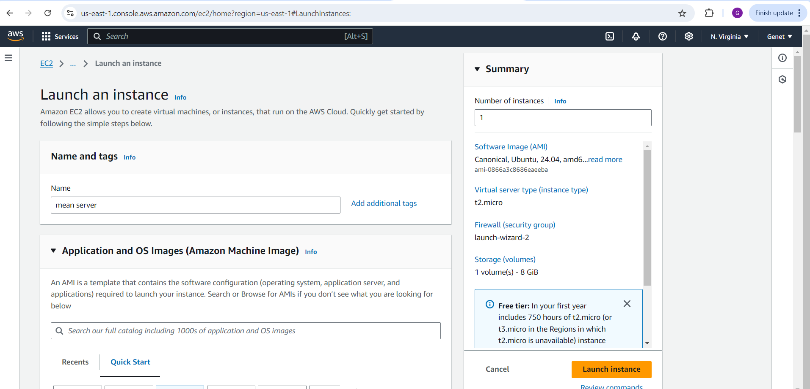
  
2. **Configure Security Group**
 
   To allow necessary traffic, I set up security rules to open HTTP (Port 80) to the world for web traffic and restrict SSH (Port 22) access to my IP for security reasons.

   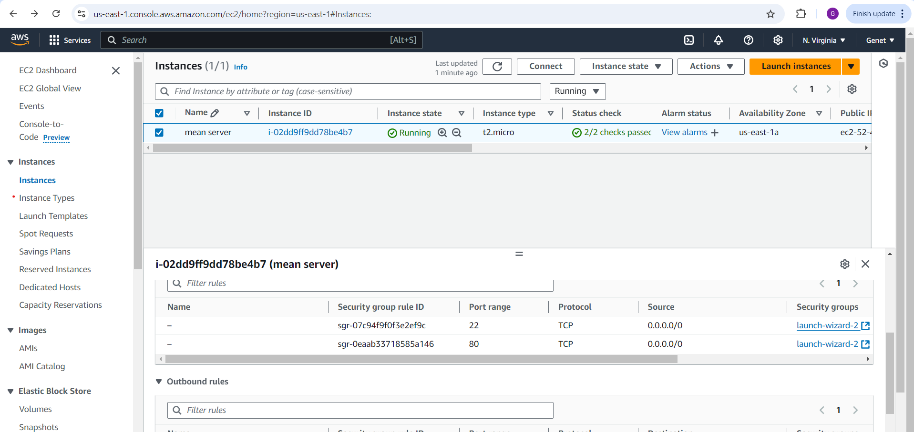

3. **Create SSH Key Pair**

   I created an SSH key pair named my-key for secure access, adjusted file permissions, and connected to the instance using the following commands:
     ```bash
     chmod 400 my-key.pem
     ssh -i my-key.pem ubuntu@52.4.87.127
     ```
    For this project, I connected to my EC2 instance using the `CLI` from the `AWS` Web Console.

    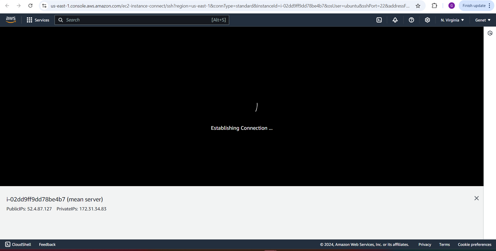

## Step 1: Install NodeJs

1. **Update Ubuntu**

   First, I updated my package list by running:
   ```bash
   sudo apt update
   ```
2. **Upgrade Ubuntu**

   Next, I upgraded my system using this command:
   ```bash
   sudo apt upgrade
   ```
3. **Add Certificates**

   Then, I installed the necessary packages for Node.js by typing:
   ```bash
   sudo apt -y install curl dirmngr apt-transport-https lsb-release ca-certificates
   ```
   After that, I added the Node.js repository by executing:
   ```bash
   curl -sL https://deb.nodesource.com/setup_18.x | sudo -E bash -
   ```
4. **Install Node.js**

   Finally, I installed Node.js with this command:
   ```bash
   sudo apt install -y nodejs
   ```

## Step 2: Install MongoDB

1. **Install MongoDB**

   I installed the necessary tools for MongoDB:
   ```bash
   sudo apt-get install -y gnupg curl
   ```
   Then, I downloaded and installed the MongoDB GPG key:
   ```bash
   curl -fsSL https://www.mongodb.org/static/pgp/server-7.0.asc | \
   sudo gpg -o /usr/share/keyrings/mongodb-server-7.0.gpg --dearmor
   ```

2. **Add MongoDB Repository**

   Now, I added the MongoDB repository to my Ubuntu sources list:
   ```bash
   echo "deb [ arch=amd64,arm64 signed-by=/usr/share/keyrings/mongodb-server-7.0.gpg ] https://repo.mongodb.org/apt/ubuntu jammy/mongodb-org/7.0 multiverse" | sudo tee /etc/apt/sources.list.d/mongodb-org-7.0.list
   ```
   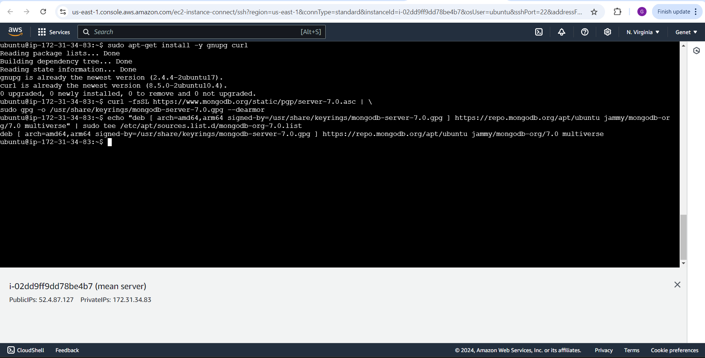

3. **Install MongoDB**

   I installed MongoDB by running:
   ```bash
   sudo apt-get install -y mongodb-org
   ```

4. **Start the MongoDB Service**

   Next, I started the MongoDB service:
   ```bash
   sudo service mongod start
   ```

5. **Verify MongoDB is Running**

   I checked the status of MongoDB to ensure it's running:
   ```bash
   sudo systemctl status mongod
   ```
   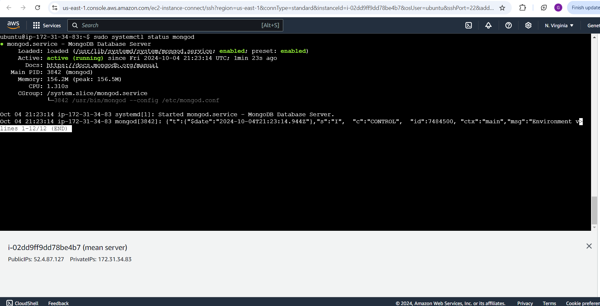

6. **Install `npm`**

   I install Node.js package manager `npm` by executing:
   ```bash
   sudo apt install -y npm
   ```

7. **Install `body-parser`**

   Since my project needs to process JSON files, I installed the `body-parser` package:
   ```bash
   sudo npm install body-parser
   ```
   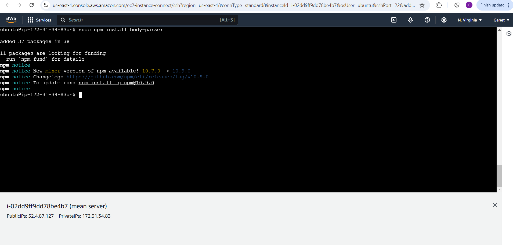

8. **Create a Folder for the Project**

   Now, I created a folder called 'Books' for my project and navigated into it:

   ```bash
   mkdir Books && cd Books
   ```

9. **Initialize `npm`**

   In the 'Books' folder, I initialized the npm project:
   ```bash
   npm init
   ```
   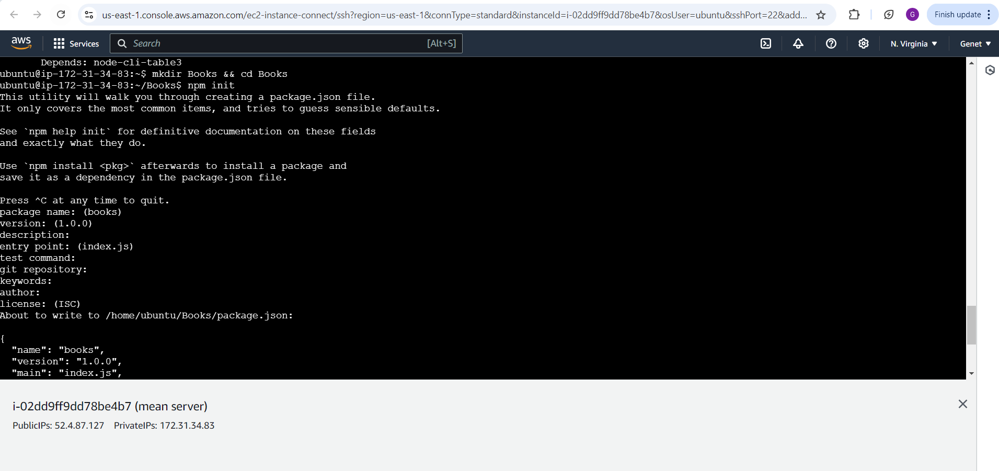

10. **Create `server.js`**

    After initializing the project, I created a file named `server.js`:

    ```bash
    vi server.js
    ```

11. **Write the Web Server Code**

    Finally, I copied and pasted the following code into the `server.js` file to set up the MongoDB connection and web server:
    ```javascript
    const express = require('express');
    const bodyParser = require('body-parser');
    const mongoose = require('mongoose');
    const path = require('path');

    const app = express();
    const PORT = process.env.PORT || 3300;

    // MongoDB connection
    mongoose.connect('mongodb://localhost:27017/test', {
        useNewUrlParser: true,
        useUnifiedTopology: true,
    })
    .then(() => console.log('MongoDB connected'))
    .catch(err => console.error('MongoDB connection error:', err));

    app.use(express.static(path.join(__dirname, 'public')));
    app.use(bodyParser.json());

    require('./apps/routes')(app);

    app.listen(PORT, () => {
        console.log(`Server up: http://localhost:${PORT}`);
    });
    ```
    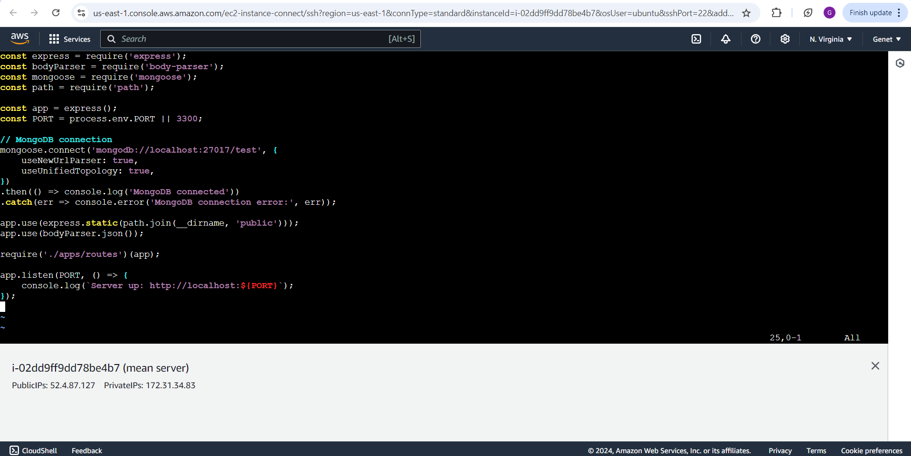


## Step 3: Installing Express and Set Up Routes to the Server

1. **Installed Express and Mongoose**

   I installed both the Express framework and the Mongoose library to handle my MongoDB database. To do this, I ran:
   ```bash
   sudo npm install express mongoose
   ```

2. **Created an `apps` Folder:**
   Inside my project directory ('Books'), I created a folder named `apps` where I placed the routes for my web application:
   ```bash
   mkdir apps && cd apps
   ```

3. **Created the `routes.js` File:**
   I created a file called `routes.js` to define the API routes:
   ```bash
   vi routes.js
   ```

4. **Added the Routes Code:**
   In the `routes.js` file, I added code to handle GET, POST, and DELETE requests for my book records:
   ```javascript
   const Book = require('./models/book');
   const path = require('path');

   module.exports = function(app) {
       app.get('/book', async (req, res) => {
           try {
               const books = await Book.find();
               res.json(books);
           } catch (err) {
               res.status(500).json({ message: 'Error fetching books', error: err.message });
           }
       });

       app.post('/book', async (req, res) => {
           try {
               const book = new Book({
                   name: req.body.name,
                   isbn: req.body.isbn,
                   author: req.body.author,
                   pages: req.body.pages,
               });
               const savedBook = await book.save();
               res.status(201).json({
                   message: 'Successfully added book',
                   book: savedBook
               });
           } catch (err) {
               res.status(400).json({ message: 'Error adding book', error: err.message });
           }
       });

       app.delete('/book/:isbn', async (req, res) => {
           try {
               const result = await Book.findOneAndDelete({ isbn: req.params.isbn });
               if (!result) {
                   return res.status(404).json({ message: 'Book not found' });
               }
               res.json({
                   message: 'Successfully deleted the book',
                   book: result
               });
           } catch (err) {
               res.status(500).json({ message: 'Error deleting book', error: err.message });
           }
       });

       app.get('*', (req, res) => {
           res.sendFile(path.join(__dirname, '../public', 'index.html'));
       });
   };
   ```
   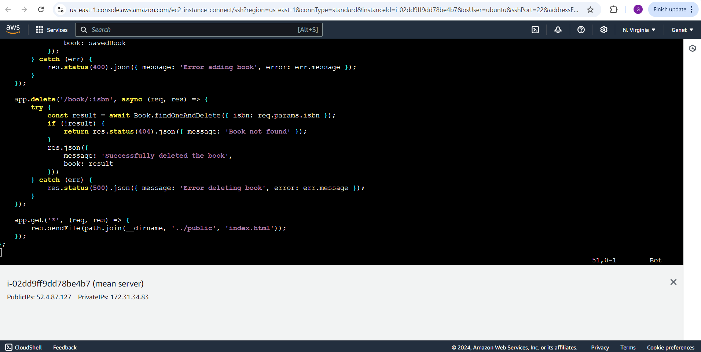

5. **Created the `models` Folder:**
   After setting up the routes, I created a folder inside `apps` called `models`, where I defined my book schema:
   ```bash
   mkdir models && cd models
   ```

6. **Created the `book.js` File:**
   Inside the `models` folder, I created a file called `book.js`:
   ```bash
   vi book.js
   ```

7. **Defined the Book Schema:**
   In `book.js`, I defined the schema for my book records:
   ```javascript
   const mongoose = require('mongoose');

   const bookSchema = new mongoose.Schema({
       name: { type: String, required: true },
       isbn: { type: String, required: true, unique: true, index: true },
       author: { type: String, required: true },
       pages: { type: Number, required: true, min: 1 }
   }, {
       timestamps: true
   });

   module.exports = mongoose.model('Book', bookSchema);
   ```


With everything set up, I can now interact with my MongoDB database using the defined routes to fetch, add, and delete book records.

## Step 4: Access the Routes with AngularJS

1. **Changed the Directory Back to 'Books'** 

   I navigated back to the 'Books' folder:
   ```bash
   cd ../..
   ```

2. **Created a 'public' Folder:**  
   In the 'Books' folder, I created a folder named `public`:
   ```bash
   mkdir public && cd public
   ```

3. **Created the `script.js` File**  

   I created a file named `script.js` where I added AngularJS code to connect the frontend to the Express server:
   ```bash
   vi script.js
   ```
   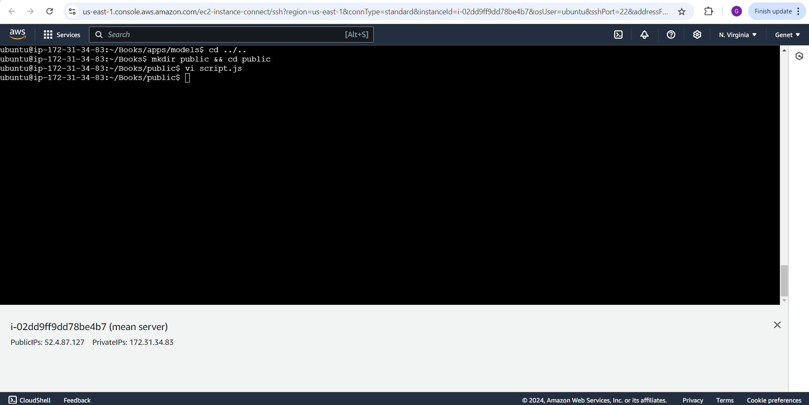

4. **Added AngularJS Code in `script.js`**  

   In the `script.js` file, I added the following code to set up the AngularJS controller for fetching, deleting, and adding books:
   ```javascript
   angular.module('myApp', [])
   .controller('myCtrl', function($scope, $http) {
       function fetchBooks() {
           $http.get('/book')
           .then(response => {
               $scope.books = response.data;
           })
           .catch(error => {
               console.error('Error fetching books:', error);
           });
       }

       fetchBooks();

       $scope.del_book = function(book) {
           $http.delete(`/book/${book.isbn}`)
           .then(() => {
               fetchBooks();
           })
           .catch(error => {
               console.error('Error deleting book:', error);
           });
       };

       $scope.add_book = function() {
           const newBook = {
               name: $scope.Name,
               isbn: $scope.Isbn,
               author: $scope.Author,
               pages: $scope.Pages
           };

           $http.post('/book', newBook)
           .then(() => {
               fetchBooks();
               // Clear form fields
               $scope.Name = $scope.Isbn = $scope.Author = $scope.Pages = '';
           })
           .catch(error => {
               console.error('Error adding book:', error);
           });
       };
   });
   ```
   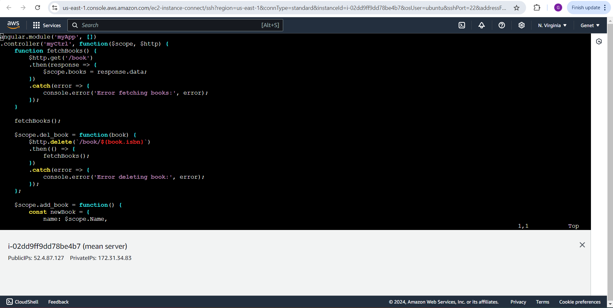
   
5. **Created the `index.html` File**

   After setting up the AngularJS script, I created an `index.html` file in the `public` folder:
   ```bash
   vi index.html
   ```

6. **Added HTML Content:**  
   In the `index.html` file, I added the HTML structure for the book management system, including a form to add new books and a list of existing books:
   ```html
   <!DOCTYPE html>
   <html ng-app="myApp" ng-controller="myCtrl">
   <head>
       <meta charset="UTF-8">
       <meta name="viewport" content="width=device-width, initial-scale=1.0">
       <title>Book Management</title>
       <script src="https://ajax.googleapis.com/ajax/libs/angularjs/1.8.2/angular.min.js"></script>
       <script src="script.js"></script>
       <style>
           body { font-family: Arial, sans-serif; margin: 20px; }
           table { border-collapse: collapse; width: 100%; }
           th, td { border: 1px solid #ddd; padding: 8px; text-align: left; }
           th { background-color: #f2f2f2; }
           input[type="text"], input[type="number"] { width: 100%; padding: 5px; }
           button { margin-top: 10px; padding: 5px 10px; }
       </style>
   </head>
   <body>
       <h1>Book Management</h1>
       <h2>Add New Book</h2>
       <form ng-submit="add_book()">
           <table>
               <tr>
                   <td>Name:</td>
                   <td><input type="text" ng-model="Name" required></td>
               </tr>
               <tr>
                   <td>ISBN:</td>
                   <td><input type="text" ng-model="Isbn" required></td>
               </tr>
               <tr>
                   <td>Author:</td>
                   <td><input type="text" ng-model="Author" required></td>
               </tr>
               <tr>
                   <td>Pages:</td>
                   <td><input type="number" ng-model="Pages" required></td>
               </tr>
           </table>
           <button type="submit">Add Book</button>
       </form>
       <h2>Book List</h2>
       <table>
           <thead>
               <tr>
                   <th>Name</th>
                   <th>ISBN</th>
                   <th>Author</th>
                   <th>Pages</th>
                   <th>Action</th>
               </tr>
           </thead>
           <tbody>
               <tr ng-repeat="book in books">
                   <td>{{book.name}}</td>
                   <td>{{book.isbn}}</td>
                   <td>{{book.author}}</td>
                   <td>{{book.pages}}</td>
                   <td><button ng-click="del_book(book)">Delete</button></td>
               </tr>
           </tbody>
       </table>
   </body>
   </html>
   ```
   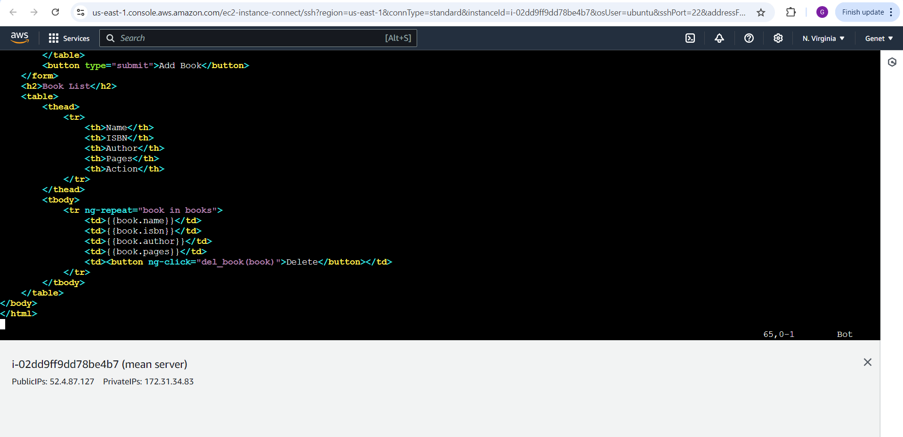

7. **Ran the Server** 

   I navigated back to the `Books` directory and started the server:
   ```bash
   cd ..
   node server.js
   ```
   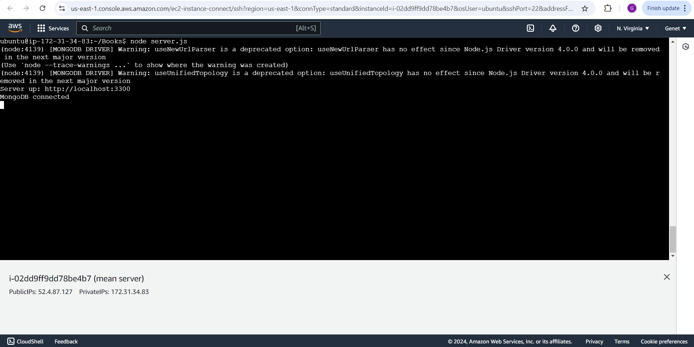

8. **Opened Port 3300**

   I opened TCP port 3300 in my AWS EC2 instance’s security group settings to allow access to the server.

   

9. **Tested the Application**  

   Finally, I tested my book register application in the browser using the public IP or DNS of my EC2 instance. The application displayed a form to add books and a table listing the books.

   ```bash
   http://52.4.87.127:3300
   ```
   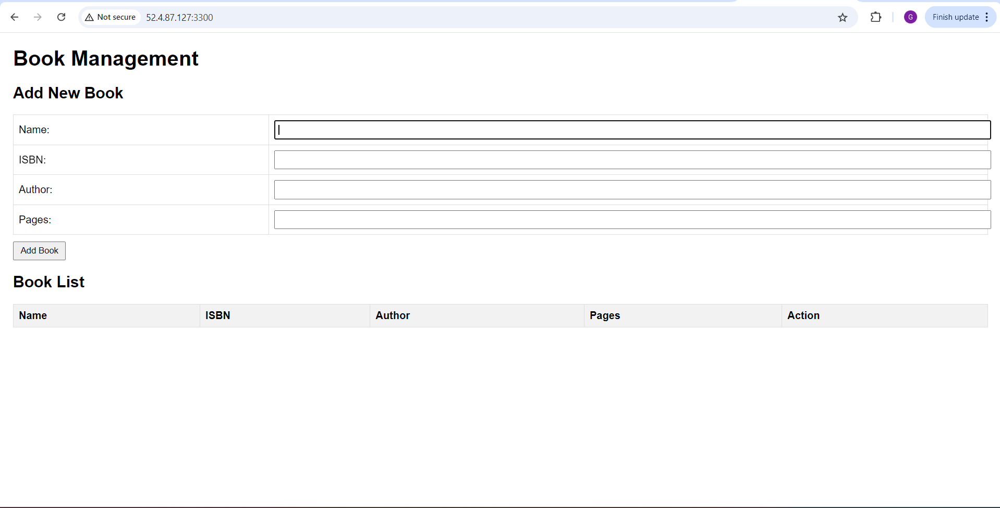

   With these steps completed, my web application is fully functional, allowing me to manage books through the AngularJS frontend connected to the Node.js backend.

**Congratulations**
Setting up the MEAN stack on Ubuntu 24.04 LTS provided a powerful platform for full-stack web development. I launched an EC2 instance, installed Node.js, MongoDB, and configured an Express API with AngularJS for managing book records. This process helped enhance my skills in AWS EC2 management and deploying scalable web applications, creating a solid foundation for future projects.


  