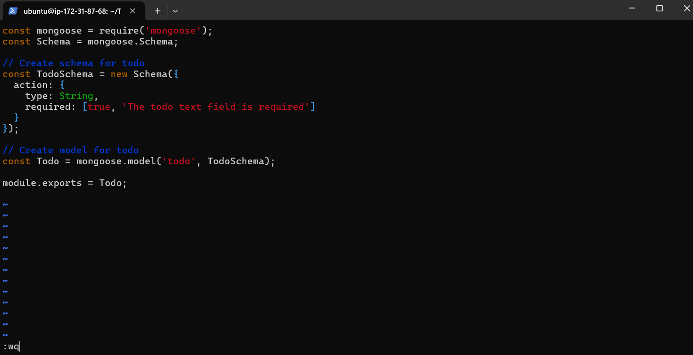

# MERN Stack Setup on Ubuntu 24.04 LTS

This guide describes the step-by-step process I followed to set up a MERN stack on an Ubuntu server. This environment, which includes MongoDB, ExpressJS, ReactJS, and NodeJS, is essential for hosting websites and web applications.

## Step 0: Server Setup

1. **Launch EC2 Instance**

   I launched an EC2 instance of type **t2.micro** running **Ubuntu 24.04 LTS (HVM)** in the **us-east-1** region using the AWS console.

   
   

2. **Configure Security Group**
 
   To allow necessary traffic, I set up security rules to open HTTP (Port 80) to the world for web traffic and restrict SSH (Port 22) access to my IP for security reasons.

   

3. **Create SSH Key Pair**

   I created an SSH key pair named my-key for secure access, adjusted file permissions, and connected to the instance using the following commands:
     ```bash
     chmod 400 my-key.pem
     ssh -i my-key.pem ubuntu@35.173.221.171
     ```
    

## Step 1: Backend Configuration

1. **Update Ubuntu**

   First, I started by updating the package lists to ensure I have the latest information about available packages:

   ```bash
   sudo apt update
   ```

2. **Upgrade Ubuntu**

   Then, I upgraded all the installed packages to their latest versions:

   ```bash
   sudo apt upgrade
   ```
   

3. **Get the Node.js Software Location**

   I retrieved the Node.js software from the NodeSource repository. To do this, I ran the following command to download and set up the Node.js 18.x setup script:

   ```bash
   curl -fsSL https://deb.nodesource.com/setup_18.x | sudo -E bash -
   ```
   

4. **Install Node.js on the Server**

   After setting up the repository, I installed Node.js using the following command:

   ```bash
   sudo apt-get install -y nodejs
   ```
   

5. **Verify Installation**

   To confirm Node.js and npm were successfully installed, I checked their versions:

   ```bash
   node -v
   ```
   ```bash
   npm -v
   ```
   

   You should see the Node.js and npm version numbers displayed if everything worked correctly.

6. **Setting Up Application Code**

   Now that Node.js is installed, we are going to set up the application code for the project.I started by creating a new directory for my To-Do application:
   ```
   mkdir Todo
   ```
   To make sure the Todo directory was successfully created, I ran the following command:

   ```
   ls
   ```
   

7. **Navigate to the Project Directory**

   Next, I changed my current directory to the newly created Todo directory:

   ```
   cd Todo
   ```

8. **Initialize npm**

   I initialized my project using npm, which generated a package.json file for my application. I did this by running:

   ```
   npm init
   ```
   I followed the interactive prompts, pressing `Enter` several times to accept the default values. Finally, I typed `yes` to confirm and create the `package.json` file.

   

   After finishing the npm initialization, I verified that the package.json file had been created in the Todo directory by running:
   
   ```
   ls
   ```
   
   
   I was able to see 'package.json' listed in the output.

## Step 2: **Install ExpressJS**

1. **Install Express**

   Express is a framework for Node.js that simplifies the development of server-side applications. I installed it using npm with the following command:

   ```
   npm install express
   ```
   

2. **Create an `index.js` file**

   I then created the main file for my project, which will serve as the entry point for my Express application:

   ```bash
   touch index.js
   ```
   To ensure the file was created successfully, I ran:

   ```bash
   ls
   ```
   
   
3. **Install dotenv**

   Since I need to manage environment variables, I installed the `dotenv` module as well:

   ```bash
   npm install dotenv
   ```

4. **Setup Application Code**

   I then opened the `index.js` file using `vim` editor and added the following code:

   ```
   vim index.js

   ```
    
   ```js
   const express = require('express');
   require('dotenv').config();

   const app = express();
   const port = process.env.PORT || 5000;

   app.use((req, res, next) => {
       res.header("Access-Control-Allow-Origin", "*");
       res.header("Access-Control-Allow-Headers", "Origin, X-Requested-With, Content-Type, Accept");
       next();
    });
 
   app.use((req, res, next) => {
       res.send('Welcome to Express');
    });

   app.listen(port, () => {
     console.log(`Server running on port ${port}`);
   });
   ```

    I saved the file and exited.
   

5. **Run the Application**

   Finally, I started the Express server by running:

   ```bash
   node index.js
   ```
    

   I saw the message `Server running on port 5000`, indicating that the server was up and running.

6. **Security Group Setup**

   To access my server on port 5000, I needed to update the inbound security rules in AWS EC2. I added a custom rule to allow traffic on port 5000.

    

7. **Access the Application**

   To verify everything, I opened my browser and navigated to:

   ```
   http://35.173.221.171:5000
   ```
    
   
   I successfully accessed the Express server, and it displayed the message: **"Welcome to Express."**

## Step 3: **Routes Setup**

   There are three actions that my To-Do application needs to handle:

   1. Create a new task
   2. Display a list of all tasks
   3. Delete a completed task

   Each task will be associated with its own endpoint, using standard HTTP request methods: POST, GET, and DELETE.

1. **Create the routes folder**

   To begin, I created a folder called `routes` where all the routes will be stored.

   ```
   mkdir routes
   ```

2. **Navigate to the routes folder**

   Next, I changed the directory to `routes`.

   ```
   cd routes
   ```
    

3. **Create the `api.js` file**

   I created a new file `api.js` that will contain the logic for the routes.

   ```
   touch api.js
   ```

4. **Open the file and insert code**

   I used `vim` to open the `api.js` file and wrote the following code, which handles the three operations: creating, listing, and deleting tasks.
 
   ```
   vim api.js
   ```

   Here’s the code I added:

   ```
   const express = require('express');
   const router = express.Router();

   // Route to retrieve tasks
   router.get('/todos', (req, res, next) => {
   // Logic for getting tasks
   });

   // Route to create a task
   router.post('/todos', (req, res, next) => {
    // Logic for creating a task
   });

   // Route to delete a task
   router.delete('/todos/:id', (req, res, next) => {
    // Logic for deleting a task
   });

   module.exports = router;
   ```
    

   Now, I am ready to move forward with setting up the **Models** directory, where I'll define the structure of the task data.

## Step 4: **Models Setup**

   Now comes the interesting part, since the app is going to make use of **MongoDB** (a NoSQL database), we need to create a model.

1. **Install Mongoose** 

   First, I installed **Mongoose**, which is a Node.js package that makes working with MongoDB easier.

   ```
   cd Todo
   ```

   ```bash
   npm install mongoose
   ```
    

2. **Create the Models Folder**

   I created a new folder called `models` where my schema and models will be stored.

   ```
   mkdir models && cd models && touch todo.js
   ```
    
   
3. **Create the Todo Schema and Model**

   I opened the newly created `todo.js` file and added the schema for the "To-Do" items using Mongoose.

   ```
   vim todo.js
   ```

   Here’s the code I added:

   ```
   const mongoose = require('mongoose');
   const Schema = mongoose.Schema;

   // Create schema for todo
   const TodoSchema = new Schema({
     action: {
     type: String,
     required: [true, 'The todo text field is required']
   }
   });

   // Create model for todo
   const Todo = mongoose.model('todo', TodoSchema);

   module.exports = Todo;
   ```
    
   
4. **Update the Routes to Use the Model**

   Now, I needed to update my routes to interact with the **MongoDB** database using the model. I opened the `api.js` file in the `routes` folder and replaced the previous code with the following:

   ```
   vim ../routes/api.js
   ```

   ```js
   const express = require('express');
   const router = express.Router();
   const Todo = require('../models/todo');

   // Get all tasks
   router.get('/todos', (req, res, next) => {
     Todo.find({}, 'action')
       .then(data => res.json(data))
       .catch(next);
   });

   // Create a new task
   router.post('/todos', (req, res, next) => {
     if (req.body.action) {
       Todo.create(req.body)
         .then(data => res.json(data))
         .catch(next);
     } else {
       res.json({ error: 'The input field is empty' });
    }
   });

    // Delete a task by id
   router.delete('/todos/:id', (req, res, next) => {
     Todo.findOneAndDelete({ "_id": req.params.id })
       .then(data => res.json(data))
       .catch(next);
   });

    module.exports = router;
   ```
    

   By following these steps, I now have a fully functioning MongoDB model that can interact with the database to perform **CRUD** operations on the to-do tasks: create new tasks, display all tasks, and delete completed tasks.


