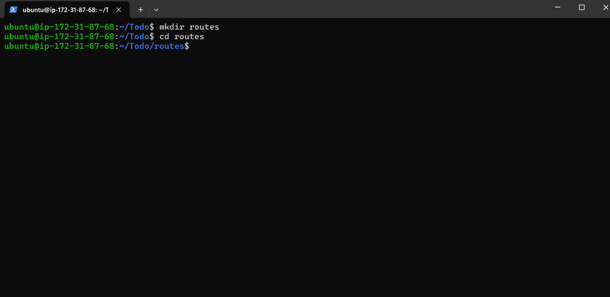

# MERN Stack Setup on Ubuntu 24.04 LTS

This guide describes the step-by-step process I followed to set up a MERN stack on an Ubuntu server. This environment, which includes MongoDB, ExpressJS, ReactJS, and NodeJS, is essential for hosting websites and web applications.

## Step 0: Server Setup

1. **Launch EC2 Instance**

   I launched an EC2 instance of type **t2.micro** running **Ubuntu 24.04 LTS (HVM)** in the **us-east-1** region using the AWS console.

   
   

2. **Configure Security Group**
 
   To allow necessary traffic, I set up security rules to open HTTP (Port 80) to the world for web traffic and restrict SSH (Port 22) access to my IP for security reasons.

   

3. **Create SSH Key Pair**

   I created an SSH key pair named my-key for secure access, adjusted file permissions, and connected to the instance using the following commands:
     ```bash
     chmod 400 my-key.pem
     ssh -i my-key.pem ubuntu@35.173.221.171
     ```
    

## Step 1: Backend Configuration

1. **Update Ubuntu**

   First, I started by updating the package lists to ensure I have the latest information about available packages:

   ```bash
   sudo apt update
   ```

2. **Upgrade Ubuntu**

   Then, I upgraded all the installed packages to their latest versions:

   ```bash
   sudo apt upgrade
   ```
   

3. **Get the Node.js Software Location**

   I retrieved the Node.js software from the NodeSource repository. To do this, I ran the following command to download and set up the Node.js 18.x setup script:

   ```bash
   curl -fsSL https://deb.nodesource.com/setup_18.x | sudo -E bash -
   ```
   

 **Install Node.js on the Server**

1. **Install Node.js on the Server**

   After setting up the repository, I installed Node.js using the following command:

   ```bash
   sudo apt-get install -y nodejs
   ```
   

2. **Verify Installation**

   To confirm Node.js and npm were successfully installed, I checked their versions:

   ```bash
   node -v
   ```
   ```bash
   npm -v
   ```
   

   You should see the Node.js and npm version numbers displayed if everything worked correctly.

3. **Setting Up Application Code**

   Now that Node.js is installed, we are going to set up the application code for the project.I started by creating a new directory for my To-Do application:
   ```
   mkdir Todo
   ```
   To make sure the Todo directory was successfully created, I ran the following command:

   ```
   ls
   ```
   

4. **Navigate to the Project Directory**

   Next, I changed my current directory to the newly created Todo directory:

   ```
   cd Todo
   ```
5. **Initialize npm**

   I initialized my project using npm, which generated a package.json file for my application. I did this by running:

   ```
   npm init
   ```
   I followed the interactive prompts, pressing `Enter` several times to accept the default values. Finally, I typed `yes` to confirm and create the `package.json` file.

   

   After finishing the npm initialization, I verified that the package.json file had been created in the Todo directory by running:
   
   ```
   ls
   ```
   
   
   I was able to see 'package.json' listed in the output.

 **Install ExpressJS**

1. **Install Express**

   Express is a framework for Node.js that simplifies the development of server-side applications. I installed it using npm with the following command:

   ```
   npm install express
   ```
   

2. **Create an `index.js` file**

   I then created the main file for my project, which will serve as the entry point for my Express application:

   ```bash
   touch index.js
   ```
   To ensure the file was created successfully, I ran:

   ```bash
   ls
   ```
   
   
3. **Install dotenv**

   Since I need to manage environment variables, I installed the `dotenv` module as well:

   ```bash
   npm install dotenv
   ```

4. **Setup Application Code**

   I then opened the `index.js` file using `vim` editor and added the following code:

   ```
   vim index.js

   ```
    
   ```js
   const express = require('express');
   require('dotenv').config();

   const app = express();
   const port = process.env.PORT || 5000;

   app.use((req, res, next) => {
       res.header("Access-Control-Allow-Origin", "*");
       res.header("Access-Control-Allow-Headers", "Origin, X-Requested-With, Content-Type, Accept");
       next();
    });
 
   app.use((req, res, next) => {
       res.send('Welcome to Express');
    });

   app.listen(port, () => {
     console.log(`Server running on port ${port}`);
   });
   ```

    I saved the file and exited.
   

5. **Run the Application**

   Finally, I started the Express server by running:

   ```bash
   node index.js
   ```
    

   I saw the message `Server running on port 5000`, indicating that the server was up and running.

6. **Security Group Setup**

   To access my server on port 5000, I needed to update the inbound security rules in AWS EC2. I added a custom rule to allow traffic on port 5000.

    

7. **Access the Application**

   To verify everything, I opened my browser and navigated to:

   ```
   http://35.173.221.171:5000
   ```
    
   
   I successfully accessed the Express server, and it displayed the message: **"Welcome to Express."**

 **Routes Setup**

   There are three actions that my To-Do application needs to handle:

   1. Create a new task
   2. Display a list of all tasks
   3. Delete a completed task

   Each task will be associated with its own endpoint, using standard HTTP request methods: POST, GET, and DELETE.

1. **Create the routes folder**

   To begin, I created a folder called `routes` where all the routes will be stored.

   ```
   mkdir routes
   ```

2. **Navigate to the routes folder**

   Next, I changed the directory to `routes`.

   ```
   cd routes
   ```
    

3. **Create the `api.js` file**

   I created a new file `api.js` that will contain the logic for the routes.

   ```
   touch api.js
   ```

4. **Open the file and insert code**

   I used `vim` to open the `api.js` file and wrote the following code, which handles the three operations: creating, listing, and deleting tasks.
 
   ```
   vim api.js
   ```

   Here’s the code I added:

   ```
   const express = require('express');
   const router = express.Router();

   // Route to retrieve tasks
   router.get('/todos', (req, res, next) => {
   // Logic for getting tasks
   });

   // Route to create a task
   router.post('/todos', (req, res, next) => {
    // Logic for creating a task
   });

   // Route to delete a task
   router.delete('/todos/:id', (req, res, next) => {
    // Logic for deleting a task
   });

   module.exports = router;
   ```
    

   Now, I am ready to move forward with setting up the **Models** directory, where I'll define the structure of the task data.

 **Models Setup**

   Now comes the interesting part, since the app is going to make use of **MongoDB** (a NoSQL database), we need to create a model.

1. **Install Mongoose** 

   First, I installed **Mongoose**, which is a Node.js package that makes working with MongoDB easier.

   ```
   cd Todo
   ```

   ```bash
   npm install mongoose
   ```
    

2. **Create the Models Folder**

   I created a new folder called `models` where my schema and models will be stored.

   ```
   mkdir models && cd models && touch todo.js
   ```
    
   
3. **Create the Todo Schema and Model**

   I opened the newly created `todo.js` file and added the schema for the "To-Do" items using Mongoose.

   ```
   vim todo.js
   ```

   Here’s the code I added:

   ```
   const mongoose = require('mongoose');
   const Schema = mongoose.Schema;

   // Create schema for todo
   const TodoSchema = new Schema({
     action: {
     type: String,
     required: [true, 'The todo text field is required']
   }
   });

   // Create model for todo
   const Todo = mongoose.model('todo', TodoSchema);

   module.exports = Todo;
   ```
    
   
4. **Update the Routes to Use the Model**

   Now, I needed to update my routes to interact with the **MongoDB** database using the model. I opened the `api.js` file in the `routes` folder and replaced the previous code with the following:

   ```
   vim ../routes/api.js
   ```

   ```js
   const express = require('express');
   const router = express.Router();
   const Todo = require('../models/todo');

   // Get all tasks
   router.get('/todos', (req, res, next) => {
     Todo.find({}, 'action')
       .then(data => res.json(data))
       .catch(next);
   });

   // Create a new task
   router.post('/todos', (req, res, next) => {
     if (req.body.action) {
       Todo.create(req.body)
         .then(data => res.json(data))
         .catch(next);
     } else {
       res.json({ error: 'The input field is empty' });
    }
   });

    // Delete a task by id
   router.delete('/todos/:id', (req, res, next) => {
     Todo.findOneAndDelete({ "_id": req.params.id })
       .then(data => res.json(data))
       .catch(next);
   });

    module.exports = router;
   ```
    

   By following these steps, I now have a fully functioning MongoDB model that can interact with the database to perform **CRUD** operations on the to-do tasks: create new tasks, display all tasks, and delete completed tasks.


 **MongoDB Database Setup**

1. **Login to MongoDB Atlas**
   
   Since I already have an account, I just logged into **MongoDB Atlas**. If you don't have one, you can [sign up here](https://www.mongodb.com/products/try-free/platform/atlas-signup-from-mlab) and follow the steps provided to create an account and start using MongoDB Atlas.

2. **Create a New Cluster**

   After logging in, I created a new MongoDB cluster by selecting the **Create a New Cluster** button and following the checklist provided to complete the initial setup. This involved choosing **AWS** as the cloud provider and selecting a region that is nearest to my location for optimal performance.

   

3. **Whitelist Your IP**

   After creating the cluster, I configured **Network Access** by whitelisting my IP address. This is an important security measure to restrict who can connect to the MongoDB database.

   

4. **Create MongoDB Collections**

   Once the cluster was set up, I navigated to the **Collections** section in MongoDB Atlas to create a new collection. This collection is where the application data will be stored and managed. 

   

5. **Retrieve the Connection String**

   In the **Clusters** section, I obtained the connection string necessary to connect my application to the MongoDB database. This string includes important details such as the username, password, and database information. I added this connection string to the environment variables in my `.env` file.

   ```bash
   touch .env
   vim .env
   ```

   In the `.env` file, I added the following:

   ```
   DB = 'mongodb+srv://genet:<password>@cluster0.xlcje.mongodb.net/?retryWrites=true&w=majority&appName=Cluster0'
   ```

   

6. **Update the `index.js` file**

   I then updated the `index.js` file to use the environment variables, allowing the application to securely connect to the MongoDB database. 

   To do this, I opened `index.js` in the `vim` editor, deleted the old content, and added the updated code as shown below:

   ```bash
   vim index.js
   ```

   **Steps to delete the old content:**

   1. Open the file with `vim index.js`
   2. Press `esc`
   3. Type `:`
   4. Type `%d`
   5. Press `Enter`

   Now, insert the new code:

   ```bash
   Press `i` to enter insert mode in vim.
   ```
   

   Then, add the following code:

   ```js
   const express = require('express');
   const bodyParser = require('body-parser');
   const mongoose = require('mongoose');
   const routes = require('./routes/api');
   const path = require('path');
   require('dotenv').config();

   const app = express();
   const port = process.env.PORT || 5000;

   // Connect to the database
   mongoose.connect(process.env.DB, { useNewUrlParser: true, useUnifiedTopology: true })
   .then(() => console.log('Database connected successfully'))
   .catch(err => console.log(err));

   // Override mongoose promises with Node.js promises
   mongoose.Promise = global.Promise;

   // Middleware to handle CORS and JSON parsing
   app.use((req, res, next) => {
       res.header("Access-Control-Allow-Origin", "*");
       res.header("Access-Control-Allow-Headers", "Origin, X-Requested-With, Content-Type, Accept");
       next();
   });

   app.use(bodyParser.json());
   app.use('/api', routes);

   // Error handling middleware
   app.use((err, req, res, next) => {
       console.log(err);
       next();
   });

   // Start the server
   app.listen(port, () => {
       console.log(`Server running on port ${port}`);
   });
   ```

   


7. **Starting the Application and Verifying MongoDB Connection**

   Once you've set up your application and configured everything, start the server to check if the connection to MongoDB is successful. You can do this by running the following command in the terminal:

   ```bash
   node index.js
   ```
 
   

   If everything is correctly configured, you should see the following message in your terminal:

   ```
   Database connected successfully
   ```

   This message indicates that the backend is successfully connected to MongoDB, and the application is ready to start functioning.


 **Testing Backend Code without Frontend using RESTful API**

   Since I have already written the backend code for my **To-Do** application and configured the MongoDB database, I tested my backend without a frontend by using **Postman** to simulate RESTful API requests and ensure the backend is functioning correctly.

1. Installed Postman 

   I already had **Postman** installed, so I proceeded with creating the requests.

2. Created a POST Request

   In **Postman**, I created a **POST request** to my API endpoint:

   ```
   http://35.173.221.171:5000/api/todos
   ```

- **Headers Setup**: I added a header to specify the content type.
   ```
   Key: Content-Type
   Value: application/json
   ```
  

- **Body Setup**: In the Body section of the request, I selected the **raw** option and chose **JSON** from the dropdown. I entered the following data:

   ```json
   {
     "action": "Finish Project 8 and 9"
   }
   ```

  This POST request sent a new task to my To-Do application, and the backend stored it in the MongoDB database.

  Here’s how it looks in Postman:

  

3. **Created a GET Request to Verify the Task**

   After successfully creating the task using the POST request, I verified if it was stored in the database by making a **GET request**:

   - I created a **GET request** to retrieve the list of all tasks:

    ```
    http:35.173.221.171:5000/api/todos
    ```

    This GET request retrieved all tasks stored in the To-Do application by fetching the records from MongoDB.

    Here's an example of the GET request in Postman:

    

4. **Optional Task: DELETE Request**

   Now that I tested adding and retrieving tasks, I also sent a **DELETE request** to remove a task from the To-Do list.

   - To delete a task, I sent its unique **ID** as part of the DELETE request URL:

   ```
   http://<PublicIP-or-PublicDNS>:5000/api/todos/<TaskID>
   ```
   
   
  This DELETE request removed the task with the specified ID from the database.

  By now, I have successfully tested all the main CRUD (Create, Read, Update, Delete) operations of my To-Do application’s backend. The backend code supports the following operations:

- [x] **Display** a list of tasks - HTTP GET request
- [x] **Add** a new task to the list - HTTP POST request
- [x] **Delete** an existing task from the list - HTTP DELETE request

## Step 2: **Frontend Creation**

   Since I have already completed the backend functionality and API setup for my To-Do application, it is now time to create the frontend interface for users to interact with the application through a web client (browser).

   **Creating the React App**

   **"Since the t2.micro instance has 1GB of memory, I upgraded to a t2.medium. After upgrading, there was a new IP address, so I needed to whitelist the new IP in MongoDB."**

   In the same root directory as my backend code (the `Todo` directory), I ran the following command to scaffold a new React app:

   ```
   npx create-react-app client
   ```
   This command created a new folder called `client` in my Todo directory, where all the React code will be stored.
    
   


 **Running a React App** 

  Before testing the React app, there are some dependencies that need to be installed.

1. **Install Dependencies**

   Before testing the React app, I needed to install some dependencies that are required for managing multiple commands and monitoring the server.

   I installed **concurrently** to run more than one command from the same terminal window simultaneously:

   ```bash
   npm install concurrently --save-dev
   ```
   I installed **nodemon** to monitor changes in the server code. Whenever there's a change, nodemon automatically restarts the server.

   ```bash
   npm install nodemon --save-dev
   ```
2. **Update the `package.json` file**

   I updated the `package.json` file inside the **Todo** folder to allow concurrently running both the backend and frontend. Here's the section I updated:

   ```
   "scripts": {
   "start": "node index.js",
   "start-watch": "nodemon index.js",
   "dev": "concurrently \"npm run start-watch\" \"cd client && npm start\""
   },
   ```

   

 **Configure Proxy in `package.json` (client)**

   Next, I configured a proxy to ensure that API calls made from the frontend will be forwarded to the backend without needing to include the full URL.

1. I navigated to the **client** directory:

   ```bash
   cd client
   ```

2. Then, I opened the `package.json` file inside the **client** folder and added the following line to configure the proxy:

   ```json
   "proxy": "http://localhost:5000"
   ```
   

   This proxy configuration helps simplify API calls in development. Instead of calling the backend using the full path like `http://localhost:5000/api/todos`, I can just call `/api/todos` directly.

3. Run the React Application

   Once everything was set up, I navigated back to the **Todo** directory and ran both the backend and frontend with the following command:

   ```bash
   npm run dev
   ```
   

   By running this command, both the backend and frontend servers started simultaneously. The React app should be accessible on `localhost:3000`.

4. Open Ports 

   To make the application accessible to the public, I opened **TCP port 3000** on EC2 by adding a new security group rule. This allows me to access the React app from a browser on the Internet.

   

   

   Now, my application is fully functional with both the backend and frontend running smoothly. I can interact with the To-Do application through the web browser, adding tasks, viewing them, and deleting them.

**Creating Your React Components**

1. I navigated to the client directory

   ```
   cd client
   ```
2. Then, I moved to the src directory

   ```bash
   cd src
   ```
3. I created a new folder for components

   ```
   mkdir components
   ```
4. Next, I moved into the components directory

   ```
   cd components
   ```

5. I created the component files

   ```
   touch Input.js ListTodo.js Todo.js
   ```
   

6. I edited `Input.js` and pasted the following code
   ```javascript
   import React, { Component } from 'react';
   import axios from 'axios';

   class Input extends Component {
     state = {
       action: ""
     };

     addTodo = () => {
       const task = { action: this.state.action };

       if (task.action && task.action.length > 0) {
         axios.post('/api/todos', task)
           .then(res => {
             if (res.data) {
               this.props.getTodos();
               this.setState({ action: "" });
             }
           })
           .catch(err => console.log(err));
       } else {
         console.log('Input field required');
       }
     };

     handleChange = (e) => {
       this.setState({
         action: e.target.value
       });
     };

     render() {
       let { action } = this.state;
       return (
         <div>
           <input type="text" onChange={this.handleChange} value={action} />
           <button onClick={this.addTodo}>Add todo</button>
         </div>
       );
     }
   }

   export default Input;
   ```
   

7. **To install Axios in my client directory (if not already installed), I ran:**
   ```bash
   npm install axios
   ```
   

8. **Then I went to the components directory and opened `ListTodo.js`:**
   ```bash
   cd src/components
   vi ListTodo.js
   ```

9. **I copied and pasted the following code into `ListTodo.js`:**
   ```javascript
   import React from 'react';

   const ListTodo = ({ todos, deleteTodo }) => {
     return (
       <ul>
         {todos && todos.length > 0 ? (
           todos.map(todo => (
             <li key={todo._id} onClick={() => deleteTodo(todo._id)}>
               {todo.action}
             </li>
           ))
         ) : (
           <li>No todos left</li>
         )}
       </ul>
     );
   };

   export default ListTodo;
   ```

10. **For `Todo.js`, I wrote and pasted the following:**
    ```javascript
    import React, { Component } from 'react';
    import axios from 'axios';
    import Input from './Input';
    import ListTodo from './ListTodo';

    class Todo extends Component {
      state = {
        todos: []
      };

      componentDidMount() {
        this.getTodos();
      }

      getTodos = () => {
        axios.get('/api/todos')
          .then(res => {
            if (res.data) {
              this.setState({ todos: res.data });
            }
          })
          .catch(err => console.log(err));
      };

      deleteTodo = (id) => {
        axios.delete(`/api/todos/${id}`)
          .then(res => {
            if (res.data) {
              this.getTodos();
            }
          })
          .catch(err => console.log(err));
      };

      render() {
        let { todos } = this.state;
        return (
          <div>
            <h1>My Todos</h1>
            <Input getTodos={this.getTodos} />
            <ListTodo todos={todos} deleteTodo={this.deleteTodo} />
          </div>
        );
      }
    }

    export default Todo;
    ```

11. I adjusted the `App.js` file by running
    ```bash
    vi src/App.js
    ```

12. I replaced the contents of `App.js` with this code

    ```javascript
    import React from 'react';
    import Todo from './components/Todo';

    function App() {
      return (
        <div className="App">
          <Todo />
        </div>
      );
    }

    export default App;
    ```

13. After updating app.js I replaced the contents of `App.css` with this code

    ```
    .app {
    max-width: 600px;
    margin: 50px auto;
    padding: 20px;
    background: #282c34;
    border-radius: 8px;
    box-shadow: 0 2px 10px rgba(0, 0, 0, 0.1);
    }

    .todo-input {
    display: flex;
    flex-direction: column;
    }

    .todo-input input {
    padding: 10px;
    border: none;
    border-radius: 4px;
    margin-bottom: 10px;
    }

    .todo-input button {
    padding: 10px;
    border: none;
    border-radius: 4px;
    background-color: #61dafb;
    color: #282c34;
    cursor: pointer;
    font-size: 16px;
    }

    .todo-list {
    list-style-type: none;
    padding: 0;
    } 

    .todo-item {
    padding: 10px;
    background: #444;
    margin: 5px 0;
    border-radius: 4px;
    cursor: pointer;
    transition: background 0.3s;
    }

    .todo-item:hover {
    background: #555;
    }

    @media only screen and (min-width: 300px) {
    .app {
    width: 80%;
    }
    .todo-input input {
    width: 100%;
    }
    .todo-input button {
     width: 100%;
     margin-top: 15px;
     margin-left: 0;
    }
    }

    @media only screen and (min-width: 640px) {
    .app {
    width: 60%;
    }
    .todo-input input {
    width: 50%;
    }
    .todo-input button {
    width: 30%;
    margin-left: 10px;
    margin-top: 0;
    }
    }
    ```
14. I exited the components directory and opened the 'index.css' file in the 'src' directory

    ```
    vim src/index.css
    ```
    Then, I copied and pasted the following CSS code to style my app:

    ```
    body {
    margin: 0;
    padding: 0;
    font-family: -apple-system, BlinkMacSystemFont, "Segoe UI", "Roboto", "Oxygen",
    "Ubuntu", "Cantarell", "Fira Sans", "Droid Sans", "Helvetica Neue",
    sans-serif;
    -webkit-font-smoothing: antialiased;
    -moz-osx-font-smoothing: grayscale;
    box-sizing: border-box;
    background-color: #282c34;
    color: #787a80;  
    }

    code {
      font-family: source-code-pro, Menlo, Monaco, Consolas, "Courier New",
      monospace;
      }
    ```
15. After saving the changes, I navigated back to the Todo directory

    ```
    cd ../..
    ```

16. Finally, I started my React Todo app by running:
 
    ```
    npm run dev
    ```
    

    I have successfully created a simple To-Do application and deployed it using the MERN stack.

**Conclusion**

In this project, I have successfully created a simple To-Do application and deployed it using the MERN stack. I built the frontend using React.js, which communicates with a backend written in Express.js. Additionally, I integrated a MongoDB backend for storing tasks in a database, making the app fully functional.


