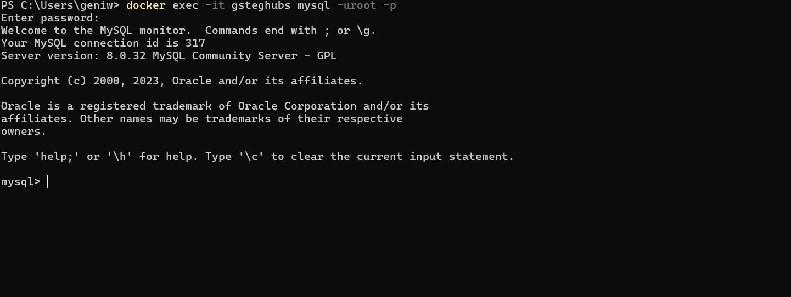
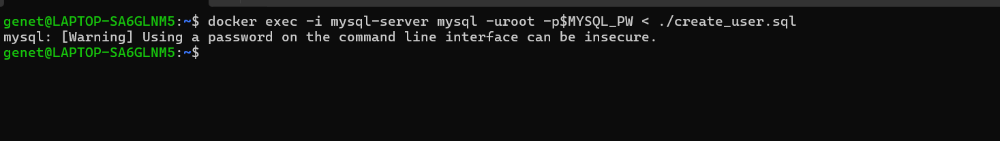

## Migration to the Сloud with containerization (Docker & Docker Compose)1- 101

In this project, we will learn how to solve this problem and practice the technology that revolutionized application distribution and deployment back in 2013 We are talking of Containers and imply Docker. Even though there are other application containerization technologies, Docker is the standard and the default choice for shipping your app in a container!

### Install Docker and prepare for migration to the Cloud

First, we need to install [Docker Engine](https://docs.docker.com/engine/install/), which is a client-server application that contains:

- A server with a long-running daemon process `dockerd`.  
- APIs that specify interfaces that programs can use to talk to and instruct the Docker daemon.  
- A command-line interface (CLI) client `docker`.  

You can learn how to install Docker Engine on your PC [here](https://docs.docker.com/engine/install/).  

### MySQL in container

Let us start assembling our application from the Database layer - we will use a pre-built MySQL database container, configure it, and make sure it is ready to receive requests from our PHP application.

### Step 1: Pull MySQL Docker Image from Docker Hub Registry

Start by pulling the appropriate [Docker image for MySQL](https://hub.docker.com/_/mysql). You can download a specific version or opt for the latest release, as seen in the following command:

```bash
docker pull mysql/mysql-server:latest
```


If you are interested in a particular version of MySQL, replace `latest` with the version number. Visit Docker Hub to check other tags [here](https://hub.docker.com/_/mysql).

List the images to check that you have downloaded them successfully:

```bash
docker image ls
```


### Step 2: Deploy the MySQL Container to your Docker Engine

1. Once you have the image, move on to deploying a new MySQL container with:

   ```bash
   docker run --name <container_name> -e MYSQL_ROOT_PASSWORD=<my-secret-pw> -d mysql/mysql-server:latest
   ```
   - Replace `<container_name>` with the name of your choice. If you do not provide a name, Docker will generate a random one.
   - The `-d` option instructs Docker to run the container as a service in the background.
   - Replace `<my-secret-pw>` with your chosen password.
   - In the command above, we used the latest version tag. This tag may differ according to the image you downloaded.
   

2. Then, check to see if the MySQL container is running. Assuming the container name specified is `mysql-server`, run:

   ```bash
   docker ps -a
   ```

   **Example Output:**
   ```
   CONTAINER ID   IMAGE                         COMMAND                  CREATED          STATUS           PORTS                      NAMES
   7141da183562   mysql/mysql-server:latest     "/entrypoint.sh mysq…"   12 seconds ago   Up 11 seconds    3306/tcp, 33060-33061/tcp   mysql-server
   ```
   

   You should see the newly created container listed in the output. It includes container details, one being the status of this virtual environment. The status changes from `health: starting` to `healthy` once the setup is complete.

### Step 3: Connecting to the MySQL Docker Container

We can either connect directly to the container running the MySQL server or use a second container as a MySQL client. Let us see what the first option looks like.

#### Approach 1

Connecting directly to the container running the MySQL server:

```bash
docker exec -it <container_name> mysql -u root -p
```

Provide the root password when prompted. With that, you have connected the MySQL client to the server.

Finally, change the server root password to protect your database.


#### Approach 2

First, create a network:

```bash
docker network create --subnet=172.18.0.0/24 tooling_app_network
```
 
Creating a custom network is not necessary because even if we do not create a network, Docker will use the default network for all the containers you run. By default, the network we created above is of `DRIVER Bridge`. So, also, it is the default network. You can verify this by running the `docker network ls` command.
 

But there are use cases where this is necessary. For example, if there is a requirement to control the `cidr` range of the containers running the entire application stack. This will be an ideal situation to create a network and specify the `--subnet`.

For clarity’s sake, we will create a network with a subnet dedicated for our project and use it for both MySQL and the application so that they can connect.

Run the MySQL Server container using the created network.

First, let us create an environment variable to store the root password:

```sh
export MYSQL_PW=<root-secret-password>
```
 
Then, pull the image and run the container, all in one command like below:

```sh
docker run --network tooling_app_network -h mysqlserverhost --name=mysql-server -e MYSQL_ROOT_PASSWORD=$MYSQL_PW -d mysql/mysql-server:latest
```


### Flags used
- `-d` runs the container in detached mode
- `--network` connects a container to a network
- `-h` specifies a hostname

If the image is not found locally, it will be downloaded from the registry.

### Verify the container is running:
```sh
docker ps -a
```


```
CONTAINER ID    IMAGE                        COMMAND                  CREATED         STATUS                        PORTS                     NAMES
7141da183562    mysql/mysql-server:latest    "/entrypoint.sh mysq…"   12 seconds ago Up 11 seconds (health: starting)  3306/tcp, 33060-33061/tcp  mysql-server
```

As you already know, it is best practice not to connect to the MySQL server remotely using the root user. Therefore, we will create an SQL script that will create a user we can use to connect remotely.

Create a file and name it `create_user.sql` and add the below code in the file:
```sql
CREATE USER '<user>'@'%' IDENTIFIED BY '<client-secret-password>';
GRANT ALL PRIVILEGES ON *.* TO '<user>'@'%';
```


**Run the script:**

```bash
docker exec -i mysql-server mysql -uroot -p$MYSQL_PW < ./create_user.sql
```


If you see a warning like below, it is acceptable to ignore:

```bash
mysql: [Warning] Using a password on the command line interface can be insecure.
```

### Connecting to the MySQL server from a second container running the MySQL client utility

The good thing about this approach is that you do not have to install any client tool on your laptop, and you do not need to connect directly to the container running the MySQL server.

#### Run the MySQL Client Container:

```bash
docker run --network tooling_app_network --name mysql-client -it --rm mysql mysql -h mysqlserverhost -u <user-created-from-the-SQL-script> -p
```


### Flags used:
- `--name` gives the container a name
- `-it` runs in interactive mode and Allocates a pseudo-TTY
- `--rm` automatically removes the container when it exits
- `--network` connects a container to a network
- `-h` a MySQL flag specifying the MySQL server Container hostname
- `-u` user created from the SQL script
- `-p` password specified for the user created from the SQL script


### Prepare database schema
Now you need to prepare a database schema so that the Tooling application can connect to it.

1. Clone the Tooling-app repository from [here](https://github.com/StegTechHub/tooling-02.git)

```sh
git clone https://github.com/StegTechHub/tooling-02.git
```

2. On your terminal, export the location of the SQL file

```sh
export tooling_db_schema=<path-to-tooling-schema-file>/tooling_db_schema.sql
```
You can find the `tooling_db_schema.sql` in the `html` folder of the cloned repo.


3. Use the SQL script to create the database and prepare the schema. With the `docker exec` command, you can execute a command in a running container.

```sh
docker exec -i mysql-server mysql -uroot -p$MYSQL_PW < $tooling_db_schema
```


4. Update the `db_conn.php` file with connection details to the database

```php
$servername = "mysqlserverhost";
$username = "<user>";
$password = "<client-secret-password>";
$dbname = "toolingdb";
```
5. Run the Tooling App

Containerization of an application starts with the creation of a file with a special name - `Dockerfile` (without any extensions). This can be considered as a ‘recipe’ or ‘instruction’ that tells Docker how to pack your application into a container. In this project, you will build your container from a pre-created `Dockerfile`, but as a DevOps, you must also be able to write Dockerfiles.

You can watch [this video](#) to get an idea of how to create your `Dockerfile` and build a container from it.

And on [this page](#), you can find official Docker best practices for writing Dockerfiles.

So, let us containerize our Tooling application; here is the plan:

- Make sure you have checked out your Tooling repo to your machine with Docker engine.
- First, we need to build the Docker image the tooling app will use. The Tooling repo you cloned above has a `Dockerfile` for this purpose. Explore it and make sure you understand the code inside it.
- Run `docker build` command.
- Launch the container with `docker run`.
- Try to access your application via the port exposed from a container.

Let us begin:

Ensure you are inside the folder that has the `Dockerfile` and build your container:

```sh
docker build -t tooling:0.0.1 .
```


In the above command, we specify a parameter `-t`, so that the image can be tagged `tooling:0.0.1`. Also, you have to notice the `.` at the end. This is important as that tells Docker to locate the `Dockerfile` in the current directory you are running the command. Otherwise, you would need to specify the absolute path to the `Dockerfile`.

6. Run the container:

```sh
docker run --network tooling_app_network -p 8085:80 -it tooling:0.0.1
```

Let us observe those flags in the command:

- We need to specify the `--network` flag so that both the Tooling app and the database can easily connect on the same virtual network we created earlier.
- The `-p` flag is used to map the container port with the host port. Within the container, `apache` is the webserver running and, by default, it listens on port 80. You can confirm this with the `CMD ["start-apache"]` section of the `Dockerfile`. But we cannot directly use port 80 on our host machine because it is already in use. The workaround is to use another port that is not used by the host machine. In our case, port 8085 is free, so we can map that to port 80 running in the container.

**Note:** *You will get an error. But you must troubleshoot this error and fix it. Below is your error message.*


```sh
AH00558: apache2: Could not reliably determine the server's fully qualified domain name, using 172.18.0.3. Set the 'ServerName' directive globally to suppress this message.
```
**Hint:** *You must have faced this error in some of the past projects. It is time to begin to put your skills to good use. Simply do a Google search of the error message, and figure out where to update the configuration file to get the error out of your way.*

If everything works, you can open the browser and type **[http://localhost:8085](http://localhost:8085)**
You will see the login page.


The default email is **test@gmail.com**, the password is **12345**, or you can check users’ credentials stored in the `toolingdb.user` table.

### **Practice Task №1 - Implement a POC to migrate the PHP-Todo app into a containerized application.**

Download `php-todo` repository **[from here](https://github.com/StegTechHub/php-todo)**

### **Part 1**
1. Write a `Dockerfile` for the TODO app  
 
 
 
2. Run both database and app on your laptop Docker Engine
   ```sh
   docker run --network tooling_app_network -h mysql --name=mysql-server -e MYSQL_ROOT_PASSWORD=$MYSQL_PW  -d mysql/mysql-server:latest 
   ```  
- Build the todo app
  ```sh
  docker build -t php-todo:0.0.1 .
  ```
- Run the todo app
  ```sh
  docker run --network tooling_app_network --rm --name php-todo --env-file .env -p 8080:8000 -it php-todo:0.0.1
  ```
  

3. Access the application from the browser  
  

### **Part 2**
1. Create an account in **[Docker Hub](https://hub.docker.com/)**  
   
2. Create a new Docker Hub repository  
   

3. Push the docker images from your PC to the repository  

   - Log in to Docker Hub

   ```bash
   docker login
   ```
You will be prompted to enter your **Docker Hub username** and **password**.

- Tag Your Docker Image

```bash
docker tag php-todo-app:latest your-dockerhub-username/php-todo-app:latest
```

Example:

```bash
docker tag php-todo:0.0.1 your-dockerhub-username/php-todo-app:latest
```
Now, push the images to Docker Hub:

```bash
docker push your-dockerhub-username/php-todo-app:latest
```


### **Part 3**
1. Write a `Jenkinsfile` that will simulate a Docker Build and a Docker Push to the registry  

2. Launch ec2 instance for jenkins and install Docker

3. Connect your repo to Jenkins  
3. Create a multi-branch pipeline  
4. Simulate a CI pipeline from a feature and master branch using previously created `Jenkinsfile`  

5. Ensure that the tagged images from your `Jenkinsfile` have a prefix that suggests which branch 
 

