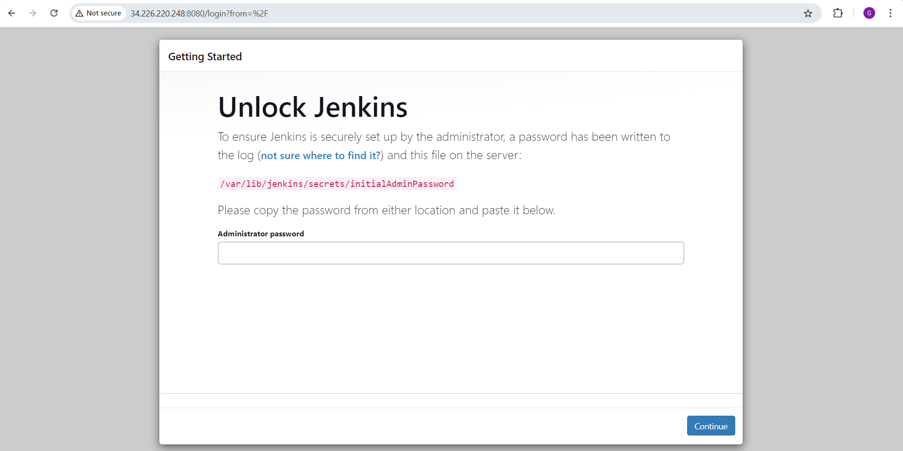
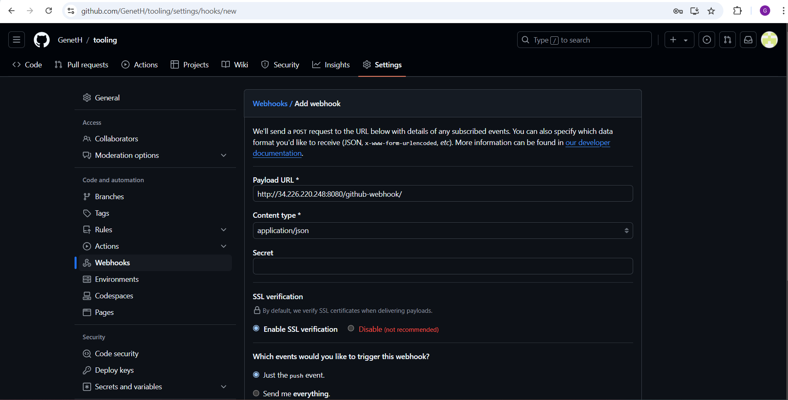

## Tooling Website Deployment Automation with Continuous Integration using Jenkins
### Introduction

In DevOps, agility and the speed of releasing software and web solutions are critical to ensure fast and repeatable deployments. One effective way to achieve this is through **automation** of routine tasks. Jenkins, a powerful open-source CI/CD tool, plays a pivotal role in automating such processes. Originally developed by Kohsuke Kawaguchi, Jenkins has become one of the most popular tools for managing continuous integration and continuous deployment.

The main focus of this project is to automate the deployment of source code changes from GitHub to a live web environment using Jenkins. Every time a developer pushes a change to a GitHub repository, Jenkins will automatically build the project and deploy the updated code to a shared storage, specifically on an NFS server, that is accessed by multiple web servers.


The image provides a visual representation of the updated architecture after integrating Jenkins. Here’s what the architecture entails:

1. **GitHub Repository**: Developers commit code to a GitHub repository. In this project, we use GitHub's webhook functionality to notify Jenkins whenever there is a change in the repository.

2. **Jenkins Server**: Jenkins listens for GitHub webhooks. When a webhook is received (indicating a new commit), Jenkins automatically triggers a build. The built artifacts (compiled code, scripts, etc.) are then transferred to the NFS server via SSH.

3. **Load Balancer and Web Servers**: The setup consists of two web servers behind a load balancer. The load balancer ensures traffic is evenly distributed between the web servers. Both web servers pull files from the NFS server, ensuring they have access to the latest code.

4. **NFS Server**: The NFS server stores the artifacts Jenkins has built. This shared storage ensures that the web servers can retrieve the same updated files.

5. **Database Server**: The web servers communicate with a centralized database server using TCP 3306 (MySQL/MariaDB) for storing and retrieving application data.

The diagram clearly illustrates how traffic flows between the different components:
- **Client Traffic**: Incoming requests from users to the load balancer, which routes them to one of the web servers.
- **NFS Traffic**: Web servers use NFS to access shared storage, pulling code updates after each deployment.
- **DB Traffic**: Web servers interact with the database server for data storage and retrieval.
- **Deploy Traffic**: Jenkins pushes code updates to the NFS server, making the updated code available to the web servers.

   This setup allows for seamless and automated deployments, ensuring that the application running on the web servers is always up-to-date with the latest changes from the GitHub repository.
---
### Step 1: Install Jenkins Server (Completed)

1. **Create AWS EC2 Instance**  
   - I launched an EC2 instance with Ubuntu Server 20.04 LTS and named it "Jenkins."

2. **Install JDK (Java Development Kit)**  
   - I updated the system packages and installed the JDK, which Jenkins requires to run Java-based applications:
   ```bash
   sudo apt update
   sudo apt install default-jdk-headless
   ```

3. **Install Jenkins**  
   - I added the Jenkins package key and the source to my system, then installed Jenkins:
   ```bash
   wget -q -O - https://pkg.jenkins.io/debian-stable/jenkins.io.key | sudo apt-key add -
   sudo sh -c 'echo deb https://pkg.jenkins.io/debian-stable binary/ > /etc/apt/sources.list.d/jenkins.list'
   sudo apt update
   sudo apt-get install jenkins
   ```

4. **Verify Jenkins is Running**  
   - I checked that Jenkins is up and running with:
   ```bash
   sudo systemctl status jenkins
   ```
   


5. **Configure EC2 Security Group to Open TCP Port 8080**
   - Since Jenkins runs on **TCP port 8080** by default, I needed to allow inbound traffic to that port in the **Security Group** of my EC2 instance

   

6. **Perform Initial Jenkins Setup**  
   - I opened my browser and navigated to the Jenkins server by entering:
     ```
     http://34.226.220.248:8080
     ```
     

   - I was prompted to enter the **default admin password**. I retrieved it by running the following command on my Jenkins server:
     ```bash
     sudo cat /var/lib/jenkins/secrets/initialAdminPassword
     ```
     

   - After entering the password, I followed the on-screen instructions to complete the Jenkins setup, choosing to install the suggested plugins for a basic setup.
   
     

7. **Complete Jenkins Installation**  
   - Once the plugin installation was done, I was prompted to create an admin user for Jenkins.
   - After creating the admin user, Jenkins provided the server address.
   - **The installation is now complete!** At this point, the Jenkins server is fully set up and ready to use.
    
    

---

### Step 2: I Configured Jenkins to Retrieve Source Code from GitHub using Webhooks

1. **Enable Webhooks in GitHub Repository**
   - I went to the settings of my GitHub repository.
   - Under "Webhooks", I created a new webhook and provided the Jenkins URL: `http://34.226.220.248:8080/github-webhook/`.

   

2. **Create a Freestyle Project in Jenkins**
   - I opened the Jenkins web console.
   - Clicked on "New Item" and selected "Freestyle project".
   - I named the project `tooling_github` and clicked OK.
  
   

3. **Configure GitHub Repository in Jenkins**
   - In the Jenkins project configuration, I selected **Git** under "Source Code Management".
   - I added the GitHub repository URL and my credentials (GitHub username/password or personal access token).
   - Specified the branch to build (e.g., `master/main`).

    

4. **Trigger a Manual Build**
   - I saved the configuration.
   - Manually triggered the build using the "Build Now" button.
   - Checked the console output to ensure the build was successful.
    
    
   

5. **Set Up Build Triggers for GitHub Webhooks**
   - To automate the build process, I went to the **Build Triggers** section in the Jenkins project configuration.
   - I enabled the checkbox for **GitHub hook trigger for GITScm polling**.

    

6. **Configure Post-Build Actions**
   - I set up "Post-build Actions" to archive the build artifacts (files created during the build).
   - The files are saved in Jenkins server’s local file system under:
     ```bash
     /var/lib/jenkins/jobs/tooling_github/builds/<build_number>/archive/
     ```
    
     

7. **Test the Webhook**
   - I made a change in the GitHub repository updated README.md (pushed a commit to the `master/main` branch).
   - Jenkins automatically triggered a new build as soon as GitHub sent the webhook.
     
     
---

### Step 3: Configure Jenkins to Copy Files to the NFS Server via SSH

1. **Install the "Publish Over SSH" Plugin**
   - I went to the Jenkins dashboard.
   - Selected **Manage Jenkins** → **Manage Plugins**.
   - Under the **Available** tab, I searched for the **Publish Over SSH** plugin and installed it.
     
     

2. **Configure the Job/Project to Copy Artifacts Over to the NFS Server**
   - From the Jenkins dashboard, I selected **Manage Jenkins** → **Configure System**.
   - I scrolled down to the **Publish Over SSH** plugin section and set it up to connect to the NFS server by providing:
     1. Private key (.pem file) to connect via SSH.
     2. Arbitrary name for the server.
     3. Hostname (private IP address of my NFS server).
     4. Username (e.g., `ec2-user`, since the NFS server runs on an EC2 instance with RHEL).
     5. Remote directory (`/mnt/apps`), which the web servers use to retrieve files.

     

3. **Test the Connection**
   - I tested the SSH connection to ensure it returned a **Success** message, making sure that TCP port 22 was open on the NFS server.
     

4. **Configure Jenkins to Copy Files After a Build**
   - I opened the Jenkins project configuration.
   - I added a **Post-build Action**.
   - I selected **Send build artifacts over SSH**.
   - Configured it to send all files produced by the build (`**`) to the `/mnt/apps` directory on the NFS server.

   

5. **Trigger a Build and Verified the Files**
   - I saved the configuration and made a change in the GitHub repository in the `README.md` file.
   - The webhook triggered a new build, and the console output showed that the files were successfully transferred via SSH.
   - I logged into the NFS server via SSH and verified that the files in `/mnt/apps` had been updated.

   
   

---

### Conclusion

In this project, we successfully automated the deployment of source code changes using Jenkins as part of a continuous integration and continuous deployment (CI/CD) pipeline. By integrating Jenkins with GitHub, we ensured that every code change committed to the repository triggers an automatic build and deployment to the NFS server, which is used by the web servers.

This setup enhances the efficiency of the deployment process, allowing for faster and more reliable updates to the application. With the help of the **Publish Over SSH** plugin, Jenkins can securely transfer build artifacts to the NFS server, ensuring that the web servers always have access to the latest code. The integration of a load balancer further ensures high availability and balanced traffic distribution between the web servers.

This architecture provides a scalable and maintainable solution for automating deployments, reducing manual intervention, and minimizing the risk of errors in production environments. By implementing these CI/CD practices, we’ve laid the groundwork for further enhancements and optimizations, enabling a smoother development and deployment cycle for future projects.

