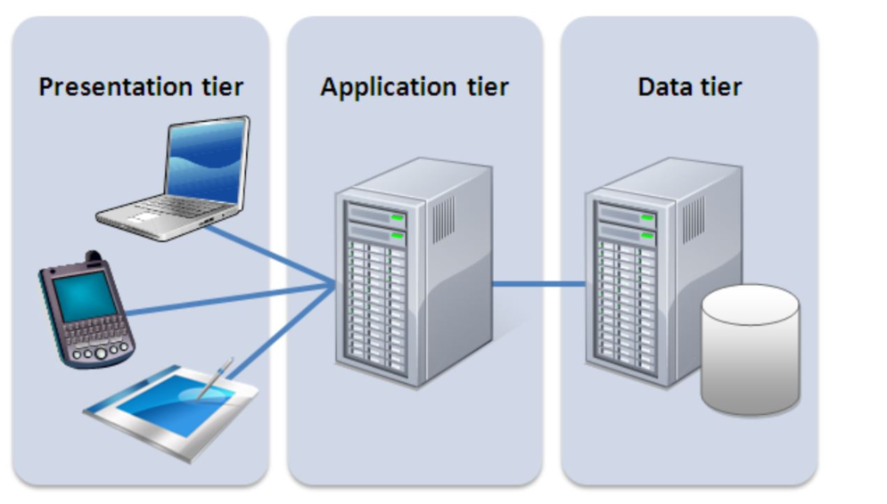
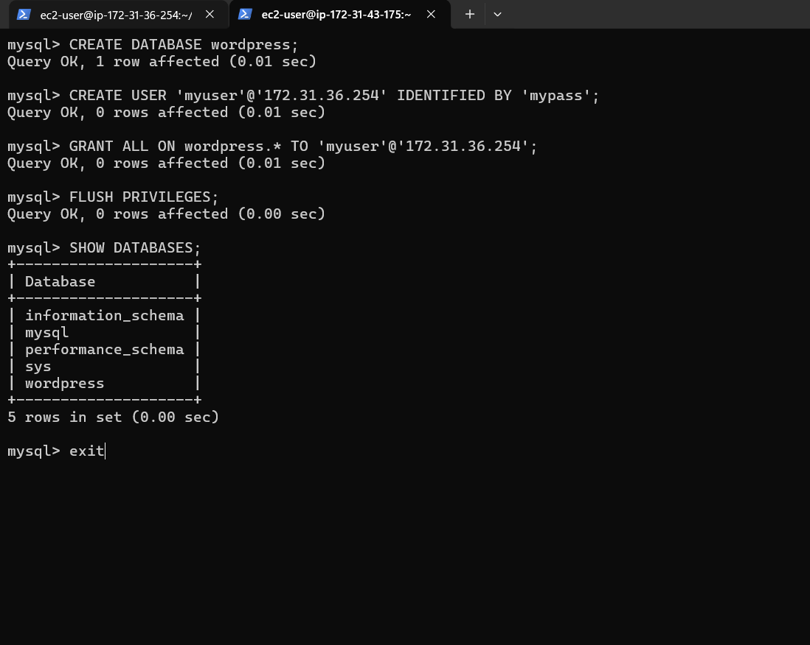
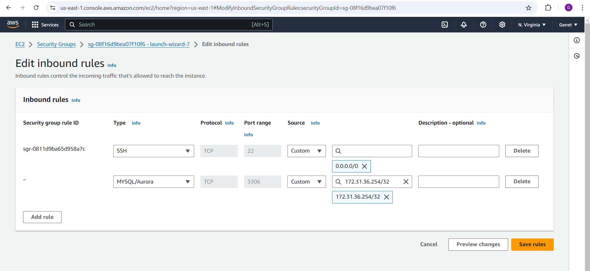
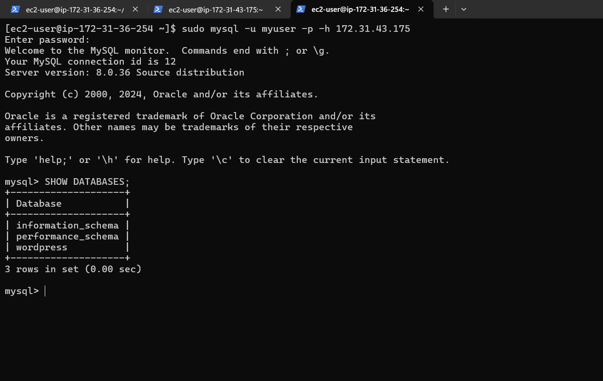
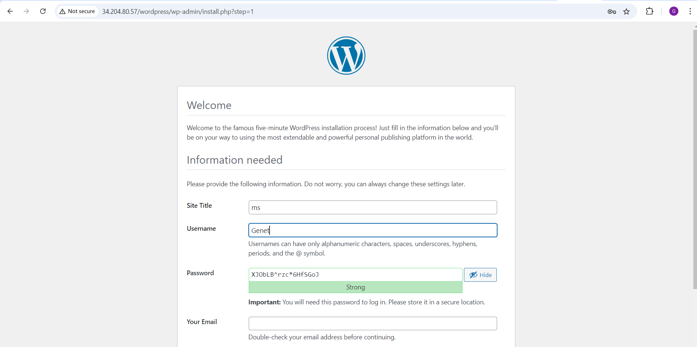

# Web Solution with WordPress on AWS EC2

### Three-tier Architecture



1. **Three-tier architecture** is a software design pattern that divides an application into three distinct layers:
   - **Presentation Tier (PL)**: The front-end interface where users interact with the application, typically through devices like laptops, phones, or tablets.
   - **Application Tier (BL)**: The logic layer responsible for processing business rules and logic, usually hosted on an application server.
   - **Data Tier (DAL)**: The storage layer responsible for managing databases or file storage systems, handling data access.

This architecture pattern is commonly used in web and mobile applications as it promotes scalability, maintainability, and separation of concerns.

### Introduction

In this project, I focused on deploying a **WordPress web solution** on AWS EC2 using a **Three-tier architecture** approach. The architecture separates the three core layers into:
- The **Presentation Layer** (web server),
- The **Application Layer** (business logic), and
- The **Data Access Layer** (database server).

I launched two EC2 instances: one for the web server (hosting WordPress) and another for the database server (hosting MySQL). Both instances were configured with the necessary EBS volumes and logical volumes for efficient data management.

Below are the steps I followed to set up the web server, create and attach EBS volumes, configure logical volumes, and install WordPress on the web server and MySQL on the database server.

---

## Step 1: Prepare the Web Server

### 1. Launch the Web Server EC2 Instance

- **I launched my EC2 instance:**
  - I logged into the AWS Console and launched an EC2 instance to serve as my web server.
  - I selected **Red Hat** as the operating system and configured the instance based on my needs.


### 2. Create and Attach EBS Volumes

- **I created 3 EBS volumes:**
  - I navigated to **Elastic Block Store (EBS)** > **Volumes** in the AWS Console and created 3 new volumes, each with 10 GiB of space, ensuring they were in the same availability zone as my EC2 instance.
  
  

- **I attached my volumes to the instance:**
  - I selected each volume and attached it to the EC2 instance.
  - I repeated this process for all three volumes.

  

---

### 3. Inspect Block Devices and Partition the Disks

- **I connected to my EC2 instance via SSH:**
  - I used the SSH command to connect to my instance:
    ```bash
    ssh -i my-key.pem ec2-user@34.204.80.57
    ```

- **I listed my block devices:**
  - I used `lsblk` to confirm that the new EBS volumes were attached:
    ```bash
    lsblk
    ```
    

---

### 4. Partition the Disks

- **I used `gdisk` to create partitions:**
  - For each disk (e.g., `/dev/xvdb`), I created partitions using the `gdisk` utility:
    ```bash
    sudo gdisk /dev/xvdb
    ```
  - I repeated this process for all the attached disks (`/dev/xvdc`, `/dev/xvdd`).
    

---

### 5. Create and Manage Logical Volumes

- **I installed the LVM tools:**
  - I installed `lvm2` to manage the logical volumes:
    ```bash
    sudo yum install lvm2
    ```

- **I created physical volumes and combined them into a volume group:**
  - I ran `pvcreate` to mark each partition and then created a volume group:
    ```bash
    sudo pvcreate /dev/xvdb1
    sudo vgcreate webdata-vg /dev/xvdb1 /dev/xvdc1 /dev/xvdd1
    ```
    

- **I created logical volumes for apps and logs:**
    ```bash
    sudo lvcreate -n apps-lv -L 14G webdata-vg
    sudo lvcreate -n logs-lv -L 14G webdata-vg
    ```

---

### 6. Format and Mount Logical Volumes

- **I formatted and mounted the logical volumes:**
  - I formatted the logical volumes with `ext4` and mounted them:
    ```bash
    sudo mkfs.ext4 /dev/webdata-vg/apps-lv
    sudo mkdir -p /var/www/html
    sudo mount /dev/webdata-vg/apps-lv /var/www/html
    ```
  
  - I mounted the `/var/log` directory for log files:
    ```bash
    sudo mount /dev/webdata-vg/logs-lv /var/log
    ```
    

---

### 7. Persist Mount Points

- **I configured persistent mounts using UUIDs in `/etc/fstab`:**
  - I used `blkid` to get the UUIDs and added them to `/etc/fstab`:
    ```bash
    sudo blkid
    sudo vi /etc/fstab
    ```
  - Example entries for persistent mounts:
    ```bash
    UUID=<UUID-of-apps-lv> /var/www/html ext4 defaults 0 0
    UUID=<UUID-of-logs-lv> /var/log ext4 defaults 0 0
    ```
    

---

## Step 2: Prepare the Database Server

For the database server, I launched a second EC2 instance specifically for the **Database Server (DB Server)**, following similar steps as the web server but with adjustments for the database storage.

---

### Differences in Database Server Setup

- **I created and mounted a new logical volume for the database:**
  - Instead of creating `apps-lv`, I created a `db-lv` for database data:
    ```bash
    sudo lvcreate -n db-lv -L 14G webdata-vg
    sudo mkdir -p /db
    sudo mount /dev/webdata-vg/db-lv /db
    ```

---

## Step 3: Install WordPress on the Web Server EC2

1. **I updated the system repositories:**
    ```bash
    sudo yum -y update
    ```

2. **I installed Apache and PHP:**
    ```bash
    sudo yum -y install wget httpd php php-mysqlnd php-fpm php-json
    sudo systemctl enable httpd
    sudo systemctl start httpd
    ```

3. **I downloaded and configured WordPress:**
    ```bash
    wget http://wordpress.org/latest.tar.gz
    tar -xzvf latest.tar.gz
    cp wordpress/wp-config-sample.php wordpress/wp-config.php
    sudo cp -R wordpress /var/www/html/
    ```

## Step 4: Install MySQL on the DB Server EC2

1. **I installed and started MySQL:**
    ```bash
    sudo yum update
    sudo yum install mysql-server
    sudo systemctl start mysqld
    ```

---

## Step 5: Configure the Database for WordPress

- **I created a MySQL user and database for WordPress:**
    ```bash
    CREATE DATABASE wordpress;
    CREATE USER 'myuser'@'<Web-Server-Private-IP>' IDENTIFIED BY 'mypass';
    GRANT ALL PRIVILEGES ON wordpress.* TO 'myuser'@'<Web-Server-Private-IP>';
    FLUSH PRIVILEGES;
    ```
    

## Step 6: Configure WordPress to Connect to the Remote Database

**Hint**: I ensured that MySQL port 3306 was open on my DB Server EC2. For security reasons, I allowed access to the DB server **ONLY** from my Web Server’s IP address by specifying the source as `/32` in the Inbound Rule configuration.



1. **I installed the MySQL client** and tested the connection from my Web Server to the DB server by using the `mysql-client`:
    ```bash
    sudo yum install mysql
    sudo mysql -u admin -p -h <DB-Server-Private-IP-address>
    ```

2. **I verified the connection** by executing the following command:
    ```sql
    SHOW DATABASES;
    ```

   

3. **I changed permissions and configuration** so that Apache could use WordPress.

4. **I enabled TCP port 80** in the Inbound Rules configuration for my Web Server EC2 (allowing access from everywhere `0.0.0.0/0` or just from my workstation’s IP).

5. **I configured WordPress to connect to the database**:
   - I edited the `wp-config.php` file to include the correct database credentials:
     ```bash
     sudo vi /var/www/html/wordpress/wp-config.php
     ```
   - I ensured the database name, user, password, and host were correctly set:
     ```php
     define('DB_NAME', 'wordpress');
     define('DB_USER', 'myuser');
     define('DB_PASSWORD', 'mypass');
     define('DB_HOST', '<DB-Server-Private-IP>');
     ```

6. **I accessed WordPress from my browser**:
    - I opened the following link in my browser to access WordPress:
      ```
      http://<Web-Server-Public-IP-Address>/wordpress/
      ```

   

---

**Conclusion:**

The **three-tier architecture** is a robust design model commonly used in web and mobile applications, such as those developed using WordPress. By separating the system into three distinct layers—**Presentation Layer**, **Business/Application Layer**, and **Data Layer**—this architecture ensures efficient management of the system's various components. Each tier performs its specialized function, promoting better maintainability, scalability, and flexibility of the system. This modular approach allows developers to independently manage and update the application’s user interface, business logic, and data storage, contributing to a more streamlined development process. 

For solutions like WordPress, implementing this architecture provides clear boundaries between the user interface, application logic, and data management, which can enhance the performance and security of the web solution.

