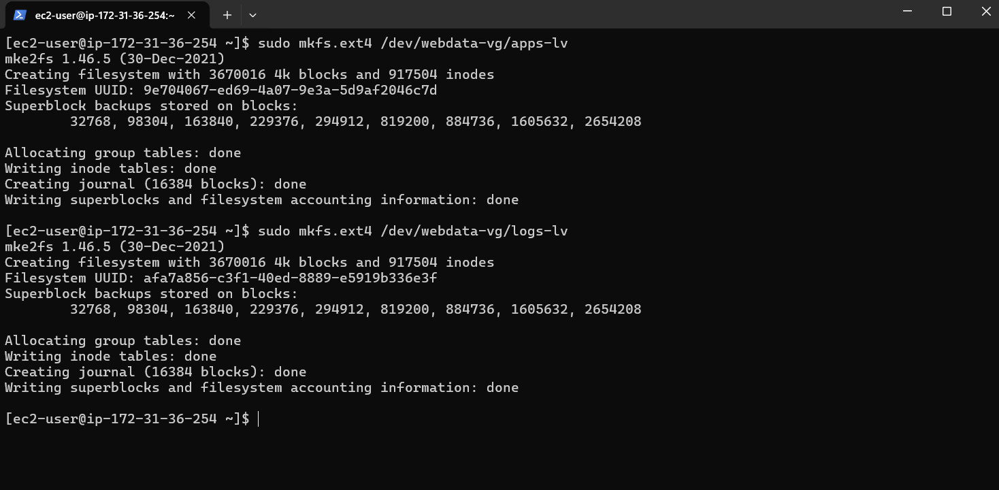

# Web Solution with WordPress
## Step 1: Prepare a Web Server 

### 1. Prepare My Web Server on AWS EC2

- **I launched my EC2 instance:**
  - I logged into the AWS Console and launched an EC2 instance to serve as my web server.
  - I selected Red Hat as the operating system and configured the instance based on my needs.

  

- **I created 3 EBS volumes:**
  - I navigated to **Elastic Block Store (EBS)** > **Volumes** in the AWS Console.

    

  - I created 3 new volumes, each with 10 GiB of space, making sure they were in the same availability zone as my EC2 instance.
    
    

### 2. Attach My Volumes

- **I attached my volumes to the instance:**
  - I selected the volumes I created one by one.
  - I clicked **Actions** > **Attach Volume**.
  - I selected my EC2 instance from the list and attached the volume.
  - I repeated this process for all three volumes.

  

### 3. Inspect My Block Devices

- **I connected to my EC2 instance via SSH:**
  - I used the SSH command to connect to my instance:
    ```bash
    ssh -i my-key.pem ec2-user@34.204.80.57
    ```

- **I listed my block devices:**
  - I ran the following command to see all block devices attached to my instance:
    ```bash
    lsblk
    ```
    

  - I confirmed that the new EBS volumes appeared as `xvdb`, `xvdc`, and `xvdd`.

### 4. Partition My Disks

- **I used `gdisk` to create partitions:**
  - For each disk (e.g., `/dev/xvdb`), I created a partition:
    ```bash
    sudo gdisk /dev/xvdb
    ```
  - In the `gdisk` utility:
    - I typed `n` to create a new partition.
    - I accepted the default sector sizes.
    - I typed `w` to write the partition table and confirmed by typing `y`.
  
  
    
    
  - I repeated this process for the other two volumes (`/dev/xvdc` and `/dev/xvdd`).
    ```bash
    sudo gdisk /dev/xvdc
    ```
    ```bash
    sudo gdisk /dev/xvdd
    ```
  - After partitioning, view the newly created partitions using:
    
    ```bash
    lsblk
    ```
    

### 5. Create Physical Volumes for LVM

- **I installed LVM tools:**
  - I installed the LVM package by running:
    ```bash
    sudo yum install lvm2
    ```
    

- **I marked the disks as physical volumes:**
  - I ran `pvcreate` to mark each partition:
    ```bash
    sudo pvcreate /dev/xvdb1 
    sudo pvcreate /dev/xvdc1 
    sudo pvcreate /dev/xvdd1
    ```
    

- **I verified the physical volumes:**
  - I checked that my physical volumes were created successfully by running:
    ```bash
    sudo pvs
    ```
   

### 6. Create a Volume Group

- **I created my volume group:**
  - I combined all three physical volumes into one volume group:
    ```bash
    sudo vgcreate webdata-vg /dev/xvdb1 /dev/xvdc1 /dev/xvdd1
    ```

- **I verified my volume group:**
  - I confirmed that my volume group was successfully created by running:
    ```bash
    sudo vgs
    ```
    

### 7. Create Logical Volumes

- **I created logical volumes:**
  - I created two logical volumes from the volume group:
    ```bash
    sudo lvcreate -n apps-lv -L 14G webdata-vg
    sudo lvcreate -n logs-lv -L 14G webdata-vg
    ```

- **I verified the logical volumes:**
  - I checked if my logical volumes were created by running:
    ```bash
    sudo lvs
    ```
   

### 8. Format and Mount the Volumes

- **I formatted my logical volumes:**
  - I formatted each logical volume with the `ext4` filesystem:
    ```bash
    sudo mkfs.ext4 /dev/webdata-vg/apps-lv
    sudo mkfs.ext4 /dev/webdata-vg/logs-lv
    ```
   

- **I mounted the volumes:**
  - I created directories for mounting the logical volumes:
    ```bash
    sudo mkdir -p  /var/www/html
    ```
  - I created /home/recovery/logs to store backup of log data:
    
     ```bash
    sudo mkdir -p /home/recovery/logs
    ```
  `
- I mounted the `/var/www/html` directory on the `apps-lv` logical volume:

    ```bash
    sudo mount /dev/webdata-vg/apps-lv /var/www/html
    ```

- I used `rsync` to back up the `/var/log` directory to `/home/recovery/logs`:
    ```bash
    sudo rsync -av /var/log/ /home/recovery/logs/
    ```

- I mounted `/var/log` on the `logs-lv` logical volume:
    ```bash
    sudo mount /dev/webdata-vg/logs-lv /var/log
    ```

- I restored log files back to `/var/log` from `/home/recovery/logs`:
    ```bash
    sudo rsync -av /home/recovery/logs/ /var/log
    ```

- **I verified the setup:**
  - I ran `lsblk` to ensure that the logical volumes were mounted correctly:
    ```bash
    lsblk
    ```

### 9. Persist Mount Points with UUID in `/etc/fstab`

- **I retrieved the UUIDs of my devices using `blkid`:**
    ```bash
    sudo blkid
    ```
    

- **I updated the `/etc/fstab` file using the UUID of the devices:**
    ```bash
    sudo vi /etc/fstab
    ```

    In the `/etc/fstab` file, I added the following lines for persistent mounting:

    ```bash
    UUID=<UUID-of-apps-lv> /var/www/html ext4 defaults 0 0
    UUID=<UUID-of-logs-lv> /var/log ext4 defaults 0 0
    ```
    

- **I tested the configuration and reloaded the daemon:**
    ```bash
    sudo mount -a
    sudo systemctl daemon-reload
    ```

- **I verified the setup by running `df -h` to ensure the volumes are mounted correctly:**
    ```bash
    df -h
    ```
   

## Step 2: Prepare the Database Server
In **Step 2: Prepare the Database Server**, you would follow similar steps as in Step 1 but with the focus on setting up the database server. Here’s how the updated instructions should flow:

---

## Step 2: Prepare the Database Server

- **I launched a second Red Hat EC2 instance to serve as the Database Server (DB Server):**
  - I logged into the AWS Console and launched a new EC2 instance, specifically designated as the database server.
  - I selected Red Hat as the operating system and configured the instance as needed.
  
- **I repeated the same steps for creating and attaching EBS volumes:**
  - I created 3 EBS volumes, each with 10 GiB of space, ensuring that they are in the same availability zone as the DB instance.
  - I attached each volume to the DB instance, following the same procedure as the web server.

### Differences in Setting Up the Database Server

- **I created a new logical volume for the database data:**
  - Instead of creating `apps-lv`, I created a new logical volume named `db-lv`.
    ```bash
    sudo lvcreate -n db-lv -L 14G webdata-vg
    ```
  
- **I mounted the new logical volume for the database:**
  - I mounted the logical volume to the `/db` directory instead of `/var/www/html`.
    ```bash
    sudo mkdir -p /db
    sudo mount /dev/webdata-vg/db-lv /db
    ```

For **Step 3: Install WordPress on your Web Server EC2**, here's a breakdown of the instructions with the provided commands:

---

### Step 3 — Install WordPress on your Web Server EC2

1. **Update the repository:**
    - I updated the system's repository to get the latest package information:
      ```bash
      sudo yum -y update
      ```

2. **Install wget, Apache, and its dependencies:**
    - I installed the required packages including `wget`, Apache, and PHP with its necessary modules:
      ```bash
      sudo yum -y install wget httpd php php-mysqlnd php-fpm php-json
      ```

3. **Start Apache:**
    - I enabled and started the Apache web server:
      ```bash
      sudo systemctl enable httpd
      sudo systemctl start httpd
      ```

4. **To install PHP and its dependencies:**
    - I installed additional dependencies for PHP, including the remi repository, and enabled PHP 7.4:
      ```bash
      sudo yum install https://dl.fedoraproject.org/pub/epel/epel-release-latest-8.noarch.rpm
      sudo yum install yum-utils http://rpms.remirepo.net/enterprise/remi-release-8.rpm
      sudo yum module list php
      sudo yum module reset php
      sudo yum module enable php:remi-7.4
      sudo yum install php php-opcache php-gd php-curl php-mysqlnd
      sudo systemctl start php-fpm
      sudo systemctl enable php-fpm
      setsebool -P httpd_execmem 1
      ```

5. **Restart Apache:**
    - I restarted Apache to apply the changes:
      ```bash
      sudo systemctl restart httpd
      ```

6. **Download WordPress and copy it to `/var/www/html`:**
    - I downloaded the latest version of WordPress, extracted it, and moved it to the `/var/www/html` directory:
      ```bash
      mkdir wordpress
      cd wordpress
      sudo wget http://wordpress.org/latest.tar.gz
      sudo tar -xzvf latest.tar.gz
      sudo rm -rf latest.tar.gz
      cp wordpress/wp-config-sample.php wordpress/wp-config.php
      cp -R wordpress /var/www/html/
      ```
      

7. **Configure SELinux Policies:**

    - I set the appropriate SELinux policies to ensure that the Apache user can access the WordPress directory:
      ```bash
      sudo chown -R apache:apache /var/www/html/wordpress
      sudo chcon -t httpd_sys_rw_content_t /var/www/html/wordpress -R
      sudo setsebool -P httpd_can_network_connect=1
      ```


### Step 4 — Install MySQL on your DB Server EC2

1. **Update the repository and install MySQL:**
    - I updated the system's repository and installed the MySQL server package:
      ```bash
      sudo yum update
      sudo yum install mysql-server
      ```

2. **Verify MySQL service status:**
    - I checked whether the MySQL service is up and running:
      ```bash
      sudo systemctl status mysqld
      ```
    - If the service is not running, I restarted it and enabled it to run on boot:
      ```bash
      sudo systemctl restart mysqld
      sudo systemctl enable mysqld
      ```

### Step 5 — Configure DB to work with WordPress

**I have created a MySQL user `myuser` with access from the web server's private IP address using the password `mypass`.** 

```bash
sudo mysql

CREATE DATABASE wordpress;

CREATE USER 'myuser'@'<Web-Server-Private-IP-Address>' IDENTIFIED BY 'mypass';

GRANT ALL ON wordpress.* TO 'myuser'@'<Web-Server-Private-IP-Address>';

FLUSH PRIVILEGES;

SHOW DATABASES;

exit
```


---

Let me know if this works or if you'd like to add more!


### Step 6 — Configure WordPress to connect to the remote database

**Hint**: I did not forget to open MySQL port 3306 on my DB Server EC2. For extra security, I allowed access to the DB server **ONLY** from my Web Server's IP address by specifying the source as `/32` in the Inbound Rule configuration.


1. **I installed the MySQL client** and tested that I could connect from my Web Server to my DB server by using `mysql-client`:
    ```bash
    sudo yum install mysql
    sudo mysql -u admin -p -h <DB-Server-Private-IP-address>
    ```

2. **I verified the connection** by executing the following command:
    ```sql
    SHOW DATABASES;
    ```
   

3. **I changed permissions and configuration** so that Apache could use WordPress.

4. **I enabled TCP port 80** in the Inbound Rules configuration for my Web Server EC2 (allowing from everywhere `0.0.0.0/0` or just from my workstation's IP).

5. **I accessed WordPress from my browser**:
    - I opened the following link in my browser to access WordPress:
      ```
      http://<Web-Server-Public-IP-Address>/wordpress/
      ```

