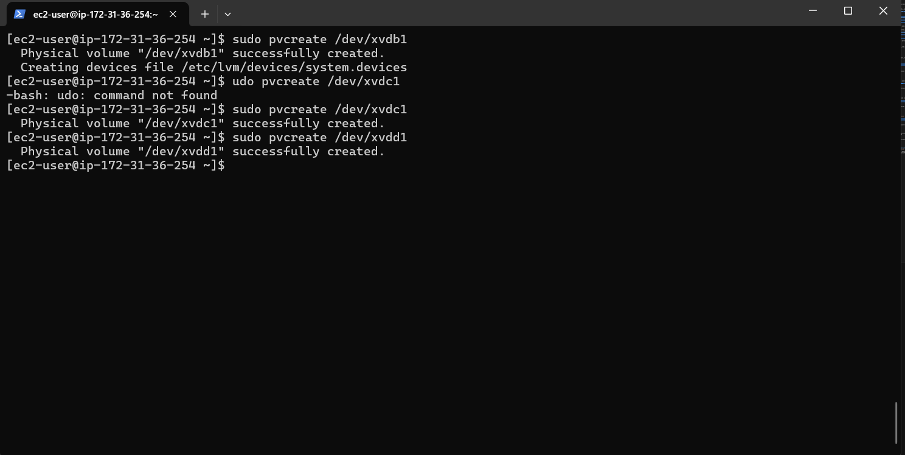
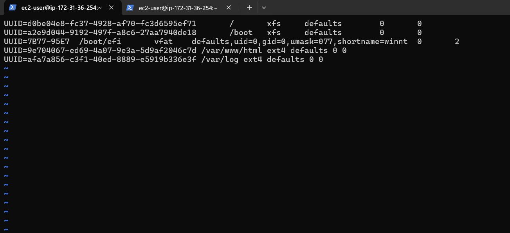

### Step 1: Prepare My Web Server on AWS EC2

- **I launched my EC2 instance:**
  - I logged into the AWS Console and launched an EC2 instance to serve as my web server.
  - I selected Red Hat as the operating system and configured the instance based on my needs.

  

- **I created 3 EBS volumes:**
  - I navigated to **Elastic Block Store (EBS)** > **Volumes** in the AWS Console.

    

  - I created 3 new volumes, each with 10 GiB of space, making sure they were in the same availability zone as my EC2 instance.
    
    

### Step 2: Attach My Volumes

- **I attached my volumes to the instance:**
  - I selected the volumes I created one by one.
  - I clicked **Actions** > **Attach Volume**.
  - I selected my EC2 instance from the list and attached the volume.
  - I repeated this process for all three volumes.

  

### Step 3: Inspect My Block Devices

- **I connected to my EC2 instance via SSH:**
  - I used the SSH command to connect to my instance:
    ```bash
    ssh -i my-key.pem ec2-user@34.204.80.57
    ```

- **I listed my block devices:**
  - I ran the following command to see all block devices attached to my instance:
    ```bash
    lsblk
    ```
    

  - I confirmed that the new EBS volumes appeared as `xvdb`, `xvdc`, and `xvdd`.

### Step 4: Partition My Disks

- **I used `gdisk` to create partitions:**
  - For each disk (e.g., `/dev/xvdb`), I created a partition:
    ```bash
    sudo gdisk /dev/xvdb
    ```
  - In the `gdisk` utility:
    - I typed `n` to create a new partition.
    - I accepted the default sector sizes.
    - I typed `w` to write the partition table and confirmed by typing `y`.
  
  
    
    
  - I repeated this process for the other two volumes (`/dev/xvdc` and `/dev/xvdd`).
    ```bash
    sudo gdisk /dev/xvdc
    ```
    ```bash
    sudo gdisk /dev/xvdd
    ```
  - After partitioning, view the newly created partitions using:
    
    ```bash
    lsblk
    ```
    

### Step 5: Create Physical Volumes for LVM

- **I installed LVM tools:**
  - I installed the LVM package by running:
    ```bash
    sudo yum install lvm2
    ```
    

- **I marked the disks as physical volumes:**
  - I ran `pvcreate` to mark each partition:
    ```bash
    sudo pvcreate /dev/xvdb1 
    sudo pvcreate /dev/xvdc1 
    sudo pvcreate /dev/xvdd1
    ```
    

- **I verified the physical volumes:**
  - I checked that my physical volumes were created successfully by running:
    ```bash
    sudo pvs
    ```
   

### Step 6: Create a Volume Group

- **I created my volume group:**
  - I combined all three physical volumes into one volume group:
    ```bash
    sudo vgcreate webdata-vg /dev/xvdb1 /dev/xvdc1 /dev/xvdd1
    ```

- **I verified my volume group:**
  - I confirmed that my volume group was successfully created by running:
    ```bash
    sudo vgs
    ```
    

### Step 7: Create Logical Volumes

- **I created logical volumes:**
  - I created two logical volumes from the volume group:
    ```bash
    sudo lvcreate -n apps-lv -L 14G webdata-vg
    sudo lvcreate -n logs-lv -L 14G webdata-vg
    ```

- **I verified the logical volumes:**
  - I checked if my logical volumes were created by running:
    ```bash
    sudo lvs
    ```
   

### Step 8: Format and Mount the Volumes

- **I formatted my logical volumes:**
  - I formatted each logical volume with the `ext4` filesystem:
    ```bash
    sudo mkfs.ext4 /dev/webdata-vg/apps-lv
    sudo mkfs.ext4 /dev/webdata-vg/logs-lv
    ```
   

- **I mounted the volumes:**
  - I created directories for mounting the logical volumes:
    ```bash
    sudo mkdir -p  /var/www/html
    ```
  - I created /home/recovery/logs to store backup of log data:
    
     ```bash
    sudo mkdir -p /home/recovery/logs
    ```
  `
- I mounted the `/var/www/html` directory on the `apps-lv` logical volume:

    ```bash
    sudo mount /dev/webdata-vg/apps-lv /var/www/html
    ```

- I used `rsync` to back up the `/var/log` directory to `/home/recovery/logs`:
    ```bash
    sudo rsync -av /var/log/ /home/recovery/logs/
    ```

- I mounted `/var/log` on the `logs-lv` logical volume:
    ```bash
    sudo mount /dev/webdata-vg/logs-lv /var/log
    ```

- I restored log files back to `/var/log` from `/home/recovery/logs`:
    ```bash
    sudo rsync -av /home/recovery/logs/ /var/log
    ```

- **I verified the setup:**
  - I ran `lsblk` to ensure that the logical volumes were mounted correctly:
    ```bash
    lsblk
    ```

### Step 9: Persist Mount Points with UUID in `/etc/fstab`

- **I retrieved the UUIDs of my devices using `blkid`:**
    ```bash
    sudo blkid
    ```
    

- **I updated the `/etc/fstab` file using the UUID of the devices:**
    ```bash
    sudo vi /etc/fstab
    ```

    In the `/etc/fstab` file, I added the following lines for persistent mounting:

    ```bash
    UUID=<UUID-of-apps-lv> /var/www/html ext4 defaults 0 0
    UUID=<UUID-of-logs-lv> /var/log ext4 defaults 0 0
    ```
    

- **I tested the configuration and reloaded the daemon:**
    ```bash
    sudo mount -a
    sudo systemctl daemon-reload
    ```

- **I verified the setup by running `df -h` to ensure the volumes are mounted correctly:**
    ```bash
    df -h
    ```
   

